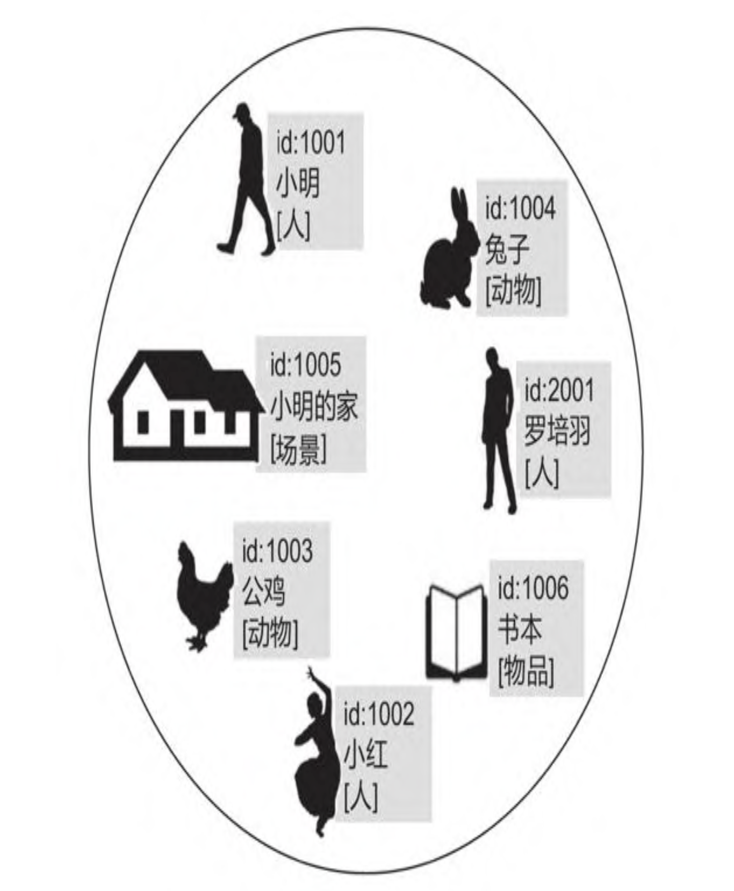
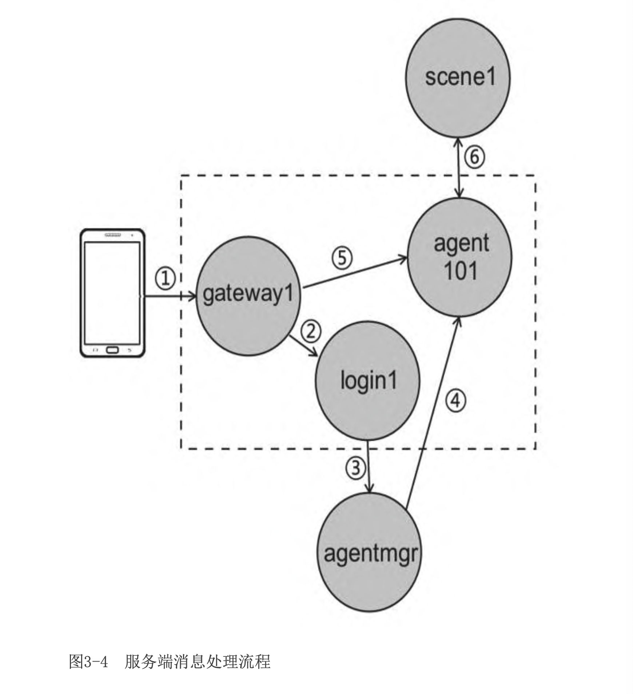
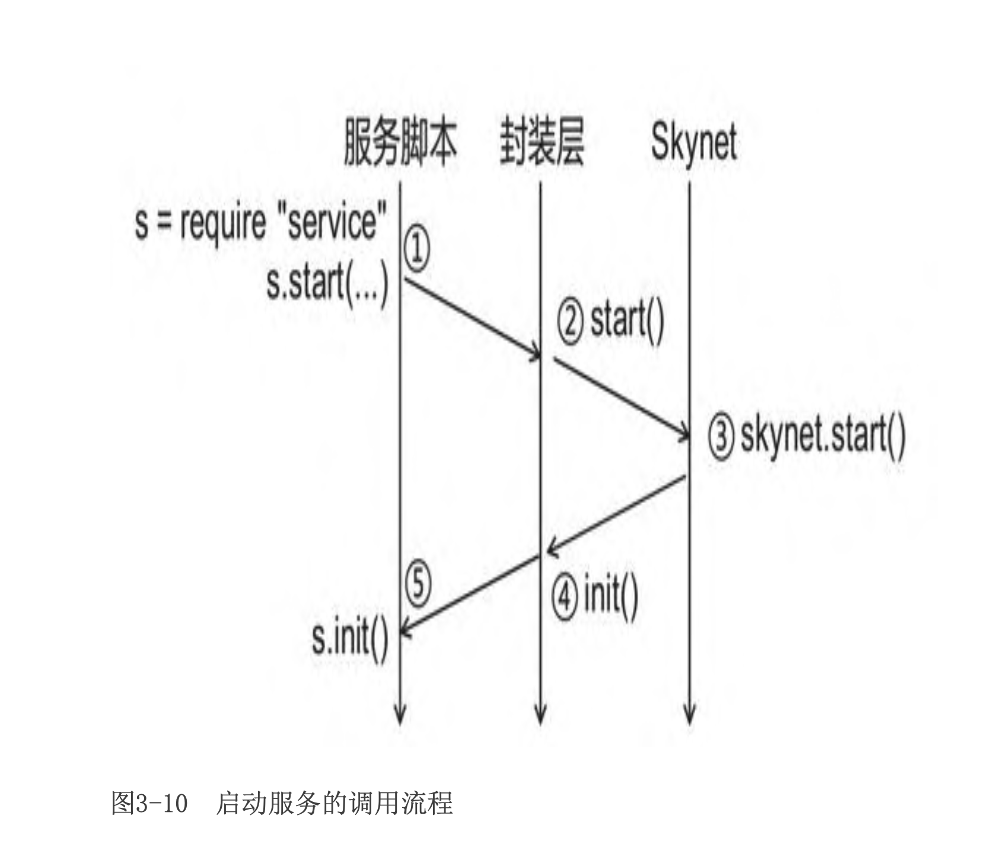
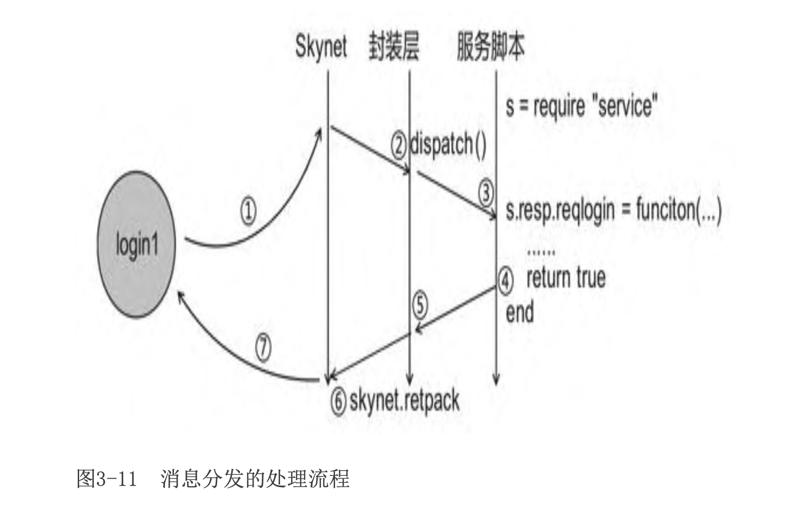
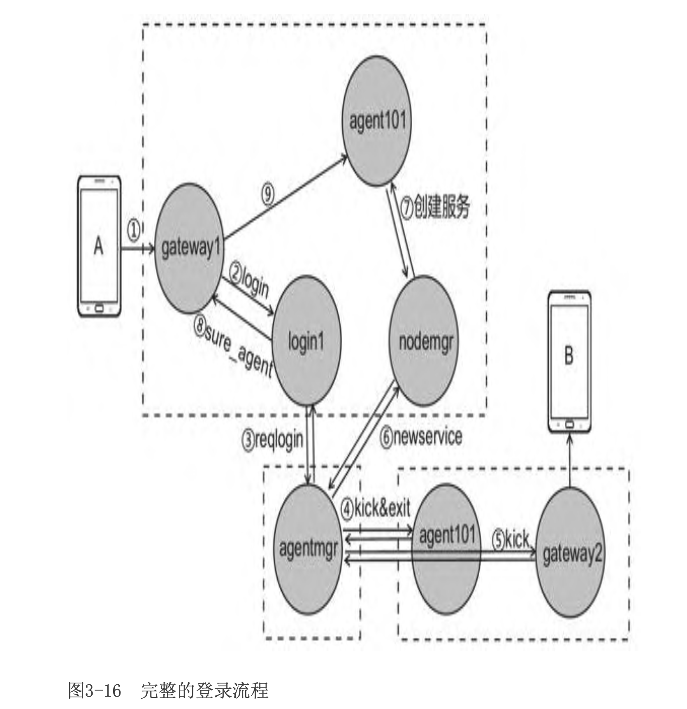

# 百万在线---大型游戏服务端开发

# 第一部分　学以致用

## 第1章　从角色走路说起

1. 分布式程序要处理很多异常情况。如果程序部署在不同物理机 上，连接不太稳定，需要处理好断线重连、断线期间的消息重发，以 及断线后进程间状态不一致的问题。图1-16展示的是因网络不畅通导 致的异常情形，假如客户端A的玩家向客户端B的玩家购买道具，消息 需要通过程序C中转，因程序A和程序C之间的网络连接出现异常，出现 了客户端B的玩家被扣除了道具，客户端A的玩家却没得到道具的情 况。程序A与程序C的网络连接异常，游戏功能受到了影响，就算一段 时间后重新连接上，两个进程的状态也可能会不一致。

   一致性问题是分布式系统的一大难题，在游戏业务中，开发者一 般会把一致性问题抛给具体业务去处理。对于图1-16所示的异常情况，需要给每个交易赋予唯一编号。程序C除了转发消息，还需要记录 程序A对每个交易的执行状态，如果转发失败，程序C要在稍后重发交易消息，直到程序A成功执行。而程序A也需要记录每个交易的状态， 如果某个交易已经成功执行，则不再响应程序C发来的消息，避免重复 添加道具。

   

   另外，管理数百台物理机、成百上千个程序也不容易，第一，物理机多了，某一台出故障的可能性很大;第二，开启或关闭全部程序要花费很长时间。

1. Actor模型由来已久。早在1973年，Carl Hewitt提出了Actor并发 计算的理论模型;1991年爱立信推出的编程语言Erlang将Actor模型融入语言里，并应用在通信领域里。2009年前后，珠三角的一些游戏公 司(四三九九、菲音、明朝网络)开始大规模地将Erlang语言应用于 游戏领域。2012年前后，云风(吴云洋的网名)开源了C语言Actor模 型框架Skynet，并称之为游戏服务端引擎，且将其应用在不少商业游 戏上。

1. Actor模型的理念——万物皆Actor，它是更进一步的面向对象， 即把世间万物都当作Actor对象。Actor可以代表一个角色、一只动物，也可以代表整个游戏场景，图1-26展示的是用Actor模型抽象的一 个游戏世界，方括号代表Actor的类型，id代表Actor的标识，中间文 本代表名称。

   

   4. 为什么说Actor模型适用于游戏开发呢?

      回顾1.4.3节的多进程程序，从某种程度上说，Actor模型和传统 的多进程服务端结构有很多相似之处。不同的是，一个操作系统进程 会占用很多的系统资源，按照1.5.3节的分析，进程不仅会占用较多的 内存，操作系统在切换进程(线程)时也会占用较多的CPU时间，一台 物理机只能运行几百个进程，这会限制游戏的业务分割。

## 第2章　Skynet入门精要

1. Skynet是一套历经商业游戏验证的游戏服务端引擎。策略类游戏 《三国志·战略版》、第一人称射击游戏《枪战英雄》，它们都使用了Skynet。然而Skynet是一套底层引擎，不能开箱即用。有网友说“没有5年的服务器经验很难驾驭”。

2. 协程的作用

   Skynet服务在收到消息时，会创建一个协程，在协程中会运行消 息处理方法(即用skynet.dispatch设置的回调方法)。这意味着，如 果在消息处理方法中调用阻塞API(如skynet.call、skynet.sleep、 socket.read)，服务不会被卡住(仅仅是处理消息的协程被卡住)， 执行效率得以提高，但程序的执行时序将得不到保证。

## 第3章　案例：《球球大作战》

1. 方案设计 

   

   登录过程:在阶段1客户端连接某个gateway，然后发送登录协 议。gateway将登录协议转发给login(阶段2)，校验账号后，由 agentmgr创建与客户端对应的agent(阶段3和4)完成登录。如果该 玩家已在其他节点登录，agentmgr会先把另一个客户端顶下线。

   游戏过程:登录成功后，客户端的消息经由gateway转发给对应的 agent(阶段5)，agent会处理角色的个人功能，比如购买装备、查 看成就等。当客户端发送“开始比赛”的协议时，程序会选择一个场 景服务器，让它和agent关联，处理一场战斗(阶段6)。

2. 设计要点

   * A: gateway

     这套服务端系统采用传统C++服务器的架构方案。gateway只做消 息转发，启用gateway服务有以下好处:

     I. 隔离客户端与服务端系统。如果要更改客户端协议(比如改用 json协议或protobuf)，仅需更改gateway，不会对系统内部产生影响。

     II. 预留了断线重连功能，如果客户端掉线，仅影响到gateway(下 一章介绍)。

     然而引入gateway意味着客户端消息需经过一层转发，会带来一定 的延迟。将同一个客户端连接的gateway、login、agent置于同一节 点，有助于减少延迟。

   * agent可以和任意一个scene通信，但跨节点通信的开销较大(见 1.4.2节)。一个节点可以支撑数千名玩家，足以支撑各种段位的匹 配，玩家应尽可能地进入同一节点的战斗场景服务器(scene)。

   * agentmgr仅记录agent的状态、处理玩家登录、登出功能，所有对 它的访问都以玩家id为索引。它是个单点，但很容易拓展成分布式。

3. Skynet的API提供了偏底层的功能，按官方说法，由于历史原因， 某些API设计的比较奇怪，不方便使用，于是Skynet通过snax框架给出 了一套更简单的API。然而，经实际项目检验，snax还不太完善，一些 项目会做进一步的修改。本节会封装一套更简洁的API，也方便读者在 此基础上做修改。

4. 

5. 

6. 

   7. 1)登录流程的一种意外情况:尽管登录流程已相对完善，但还存 在一种意外情况。在客户端发起登录协议后，在登录协议返回之前客 户端下线。由于此时agentmgr记录的是“登录中”状态，下线请求不 会被执行，除非再次登录踢下线，否则agent会一直存在。这种情况不 常出现，解决方法是让gateway和agent之间偶尔发送心跳协议，若检 测到客户端连接已断开，则请求下线。

      2)agentmgr是个单点，有可能成为系统瓶颈。这个问题不大，可 以开启多个agentmgr，以玩家id为索引分开处理。

      3)由于move协议的广播量很大，会造成跨节点通信的负载压力。 匹配时应尽量匹配到同节点的场景服务，只有在某些特殊玩法中才匹 配到跨节点的场景服务。

      4)gateway在Lua层处理字符串协议，但Lua并不适合处理大量可 变字符串，因为它会增加GC(内存垃圾回收机制)的负担，所以3.6节 所述的Lua层输入缓冲区效率较低，Skynet已提供了netpack模块用于 高效处理该功能(下一章介绍)。

      5)场景服务广播量很大，可以用AOI(Area of Interest)算法 做优化。考虑到玩家屏幕大小有限，只能看到有限的球和食物，因此 只需把玩家附近小球和食物广播给他即可(第8章会介绍)。

      6)食物碰撞计算量很大，可以用四叉树算法做优化，比起双重遍 历，可以减少几倍计算量。另一种做法是服务端不主动做碰撞检测， 由客户端计算。若客户端发现玩家碰撞到食物，告诉服务端。服务端 只需做校验，这样就把计算量转移到了客户端(第9章会介绍不同做法 的优劣之处)。

      7)在登出过程中，agent会接收kick和exit消息，分别用于保存 数据和退出服务。一种意外情形是，在kick和exit之间，agent接收并 处理了其他服务发来的消息，这些消息导致的属性更改将不会被存档想想，如果在kick和exit之间，玩家充值了，因为已经保存了数 据，所以更新的金额不会被再次保存)。若要解决该问题，可以给 agent添加状态，设置若处于kick状态下则不处理任何消息。

      8)本章没有提及数据库的内容，对于大量玩家，可以对数据库做 分库分表操作，甚至可使用Redis做一层缓存。

      9)本章服务端稳定运行的前提是所有Skynet节点都能稳定运行， 且各个节点能维持稳定的网络通信，因此所有节点应当部署在同一局 域网。

## 第4章　Skynet进阶技法

### 4.1　用“长度信息”解TCP包

### 4.2　用Json序列化协议

### 4.3　用Protobuf高效传输

### 4.4　如何设计游戏数据库

### 4.5　如何关闭服务器

### 4.6　怎样做定时系统

### 4.7　断线重连

# 第二部分　入木三分

## 第5章　你好，C++并发世界

### 5.1　从HelloWorld开始

### 5.2　多核多线程### 

### 5.3　探索C++对象模型

### 5.4　队列与锁

### 5.5　多线程下的对象管理

### 5.6　充分利用CPU

### 5.7　演示程序PingPong

### 5.8　条件变量与唤醒机制

### 5.9　后台运行

## 第6章　图解TCP网络模块

### 6.1　启动网络线程

### 6.2　半小时搞懂Epoll的用法

### 6.3　打开监听端口

### 6.4　网络事件分发

### 6.5　如何安全读写数据

### 6.6　写缓冲区满

## 第7章　嵌入Lua脚本语言

### 7.1　方案设计

### 7.2　嵌入Lua虚拟机

### 7.3　C++调用Lua方法

### 7.4　Lua调用C++函数

### 7.5　Lua版的PingPong

### 7.6　Lua版聊天室

# 第三部分　各个击破

## 第8章　同步算法

### 8.1　同步难题

### 8.2　客户端障眼法

### 8.3　各类同步方案及适用场景

### 8.4　帧同步

### 8.5　AOI算法

### 8.6　可靠UDP

## 第9章　热更新

### 9.1　Skynet热更新

### 9.2　切换进程

### 9.3　动态库

### 9.4　脚本语言

## 第10章　防外挂

### 10.1　不信任客户端

### 10.2　尽可能多的校验

### 10.3　反外挂常用措施

## 第11章　未尽之路

### 11.1　高并发

### 11.2　服务端架构

### 11.3　工程管理