# 百万在线---大型游戏服务端开发

# 第一部分　学以致用

## 第1章　从角色走路说起

1. 分布式程序要处理很多异常情况。如果程序部署在不同物理机 上，连接不太稳定，需要处理好断线重连、断线期间的消息重发，以 及断线后进程间状态不一致的问题。图1-16展示的是因网络不畅通导 致的异常情形，假如客户端A的玩家向客户端B的玩家购买道具，消息 需要通过程序C中转，因程序A和程序C之间的网络连接出现异常，出现 了客户端B的玩家被扣除了道具，客户端A的玩家却没得到道具的情 况。程序A与程序C的网络连接异常，游戏功能受到了影响，就算一段 时间后重新连接上，两个进程的状态也可能会不一致。

   一致性问题是分布式系统的一大难题，在游戏业务中，开发者一 般会把一致性问题抛给具体业务去处理。对于图1-16所示的异常情况，需要给每个交易赋予唯一编号。程序C除了转发消息，还需要记录 程序A对每个交易的执行状态，如果转发失败，程序C要在稍后重发交易消息，直到程序A成功执行。而程序A也需要记录每个交易的状态， 如果某个交易已经成功执行，则不再响应程序C发来的消息，避免重复 添加道具。

   

   另外，管理数百台物理机、成百上千个程序也不容易，第一，物理机多了，某一台出故障的可能性很大;第二，开启或关闭全部程序要花费很长时间。

1. Actor模型由来已久。早在1973年，Carl Hewitt提出了Actor并发 计算的理论模型;1991年爱立信推出的编程语言Erlang将Actor模型融入语言里，并应用在通信领域里。2009年前后，珠三角的一些游戏公 司(四三九九、菲音、明朝网络)开始大规模地将Erlang语言应用于 游戏领域。2012年前后，云风(吴云洋的网名)开源了C语言Actor模 型框架Skynet，并称之为游戏服务端引擎，且将其应用在不少商业游 戏上。

1. Actor模型的理念——万物皆Actor，它是更进一步的面向对象， 即把世间万物都当作Actor对象。Actor可以代表一个角色、一只动物，也可以代表整个游戏场景，图1-26展示的是用Actor模型抽象的一 个游戏世界，方括号代表Actor的类型，id代表Actor的标识，中间文 本代表名称。

   

   4. 为什么说Actor模型适用于游戏开发呢?

      回顾1.4.3节的多进程程序，从某种程度上说，Actor模型和传统 的多进程服务端结构有很多相似之处。不同的是，一个操作系统进程 会占用很多的系统资源，按照1.5.3节的分析，进程不仅会占用较多的 内存，操作系统在切换进程(线程)时也会占用较多的CPU时间，一台 物理机只能运行几百个进程，这会限制游戏的业务分割。

## 第2章　Skynet入门精要

1. Skynet是一套历经商业游戏验证的游戏服务端引擎。策略类游戏 《三国志·战略版》、第一人称射击游戏《枪战英雄》，它们都使用了Skynet。然而Skynet是一套底层引擎，不能开箱即用。有网友说“没有5年的服务器经验很难驾驭”。

2. 协程的作用

   Skynet服务在收到消息时，会创建一个协程，在协程中会运行消 息处理方法(即用skynet.dispatch设置的回调方法)。这意味着，如 果在消息处理方法中调用阻塞API(如skynet.call、skynet.sleep、 socket.read)，服务不会被卡住(仅仅是处理消息的协程被卡住)， 执行效率得以提高，但程序的执行时序将得不到保证。

## 第3章　案例：《球球大作战》

1. 方案设计 

   

   登录过程:在阶段1客户端连接某个gateway，然后发送登录协 议。gateway将登录协议转发给login(阶段2)，校验账号后，由 agentmgr创建与客户端对应的agent(阶段3和4)完成登录。如果该 玩家已在其他节点登录，agentmgr会先把另一个客户端顶下线。

   游戏过程:登录成功后，客户端的消息经由gateway转发给对应的 agent(阶段5)，agent会处理角色的个人功能，比如购买装备、查 看成就等。当客户端发送“开始比赛”的协议时，程序会选择一个场 景服务器，让它和agent关联，处理一场战斗(阶段6)。

2. 设计要点

   * A: gateway

     这套服务端系统采用传统C++服务器的架构方案。gateway只做消 息转发，启用gateway服务有以下好处:

     I. 隔离客户端与服务端系统。如果要更改客户端协议(比如改用 json协议或protobuf)，仅需更改gateway，不会对系统内部产生影响。

     II. 预留了断线重连功能，如果客户端掉线，仅影响到gateway(下 一章介绍)。

     然而引入gateway意味着客户端消息需经过一层转发，会带来一定 的延迟。将同一个客户端连接的gateway、login、agent置于同一节 点，有助于减少延迟。

   * agent可以和任意一个scene通信，但跨节点通信的开销较大(见 1.4.2节)。一个节点可以支撑数千名玩家，足以支撑各种段位的匹 配，玩家应尽可能地进入同一节点的战斗场景服务器(scene)。

   * agentmgr仅记录agent的状态、处理玩家登录、登出功能，所有对 它的访问都以玩家id为索引。它是个单点，但很容易拓展成分布式。

3. Skynet的API提供了偏底层的功能，按官方说法，由于历史原因， 某些API设计的比较奇怪，不方便使用，于是Skynet通过snax框架给出 了一套更简单的API。然而，经实际项目检验，snax还不太完善，一些 项目会做进一步的修改。本节会封装一套更简洁的API，也方便读者在 此基础上做修改。

4. 

5. 

6. 

   7. 1)登录流程的一种意外情况:尽管登录流程已相对完善，但还存 在一种意外情况。在客户端发起登录协议后，在登录协议返回之前客 户端下线。由于此时agentmgr记录的是“登录中”状态，下线请求不 会被执行，除非再次登录踢下线，否则agent会一直存在。这种情况不 常出现，解决方法是让gateway和agent之间偶尔发送心跳协议，若检 测到客户端连接已断开，则请求下线。

      2)agentmgr是个单点，有可能成为系统瓶颈。这个问题不大，可 以开启多个agentmgr，以玩家id为索引分开处理。

      3)由于move协议的广播量很大，会造成跨节点通信的负载压力。 匹配时应尽量匹配到同节点的场景服务，只有在某些特殊玩法中才匹 配到跨节点的场景服务。

      4)gateway在Lua层处理字符串协议，但Lua并不适合处理大量可 变字符串，因为它会增加GC(内存垃圾回收机制)的负担，所以3.6节 所述的Lua层输入缓冲区效率较低，Skynet已提供了netpack模块用于 高效处理该功能(下一章介绍)。

      5)场景服务广播量很大，可以用AOI(Area of Interest)算法 做优化。考虑到玩家屏幕大小有限，只能看到有限的球和食物，因此 只需把玩家附近小球和食物广播给他即可(第8章会介绍)。

      6)食物碰撞计算量很大，可以用四叉树算法做优化，比起双重遍 历，可以减少几倍计算量。另一种做法是服务端不主动做碰撞检测， 由客户端计算。若客户端发现玩家碰撞到食物，告诉服务端。服务端 只需做校验，这样就把计算量转移到了客户端(第9章会介绍不同做法 的优劣之处)。

      7)在登出过程中，agent会接收kick和exit消息，分别用于保存 数据和退出服务。一种意外情形是，在kick和exit之间，agent接收并 处理了其他服务发来的消息，这些消息导致的属性更改将不会被存档想想，如果在kick和exit之间，玩家充值了，因为已经保存了数 据，所以更新的金额不会被再次保存)。若要解决该问题，可以给 agent添加状态，设置若处于kick状态下则不处理任何消息。

      8)本章没有提及数据库的内容，对于大量玩家，可以对数据库做 分库分表操作，甚至可使用Redis做一层缓存。

      9)本章服务端稳定运行的前提是所有Skynet节点都能稳定运行， 且各个节点能维持稳定的网络通信，因此所有节点应当部署在同一局 域网。

## 第4章　Skynet进阶技法

1. “长度信息法”指在数据包前面加上长度信息。游戏一般会使用2 字节或4字节来表示长度，2字节整型数的取 值范围是0到65535，4字节整型数的取值范围是0到4294967295。对于 大部分游戏，2字节已经足够。

2. 在process_more中，使用skynet.fork创建process_msg协程，是 为了保障阻塞消息处理方法的时序一致性。

3. 假如某个游戏版本新增“换装”功 能，需要存储玩家的皮肤(skin)。那么，需要在数据表中新增skin 栏位，假如游戏用户量很大，这一步操作可能要花 费十几个小时，会造成较大损失。

   新增skin栏位后，有些记录是默认的空值(后3 行)，有些被赋予了默认值(第1行)。假如新增栏位的默认值为空 (后3行)，而玩家上线后会赠送id为“1”的皮肤(第一行)，那么 数据库会存在“空”和“皮肤id”两种数据格式，读取时，往往需要 多重判断。需判断“res[1].skin是否为空”来决定是 “读取数据库的值”还是“赋予默认值1”。经历多次版本更迭后，这 些“判断历史数据的代码”会变得冗长而混乱。后期接手项目的同 事，他们没有经历前期版本更迭，很难理解这些代码的用意，很难做维护。

   为避免拓展数据库导致十几个小时停服，就要保证数据库结构的 稳定。一种办法是，将玩家数据序列化，数据库仅存储序列化后的二 进制数据。它类似于“Key-Value”(键 值对)数据库，以玩家id为键，以序列化数据为值，其中的playerid 代表玩家id，用作索引，data存储序列化后的数据。

4. 关闭服务器的流程，一般会先给gateway(网关)发 送关闭服务器的消息，让它阻止新玩家连入;再缓慢地让所有玩家下 线，下线过程中玩家数据都将得以保存;然后保存公会、排行榜等一 些全局数据;最后才关闭整个节点。

5. 一种错误的定时唤醒写法，它会启用定时器每秒 调用一次timer方法，然后判断时、分、秒是否满足开启条件。这种方 法的问题是:如果活动开启的那一秒服务端刚好卡顿，活动将不会开启。

   一种较好的实现方法，它会定时检查并记录下 每次检查的时间，判断两次检查时间是否跨过活动开启时间。就算是 服务端卡顿，甚至中间服务器停止了一小段时间，活动都会正常开启。

6. 断线重连---以3.2节《球球大作战》的 服务端架构为例，gateway作为中介连接客户端与内部服务，当客户端 断开连接(阶段1)时，只要gateway不去触发下线流程，agent和 scene就都不会受到影响。当客户端重新发起连接(阶段2)时，经过 校验，如果gateway认为它是合法的连接(阶段3)，则会将新连接与 agent关联起来，这样便完成了重连。整个重连过程只有gateway参 与，服务端系统中的其他服务均不受影响。

   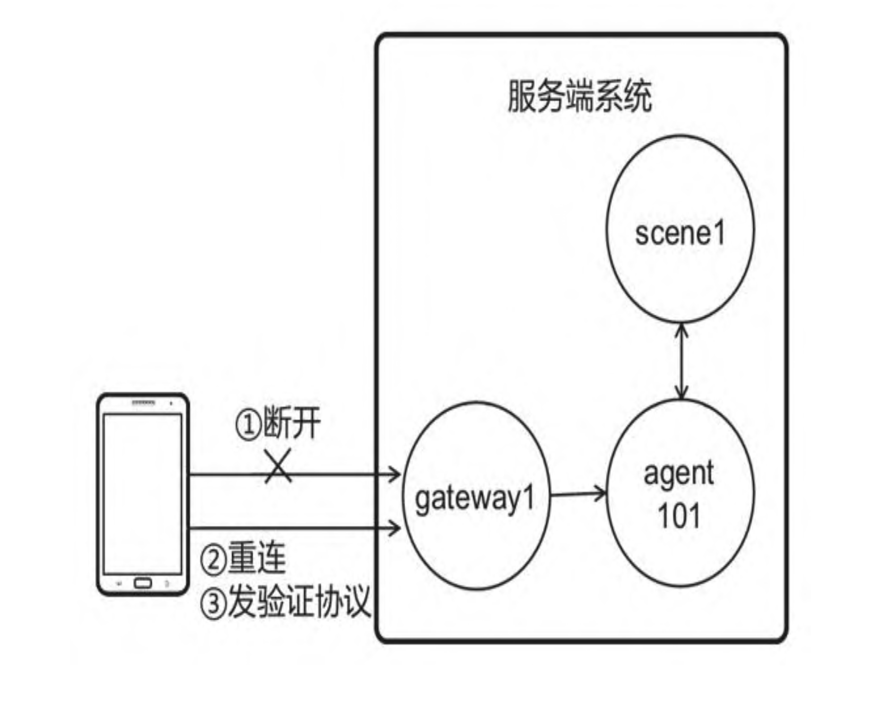

# 第二部分　入木三分

## 第5章　你好，C++并发世界

1. 如果深究服务端底层，你会发现它是榨取计算资源的艺术。由于 C/C++更底层，能较大限度地利用操作系统提供的功能，因此是高性能 服务端开发的首选语言。Skynet底层由C语言编写，它提供一套Actor 模型机制，本章会以C++仿写Skynet为主线来进行讲解，这不仅仅是为 了说明Skynet的原理，更重要的是学习“线程”“锁”“条件变量” 这些操作系统概念，从而方便编写更高效的程序。

   本章将会实现一套用C++仿写Skynet的Sunnet引擎，通过它学习 C++并发编程。对于体量小、数 量大的任务，并发程序有较高的效率。

2. 现代CPU大都是多核CPU，每个物理核心均可以单独运转。操作系 统抽象出的“线程”的概念是CPU物理核心的进一步抽象，比起CPU只 有2核、4核少量物理核心，用户可以创建数百条线程(见1.5.3节)， 操作系统将会按时间分片调度它们。如图5-13所示，图中的CPU有两个 物理核心，系统开了5条线程，操作系统会给每条线程分配执行时间， 图中线程上的黑色方块表示当前线程处于活跃状态，同一时刻最多只 有“物理核心数条”(即2条)线程处于活跃状态。由于CPU执行速度 非常快，因此看上去好像所有线程都在同时执行。

   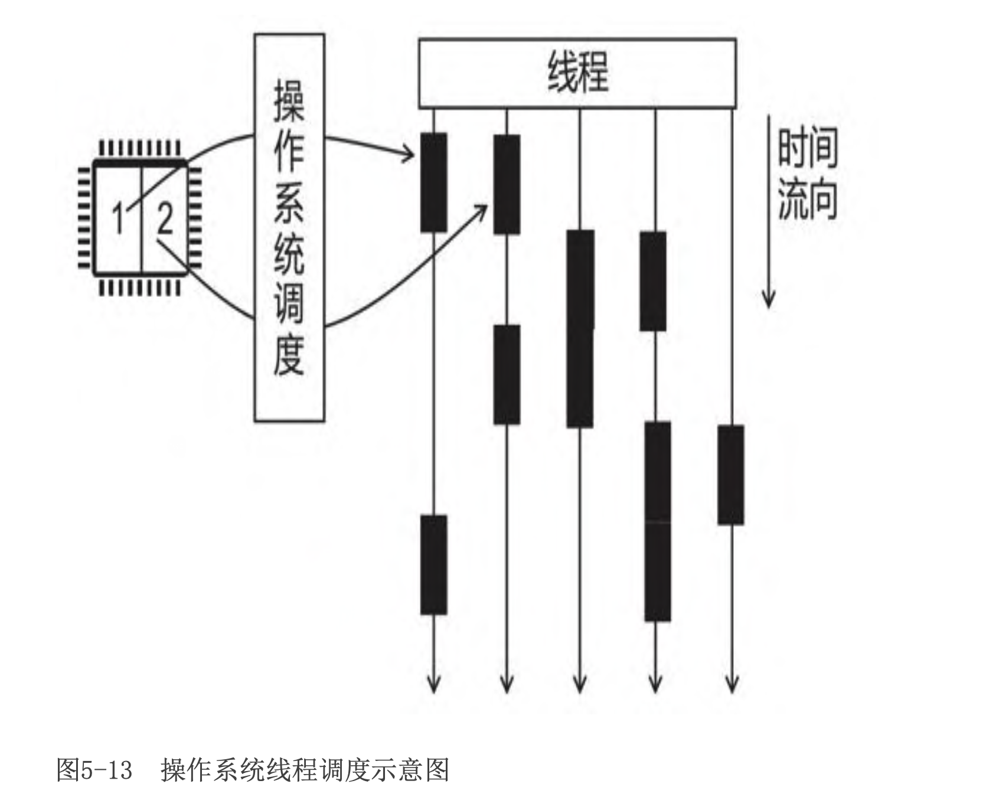

   开启多条线程，让各线程同时运作，可以充分利用硬件资源。图 5-14展示了一种多线程Actor模型，每条线程处理部分服务的逻辑，它 们并行执行，每个CPU的物理核心都在工作。图中CPU有两个核心，开 启了两条线程(由带箭头的椭圆形表示，代表线程在循环执行逻 辑)，其中线程1处理着3个服务的逻辑、线程2处理着2个服务的逻 辑。图中Sunnet::inst的边框为实线，代表着已经创建(见5.1.5 节);服务的边框为虚线，代表尚未实现。

   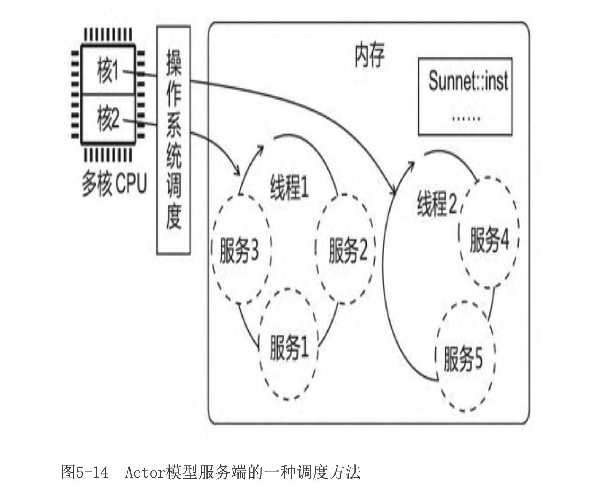

3. 回顾5.6.5节介绍的工作线程调度，图5-51展示了该节代码5-40的 流程，先是从全局队列中取出待处理的服务，处理它;如果没有需处 理的服务，等待一小段时间，然后继续循环。至于究竟要等多长时间 是个值得研究的问题，如果时间太短，线程会频繁休眠和唤起、频繁 地检测全局队列，这会带来性能损耗;如果等待时间太长，工作线程 将不能够很及时地处理消息。早期的Skynet设置了0.1秒的等待时间， 以求达到效率和延迟之间的平衡。

   但这个“等待0.1秒”的设计被一些用户诟病，因为它只适用于对 延迟要求不高的场合，例如MMORPG(多人角色扮演游戏);难以应对 要求低延迟的RTS(即时战略)、FPS(第一人称射击)游戏。后期的 Skynet版本改用条件变量的设计，以求降低延迟。

   具体做法如图5-52所示。若暂无“待处理服务”，工作线程将进 入休眠状态，而在“将服务插入到全局队列”的操作中，它除了将服 务插入队列末端以外，还会唤醒正在休眠的线程。既能在某种程度上 保证效率，又能实现0延迟。

   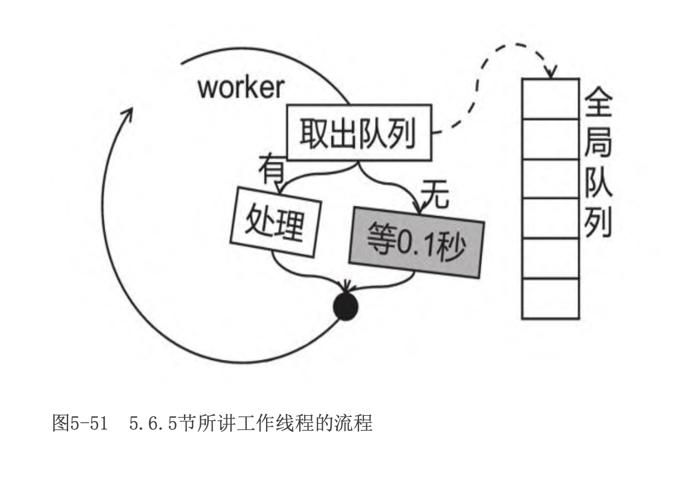

   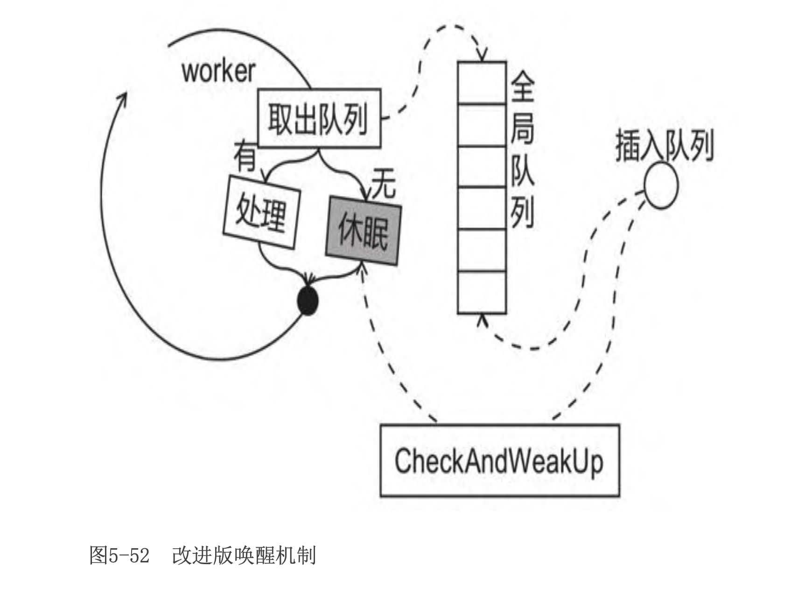

   实现“休眠–唤醒”功能需由一个互斥锁 (sleepMtx)和一个条件变量(sleepCond)配合工作。

## 第6章　图解TCP网络模块

1. TCP编程需要掌握如下两方面的内容。其一是了解套接字、多路复用等系统API的使用方法，其二是了解不同条件下可能会出现的异 常情况及应对方法。需要说明的一点是，由于网络编程有一定的难度。

2. Sunnet系统的网络模块如图6-2所示。Sunnet系统专门开启了一条 线程来监听网络事件，当“有新的客户端连接”“某客户端发来数 据”“某套接字可写”等事件发生时，网络线程会向套接字绑定的服 务发送消息。在图6-2中展示了网络模块接收客户端数据的过程:客户 端发送数据(阶段1)，网络线程捕获到“有新数据”的事件(阶段 2)，然后网络线程通知对应的服务(阶段3)。

   在处理消息时，服务会对不同的消息类型做不同的处理。图6-3所 示的是当收到网络数据时，服务2先调用read函数读取消息，再调用 write函数回应客户端。

   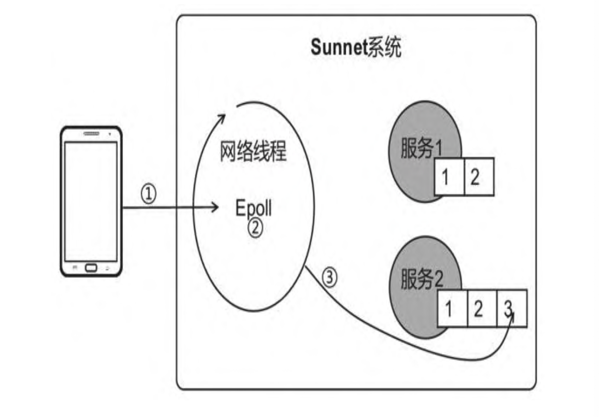

   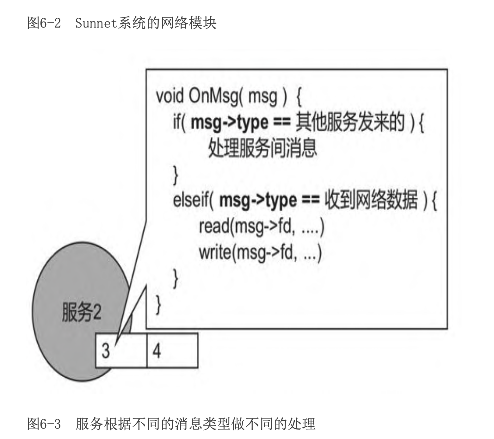

## 第7章　嵌入Lua脚本语言

1. Lua是一种轻量小巧的脚本语言，免费开源，简单易学。C/C++这 类“低级语言”胜在能够直接与操作系统打交道，从而能够最大限度 地利用系统资源，但写逻辑不太方便。“C++/Lua”是游戏业界比较常 用的一种开发解决方案，用C++做服务端底层，再嵌入Lua编写业务逻 辑，这种组合能够较好地平衡性能与开发效率。图7-1展示了一些较早 采用C++/Lua方案的游戏，包括《大话西游2》《魔兽世界》《剑侠情 缘网络版3》《卡布西游》等。

2. C++负责底层调度，Lua负责业务逻辑

3. Sunnet可理解为一套简单的操作系统，可以调度数千个服务。 Sunnet的Lua虚拟机和脚本文件如图7-2所示，其中，[A]和[B]表示服 务的类型。由于各个Lua虚拟机相互独立，符合服务的特性，因此每个 服务开启一个Lua虚拟机，各个服务的Lua代码相互隔离。

   

   这里的服务可分为很多类型，同一类型的服务对应于同一份Lua脚 本。每份脚本都提供了OnInit、OnServiceMsg等回调方法，在创建服务时，C++底层会调用对应脚本的OnInit方法;当收到消息时，C++底 层会调用OnServiceMsg方法。

# 第三部分　各个击破

## 第8章　同步算法

1. 同步问题：

* 顿挫---服务端每隔0.2秒计算一次位置，并将新坐标广播给 客户端。客户端收到移动协议后，如果简单粗暴地直接设置角色坐 标，玩家会有明显的顿挫感。举例来说，玩家将会看到如图8-4所示的 场景，一开始角色处于位置A，过了0.2秒突然变到位置B，又突然变到 位置C，移动过程很不顺畅。

* 打不中---网络质量的差异，会使得同一时刻各玩家看到的画面不同。角色A向左移动，角色B向右移动。由于客户端A的 网络延迟较低，因此它能较早收到最新的移动协议，在玩家A的眼中， 角色A刚好瞄准角色B，于是开枪射击;但在玩家B的眼中，自己并未被 瞄准。

* “顿挫”“打不中”这些问题都可以归结于网络的延迟和抖动，就算服务端的性能再好，设置很高的同步频率，也无法解决该问题。

2. 解决办法： 
   * 插值算法

     客户端收到移动协议后，不会直接设置角色坐标，而是让角色慢 慢往目标点移动。如图8-11所示，服务端在0秒、0.2秒、0.4秒时分别 发送了3条移动协议，告知角色在A、B、C三个点。当客户端收到B点协 议时，不直接设置位置，而是让角色慢慢走向B点;收到C点协议时， 再慢慢走向C点。使用插值算法，就算是以0.2秒一次的低频率同步， 玩家也能有较好的游戏体验。作为障眼法的代价，插值算法比“直接设置位置”存在更大的误 差。在图8-11所示的场景中，客户端第0.4秒才走到B点，0.6秒才走到 C点，增加了0.2秒的延迟。但无论如何，比起“直接设置位置”那种 玩家体验极差的游戏，0.2秒的延迟是值得付出的。

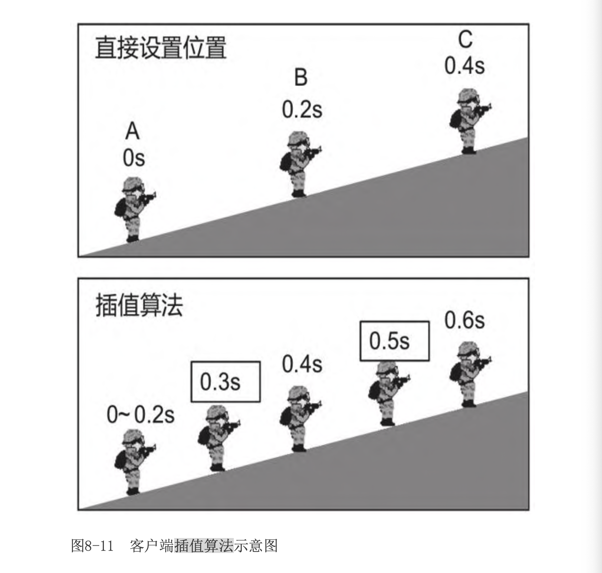

* 缓存队列

  单纯的插值算法还不能解决顿挫问题。回顾图8-8，其中第3条到 第7条协议几乎同时到达，图8-12展示了仅仅使用插值算法来做优化的 情形，顿挫问题依然存在。假设插值算法增加了0.2秒的延迟，即收到 移动协议后，让角色花0.2秒的时间从当前位置移动到新位置。那么角 色从A点走到B点(很短的距离)花费的时间为0.2秒，从B点走到C点 (较长的距离)花费的时间也是0.2秒，移动速度发生突变，故而会影 响玩家体验。

  客户端可以通过缓存队列来缓解速度跳变的问题。如图8-13所 示，收到移动协议后，不立即进行处理，而是把协议数据存在队列 中，再用固定的频率(比如，每隔0.2秒)取出，结合插值算法移动角 色。“缓存队列”相当于是在客户端加一层缓存来缓解网络抖动的问 题，这样做能够有效提高玩家的游戏体验。

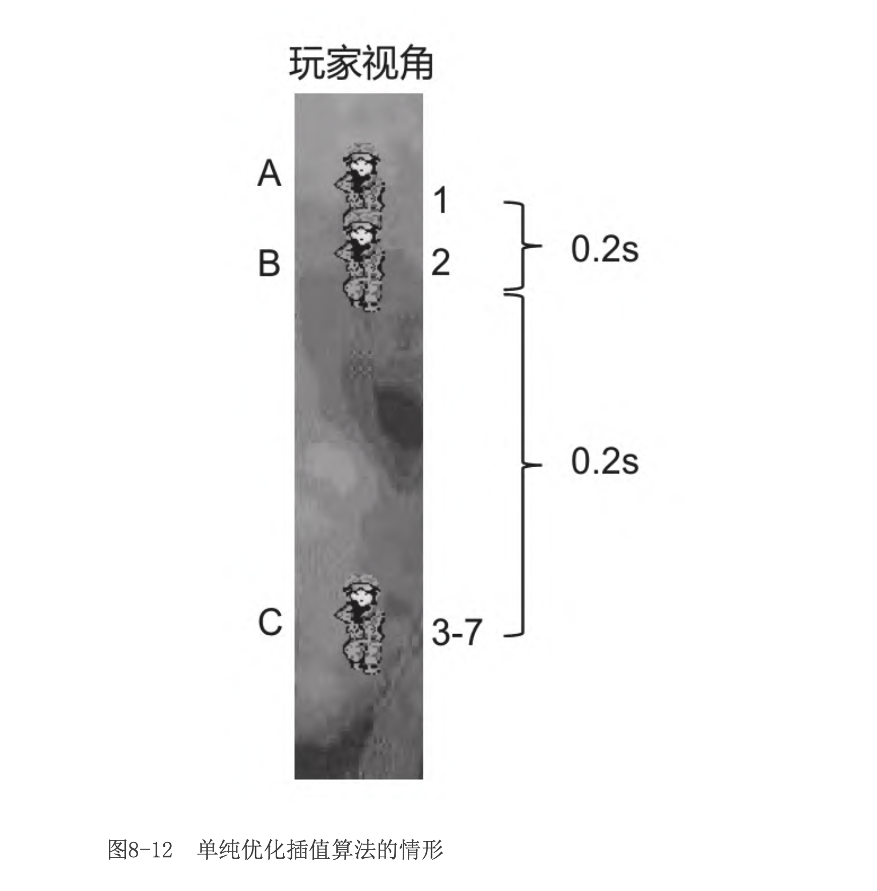

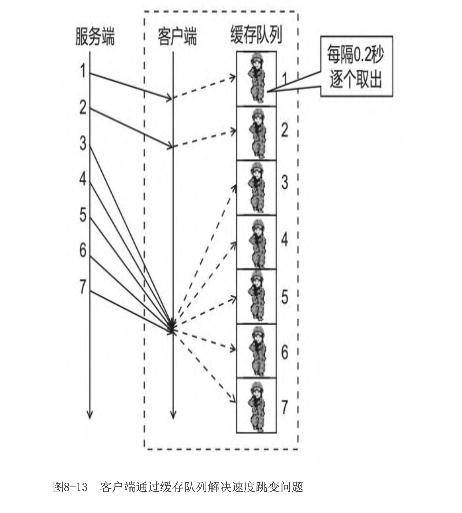

*  主动方优先

  插值算法、缓存队列会加大不同玩家所见画面的差异。回顾图8-5 可知，客户端画面差异越大，“打不中”“莫名其妙被打死”的问题 就越有可能发生。

  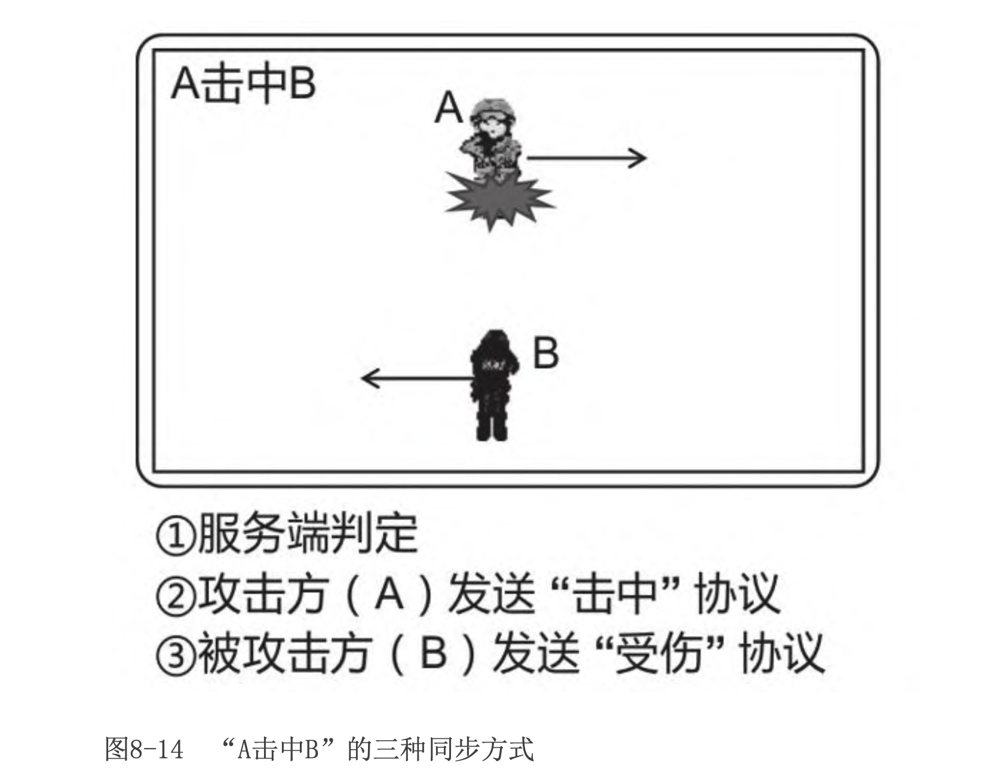

  第1种:不管客户端的误差，一切以服务端的计算为准。例如第3 章的《球球大作战》，不论玩家看到怎样的画面，小球吃到哪个食
  物、碰到哪个敌人都由服务端裁决。这是一种最权威也是最难实现的
  方案，因为该方案要求服务端具备完全的运算能力。

  第2种:信任主动方。客户端A发送“我击中了B”的协议，只要不 是偏差太大(例如，角色A和B隔得太远)，服务端就认定A真的击中了 B。这种方式会提高玩家A的游戏体验，但玩家B可能会感到“莫名其妙 被打死”。

  第3种:信任被动方。客户端B发送“我被A击中”的协议。这种方 式会提高玩家B的游戏体验，但玩家A可能会感到“明明瞄准了却打不 中”。

3. 第3章的《球球大作战》中，服务端的输入是客户端发来的摇杆方 向(即角色移动方向)，输出是球的位置坐标，这种情况属于“指令- >状态”同步;又比如一些射击游戏，客户端直接发送角色的位置坐 标，服务端只进行转发，这种情况属于“状态->状态”同步。表8-3 列出了三种同步方案及其特性。

   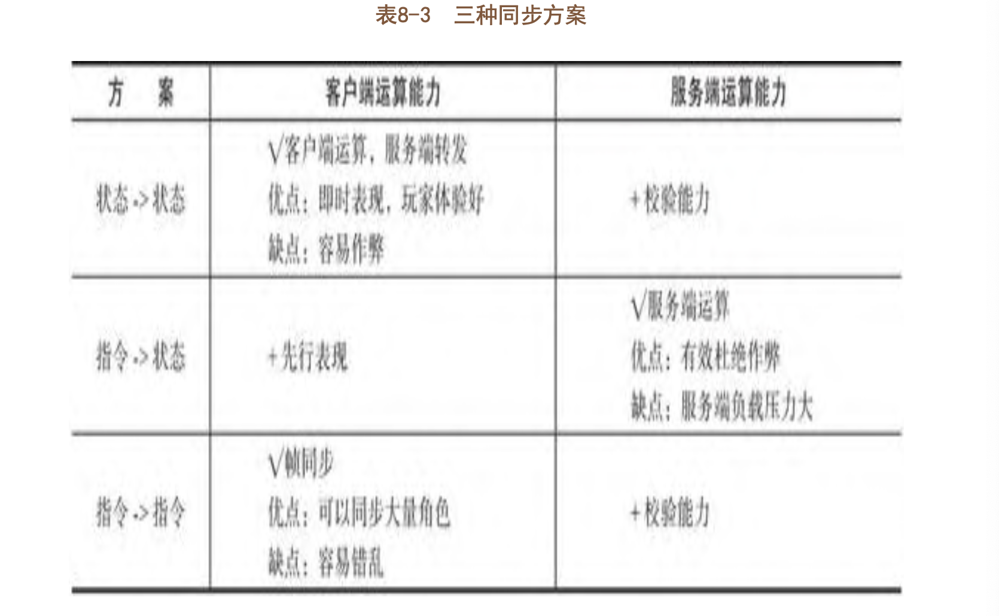

   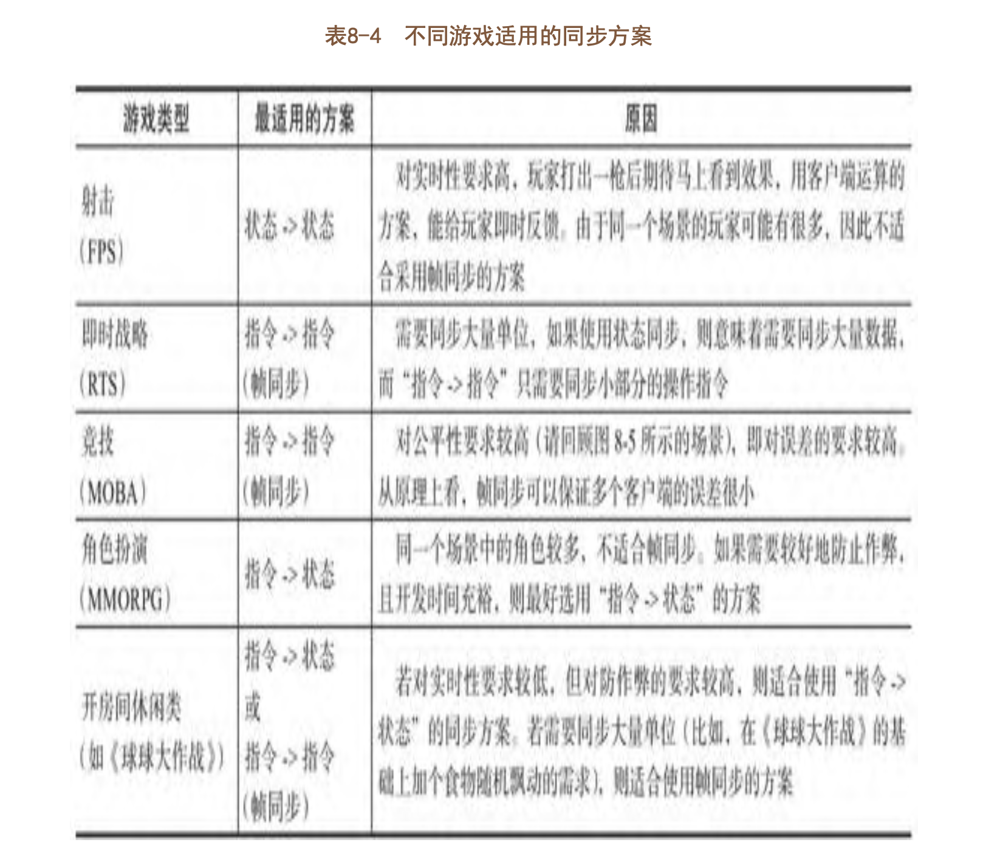

4. 帧同步方案的实现需要克服两大难点，具体说明如下。

   其一，从客户端的角度看，各客户端的硬件配置和软件环境不 同，要保证“同样的输入”能有“同样的输出”，需要自行实现客户 端的循环(如Unity中的Update)机制，规范好逻辑写法。现成的寻 路、物理碰撞模块，大多不能保证在不同的硬件条件下能产生同样的 运算结果，只能自己重写。举例来说，同样是“移动0.1米”，由于浮 点数精度不同，有些机器会用0.0999999999999979表示0.1，有些则会 用0.0999755859375表示。一次次的误差积累，时间一久，不同客户端 的画面可能就会出现很大的差异

   其二，帧同步对网络质量的要求很高，每回合0.1 秒，意味着如果延迟高于100毫秒，那基本上就没法玩了。100毫秒是 “最大值”，这就要求大部分时间的延迟要低于50毫秒(关于部分网 络延迟的测试值请回顾表8-2)，这将是一个很大的挑战。

   * 确定性计算

     (1)浮点数精度

     不同系统可能会使用不同的位数表示浮点数，精度不同。一种简 单粗暴的方法是，不使用浮点数，全部转为整数单位。例如，“角色 以0.1米/秒的速度移动0.3秒”，可以转换成“角色以10厘米/毫秒的 速度移动300毫秒”，从而避免浮点数的运算。

     (2)随机数

     游戏经常会用到随机数，例如“技能‘斩龙诀’有30%的概率打出 两倍伤害”，如果客户端各自随机，那么结果也会有所不同。一种解 决办法是，各客户端都使用同一套伪随机算法，具体做法是在战斗开 始时，由服务端同步同一个随机种子，然后基于相同的规则生成随机数。

     (3)遍历的顺序

     如果使用诸如“for(int i=0;i<100;i++)”的语句遍历数组，则 可以确定数组的遍历顺序，但如果使用foreach语句遍历数组，则不能 完全保证顺序，foreach只能保证把每个元素都遍历一遍。如果游戏逻 辑依赖于遍历的顺序，foreach可能会导致不同的计算结果。

     (4)多线程、异步和协程

     由于多线程、异步和协程的调度并不由开发者控制，因此如果游戏逻辑中使用了这些技术，需要特别关注不同时间执行线程、异步和协程的代码是否会导致不同的运算结果。

5.  “严格帧同步”看似完美，它让快的客户端等待慢的，客户端误差很小。但如果网络环境不好，快的客户端就会频繁等待，玩家的游
   戏体验就会很糟糕。公网环境下，一般会采取“定时不等待”的策略，即“乐观帧同步”。

   “乐观帧同步”是指服务端定时广播操作指令，以推进游戏进 程，而不必等待慢客户端。“乐观帧同步”的广播策略比“严格帧同 步”简单许多。

   如图8-27所示，客户端A比客户端B快，当服务端走完一轮(st1) 时，只收到客户端A的指令(c1)，服务端不等待客户端2的c1，直接 广播s2。

   不过，乐观帧同步所采取的收集策略更为复杂，图8-27中，服务 端在第2轮(st2)才收到客户端A的c2和客户端B的c1，服务端会在s3 中合并它们，作为第三轮的操作指令。在第3轮(st3)，服务端收到 客户端B的c2和c3两条协议，服务端会将它们合并在一起，与客户端A 的c3组成s4。代码8-8展示了收集策略的具体实现。

   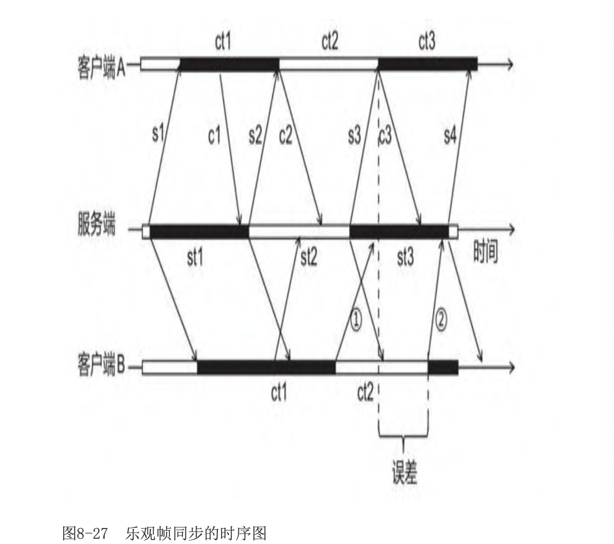

6. AOI算法可翻译成“感兴趣区域”算法，它基于角色扮演 (MMORPG)、射击(FPS)类游戏“角色仅关心周边事务”的事实。在 角色扮演游戏中，玩家只能与附近的NPC和其他玩家进行交互;射击游 戏也是如此，只能攻击较近的敌人，至于距离太远的，玩家根本看不 到他们。

7. 三角制约---TCP牺牲了“低延迟”以满足有序性和可靠性;UDP的延迟很低， 但不可靠。

   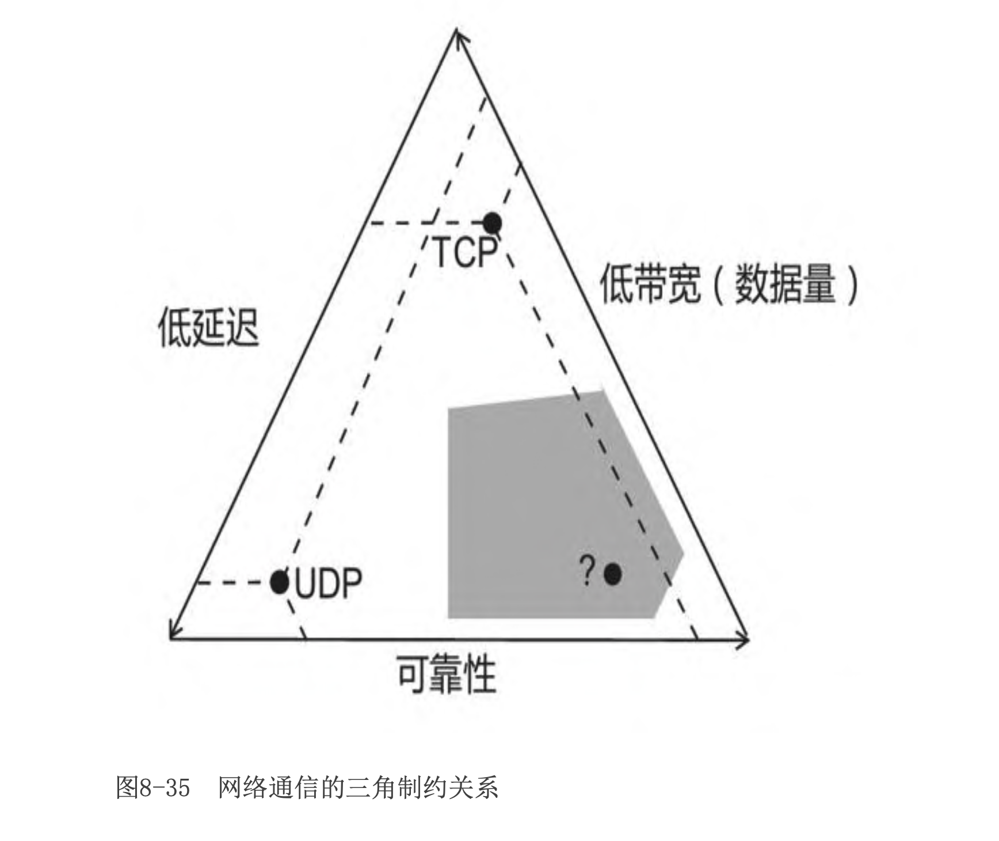

8. 第三方可靠UDP方案

   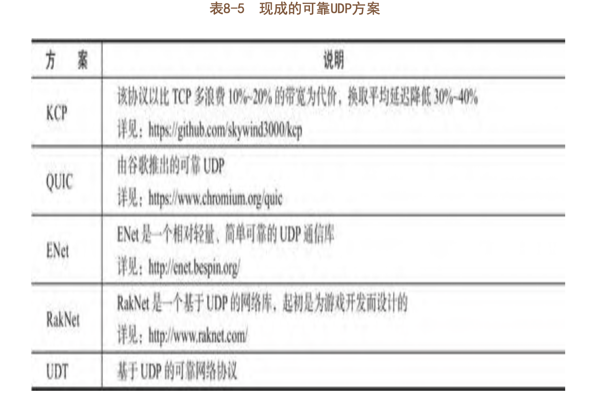

   ​	如果大家觉得很难分析各种方案的适用场景，那么可直接在UDP的 基础上使用KCP。KCP已用于多款商业游戏，证明它是行之有效的。原 始算法由C++编写，只有两个源文件，非常便于集成到服务端系统中。 另外，Github上也有好几款该协议的C#实现，非常便于嵌入Unity引擎 中。

## 第9章　热更新

1. Skynet的业务层由Lua语言编写，可以使用常规的Lua热更新方法 (9.4节将有详细介绍)，除此之外，Skynet的Actor架构还提供了利 用“独立虚拟机”作为“服务”级别热更新的能力，以及“注入补 丁”的热更新方案。

2. “热更新”与服务端的架构设计息息相关，Skynet实现了Actor模 型，还为每个Lua服务开启了独立的虚拟机(如图9-4所示，可回顾 7.1.1节)，这种架构为Skynet提供了一些热更新能力。

3. Skynet还提供了一种称为inject(可翻译为“注入”)的热更新 方案，如图9-9所示，写一份补丁文件，把它注入某个服务，就可以单 独修复这个服务的Bug。

4. 切换进程：

   * fork和exec是类Unix系统提供的两个函数。调用fork函数的进程 可以复刻自己，创建另外一个与自己一模一样的进程，而且是从调用 fork函数处开始执行;而exec函数则提供了一个在进程中启动另一个 程序执行的方法。这两个函数可用于实现优雅的进程切换。
   * Nginx是一款由C语言编写的Web服务器，具有很高的知名度。它是 一个多进程架构的程序，如图9-17所示，Nginx会开启一个master进程 和若干个worker进程(图中开启了1个)，其中，master进程负责监听 (图中监听了80端口)新连接，当客户端成功连接后，master会把该 连接交给某个worker处理。Nginx支持热更新。
   * 除了使用fork和exec函数，利用网关也能够实现优雅的进程切 换。
   * 无论是使用fork和exec函数、还是使用网关实现的热更新，都需 要借助多个进程的配合，进程切换热更新是一种架构级别的方法;而 且需要做到进程级别的无状态，或者能够在重启时恢复整个进程的状 态。
   * 切换热更新有个特点:旧连 接由旧进程负责处理，新连接由新进程负责处理。这意味着进程切换 热更新更适合于短连接的应用，这是因为旧连接很快就会断开，服务 端很快就能够全部演化到新版本。
   * 寻路服务是一个无状态的服务，它可以拆分成微服务的形式，而微服务的请求一般是短连接，可以使用切换进程的热更新方式。

5. 动态库

   进程切换不仅需要多个进程相互配合，还要实现进程级别的无状态(或能完全保存和恢复状态，下面的表述不再说明)，灵活性很
   差。如果靠单个进程就能实现热更新，那么程序在开发时就能够灵活很多。使用动态库就能实现单进程的热更新，而且只需要达到“库”级别的无状态。

   如图9-23所示，动态库热更新的方式是指把程序的某些变量和方 法编写到外部的动态库文件(.so)中，在程序运行时再动态地加载它 们。这种方式可用于热更新动态库中的内容，只需要把动态库替换掉 即可。

   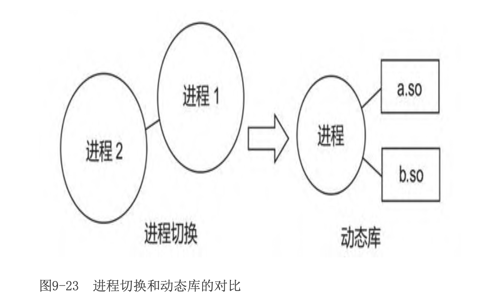

6. 服务端热更新能力的五个层次

   

## 第10章　防外挂

1. 不信任客户端

2. 尽可能多的校验

3. 反外挂常用措施

   * 防变速器

     变速器是最常见的外挂之一，它可以改变客户端的运行速度，从 而获取速度上优势。例如，某款状态同步的游戏所使用的移动协议如 代码10-12所示，由客户端运算并发送角色位置，服务端只做转发。

   * 防封包工具

     外挂通常会利用WPE(Winsock Packet Editor，网络数据包编辑 器)等封包工具，这类工具可以截取和修改网络数据包，进而向服务 端发送任意数据。例如，10.2.1节的刷金币案例，玩家可以在开启游 戏后用WPE截取“吃金币”的协议(具体实现请回顾代码10-7)，然后 重复发送。如果服务端没有做防护措施，就有可能被外挂玩家“刷金 币”。

   * 帧同步投票

     外挂的根源是游戏对客户端算力的依赖。回顾8.4节，帧同步是一 种依赖客户端运算的技术，很容易作弊。服务端可以通过投票机制找 出作弊的玩家。

## 第11章　未尽之路

### 11.1　高并发

1. 本书的第5章为大家介绍了Actor模型的原理和具体实现。实现 Actor模型是Skynet引擎的核心功能，Actor模型把“执行任务”抽象 成了各服务消息队列里的元素，从而使得CPU的各线程能够并行处理这 些任务，以提高效率。
2. “One Loop Per Thread”(如图11-2所示)是另一种用于实现高 并发的服务端模型，其将连接分派到不同的工作线程上，每个线程会 开启单独的循环，从而直接利用CPU的多核特性提高效率。

### 11.2　服务端架构

1. 大世界架构

   本书的第3章为大家介绍了一种传统的大世界服务端架构。如图 11-3所示，该架构把整个服务端划分成了网关(Gate)、游戏服务 (Game)、登录服务(Login)、中心服务(Center)、全局服务 (Chat、Rank)等几大部分，各个部分可用一个单独的进程或一个 Actor来表示。该架构具有较强的通用性，适用于角色扮演类游戏 (MMORPG)、卡牌游戏、开房间类型游戏......

   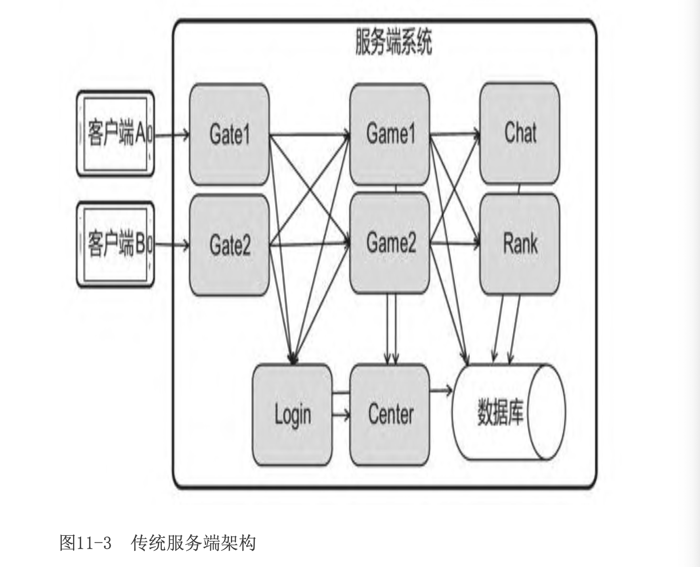

2. BigWorld

   角色扮演、开房间战斗(部分射击游戏、竞技游戏)等类型的游 戏都具有“角色在场景中”的特点，服务端底层可以进一步抽象，把 所有事物都归结为实体和空间两大类(请回顾8.5.2节)，并提供“角 色行走”“切换场景”“感兴趣区域”(请回顾8.5.1节)等功能，方 便开发者使用。

   图11-4所示的是类BigWorld的架构，它把所有事物都归结为实体 和空间两大类。服务端划分成了Base、Ceil等不同类型的进程，Ceil 是一种管理场景的进程，图中Ceil1包含森林、村落两个场景(空 间)，Ceil2包含沼泽场景;角色(实体)A和B在森林中。由于服务端 多做了一层抽象，因此服务端可以提供更多通用功能，例如，角色行 走、切换场景、感兴趣区域等，从而使得逻辑开发更加便捷。

   图11-4所示的是类BigWorld的架构，它把所有事物都归结为实体 和空间两大类。服务端划分成了Base、Ceil等不同类型的进程，Ceil 是一种管理场景的进程，图中Ceil1包含森林、村落两个场景(空 间)，Ceil2包含沼泽场景;角色(实体)A和B在森林中。由于服务端 多做了一层抽象，因此服务端可以提供更多通用功能，例如，角色行 走、切换场景、感兴趣区域等，从而使得逻辑开发更加便捷。

   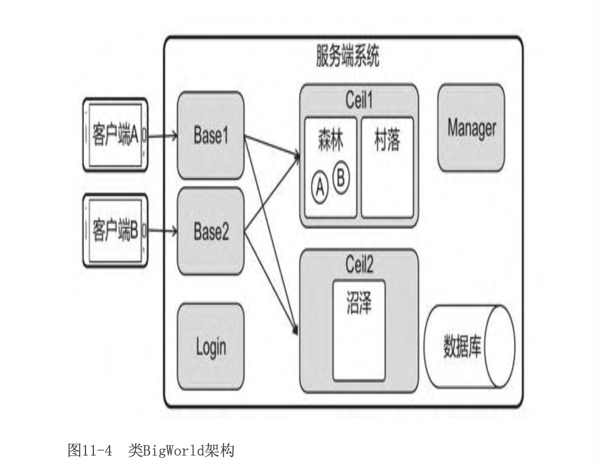

3. 无缝大地图

   一些游戏拥有又大又复杂的地图，运算量往往超过了一台物理机的极限。对于这种无缝大地图，解决办法是将大地图分块，让不同的
   物理机(节点)处理地图的不同区域。然而，分区域会让游戏逻辑变得更加复杂，实体的每一个动作(如移动)，都要考虑它对本节点的影响、对相邻节点影响，以及是否需要转移节点

4. 滚服架构

   大世界架构拥有支撑数十万玩家同时在线的潜力，如果玩家进一步增多，还可以部署多个大世界架构的服务器，支撑百万级玩家同时
   在线。一个大世界架构的服务端可以开启数千个进程支撑数十万玩家，也可以只开启三五个进程支撑数千名玩家，规模调整非常灵活。

   滚服架构是一种开启几百上千个“支撑数千名玩家的服务端”的 架构(可参考图11-6)，国内不少MMORPG都采用了该架构。滚服架构 与游戏业务有关，因为每个服务器相对独立，所以玩家可以在新服务 器上重新游玩，所有人都在同一起跑线上，从而可以避免与旧服务器 的强大玩家正面交锋。

   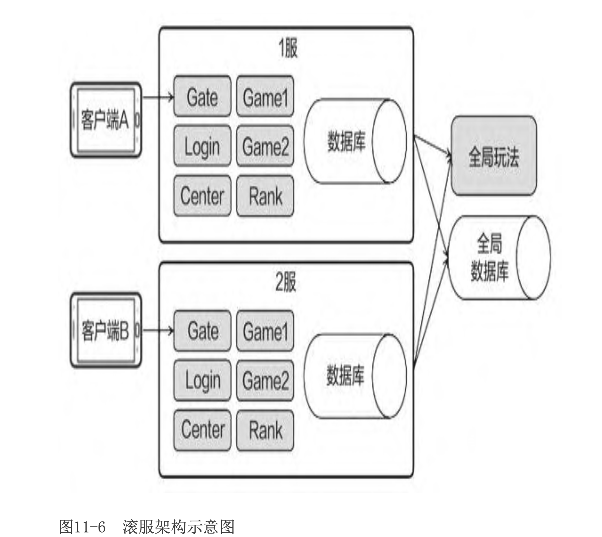

### 11.3　工程管理

1. 分层架构

   随着项目规模的增大，开发难度会越来越高。这是因为开发者每开发一个新模块都要考虑它与其他模块的关联，规模越大关联越多，
   难度也就越高。分层架构是一种性价比很高的方法，开发者只需要遵循少量的规则，就可以减少模块间的关联。

   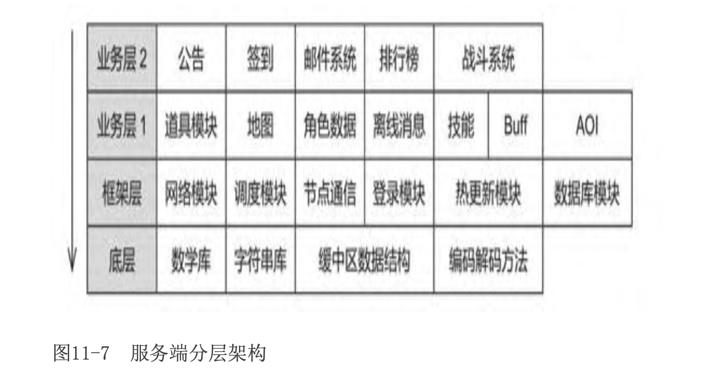

2. 人员分工

   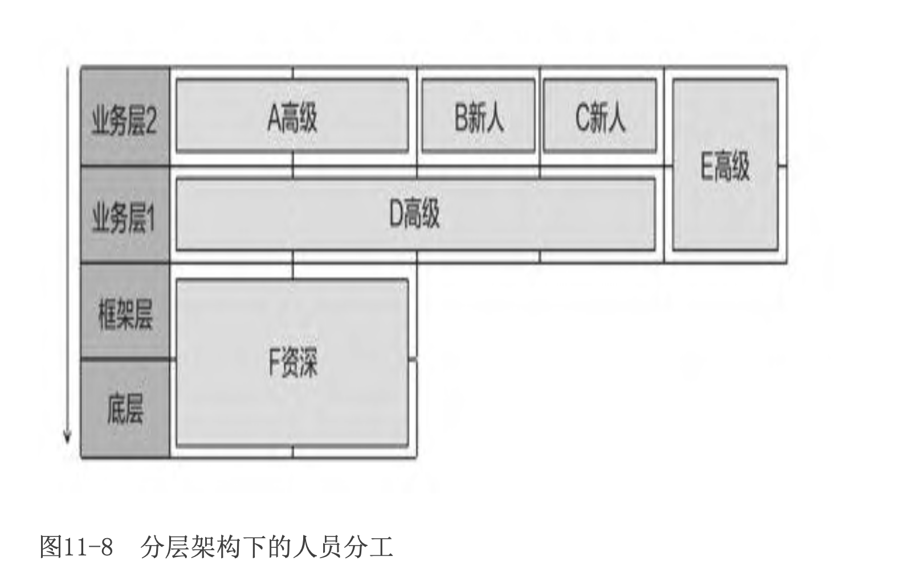

3. 版本管理

   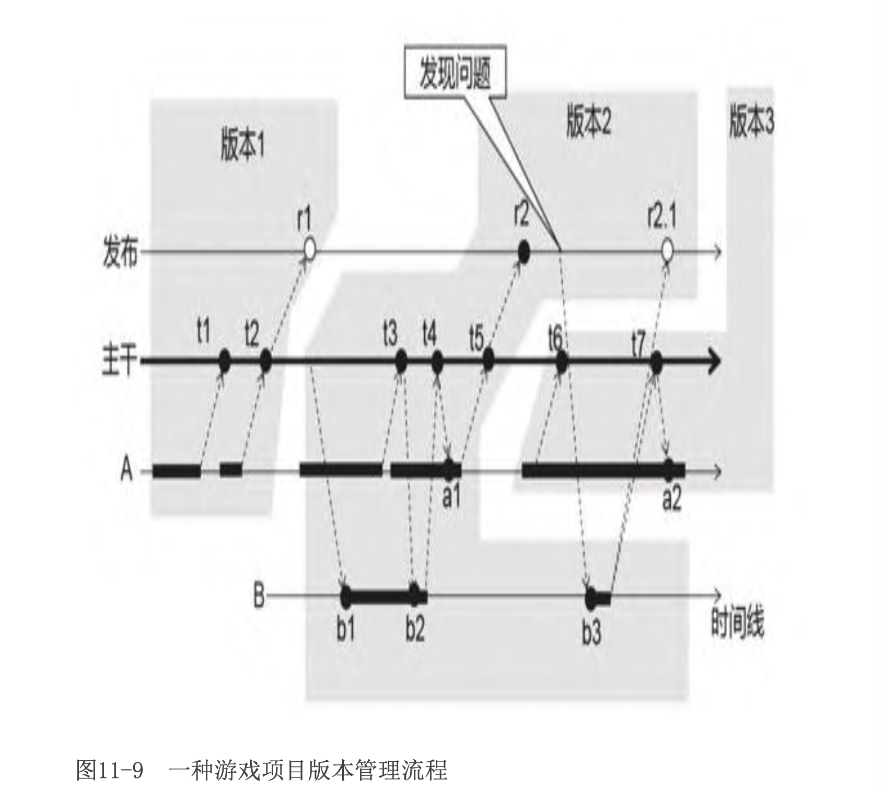