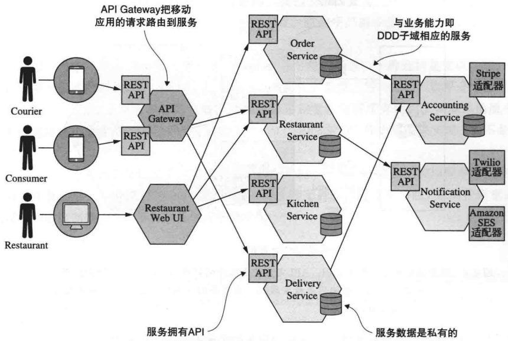

#《数据密集型应用系统设计》

## 一、整体框架与核心观点

### 1. 整体框架

**第一部分：数据系统的基石**

本部分奠定了单个数据系统组件的设计基础，涵盖核心目标、数据抽象、存储实现与兼容性演进。

- **第1章：可靠性、可伸缩性、可维护性**：开宗明义，提出并深入探讨系统设计的三大核心目标。

- **第2章：数据模型与查询语言**：比较关系模型、文档模型和图模型等不同数据抽象及其查询语言。

- **第3章：存储与检索**：深入数据库存储引擎内部，剖析日志结构存储（如LSM树）和页面存储（如B树），并介绍面向分析的数据仓库与列式存储。

- **第4章：编码与演化**：讨论数据编码格式（如JSON、Protocol Buffers、Avro）如何适应模式变化，以及不同场景下的数据流类型。

**第二部分：分布式数据**

当单个节点无法满足需求时，数据必须分布在多台机器上。本部分深入探讨分布式环境下的核心技术挑战与解决方案。

- **第5章：复制**：阐述数据冗余技术，包括主从复制、多主复制和无主复制，及其带来的延迟问题。

- **第6章：分区**：探讨如何将数据拆分到不同机器，涵盖分区策略、二级索引集成、再平衡与请求路由。

- **第7章：事务**：分析事务的隔离级别，从弱隔离级别（读已提交、快照隔离）到可串行化的实现。

- **第8章：分布式系统的麻烦**：揭示分布式系统固有的困难，如部分失效、不可靠网络、时钟问题以及“真相”的界定。

- **第9章：一致性与共识**：深入一致性模型（线性一致性、顺序保证），并探讨实现共识的算法（如Paxos、Raft）与分布式事务。

**第三部分：衍生数据**

现代系统常包含多个数据组件，数据在其间流动、转换并衍生出新的形态。本部分讨论如何集成与处理这些数据流。

- **第10章：批处理**：介绍大规模离线数据处理系统，从Unix工具到MapReduce与分布式文件系统，以及其后续演进。

- **第11章：流处理**：探讨实时事件流的处理，包括流传递模式、数据库变更捕获与流处理系统设计。

- **第12章：数据系统的未来**：展望数据集成、分拆数据库的趋势，并强调保证数据正确性的重要性及系统的伦理责任。

### 2. 作者核心观点：原则高于工具，权衡决定架构

贯穿上述框架，作者 Martin Kleppmann 的核心观点可凝练为：**以深刻理解基本原则为指导，通过掌握权衡取舍的艺术，构建适应需求、经久耐用的系统**。这一观点具体体现在以下维度：

**聚焦“数据密集型”的本质**

书中指出，现代应用的核心挑战源于**数据量、数据复杂性和数据变化速度**，而非计算能力。这些应用通常由数据库、缓存、搜索索引、流处理和批处理系统等多种数据系统组件拼接而成。

**确立三大普适设计目标**

这是全书论证的基石，所有技术讨论都服务于如何实现这些目标：

1. **可靠性**：系统应在硬件故障、软件错误、人为失误时仍能正确工作。通过设计简化、解耦、自动化测试、监控与快速恢复等策略实现。

1. **可伸缩性**：系统需有合理方法应对负载增长（数据量、流量、复杂度）。重点在于根据特定负载描述和性能指标进行设计，理解纵向与横向伸缩的权衡，**不存在通用的“银弹”架构**。

1. **可维护性**：确保系统便于长期运维与演进，包括： 

- **可操作性**：便于监控、自动化、故障诊断。

- **简单性**：通过**抽象**管理复杂度，消除“额外复杂度”，使系统易于理解。

- **可演化性**：易于适应未来变化，依赖清晰的抽象与模块化设计。

**强调方法论与权衡的艺术**

这是作者思想的核心方法论：

- **深入原理，而非表面工具**：鼓励读者穿透具体技术（如某个数据库或框架），掌握数据模型、存储引擎、复制、一致性等底层概念的共性与内在机制。

- **一切皆权衡**：明确指出现实设计中不存在完美方案，每项选择都涉及利弊权衡（例如一致性 vs. 可用性、延迟 vs. 吞吐量、开发效率 vs. 运行性能）。架构师的职责是根据具体应用上下文做出明智的取舍。

- **系统化集成视角**：现代架构常需组合多种异构数据组件。本书提供了将这些组件集成为一个**统一、健壮系统**的思考框架，而非孤立地看待它们。

总而言之，本书的框架与观点相辅相成：其**三层式结构**系统化地囊括了从单机到分布式、从存储到处理的知识闭环；而作者的**核心观点**则为 navigating 这个复杂知识领域提供了贯穿始终的“指南针”——即对基本原则的深刻把握与对现实权衡的清醒认知。

## 二、数据模型、存储引擎与编码演化

构建可靠、可伸缩、可维护数据系统的实践，始于对单机数据管理的深刻理解。它包含三个环环相扣的层面：**如何抽象现实世界为数据**（数据模型与查询语言）、**如何将数据高效地“放进去”和“取出来”**（存储与检索），以及**如何在系统演进中长期保持数据可被正确解读**（编码与演化）。本章将系统探讨这三个基础层级的核心原理、架构权衡与进化逻辑。

### **1. 数据模型：关系、文档与图的对比与选型**

数据模型定义了数据的组织、关系与操作方式，是系统抽象的顶层视图。**没有放之四海而皆准的“最佳”模型，选择取决于对数据间关系的本质、查询模式以及可维护性需求的综合权衡。** 主流模型可以分为关系、文档、图三大范式。

- **关系模型 (Relational Model)** 以**表**为基本单位，行代表数据，列代表属性，通过**外键**和**连接 (JOIN)** 操作来建立关联。其核心是**写时模式**和**SQL**这一强大的声明式查询语言。

- **优势**：为处理**多对多关系**提供了最成熟的范式，支持复杂的多表连接与事务操作。规范化设计能有效减少数据冗余，确保一致性。其模式约束在写入时即保证数据完整性。

- **挑战**：在面向对象应用中存在“**阻抗不匹配**”，常需对象关系映射层。模式变更（如增加字段）通常需要执行迁移（ ALTER TABLE ），不够灵活。当需要获取一个包含所有关联信息的完整聚合（如用户及其所有订单、评论）时，可能需要进行多次查询，**局部性**较差。

- **文档模型 (Document Model)** 以**自包含的文档**（如JSON、XML）为存储单元，将相关联的数据**嵌套**或**反规范化**在同一个文档中。

- **优势**：天然契合具有**一对多**或**树状**关系的数据（如一篇博客及其所有评论），**局部性极佳**，一次性读取即可获得完整聚合。采用**读时模式**，不强制预定义严格结构，模式演化非常灵活，适应快速变化的需求。

- **挑战**：对**多对多关系**的支持较弱，若需连接，通常需在应用层手动处理或进行数据冗余（反规范化），可能引发一致性问题。复杂查询能力有限，难以表达跨越多个集合的连接。

- **图模型 (Graph Model)** 将数据抽象为**顶点**（实体/节点）和**边**（关系），专门为处理复杂、**高度互联**的数据而设计。

- **优势**：能直观且高效地表达和遍历**复杂的多对多关系网络**，如社交网络、知识图谱。数据模型可灵活扩展，轻松添加新类型的节点和关系。提供Cypher等专用查询语言，便于表达路径查询。

- **挑战**：对于结构简单、关联度低的数据，使用图模型会引入不必要的复杂性。在分布式环境下，跨分区的图遍历查询可能性能低下。

**综合选型标准如下表所示：**

| **维度**         | **关系模型**                | **文档模型**                     | **图模型**                             |
| ---------------- | --------------------------- | -------------------------------- | -------------------------------------- |
| **核心数据关系** | 多对多关系                  | 一对多、树状                     | 任意复杂互联关系                       |
| **模式灵活性**   | 写时模式，严格              | 读时模式，灵活                   | 灵活，易于扩展                         |
| **查询特点**     | 复杂连接、聚合              | 单文档或简单查询                 | 深度遍历、路径发现                     |
| **典型适用场景** | 传统业务系统、金融交易、ERP | 内容管理系统、产品目录、用户配置 | 社交网络、欺诈检测、推荐系统、知识图谱 |

**权衡要点**：关系模型因其通用性和强大的连接能力，常被视为默认的稳健选择。但当数据关系以聚合为中心时，文档模型能极大简化应用逻辑并提升读取性能。对于关系密集、且关系本身蕴含重要价值的场景（如“朋友的朋友”），图模型则具有不可替代的优势。现代数据库正趋于融合，例如关系数据库支持JSON字段，文档数据库提供简单连接，体现了架构师应根据具体负载进行精细化权衡的务实精神。

### **2. 存储引擎：从磁盘布局看读写性能的根源**

数据模型定义了逻辑视图，而存储引擎决定了数据如何在物理存储上被组织与访问。其核心设计直接决定了系统的读写性能特性，主要分为两大类：面向事务处理的**行式存储引擎**与面向分析的**列式存储引擎**。

- **行式存储引擎：B-树 vs. LSM树** 两者都是为高效的点查询和范围查询而设计，但采用了截然不同的磁盘布局哲学。

- **B-树**：将数据组织为一棵**平衡树**，数据存储在固定大小的**页**中。更新数据时，通常**就地修改**目标页，并依赖预写日志保证崩溃恢复。这使其**读取具有稳定且可预测的低延迟**（O(log N)复杂度）。然而，**随机写入**可能引发页分裂、合并，导致显著的**写入放大**。

- **LSM树**：采用“**日志结构**”的思想。所有写入先追加到内存表，再顺序刷入磁盘形成不可变的**有序字符串表**。后台进程通过**合并**过程来整合文件并删除旧数据。这种设计使得**写入几乎完全是顺序追加，具有极高的吞吐**。但读取可能需要检查多个层级，**延迟可能不稳定**，通常依赖布隆过滤器等结构优化。

**B-树与LSM树对比：**

| **特性**     | **B-树**                   | **LSM树**                                    |
| ------------ | -------------------------- | -------------------------------------------- |
| **写入特性** | 随机写，可能写放大         | 顺序追加，写入吞吐高                         |
| **读取特性** | 延迟稳定、可预测           | 延迟可能波动，旧数据查找慢                   |
| **存储放大** | 较低（因页内可能留空）     | 较高（存在未合并的重复数据）                 |
| **适用场景** | 强事务、读多写少的OLTP系统 | 写入密集、容忍较高读延迟的日志、时序数据系统 |

- **列式存储引擎 (Column-Oriented Storage)** 专为**在线分析处理**设计。与行存储将一整行数据连续存放不同，列存储将每一列的数据单独存储在一起。

- **核心优势**：1）**极高的压缩比**，同一列数据类型一致，便于使用游程编码、位图编码等高效压缩。2）**查询高效性**，分析查询通常只涉及部分列的扫描与聚合，列存储仅需读取相关列，大幅减少I/O。数据可按列排序，进一步提升压缩与查询性能。

- **主要挑战**：**写入和更新非常昂贵**，因为需要重写整个列文件。实践中，列存储通常会结合LSM树的思路，先将写入放入内存的行式“段”，再批量转换为列格式并合并到持久化存储中。

- **适用场景**：数据仓库、BI分析等需要在大数据集上进行复杂聚合和扫描的OLAP负载。

**从设计目标看存储引擎选择**：选择**B-树**更侧重于**可预测的性能**（可维护性）和基于锁/多版本控制的**强事务**（可靠性）。选择**LSM树**则更偏向于**极高的写入可伸缩性**，代价是读取延迟的波动和更复杂的后台维护。而**列式存储**是在**分析查询的吞吐量与可伸缩性**上做到了极致，但其设计牺牲了点查询和实时更新的效率。

### **3. 编码与演化：数据流动的长期契约**

数据并非静止，它需要在进程、服务、组织间流动，并随时间演化。编码（序列化）格式决定了数据在网络传输或持久化时的字节表示，而**模式演化能力决定了系统能否在不停机的情况下平滑升级**，是长期可维护性的关键。

围绕兼容性，编码格式可分为两大阵营：

- **文本格式 (如JSON、XML)**：

- **优点**：人类可读，利于调试，通用性极强，适合**对外开放的API**。

- **缺点**：编码冗长（重复字段名），解析性能较低，缺乏强类型和模式约束。演化依赖隐式约定，易出错。

- **二进制格式 (如Protocol Buffers, Thrift, Avro)**：

- **优点**：编码紧凑，解析高效，提供强模式定义和跨语言代码生成。

- **缺点**：不可直接阅读，需要模式定义。

- **三者的核心区别在于模式演化策略**： 

- **Protocol Buffers & Thrift**：依赖**字段标签号**作为唯一标识。演化时，新代码读取旧数据会忽略未知标签号的字段（向后兼容），旧代码读取新数据会跳过它不认识的标签号（向前兼容）。关键规则是：**字段标签号一旦分配，永远不能更改或复用。**

- **Avro**：采用**读写模式分离**机制。数据编码时不存字段名或标签，仅存值序列。读取时，需同时提供“写入时所用的模式”和“读取时期望的模式”，Avro通过字段名匹配来实现转换。这使得Avro的编码最为紧凑，且特别适合模式频繁变化或数据生产者与消费者模式不完全同步的场景（如大数据管道）。

**编码格式对比与演化规则：**

| **格式**             | **核心兼容机制**        | **向前兼容关键**       | **向后兼容关键**           | **典型应用场景**                       |
| -------------------- | ----------------------- | ---------------------- | -------------------------- | -------------------------------------- |
| **JSON**             | 读时模式，无强制约束    | 旧代码需能忽略未知字段 | 新代码需能处理缺失字段     | RESTful API，配置，跨组织交换          |
| **Protocol Buffers** | 字段标签号              | 新加字段需为 optional  | 禁止修改或复用标签号       | 高性能RPC、微服务内部通信              |
| **Thrift**           | 字段标签号              | 新加字段需为 optional  | 禁止修改或复用标签号       | 跨语言服务、网络通信                   |
| **Avro**             | 读写模式分离/字段名匹配 | 为新字段提供默认值     | 删除字段时旧模式需有默认值 | 大数据存储、事件流、模式动态变化的管道 |

**核心设计原则**：

1. **数据比代码更长久**：编码格式和支持的演化策略，是系统长期演进的基础设施。

1. **避免“刚性”约束**：避免使用 required 字段（在Protobuf 2中），多使用 optional 字段并善用默认值，为未来变化留出空间。

1. **模式即显式契约**：强模式格式（Proto/Thrift/Avro）不仅提升了性能，更通过显式契约保障了不同服务、不同版本间数据交换的可靠性，是构建可维护分布式系统的基石。

**综上，数据模型定义了我们对世界的抽象视角，存储引擎决定了数据存取的物理效率，而编码格式则为数据在时间和空间维度的流动建立了可演化的契约。** 深刻理解每一层的可选方案及其在**可靠性、可伸缩性、可维护性**三维度上的权衡取舍（例如：选择关系模型增强了数据一致性（可靠性），却可能增加应用层复杂度（可维护性）；选择LSM树提升了写入吞吐（可伸缩性），却可能牺牲读取延迟的稳定性），是后续构建分布式数据系统和数据流架构不可或缺的坚实基础。

## 三、分布式数据核心技术：复制、分区、事务与一致性

当单机无法应对数据量、请求量或可用性要求时，系统必须走向分布式。正如前文所述，分布式数据管理的核心目标依然是**可靠性、可伸缩性与可维护性**，而实现这些目标依赖于四大基石技术：复制（Replication）、分区（Partitioning）、事务（Transaction）以及在此之上构建的一致性保证与共识机制。

### （一）复制：分担负载与保障可用性

复制通过在多个节点（副本）上保存相同数据的副本，旨在实现**高可用性**（部分节点故障无碍）、**低延迟**（地理上靠近用户）和**可伸缩性**（分担读取负载）。

**1. 三种核心复制模式**

| 模式         | 机制概述                                                     | 优点                                                         | 缺点                                                         | 典型适用场景                                                 |
| ------------ | ------------------------------------------------------------ | ------------------------------------------------------------ | ------------------------------------------------------------ | ------------------------------------------------------------ |
| **主从复制** | 1. **单主节点**（Leader/Master）处理所有写入，通过变更日志（WAL或逻辑日志）同步给多个**从节点**（Followers/Slaves） 2. 从节点通常提供只读服务 3. 主节点故障需进行**故障切换**（Failover） | - 简单成熟，生态支持好 - 写入强一致性（单点决策） - 读写分离，提升读吞吐 | - **单点写入瓶颈** - 主节点故障切换可能导致服务中断或数据丢失（异步复制下） - 异步复制导致从节点读取延迟（最终一致性） | 传统数据库（MySQL, PostgreSQL）、读多写少的Web应用、读写分离的分析场景 |
| **多主复制** | 1. **多个主节点**均可接受写入，每个节点异步将变更复制给其他主节点 2. 复制拓扑可为环形、星型或全连接 3. 需处理**写入冲突**（通过LWW、CRDT或应用层解决） | - 写入负载分散，提升写吞吐 - 多数据中心部署下，写入低延迟（就近写入） - 高可用性（单主故障不影响其他主节点） | - **冲突解决复杂**，可能导致数据丢失（如LWW策略） - 维护复杂，一致性为最终一致 | 多数据中心部署、离线操作应用（如日历）、协同编辑系统（如Google Docs） |
| **无主复制** | 1. **无中心主节点**，任何节点均可处理读写 2. 依赖**法定数（Quorum）机制**：写入 W 个节点、读取 R 个节点（满足 W + R > N ， N 为副本总数）即为成功 3. 使用版本向量（如向量时钟）检测冲突，通过**读修复**或**反熵过程**同步数据 | - 极高的可用性与容错性 - 写入可并行，高吞吐 - 配置灵活，可权衡一致性与延迟 | - 通常为**最终一致性**，可能读到旧数据 - 冲突检测与解决需应用层参与 - 缺乏跨节点强事务 | 对高可用性要求高于强一致性的场景（如社交网络、IoT数据收集）、Dynamo风格数据库（如Cassandra, Riak） |

**2. 复制的关键权衡**

- **同步 vs. 异步复制**：同步复制（写成功需等所有副本确认）保证强一致性但延迟高、可用性低（任一副本故障则写入失败）；异步复制延迟低、可用性高，但故障时可能丢失已确认的写入。

- **复制日志的实现**：与单机存储引擎的日志（如B树的redo log、LSM树的SSTable）技术同源，复制本质上是日志在节点间的传播。

- **处理滞后副本**：异步复制或网络分区导致副本数据滞后，系统需定义**一致性模型**（如读己之写、单调读等）来明确对客户端承诺的可见性规则。

### （二）分区：伸缩数据量与吞吐量

当单机无法容纳全部数据或处理所有请求时，需将数据**分区**（或称分片）分布到多个节点。目标是**负载均衡**与**横向扩展**。

**1. 键值数据的分区方法**

- **基于键的范围分区**：将键的连续范围分配给不同分区。**优点**是支持高效的范围查询（如时间范围扫描）；**缺点**是易导致数据分布不均和**热点**（某个范围访问过热）。

- **哈希分区**：使用哈希函数将键映射到分区。**优点**是数据分布均匀，避免热点；**核心缺点**是完全**不支持高效的范围查询**，相邻的键被散列到不同分区。

**2. 二级索引与分区**

二级索引（非主键索引）在分区环境中面临挑战，因为索引条目可能分布在多个分区。主要处理策略：

- **基于文档的二级索引（本地索引）**：每个分区独立维护只覆盖本分区数据的二级索引。查询时需向**所有分区**发送请求并合并结果（**分散/聚集**），写入简单。

- **基于关键词的二级索引（全局索引）**：二级索引本身也按索引键进行分区，独立于主数据分区。查询时只需访问相关索引分区，效率高；但**写入成本高**，因为可能需更新多个索引分区，且需跨节点协调。

**3. 动态平衡与请求路由**

- **分区再平衡**：当负载变化或节点增减时，需在集群间迁移数据。策略包括固定数量分区（预分配更多分区，通过迁移实现平衡）或动态分区（根据数据量自动拆分与合并分区）。

- **请求路由**：客户端如何知道数据所在分区？常见方案有：通过独立的**路由层**（如ZooKeeper）维护分区映射；使用**一致性哈希**；或由客户端/代理服务器缓存分区信息。

### （三）事务：在并发与故障中保证正确性

事务将多个读写操作捆绑为一个逻辑单元，提供 **ACID**（原子性、一致性、隔离性、持久性）保证，是构建正确应用的基石。

**1. 隔离级别与实现机制**

隔离级别定义了事务并发执行时，可能遇到的异常现象（脏读、不可重复读、幻读、写偏序）的允许程度。

| 隔离级别     | 防止的异常             | 典型实现机制                                                 | 性能与适用场景                                               |
| ------------ | ---------------------- | ------------------------------------------------------------ | ------------------------------------------------------------ |
| **读未提交** | 无                     | 不加读锁，可能读到未提交数据                                 | **性能最高**，一致性最弱，仅用于监控等极低要求场景           |
| **读已提交** | 脏读                   | 1. **行级写锁**（提交后释放） 2. **多版本并发控制（MVCC）**：为每次查询维护一个已提交数据快照 | **高并发读**（MVCC下读不阻塞写），多数OLTP系统默认级别       |
| **可重复读** | 脏读、不可重复读       | MVCC：事务开始时获取快照，整个事务基于此快照读取。可能需**间隙锁**防止幻读 | 读一致性更强，适用于需要稳定视图的报表查询                   |
| **快照隔离** | 脏读、不可重复读、幻读 | 基于MVCC，事务基于开始时的一致性快照读写，提交时检测**写-写冲突**。但仍可能出现**写偏序** | **读性能极高**，适用于读多写少、需要一致性读的场景           |
| **可串行化** | 所有异常               | 1. **字面串行执行**（单线程） 2. **两阶段锁（2PL）** 3. **可串行化快照隔离（SSI）** | 最强一致性，但并发性能通常最低（2PL）或中等（SSI），用于金融交易等强一致性场景 |

**2. 可串行化的实现路径**

- **两阶段锁（2PL）**：事务分为“加锁”与“释放锁”两阶段，通过严格的读写锁防止所有冲突。代价是**锁开销大、易死锁、并发度低**。

- **乐观并发控制（OCC）**：事务先无锁执行，提交前验证所读数据是否被他人修改。适用于**低冲突、读密集型**场景。

- **可串行化快照隔离（SSI）**：在快照隔离基础上，通过跟踪事务间的读写依赖（“写后读”、“读后写”）来检测可能导致环状冲突（违反可串行化）的风险，并中止风险事务。它在**保持高读并发的同时，提供了最强的隔离性**，是现代分布式数据库（如CockroachDB）追求的实现方向。

### （四）一致性与共识：在不确定的分布式世界中建立秩序

分布式环境固有的**网络延迟、时钟偏差和部分失效**，使得维持副本间的一致性及协调多个节点达成一致，成为核心挑战。

**1. 分布式系统的现实麻烦（第8章）**

- **网络延迟与不可靠性**：网络是异步的，消息可能延迟、丢失、重复。系统必须处理**部分失效**，并通过**超时重试**（需保证幂等性）、冗余副本和异步消息队列来提升容错能力。

- **时钟同步问题**：物理时钟存在**偏移**，且可能回退。依赖物理时钟作关键决策（如事务排序）是危险的。解决方案包括**逻辑时钟**（如Lamport时间戳）、**混合逻辑时钟**，或像Google Spanner那样使用有界误差的**TrueTime API**。

- **拜占庭故障**：节点可能发生任意故障（包括恶意行为）。在企业内部系统中较少见，但在区块链等开放网络中必须处理。解决方案包括**拜占庭容错算法（如PBFT）** 和基于工作量证明的**区块链共识**。

**2. 一致性模型与共识算法（第9章）**

- **线性一致性（强一致性）**：要求系统看起来仿佛只有一个数据副本，且所有操作原子生效。实现代价高，通常影响可用性与延迟。

- **顺序一致性等较弱模型**：放宽约束，允许系统在内部副本间存在延迟，但对每个客户端保证操作的顺序观感。

- **共识算法**：在不可靠的进程间就某个值达成一致的基础算法。**Paxos**和**Raft**是经典的非拜占庭容错共识算法，广泛应用于复制日志的领导者选举、配置变更等场景，是构建**强一致性分布式系统**（如etcd、一致性复制）的基石。

**总结**：复制、分区与事务，构成了分布式数据管理的**技术三角**。复制解决数据冗余与可用性，分区解决数据规模与扩展性，事务则保证在并发和故障下的操作正确性。而这一切之上，**一致性模型与共识算法**提供了在分布式不确定性的泥潭中，构建可预测、可协调系统的理论框架与工程实践。这四大核心技术环环相扣，共同支撑起**可靠、可伸缩、可维护**的现代数据密集型系统。

## 四、衍生数据处理与数据集成

在建立了如何存储、复制和分区数据的基础后，数据系统的讨论视角从“数据在单一系统内的生命周期”扩展至“数据在多个异构系统间的流动与转换”。这涉及到如何从原始数据（如数据库、日志文件）中派生出新的、专门优化的数据集（如搜索索引、缓存、机器学习模型、分析报表），以及如何在组织层面统一集成这些分散的数据组件，构建可靠、可扩展的端到端数据管道。

###  批处理：大规模数据的离线衍生

批处理系统专为处理极大规模的数据集而设计，其核心目标是在**高吞吐量**下对**静态的、完整的数据集**进行计算。

**1. MapReduce编程模型**

这是早期大规模批处理的典范。它将复杂的计算任务分解为两个阶段：

-  **map** **阶段**：读取输入数据，为每条记录生成一个或多个中间**键值对**。该函数通常是无状态的、无副作用的纯函数，便于并行化和容错。

-  **reduce** **阶段**：框架将所有相同键的中间值收集到一起，交由用户定义的 reduce 函数进行处理、聚合，最终生成输出。这个过程天然支持**分组（Group By）** 操作。

例如，统计每月观察到鲨鱼数量的任务，在SQL中是一条聚合查询，而在MapReduce中则被显式地编码为两个阶段的函数。其设计哲学强调**自动并行化与容错**，通过将计算任务调度到存储数据的节点（**数据本地化**）来减少网络传输，并通过重试失败任务来保证最终完成。

**2. 分布式文件系统架构**

以HDFS或Google File System（GFS）为代表的分布式文件系统，是MapReduce等批处理框架的存储基石。其关键设计包括：

- **大文件分块存储**：将TB级文件分割成固定大小的块（如64MB或128MB），分散在集群的多个节点上。

- **多副本冗余**：每个数据块在多个节点上保存副本，提供了高容错性和高读取吞吐量。

- **追加写入优化**：主要支持顺序、追加式写入，牺牲了随机写入的效率，以优化大规模数据加载和批量处理的场景。

**3. Unix工具哲学的影响**

批处理的思想渊源可以追溯到Unix系统的设计哲学：**通过简单、专注的工具组合（以管道** **|** **连接）来完成复杂任务**。使用 cat 、 grep 、 sort 、 awk 、 uniq 等命令行工具处理日志文件，就是单机上的“批处理”。MapReduce将这种“分而治之”和“组合使用”的理念，扩展到了成百上千台机器的集群上。

### 流处理：持续数据的实时衍生

与批处理相反，流处理系统针对**无界、持续到达**的数据流，目标是在数据产生后**极短延迟内**进行处理并输出结果。

**1. 事件流处理模型**

流处理将数据建模为**无限的事件流**。传递这些事件流的主要方式包括：

- **消息代理/消息队列**：如RabbitMQ，提供消息缓存和消费确认，支持异步解耦。

- **日志（Log）**：如Apache Kafka，将事件流持久化为仅追加（append-only）的、可按偏移量读取的日志。这提供了**消息重放**的能力，允许构建多个独立的衍生数据系统消费同一份原始数据流，是构建可靠数据管道的关键抽象。

**2. 窗口计算机制**

由于流是无界的，为了进行聚合（如“过去5分钟的销售额”），必须将流切割为有限的时间片段，即**窗口**。主要类型包括：

- **滚动窗口**：固定长度、不重叠的时间段（如每分钟一个窗口）。

- **滑动窗口**：固定长度、但可重叠的时间段（如每10秒计算一次过去1分钟的总和）。

- **会话窗口**：根据用户活动的间隙动态划分，用于分析用户会话行为。

这里引入了关键的时间概念：

- **事件时间**：事件实际发生的时刻（嵌入在数据中）。

- **处理时间**：事件被流处理器处理的时刻。

- **水位线**：一种用于处理**事件时间**和**乱序事件**的机制。水位线宣告“在某个时间点之前的事件大概率已经全部到达”，从而触发窗口的最终计算。

**3. 流与表的二元性**

这是统一理解批处理与流处理的核心理论。

- **流是变更日志**：数据库表的每一次插入、更新、删除，都可以表示为一个事件流（这正是**变更数据捕获（CDC）** 所做的事情，例如读取MySQL的binlog）。一个**表**，本质上就是其所有变更日志流从初始状态开始累积物化的结果。

- **表是流的物化状态**：流处理过程中的聚合操作（如计数、求和）会内部维护一个不断更新的状态，这个状态就是一个**表**。

- **双向转换**： 

- **流 → 表**：通过对流进行聚合或应用所有变更，可以物化生成一张表（**物化视图**）。

- **表 → 流**：通过观察表的变更（CDC）或定期生成完整快照，可以产生一个流。

这种二元性揭示了批处理（处理一个有界限的变更日志）和流处理（处理一个无界限的变更日志）在底层是相通的。现代系统如Apache Flink正是基于此，提供了**流批一体**的编程模型。

###  数据集成：构建统一的数据生态系统

当组织内存在多种数据存储（OLTP数据库、数仓、缓存、搜索索引、机器学习特征库）时，数据集成关注如何让数据在这些系统间正确、一致、及时地流动。

**1. 数据集成模式：ETL、ELT与CDC**

- **ETL**：传统数据仓库的经典模式。从源系统**抽取**数据，在专用处理服务器上进行**转换**（清洗、连接、聚合），然后**加载**到目标数据仓库。转换发生在加载之前。

- **ELT**：现代大数据平台的常见模式。先将原始数据**抽取**并**加载**到强大的数据平台（如云数据仓库或数据湖），然后在该平台内部利用其计算能力进行**转换**。ELT保留了原始数据的灵活性，便于后续进行不同的转换分析。

- **变更数据捕获**：是实现低延迟数据同步和实时衍生数据系统的关键技术。它通过解析数据库日志（最推荐的方式）、使用触发器或在应用层双写，将数据库的变更作为事件流发布，供下游的缓存、搜索索引或分析系统消费，确保它们能近乎实时地反映源系统的状态。

**2. 分拆数据库（Unbundling the Database）**

这是对未来数据系统架构的核心预测。传统关系数据库试图在一个系统中集成存储、索引、事务、查询优化、缓存等多种功能。而**分拆数据库**的理念主张将这些功能拆分为独立的、可组合的专用服务：

- 使用专门的存储引擎（如S3、HDFS）。

- 使用专门的索引与查询服务（如Elasticsearch用于搜索，Druid用于时间序列聚合）。

- 使用专门的流处理器进行实时计算（如Flink、Spark Streaming）。

- 通过CDC和消息日志（如Kafka）作为“脊梁”，将这些组件连接起来，让数据在其间流动。

这种架构提供了极大的灵活性和可扩展性，允许为每项任务选择最佳工具，但同时也对系统集成的复杂性和一致性问题提出了更高要求，需要**端到端（end-to-end）** 的可靠性与正确性设计来保障。

**3. 迈向弹性与负责任的系统**

- **无服务器与弹性伸缩**：批处理和流处理系统正日益与云原生环境结合，利用无服务器架构实现资源的自动伸缩和按使用付费，这与分拆数据库、组件化的趋势相辅相成。

- **数据伦理的内化**：在系统设计的权衡中，除了性能、成本、可靠性这些传统维度，**数据伦理**已成为不可忽视的一环。这包括对用户隐私的保护（如匿名化、差分隐私）、算法公平性的考量（避免偏见放大）、数据处理透明度的追求，以及对大规模系统环境影响的评估。未来的数据系统设计者需要将“**做正确的事**”与“**把事情做正确**”同时作为其技术决策的指引。