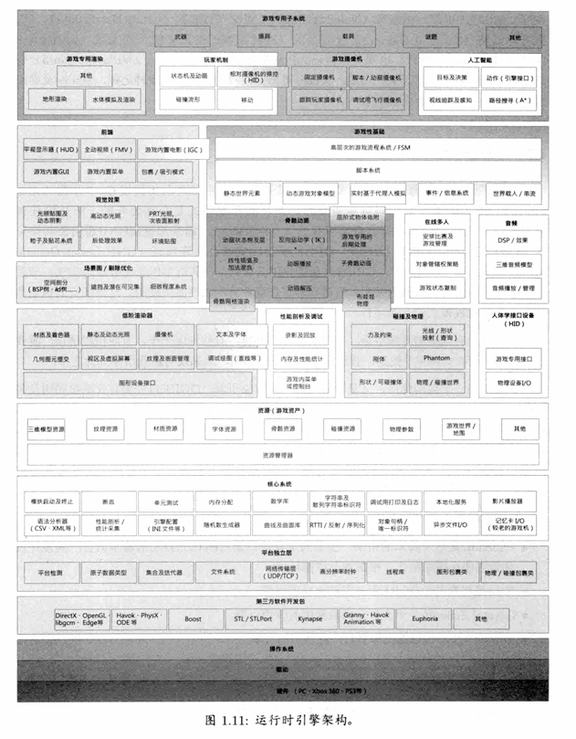
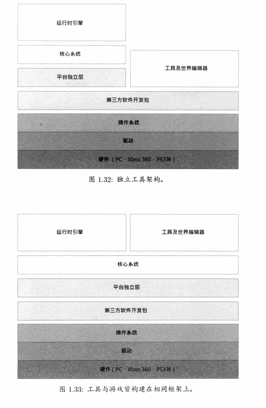
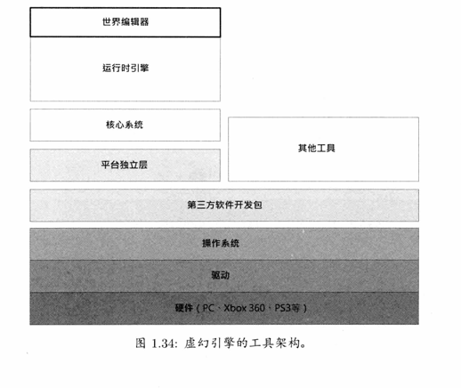
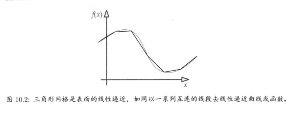
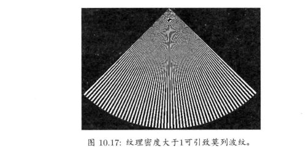
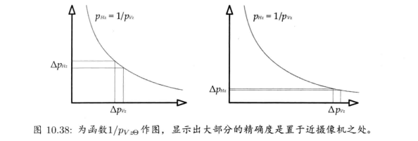
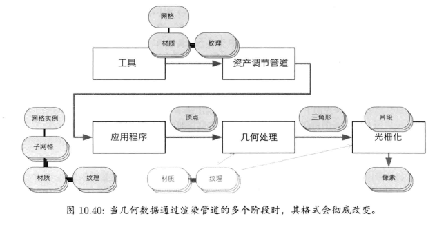
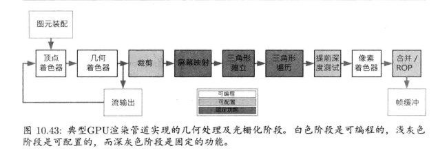

# 第一部分 基础

## 第1章 导论
1. 在开始钻研游戏引擎之前，先简单介绍一下典型游戏团队的人员配置。游戏工作(gamestudio)通常由5个基本专业领域的人员构成，包括工程师(工程师)艺术家(艺术家)游戏设计师(游戏设计师)、制作人(制作人)及其他管理/支持人员(市场策划、法律、信息科技/技术支持、行政等)。

2. 运行时架构图

   

   ```mermaid
   
   graph LR
       A[运行时引擎架构] 
       A --> B[游戏循环]
       A --> C[渲染系统]
       A --> D[物理系统]
       A --> E[音频系统]
       A --> F[输入系统]
       A --> G[资源管理系统]
       A --> H[内存管理]
       A --> I[多线程]
       A --> J[性能监控和调试]
   
       B --> B1[处理输入]
       B --> B2[更新游戏逻辑]
       B --> B3[执行物理计算]
       B --> B4[渲染帧]
       B --> B5[处理音频]
   
       C --> C1[渲染管道]
       C --> C2[着色器]
       C --> C3[缓冲区管理]
   
       D --> D1[碰撞检测]
       D --> D2[刚体动力学]
       D --> D3[流体模拟]
   
       E --> E1[音频文件加载]
       E --> E2[音频解码]
       E --> E3[混音]
       E --> E4[音频输出]
   
       F --> F1[键盘输入]
       F --> F2[鼠标输入]
       F --> F3[手柄输入]
   
       G --> G1[加载资源]
       G --> G2[管理资源]
       G --> G3[释放资源]
   
       H --> H1[内存池]
       H --> H2[对象池]
       H --> H3[自定义分配器]
   
       I --> I1[任务分配]
       I --> I2[多CPU核心]
   
       J --> J1[性能检测]
       J --> J2[内存泄漏检测]
       J --> J3[问题调试]
   
   ```
   
   3. 可用不同方式去构建游戏引擎工具套装。一些工具可能是独立的软件，如图1.32所示。一些工具可能构建在运行时引擎使用的低阶软件层之上，如图1.33所示。一些工具可能嵌入游戏本身。例如，基于Quake和虚幻的游戏都提供游戏内部控制台，供开发者及“modder在游戏运行期间，输入调试和配置命令
   
      
   
      
   
   

## 第2章 专业工具
1. 版本控制

   版本控制系统（Version Control System, VCS）是游戏开发中不可或缺的工具，用于管理代码和资源的变更。常见的版本控制系统包括Git、Subversion（SVN）和Perforce。它们能够记录每次变更，允许开发者回滚到之前的版本，并且支持多人协作开发，解决代码冲突。

2. 微软Visual Studio

   微软Visual Studio是一个功能强大的集成开发环境（IDE），广泛应用于游戏开发中。它提供了丰富的工具集，包括代码编辑器、调试器、性能剖析工具和图形调试工具。Visual Studio支持多种编程语言，如C++、C#等，并且集成了许多插件，极大地提高了开发效率。

3. 剖析工具

   剖析工具（Profiler）用于分析游戏的性能瓶颈和优化代码。通过剖析工具，开发者可以详细了解CPU和GPU的使用情况，找出耗时较多的函数和代码段。常见的剖析工具有Intel VTune、NVIDIA Nsight和AMD CodeXL等。

4. 内存泄漏和损坏检测

   内存管理是游戏开发中的一个重要方面，内存泄漏和内存损坏是常见的问题。为了检测和解决这些问题，开发者使用内存泄漏检测工具（如Valgrind、AddressSanitizer）和内存损坏检测工具（如Electric Fence）。这些工具可以帮助开发者发现并修复内存相关的错误，确保游戏的稳定性和性能。

5. 其他工具

   除了上述主要工具外，还有许多其他工具在游戏开发中发挥重要作用：

   * **图形调试工具**：如RenderDoc、PIX和NVIDIA Nsight，用于调试和优化图形渲染。
   * **构建系统**：如CMake、Make和Ninja，用于自动化构建过程，提高编译效率。
   * **协作工具**：如JIRA、Trello和Slack，用于项目管理和团队沟通。

## 第3章 游戏软件工程基础
1. 重温C++及最佳实践

   本节回顾了C++语言的关键特性和最佳实践，强调了在游戏开发中高效和安全地使用C++的重要性。包括面向对象编程、模板编程、智能指针的使用以及避免常见的编程错误。还介绍了一些提高代码性能和可维护性的技巧，如使用内联函数和避免不必要的对象复制。

2. C/C++的数据、代码及内存

   本节深入探讨了C/C++中的数据类型、代码组织和内存管理。包括堆栈和堆内存的区别、如何有效地分配和释放内存、以及如何使用内存池来优化内存管理。还讨论了常见的内存问题，如内存泄漏和缓冲区溢出，并提供了避免这些问题的方法。

3. 捕捉及处理错误

   本节介绍了在游戏开发中如何捕捉和处理错误的方法。包括使用断言（assert）进行调试、异常处理机制（try-catch）、日志记录和错误报告系统。强调了及时发现和修复错误对游戏开发的重要性，并提供了最佳实践来提高代码的鲁棒性和可靠性。

## 第4章 游戏所需的三维数学
1. 在二维中解决三维问题

   本节讨论了如何在二维平面上处理三维问题的技巧，包括将复杂的三维问题简化为易于处理的二维问题。通过这种方法，可以大大降低计算复杂度，提高引擎的性能和效率。

2. 点和矢量

   点和矢量是游戏引擎中最基本的数学对象。点通常表示空间中的位置，而矢量则表示方向和距离。理解点和矢量的基本操作（如加减、点积和叉积）是构建复杂几何运算的基础。

3. 矩阵

   矩阵在游戏引擎中用于执行几何变换，如平移、旋转和缩放。通过矩阵，可以方便地将物体从一个坐标系转换到另一个坐标系。掌握矩阵的基本操作和变换矩阵的构造方法对于三维图形编程非常重要。

4. 四元数

   四元数是一种表示旋转的数学工具，具有避免万向节锁死问题的优势。四元数的插值（如球形线性插值）在平滑过渡和动画中广泛应用。本节详细介绍了四元数的基本概念、操作和优点。

5. 比较各种旋转表达方式

   本节比较了不同的旋转表示方法，包括欧拉角、旋转矩阵和四元数。每种方法都有其优点和缺点，选择合适的旋转表示方法可以根据具体应用需求来决定。

6. 其他数学对象

   除了点、矢量、矩阵和四元数外，还有一些其他常用的数学对象，如平面、射线和包围体（如轴对齐包围盒AABB和包围球）。这些对象在碰撞检测、视锥体裁剪和物体包围等方面有重要应用。

7. 硬件加速的SIMD运算

   单指令多数据（SIMD）运算利用硬件并行处理能力，可以显著提高数学运算的性能。本节介绍了如何利用SIMD指令集（如Intel的SSE和AVX）来优化引擎中的数学计算。

   Unity引擎的DOST(**多线程式数据导向型技术堆栈**)系统就是以他为基础做的技术升级

8. 产生随机数

   随机数在游戏中有广泛的应用，如生成程序化内容、模拟随机事件和实现随机动画。本节讨论了不同的随机数生成算法及其应用场景，并介绍了如何使用现代编程语言中的随机数库。

# 第二部分 低阶引擎系统

## 第5章 游戏支持系统
1. 子系统的启动和终止

   - **启动顺序**：介绍了不同子系统启动的顺序和依赖关系，确保在启动过程中没有未初始化的依赖。

   - **终止顺序**：说明了各子系统关闭的顺序，以确保所有资源都能正确释放，防止资源泄漏。

   - **启动和终止的过程**：讨论了如何实现子系统的启动和终止过程，包括初始化和销毁函数的设计。

2. 内存管理

   - **内存分配策略**：详细讨论了各种内存分配策略，如堆分配器、栈分配器和池分配器。

   - **内存碎片问题**：解释了内存碎片的成因及其对性能的影响，并提供了解决方案。

   - **内存管理工具**：介绍了一些内存管理工具和技术，用于检测和调试内存问题，如内存泄漏和内存越界。

3. 容器

   - **容器类型**：介绍了游戏引擎中常用的容器类型，包括动态数组、链表、哈希表和树结构。

   - **性能和内存使用**：讨论了不同容器在性能和内存使用方面的优缺点，帮助开发者选择合适的容器。

   - **容器的实现**：提供了自定义容器类的设计和实现建议，强调了代码的高效性和可维护性。

4. 字符串

   - **字符串存储**：讨论了字符串的存储方式，如C风格字符串和C++标准库的字符串类。

   - **字符串操作**：介绍了常用的字符串操作和优化技术，如字符串连接、搜索和替换。

   - **自定义字符串类**：提供了自定义字符串类的设计示例，展示了如何优化字符串处理以提高性能。

5. 引擎配置

   - **配置文件格式**：讨论了常用的配置文件格式，如XML、JSON和自定义格式。

   - **配置解析**：介绍了配置文件的解析方法和工具，强调了易用性和可扩展性。

   - **引擎参数调整**：探讨了通过配置系统调整引擎参数的机制，使得引擎可以灵活适应不同的需求和环境。

## 第6章 资源及文件系统
1. 文件系统

   - **文件抽象层**：介绍了文件抽象层的设计，使得引擎可以在不同的操作系统和平台上使用统一的文件操作接口。这一层的主要作用是屏蔽底层文件系统的差异，为上层系统提供一致的文件操作API。

   - **虚拟文件系统**：讨论了虚拟文件系统（VFS）的概念，它允许将不同来源的文件（如本地硬盘、压缩包、网络）统一映射到一个虚拟文件系统中。这样可以简化文件访问逻辑，提高系统的灵活性和扩展性。

   - **文件路径处理**：强调了路径规范化和路径解析的重要性，以确保文件访问的一致性和正确性。这包括处理相对路径和绝对路径、路径合并和路径分解等操作。

   - **文件I/O性能**：介绍了提高文件输入输出性能的技术和方法，包括异步I/O、内存映射文件和文件缓存等。这些技术旨在减少I/O操作的延迟，提高文件访问效率。

2. 资源管理器

   - **资源的加载与卸载**：讨论了资源加载和卸载的策略，介绍了资源引用计数和生命周期管理的方法，以优化内存使用和提高性能。资源管理器需要有效地管理内存，防止资源泄漏和冗余加载。

   - **资源打包与流式传输**：说明了资源打包技术和流式传输的概念，帮助在需要时即时加载资源，减少加载时间。打包技术可以减少磁盘碎片和I/O操作次数，流式传输则允许大文件按需加载，提高资源加载效率。

   - **资源格式**：探讨了各种资源格式的选择和转换，强调了资源的可移植性和高效性。资源格式的选择会影响到资源的加载速度、内存占用和跨平台兼容性。

   - **资源管理工具**：介绍了一些常用的资源管理工具和技术，用于资源的打包、管理和优化。有效的工具和技术可以帮助开发者更好地组织和处理大量的游戏资源，提高开发效率。

## 第7章 游戏循环及实时模拟
1. 渲染循环

   - **定义**：渲染循环是指在每一帧中更新和绘制游戏场景的过程。

   - **主要步骤**：包括清除屏幕、绘制游戏对象、处理后期效果以及呈现最终图像。

   - **目标**：保持高帧率和一致的用户体验。

2. 游戏循环

   - **定义**：游戏循环是整个游戏运行过程中不断重复的逻辑，主要负责处理输入、更新游戏状态和渲染画面。

   - **主要组成**：包括处理用户输入、更新游戏逻辑、检测碰撞和物理模拟、更新AI以及渲染图形。

   - **重要性**：游戏循环是游戏引擎的核心，它决定了游戏的响应速度和整体性能。

3. 游戏循环的架构风格

   - **单线程循环**：所有的游戏逻辑和渲染在同一个线程中进行，简单但可能导致性能瓶颈。

   - **多线程循环**：将游戏逻辑和渲染分配到不同的线程中，以提高性能和响应速度。

   - **架构选择**：根据游戏的复杂性和平台性能来选择适合的游戏循环架构。

4. 抽象时间线

   - **时间管理**：处理游戏中的时间，包括游戏时间、实际时间和逻辑时间。

   - **时间步长**：决定每帧的时间间隔，确保游戏逻辑和物理模拟的稳定性。

   - **帧率独立性**：实现帧率独立的游戏逻辑，使游戏在不同的帧率下都能正常运行。

5. 测量及处理时间

   - **时间测量工具**：介绍了用于测量和管理时间的工具和技术，如高分辨率计时器和性能计数器。

   - **时间优化**：讨论了如何优化时间处理，以提高游戏的整体性能和响应速度。

6. 多处理器的游戏循环

   - **多核处理**：利用多核处理器分担游戏循环中的计算任务，提高性能。

   - **任务分配**：将不同的游戏任务分配到不同的处理器核心上，优化资源利用。

   - **同步和并行**：处理多线程编程中的同步和并行问题，确保游戏逻辑的一致性。

7. 网络多人游戏循环

   - **网络同步**：讨论了如何在网络环境中同步游戏状态，保证各客户端的一致性。

   - **延迟和抖动**：处理网络延迟和抖动对游戏体验的影响，提供流畅的多人游戏体验。

   - **架构设计**：介绍了常见的网络游戏架构，如客户端-服务器模式和对等网络模式。

## 第8章 人体学接口设备（HID）
1. 各种人体学接口设备

   - **输入设备**：包括键盘、鼠标、游戏手柄、触摸屏和动作捕捉设备等。这些设备用于向游戏引擎传递用户输入。

   - **输出设备**：主要指显示器、扬声器和振动反馈装置，用于向用户传递游戏信息和反馈。

2. 人体学接口设备的接口技术

   - **接口标准**：如USB、蓝牙和专用无线协议。这些标准定义了设备与主机之间的通信方式。

   - **驱动程序**：设备需要特定的驱动程序来与操作系统和游戏引擎进行通信。驱动程序的稳定性和性能直接影响设备的使用体验。

3. 输入类型

   - **离散输入**：如按键按下或松开事件。适用于键盘和按钮等设备。

   - **模拟输入**：如摇杆和触摸板的连续位置数据。适用于需要精细控制的设备。

   - **手势输入**：如触摸屏上的滑动、缩放和旋转手势。这种输入方式越来越流行，尤其是在移动设备上。

4. 输出类型

   - **视觉输出**：通过显示器呈现图形界面和游戏画面。包括2D和3D图像的渲染。

   - **音频输出**：通过扬声器或耳机播放声音效果和背景音乐。音频输出在增强游戏沉浸感方面起到重要作用。

   - **触觉反馈**：通过振动和力反馈装置提供触觉响应。这种反馈可以增加游戏的现实感和互动性。

5. 游戏引擎的人体学接口设备系统

   - **抽象层**：为不同的HID提供统一的接口，简化设备管理和数据处理。

   - **事件处理**：管理来自各种输入设备的事件，并将其转换为游戏逻辑可以理解的命令。

   - **设备配置**：允许玩家自定义设备设置和控制映射，提高游戏的可操作性和个性化体验。

6. 人体学接口设备使用实践

   - **设计原则**：如简洁、直观和响应迅速。这些原则有助于提高设备的可用性和用户体验。

   - **测试和优化**：确保设备在不同平台和环境下的稳定性和性能。包括对延迟、灵敏度和兼容性的测试。

## 第9章 调试及开发工具
1. 日志及跟踪

   - **日志系统**：用于记录游戏运行时的各种信息，如错误、警告和调试信息。

   - **跟踪系统**：用于跟踪特定事件的发生和执行过程，有助于定位问题。

2. 调试用的绘图功能

   - **调试绘图**：在游戏运行时通过绘图功能可视化内部数据和状态，如物理碰撞盒、路径规划等。

   - **用途**：帮助开发者理解和调整游戏逻辑和物理模拟。

3. 游戏内置菜单

   - **调试菜单**：在游戏中集成的菜单系统，允许开发者实时修改参数和触发特定事件。

   - **优势**：提高调试效率，方便进行各种测试。

4. 游戏内置主控台

   - **控制台**：提供一个命令行界面，允许开发者输入命令和查看输出。

   - **功能**：执行调试命令、查看变量值和状态信息。

5. 调试用摄像机和游戏暂停

   - **调试摄像机**：自由控制摄像机视角，以便观察游戏场景的不同部分。

   - **游戏暂停**：在调试时暂停游戏运行，方便检查和调整游戏状态。

6. 作弊

   - **定义**：在调试过程中使用的特殊命令或功能，允许开发者跳过某些流程或直接设置游戏状态。

   - **常见作弊**：无敌模式、跳关、直接获得资源等。

7. 屏幕截图及录像

   - **截图**：捕捉游戏中的图像，方便问题报告和测试记录。

   - **录像**：录制游戏运行过程，用于回放和分析。

8. 游戏内置性能剖析

   - **性能剖析工具**：用于分析游戏性能，找出瓶颈和性能问题。

   - **功能**：实时显示CPU、GPU使用率和内存占用等关键性能指标。

9. 游戏内置的内存统计和泄漏检测

   - **内存统计**：记录和显示游戏运行时的内存使用情况。

   - **泄漏检测**：检测内存泄漏，确保内存资源的正确释放。

# 第三部分 图形及动画

## 第10章 渲染引擎
1. 采用深度缓冲的三角形光栅化基础

   - 传统来说，游戏开发者会使用三角形网格来为表面建模。三角形是表面的分段线性逼近(piecewise linear approximation)，如同用多条相连的线段分段逼近一个函数或曲线(见图10.2)。

     

     在各种多边形中，实时渲染之所以选用三角形，是因为三角形有以下的优点。

     + 三角形是最简单的多边形。少于3个顶点就不能成为一个表面。
     + 三角形必然是平坦的。含4个或以上顶点的多边形不一定是平坦的，因为其前3个顶点能定义一个平面，第4个顶点或许会位于该平面之上或之下。
     + 三角形经多种转换之后仍然维持是三角形，这对于仿射转换和透视转换也成立。最坏的情况下，从三角形的边去观看，三角形会退化为线段。在其他角度观察，仍能维持是三角形。几乎所有商用图形加速硬件都是为三角形光栅化而设计的。从最早期的PC三维图形加速器开始，渲染硬件一直几乎只专注为三角形光栅化而设计。此决策还可追溯至最早期使用软件光栅化的三维游戏，如《德军师令部》和《毁灭战士》。无论个人喜恶，基于三角形的技术已牢牢确立在游戏业界，在未来几年应该还不会有大转变。

   - **压缩纹理**  此处不详述其细节，但其基本原理是把纹理切割成多个2像素x2像素的小块，并使用一个小型调色板(color palette)储存每个小块的颜色。显然，压缩纹理的优点是比无压缩纹理使用较少内存。其额外的好处，或许读者想不到。事实上，使用压缩纹理渲染也较高效。S3TC纹理能够提速，皆因其内存存取模式更缓存友好--每个小块把2x2个相邻像素储存至单个64或128位字，因此能够更充分利用缓存，

   - **纹素密度及多级渐远纹理**
     想象我们要渲染一个满屏的四边形(两个三角形组成的长方形)，此四边形还贴上一张纹理，其尺寸刚好配合屏幕的分辨率。在这种情况下，每个纹素刚好对应一个屏幕像素，我们称其纹素密度(texel density，即纹素和像素之比)为1。当在较远距离观看该四边形时，其屏幕上的面积就会变小。由于纹理的尺寸不变，该四边形的纹素密度就会大于1，即每个像素会受多于一个纹素所影响。
     显然纹素密度并不是一个常量，它会随物体相对摄像机的距离而改变。纹素密度影响内存使用量，也影响三维场景的视觉品质。当纹素密度远低于1，每个纹素就会显著比屏幕像素大，那么就会开始察觉到纹素的边缘。这会毁灭游戏的真实感。当纹素密度远高于1，许多纹素会影响单个屏幕像素。这样会产生如图10.17所示的莫列波纹(moiré bandingpattern)。更甚者，由于像素边缘内的多个纹素会按细微的摄像机移动而不断改变像素的颜色，像素的颜色就会显得浮动不定及闪烁。而且，若玩家永不会接近一些远距离的物体，用非常高的纹素密度渲染那些物体只是浪费内存。

     

   * 当渲染纹理三角形上的像素时，图形硬件会计算像素中心落入纹理空间的位置，来对纹理贴图采样。通常纹素和像素之间并没有一对一的映射，像素中心可以落入纹理空间的任何位置，包括在两个或以上纹素之间的边缘。因此，图形硬件通常需要采样出多于一个纹素，并把采样结果混合以得出实际的采样纹素颜色。此过程称为纹理过滤(texture filtering)多数显卡支持以下的纹理过滤种类。

     1. 最近邻(nearest neighbor):这种粗糙方法会挑选最接近像素中心的纹素。当使用多级渐远纹理时，此方法会挑选一个渐远纹理级数，该级数最接近但高于理想的分辨率。理想分辨率是指达到屏幕空间纹素密度为1。
     2. 双线性(bilinear):此方法会对围绕像素中心的4个纹素采样，并计算该4个颜色的加权平均(权重是基于纹素和像素中心的距离)。当使用多级渐远纹理时，也是选择最接近的级数。
     3. 三线性(trilinear):此方法把双线性过滤法施于最接近的两个渐远纹理级数(一个高于理想分辨率，一个低于理想分辨率)，然后把两个采样结果线性插值。这样便能消除屏幕上碍眼的、相邻渐远纹理级数之间的边界。
     4. **各向异性(anisotropic)**:双线性和三线性过滤都是对2x2的纹素块采样。如果纹理表面是刚好面对着摄像机的，这样是正确的做法。然而，若表面倾斜于虚拟屏幕平面，这就不太正确了。各向异性过滤法会根据视角，对一个梯形范围内的纹理采样，借以提高非正对屏幕的纹理表面的视觉品质。

   * **Phong光照公式**：环境+漫反射+镜面反射
     $$
     I = k_a A + \sum_i \left[ k_D (N \cdot L_i) + k_S (R_i \cdot V)^\alpha \right] C_i
     $$
     

   - **静态光照：**最快的光照计算就是不计算。因此光照最好能尽量在游戏运行前计算。我们可以在网格的顶点预计算Phong反射，并把结果储存于顶点漫反射颜色属性中。我们也可以逐像素预计算光照，把结果储存于一类名为光照贴图(light map)的纹理贴图上。在运行时，把光照贴图纹理投影在场景中的物体，以显示光源对物体的影响。
     为何不把光照信息直接烘焙到场景中的漫反射纹理中?原因有几个。

     1. 首漫反射纹理贴图通常会在场景中密铺或重复使用，所以把光照烘焙在它们上是不可行先，
     2. 我们会使用一张光照纹理贴到所有受光源影响范围内的物体上。这样做能令动态物体经过光源时得到正确的光照。
     3. 而光照贴图的分辨率也可以异于(通常是低于)漫反射纹理的分辨率。
     4. 最后一点,“纯”光照贴图通常比包含漫反射颜色信息的贴图更易压缩

   - **发光物体**场景中有些表面本身也是光源。例如手电筒、发光的水晶球、火箭喷出的火焰等。发光表面可用放射光贴图(emissive texture map)来模拟，此纹理的颜色永远以完全强度发射不受附近的光照环境所影响。这种纹理可以用来定义霓虹灯标志、车头灯等。
     有些发光物体(emissive object)会结合多种技术来渲染。例如，渲染手电简时，在直望的方向可以使用放射光贴图，在同一位置加入聚光以照亮场景，加入半透明的黄色网格模拟光锥，渲染面向摄像机的卡片以模拟镜头光量(lens flare)(若引擎支持高动态范围光照可用敷霜效果/bloom代替)，以及用投射纹理把手电筒的焦散效果投射至受光的表面上。

   - **帧缓冲**：最终渲染后的影像会储存在一个名为帧缓冲(frame buffer)的颜色位图缓冲里。虽然多数显卡支持多种帧缓冲格式，但像素颜色通常以RGBA8888格式储存。其他常用的格式包括RGB565、RGB5551，以及一些调色板模式。

     显示硬件(CRT、平板屏幕显示器、高清电视等)会周期性地读取缓冲的内容，北美及日本所使用的NTSC电视的读取频率是60Hz，而欧洲及许多其他地区所使用的PAL/SECAM电视则是50Hz。渲染引擎通常会维护至少两个缓冲。当中，显示硬件扫描一个帧缓冲时，渲染引擎则更新另一个帧缓冲。此称为双缓冲法(double buffering)

     通过在垂直消隐区间(vertical blanking interval，即CRT电子枪向屏幕左上角重置期间)互换两个缓冲，双缓冲就能确保显示硬件一直能扫描完整的帧缓冲。这么做能避免一个名为撕裂(tearing)的不良效果，当中屏幕上半部分含有最新渲染的影像而下半部分则仍是上一帧的残留影像。
     有些引擎共使用3个帧缓冲，此技术称为三缓冲法(triple buffering)。这么做的原因是，就算显示硬件仍在扫描上一帧，演染引擎已经能开始渲染下一帧。例如，当引警完成缓冲B的渲染时，硬件可能仍在扫描缓冲A，这时候引擎就可以继续把新的帧渲染至缓冲C，而不需要闲置等待显示硬件完成缓冲A的扫描。

   - **光栅化**：将三角形转换为像素，并根据深度信息进行绘制，以生成最终图像。

   - **抗锯齿**：当光栅化一个三角形时，其边缘可能显得像锯齿般不圆滑。我们都熟悉并喜爱(或恨)这种“梯级”效果。从技术上来说，这些混叠(aliasing)之所以产生，是由于我们使用离散的像素集对原本圆滑的、连续的二维信号进行采样(sample)。(在频域中，采样导致信号偏移并在频率轴方向多次复制。混叠的字面意思就是指信号重叠后，使信号之间产生混淆。)

     1. 在全屏抗锯齿(full-screen antialiasing，FSAA)中，影像渲染至比实际屏幕宽一倍、高一倍42的帧缓冲里。然后再把该帧缓冲缩减采样(down sample)至所需的分辨率。FSAA很耗时，因为渲染长宽两倍大小的帧等于渲染4倍像素。FSAA的帧缓冲也需消耗正常帧缓冲4倍的内存。
     2. 多数现在的图形硬件能够进行抗锯齿渲染，当中用到的技术称为多重采样抗锯齿(multi sample antialiasing，MSAA)。其基本原理是把每个像素分拆为多个片段。这些片段在管道最后阶段结合成单个像素。(现在的GPU通常能支持4x及8x的多重采样。)其实MSAA仅仅是FSAA的一种优化，其优化的地方在于，深度和stencil采用超采样方式进行测试(如每像素做2x2个采样)，但像素着色只是正常采样(即每像素只做1个采样)。最后如同超采样抗锯齿方法一样，把帧缓冲缩减采样至目标的分辨率。MSAA的优化能显著减少着色计算。
     3. 由于近年流行的延迟渲染(deferred rendering)不能使用MSAA，因此多种新的抗锯齿技术应运而生，例如，形态抗锯齿(morphological antialiasing,MLAA)、方向局部化抗锯(directionally localized antialiasing;DLAA)快速通近抗锯齿(fast approximate antialiasing,FXAA)、次像素重建抗锯齿(subpixel reconstruction antialiasing SRAA)等。

   - **深度缓冲**:要正确地实现三角形的遮挡(occlusion)关系，而不需要理会三角形的染次序，渲染引擎会使用称为深度缓冲(depth buffer，或称z缓冲/z-buffer)的技术。深度缓冲是全屏缓冲，当中每个像素含16或24位的深度数据。每个片段含有一个z坐标，以量度其“深入”屏幕的深度。

     当渲染互相非常接近的平行表面时，消染引擎必须能够分开这两个平面的深度。若深度缓冲有无限的精确度，这并不会造成问题。可惜，现实的深度缓冲仅含有限的精确度，因此两个足够接近的平面，其两个深度可能会变成相同的离散值。若发生这种情形，较远的平面像素就会“刺穿”较近的平面，造成一个称为深度冲突(z-fighting)的噪点效果。

     为了使整个场景的深度冲突降至最低，我们希望无论要渲染的平面是远是近，其深度都有相同的精确度。然而，z缓冲并非如此。裁剪空间的z深度(pH:)并非均匀分布于近平面和远平面之间，因为该深度是观察空间的z坐标的倒数。而由于1/z曲线的形状，深度缓冲的大部分精确度集中于近摄像机的地方。
     图10.38绘画的函数pH:=1/pv显示了此特性。接近摄像机时，两平面的观察空间距离ΔPVz,变换成相当大的裁剪空间距离ΔPHz。但当离开摄像机时，同样的分隔在变换后变成细小的裁剪空间距离。此结果造成深度冲突，并且当物体越离开摄像机情况越见严重。

     

     要克服此问题，我们希望在深度缓冲储存观察空间的z坐标(pvz)，而非裁剪空间的z坐标(pHz)。观察空间z坐标随摄像机距离线性变化，因此使用观察空间z坐标能达到整个深度范围内都具均匀精确度。此技术称为w缓冲(w-buffer)，因为观察空间z坐标恰好出现在齐次裁剪空间坐标的w分量里。
     此处的术语可能非常令人混淆。z缓冲和缓冲储存的是裁剪空间的坐标。但依观察空间的角度来说，z缓冲储存的是1/z(即1/pvz)，而u缓冲储存的是z(即pvz)!
     在此也要注意一点，w缓冲方式比z缓冲方式稍耗时一点。因为在w缓冲中我们不能直接对深度插值。深度必须先计算其倒数才能插值，然后再算倒数以储存于缓冲。

2. 渲染管道

   * **管道**: 在对三角形光栅化的主要理论及实践基础有大概理解之后，我们将注意力转向如何实现整个渲染过程。在实时游戏渲染引擎中，10.1节已提及，高级的渲染步是由名为管道(pipeline)的软件架构所实现的。管道只是一连串的顺序计算阶段(stage)，每个阶段有其具体目的，各个阶段会操作输入流中的数据项，并对输出流产生数据。

   * **阶段包括**:

     1. 工具阶段(脱机):定义几何和表面特性(材质)。

     2. 资产调节阶段(脱机):资产调节管道处理几何和材质数据，生成引擎可用的格式

     3. 应用程序阶段(CPU):识别出潜在可视的网格实例，并把它们及其材质呈交至图形硬件以供渲染。

     4. 几何阶段(GPU):把顶点变换、照明，然后投影至齐次裁剪空间。可选择用几何着色器处理三角形，然后对三角形根据平截头体进行裁剪。

     5. 光栅化阶段(GPU):把三角形转换为片段，并对片段着色。片段经过多种测试(深度测试、alpha测试、模板测试等)后，最终和缓冲混合。

        

        

3. 高级光照及全局光照

   - **高级光照技术**：如光线追踪（Ray Tracing）和辐射度（Radiosity），用于模拟真实光照效果。

   - **全局光照**：考虑了环境光和间接光照，使得场景更加逼真。

   - **延迟渲染(deferred rendering)**是另一种场景着色方法。在延迟渲染中，主要的光照计算是在屏幕空间进行的，而非观察空间。我们首先迅速地渲染不含光照的场景。在此阶段，我们把所有将用于光照计算的信息储存在一个“深厚的”帧缓冲里，此缓冲称为几何缓冲(geometry buffer，G-buffer)。完成场景渲染后，就使用几何缓冲的信息来计算光照和着色。这样做通常比观察空间光照更高效，又避免了着色器版本的增长，并且可以相对容易地渲染一些非常悦目的效果。

4. 视觉效果和覆盖层

   - **后处理效果**：包括景深、运动模糊、色调映射等，用于增强图像质量和视觉效果。
     1. **粒子效果**可以用正常的三角形网格几何物体配合适当的着色器进行渲染。然而，由于上述列出的独特性质，真实的游戏引擎总是会以专门的动画及渲染系统来实现粒子效果。
     2. **贴花**:现代引擎最常用的贴花实现方法就是，把贴花设为长方形区域，按某方向投影在场景中。这会形成一个三维空间中的长方体。长方体在投射方向与表面第一次相交的地方就成头贴花的面片。从相交的表面中提取三角形后，用投影长方体的四块包围平面裁切这些三角形。通过生成适当的顶点纹理坐标，把三角形贴上所需的贴花纹理。这些含贴图的三角形渲染在正常场景之上，有时候会使用视差贴图带出深度的错觉，并且用少许深度偏移(z-bias)(通常是往近平面稍做移动)避免和原来的表面产生深度冲突(z-fighting)。最终就能创造出弹孔或抓痕等表面改造。
   - **覆盖层**：在渲染过程中添加的图形元素，如UI、HUD（抬头显示器）等。

5. 延伸阅读
   - **推荐书目和资源**《Graphics Gems》《GPU Gems》

## 第11章 动画系统
1. 角色动画的类型

   - **动画类型**：介绍了角色动画的不同类型，如骨骼动画、顶点动画和混合动画。

     ```mermaid
     graph TD;
         A[角色动画的发展史]
         A --> B[传统动画]
         B --> C[手绘动画]
         B --> D[逐帧动画]
         A --> E[计算机图形学的兴起]
         E --> F[关键帧动画]
         E --> G[插值动画]
         A --> H[3D动画技术]
         H --> I[骨骼动画]
         H --> J[运动捕捉]
         H --> K[程序动画]
         H --> L[混合动画]
         A --> M[实时动画]
         M --> N[物理驱动动画]
         M --> O[AI驱动动画]
     
     ```

     

2. 骨骼
   - **骨骼系统**：描述了骨骼系统的基础结构，包括骨骼层次结构和骨骼变换矩阵。

3. 姿势
   - **姿势定义**：解释了角色动画中的姿势是如何定义和存储的。

4. 动画片段
   - **动画片段**：详细说明了动画片段的创建、存储和管理方式。

5. 蒙皮及生成矩阵调色板

   - **蒙皮技术**：讨论了蒙皮技术及其在角色动画中的应用。

   - **矩阵调色板**：介绍了生成矩阵调色板的方法，以实现高效的蒙皮计算。

6. 动画混合
   - **混合技术**：探讨了如何将多个动画片段混合在一起，创造出平滑的过渡效果。

7. 后期处理
   - **后期处理**：解释了动画中的后期处理步骤，如添加二次运动和动态调整。

8. 压缩技术
   - **压缩算法**：介绍了用于减少动画数据大小的压缩技术，如关键帧压缩和差值压缩。

9. 动画系统架构

   多数动画系统由3个分明的软件层所组成。

   * **动画管道(animation pipeline):**对于游戏中每个含动画的角色及物体，动画管道为它们取得一个或多个动画片段及对应的混合因子作为输入，把这些片段混合后产生一个局部骨骼姿势作为输出。动画管道也会为骨骼计算一个全局姿势，以及生成蒙皮矩阵调色板供渲染引擎使用。动画管道通常会提供后期处理钩子，以便在生成全局姿势及蒙板矩阵前可以修改局部姿势。此处可将逆运动学、布娃娃物理，以及其他形式的程序动画施于骨骼之上。
   * **动作状态机(action state machine，ASM)**:游戏角色的动作(站、行、跑、跳等)通常最好建模为有限状态机，此状态机常称为动作状态机。ASM子系统位于动画管道之上，并提供以状态驱动的动画接口供所有高层游戏代码之用。ASM确保角色能从一个状态圆滑地过渡至另一状态。此外，多数动画引擎容许角色身体的不同部分同时做不同、独立的事情，例如边跑边瞄准边开火。要实现此功能，可通过状态层(statelayer)使用多个独立的状态机控制单个角色。
   * **动画控制器(animation controller)**:在许多游戏引擎中，玩家与非玩家角色的行为最终是由动画控制器所组成的高级系统控制的。每个控制器是特别为管理某个角色行为模式而设的。例如一个控制器用于角色在开放空间移动及战斗中处理其行为(“边走边打”模式)，其他控制器可能用于躲避、驾车、爬梯等。这些高级动画控制器能封装

10. 动画管道
    - **动画管道**：详细说明了从动画制作到引擎集成的完整流程。

11. 动作状态机
    - **状态机**：讨论了动作状态机在动画系统中的应用及其设计原则。

12. 动画控制器
    - **控制器**：解释了动画控制器的作用及其实现方式，用于管理和控制动画播放。

## 第12章 碰撞及刚体动力学
1. 你想在游戏中加入物理吗

   - **物理模拟的必要性**：讨论了在游戏中引入物理模拟的原因及其对游戏体验的提升。

   - **设计考虑**：提出了在设计物理系统时需要考虑的因素，如游戏类型、性能需求和物理精度。

2. 碰撞/物理中间件

   - **中间件选择**：介绍了常用的物理和碰撞检测中间件，如Havok、PhysX和Bullet。

   - **集成方法**：讨论了如何将这些中间件集成到游戏引擎中，包括API接口和数据结构的适配。

3. 碰撞检测系统

   - **基本概念**：解释了碰撞检测的基本原理和目标。

   - **检测算法**：详细介绍了各种碰撞检测算法和技术，包括AABB、OBB、包围球和精确检测方法。

4. 刚体动力学

   - **刚体模型**：描述了刚体动力学的基本概念和数学模型，包括质心、惯性张量和运动方程。

   - **数值求解**：讨论了刚体运动方程的数值求解方法，如欧拉法和龙格-库塔法。

5. 整合物理引擎至游戏

   - **系统架构**：提供了将物理引擎整合到游戏中的系统架构设计，包括物理世界的初始化、更新和管理。

   - **性能优化**：介绍了提高物理系统性能的优化策略，如分层检测、时间步长控制和并行计算。

6. 展望：高级物理功能

   - **高级功能**：探讨了物理系统的高级功能和未来发展方向，如软体物理、布料模拟和破碎模拟。

   - **实现挑战**：提出了实现这些高级功能时可能遇到的技术挑战和解决方案。

# 第四部分 游戏性

## 第13章 游戏性系统简介
1. 剖析游戏世界

   - **游戏世界的组成**：介绍了游戏世界的基本组成部分，包括静态元素和动态元素。

   - **层次结构**：讨论了游戏世界的层次结构设计，以及如何将游戏对象组织成树状或图状结构以便管理和更新。

2. 实现动态元素：游戏对象

   - **游戏对象定义**：定义了游戏对象的概念，解释了游戏对象在游戏世界中的角色和作用。

   - **组件系统**：详细介绍了组件系统的设计，讨论了如何通过组件化来实现游戏对象的行为和属性。

3. 数据驱动游戏引擎

   - **数据驱动设计**：探讨了数据驱动设计的重要性，介绍了如何通过数据文件来配置和控制游戏对象和系统的行为。

   - **配置文件格式**：讨论了常见的配置文件格式，如XML、JSON等，以及如何解析和应用这些配置文件。

4. 游戏世界编辑器

   - **编辑器功能**：介绍了游戏世界编辑器的基本功能，包括地形编辑、对象放置、路径规划等。

   - **用户界面设计**：讨论了编辑器的用户界面设计原则，强调了易用性和高效性的平衡。

   - **实时预览和调试**：介绍了如何在编辑器中实现实时预览和调试功能，以便开发者能够即时查看和调整游戏世界的变化。

## 第14章 运行时游戏性基础系统
1. 游戏性基础系统的组件

   - **组件介绍**：描述了组成游戏性基础系统的各种组件，如对象模型、事件系统、脚本系统等。

   - **交互关系**：讨论了这些组件之间的交互关系及其在游戏中的作用。

2. 各种运行时对象模型架构

   - **对象模型架构**：介绍了不同的运行时对象模型架构，包括面向对象架构、组件架构和实体-组件-系统（ECS）架构。

   - **优缺点分析**：比较了这些架构的优缺点及其适用场景。

3. 世界组块的数据格式

   - **组块概念**：解释了世界组块的概念及其在大型游戏世界中的重要性。

   - **数据格式**：讨论了常用的世界组块数据格式及其存储和加载方法。

4. 游戏世界的加载和串流

   - **加载技术**：介绍了游戏世界加载的基本技术，包括预加载、动态加载和后台加载。

   - **串流技术**：详细描述了游戏世界的串流技术及其在大规模开放世界游戏中的应用。

5. 对象引用与世界查询

   - **对象引用**：讨论了对象引用的实现方法及其在游戏开发中的重要性。

   - **世界查询**：介绍了常用的世界查询技术，如空间分区、八叉树和网格索引。

6. 实时更新游戏对象

   - **更新机制**：描述了实时更新游戏对象的机制及其实现方法。

   - **优化策略**：讨论了优化实时更新性能的策略，如对象池、脏标记和局部更新。

7. 事件与消息泵

   - **事件系统**：介绍了事件系统的概念及其在游戏引擎中的应用。

   - **消息泵**：描述了消息泵的实现方法及其在事件处理中的作用。

8. 脚本

   - **脚本语言**：讨论了常用的脚本语言及其在游戏开发中的优势。

   - **脚本系统**：介绍了脚本系统的设计和实现方法，强调了脚本在实现游戏逻辑中的重要性。

9. 高层次的游戏流程

   - **游戏流程控制**：探讨了高层次游戏流程的控制方法及其实现技术。

   - **状态机**：介绍了有限状态机（FSM）和行为树在游戏流程控制中的应用。

# 第五部分 总结

## 第15章 还有更多内容吗
#### 15.1 一些未谈及的引擎系统

- **其他关键系统**：讨论了在前几章中未详细介绍的游戏引擎关键系统，例如网络、多线程、内存管理及调试工具等。
- **网络系统**：重点介绍了网络系统在多人游戏中的重要性及其基本架构。
- **多线程系统**：讨论了多线程系统的设计和实现，强调了多线程编程在提升游戏性能方面的作用。
- **内存管理**：介绍了游戏引擎中内存管理的基本概念和技术，讨论了内存分配、内存泄漏检测等问题。
- **调试工具**：描述了各种调试工具及其在游戏开发中的应用，如日志记录、性能分析和内存调试工具等。

#### 15.2 游戏性系统

- **高层次游戏性系统**：深入探讨了高层次的游戏性系统及其实现，包括AI系统、任务系统和对话系统等。
- **人工智能**：介绍了人工智能在游戏中的应用，讨论了AI的基本算法和技术，如路径规划、行为树和状态机等。
- **任务系统**：详细描述了任务系统的设计和实现方法，介绍了如何通过任务系统来驱动游戏的剧情和玩家的活动。
- **对话系统**：探讨了对话系统在游戏中的重要性，讨论了对话树的设计和实现，以及如何通过对话系统来增强游戏的沉浸感。