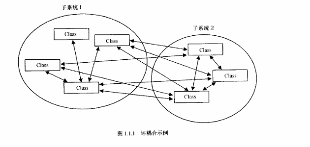
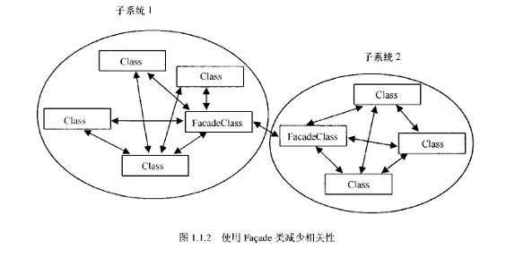

# 第1章  通用编程技术

## 1.0  神奇的数据驱动设计 

1. 不要硬编码，常量尽量做成配置文件

## 1.1  面向对象的编程与设计技术 

1. 很多文章和书籍都对通用的面向对象设计实践给出了很好的建议，但我印象中很少有针对游戏编程实践的。游戏程序员与典型的应用程序员有些不同。由于游戏程序员总是工作在最前沿的，要把人类和使件的限制推到极限，因而他们往往更愿意改变其至打破传统的程序设计原则。不幸的是,这种倾向常常会由于对共本OOP原则理解或实现的不当而产生负面效应，产生不可维护的代码。

2. Façade设计模式：

   

   ​															**↓**

   

## 1.2  使用模板元编程的快速数学方法 

1. 模板元编程允许在编译期进行计算，从而减少运行时的开销。例如，编译期的常量表达式计算和类型推导可以显著提升程序的运行效率。

## 1.3  一种自动的Singleton工具 

## 1.4  在游戏编程中使用STL 

## 1.5  一个通用的函数绑定接口 

## 1.6  通用的基于句柄的资源管理器  

## 1.7  资源和内存管理  

## 1.8  快速数据载入技巧  

## 1.9  基于帧的内存分配  

## 1.10  简单快速的位数组  

## 1.11  在线游戏的网络协议  

1. **报文篡改**：大多数针对协议的黑客攻击都是偶发的:他们尝试更改报文的字节看看会发生什么。针对此类攻击的第一线防御是一个简单的校验和checksum)。校验和是通过组合报文中每个字节得到的-个短数字。发送者计算报文的校验和并且将之与报文一起发送给接收者。接收者根据收到的报文重新计算校验和:如果计算得到的校验和与发送者的校验和不匹配，则报文被破坏并且应该被丢弃。校验和的计算范围必须包含包括包头在内的整个报文，以使接收者可以像检测有效负荷一样检
   测包头的有效性。一个完美的校验和算法能对任意修改过的报文计算出不同的值。当然如果这个完美的校验和算法太长则会变得根本不实用。哈希(hash)函数具有相同的设计日标并可以构造极好的校验和。特别是实用的单向哈希函数，它可以将输入不规则地映射到一个很宽的范围，以致通过哈希值来重新构造输入的任意一个部分在实际中不可能办得到。MD5算法就是一个经过广泛测试，可以公开使用的单向哈希函数，并且对于游戏它的速度也足够快。公开领域的实现可以在网上找到IPlumb93]。
2.  **报文重放**：在报文重放攻击中，恶意用户从客户端捕获报文(通常通过报文监听)然后多次发送。通常使用报文重放以超过游戏允许的速度来执行命令，即使客户端有时间检测。例如客户端可以使用一个计时器每秒向服务器发送一个特定命令，不管玩家以何等频率执行此命令。使用报文重放，一个单独用户可以每秒发送相同的命令儿百次。
   系统设计者可以通过在服务器端也设置一个类似的每秒一次的计时器来阻止这种攻击。但因为可变的网络延迟，这种防范措施实际上是不可行的。虽然它能检测大部分报文重放攻击，但变化的网络延迟可能导致报文同时抵达服务器端，导致合法的命令列被拒绝。我们当然不希望我们的安全机制将合法玩家当成欺骗者。要预防报文重放，每个报文需要包含一些状态信息，因此即使相同的有效负荷也要有不同的位模式(bit pattem)。一个随着每个报文发送而累加的计数器之类的方法就可以做到,尽管这种策略使攻击者能够很容易的预期。一个较好的方法是使用一个状态机为连续的报文生成连续的识别号。一个快速并且足够复杂的计算方法是常用于系统库中的线性叠加随机数生成器。
3. 客户端包括完整的加密算法，总是可以进行逆向工程;这是最难解决的问题，也是任何阻止协议篡改的机制的根本弱点。你可以采用以下的一些步骤增大逆向工程的难度:
   - 当公开发布时删除所有代码中的符号和调试信息。
   - 不要将缓冲区加密和解密放在一个独立的函数中:而要将之与其他网络代码合并到一起。这是一个值得以可维护性换取安全性的地方。
   - 运行时计算“魔术数”(例如初始化随机数种子)，而不是将其值直接保存在可执行文件中。
   - 在每个版本的客户端中包含一个好的加密机制，甚至包括早期测试版。如果任意一个客户端版本缺乏加密，用户就可以记录从该客户端发出的未加密报文流，并可以使用其知识攻击后续版本的加密机制。
   - 牢记你的目标是让作弊的成本最大化，而非完全禁止作弊。

## 1.12  最大限度地利用Assert  

## 1.13  Stats：实时统计和游戏内调试 

## 1.14  实时的游戏内建剖析 

# 第2章　数学技巧

## 2.0  可预测随机数  

## 2.1  插值方法  

## 2.2  求刚体运动方程的积分  

## 2.3  三角函数的多项式逼近  

## 2.4  为数字稳定性而利用隐式欧拉积分  

## 2.5  小波：理论与压缩 

## 2.6  水面的交互式模拟  

## 2.7  游戏编程四元数 

## 2.8  矩阵和四元数之间的转换 

## 2.9  四元数插值 

## 2.10  最短弧四元数 

# 第3章　人工智能

## 3.0  设计一个通用、健壮的AI引擎  

## 3.1  一个有限状态机类 

## 3.2  博弈树

## 3.3  A*路径规划基  

## 3.4  A*审美优化 

## 3.5  A*速度优化 

## 3.6  简化的3D运动和使用导航网格进行寻径 

## 3.7  Flocking：一种模拟群体行为的简单技术 

## 3.8  用于视频游戏的模糊逻辑 

## 3.9  神经网络初探 

# 第4章　多边形技术

## 4.0  为OpenGL优化顶点提交 

## 4.1  调整顶点的投影深度值  

## 4.2  矢量摄像机 

## 4.3  摄像机控制技术

## 4.4  一种快速的圆柱棱台相交测试算法 

## 4.5  3D碰撞检测 

## 4.6  用于交互检测的多分辨率地图 

## 4.7  计算到区域内部的距离 

## 4.8  对象阻塞剔除 

## 4.9  永远不要让他们看到你的“抖动”——几何体细节层次选择问题 

## 4.10  八叉树构造 

## 4.11  松散的八叉树 

## 4.12  独立于观察的渐进网格 

## 4.13  插值的3D关键帧动画 

## 4.14  一种快速而简单的皮肤构造技术 

## 4.15  填充间隙——使用缝合和皮肤构造的高级动画 

## 4.16  实时真实地形生成  

## 4.17  不规则地形生成——断层构造  

## 4.18  不规则地形生成——中点置换  

## 4.19  不规则地形生成——粒子沉积  

# 第5章　像素特效

## 5.0  2D镜头光晕  

## 5.1  将3D硬件用于2D子画面特效  

## 5.2  基于运动的静态光照  

## 5.3  使用定点颜色插值模拟实时光照  

## 5.4  衰减图  

## 5.5  使用纹理坐标生成技术的高级纹理  

## 5.6  硬件凹凸贴图  

## 5.7  底面阴影  

## 5.8  复杂对象上的实时阴影 

## 5.9  使用光滑预过滤和Fresnel项改善环境映射反射 

## 5.10  游戏中玻璃的效果 

## 5.11  用于容器中液体的折射贴图 

