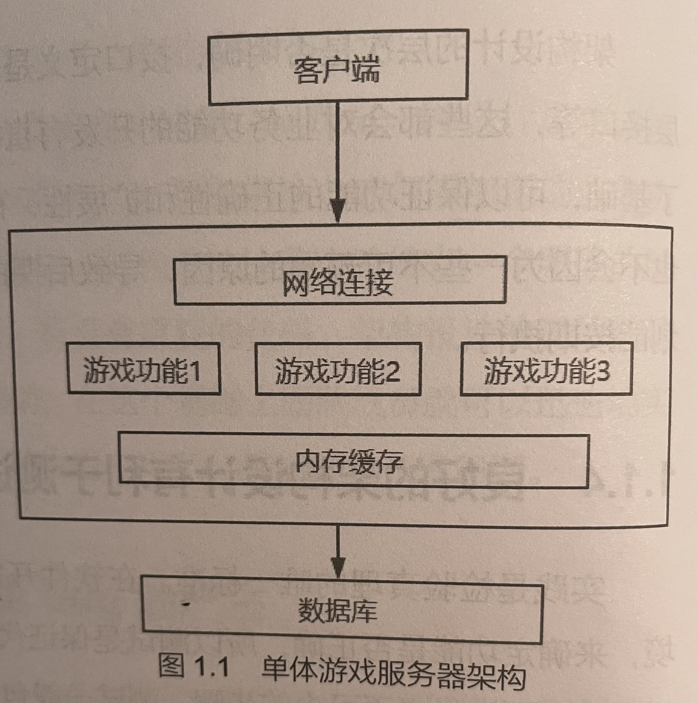

# 模块一 游戏服务中心架构设计

## 第一章 游戏服务器架构总体设计

1. 游戏服务器架构设计的意义
   * 良好的架构设计有助于团队协作开发
   * 良好的架构设计有助于避免bug 的产生
   * 良好的架构设计有助于制定合理的项目开发周期计划
   * 良好的架构设计有利于测试

2. 游戏服务器架构分类

   * 单体游戏服务器架构

     

   * 分布式游戏服务器架构

     

3. 游戏服务器架构基本模块

   * 网络通信长连接与短连接

     - 长连接是指，客户端与服务器一旦建立好连接之后，就维护这个连接，并保证这个连接不断开。长连接的优点是客户端每次发送请求都不用重新建立连接，有请求可以立即发送，从而节省消息发送的时间。而且长连接通信是双向的，服务器也可以主动给客户端发送消息，比如向其他客户端转发另一个客户端发送的聊天消息，或主动告知客广端一些数据状态的变化。而长连接的缺点是会一直占用计算杌资源（内存、文件句柄、网络VO)；代表就是Socket

     * 短连接是指客户端与服务器建立好连接，一次请求返回之后，这个连接就会断开，不需要维持连接。短连接的优点是连接断开之后资源就会释放，不再占用服务器资源，可以为更多的客户端提供服务。短连接的缺点是每次请求都需要等待建立新的连接，请求发送会慢一些，HTTP 就是常用的短连接协议之一

   * 网关

     网关就是网络通信的第一关，是服务器上所有服务的大门。它负责与外界联系，并且可以“辨正邪，识真伪，保证内部服务收到的都是合法消息，限制请求流量，防止请求超载。

   * 服务消息交互——消息中间件

     消息中间件是一类成熟的网络通信组件，它很好地屏蔽了网络的底层通信细节，比如网络连接建立、消息编码解码、消息发布与监听等。它具有高性能、低禺合、发布/ 订阅异步性、流量控制、最终一致性等一系列功能，既支持单点部署，又支持集群部署。也有一些 RPC，以它为通信基础，实现业务服务之间异步调用，使用起来非常方便。

   * 业务处理框架

     业务处理框架是为了便于业务功能开发，对影响业务功能开发的公共部分进行架构规划，尽量让开发人员专心于功能设计与开发，并提供底层的基础支持。一般有3个模块。

     * 消息管理
       游戏用户操作的过程，对服务器来讲就是修改游戏数据。在服务器架构中，网络层的数据接收和请求的业务处理会在不同的线程中，一个游戏用户的数据只有一份，用户有可能同时修改这份数据，这就有可能出现多线程操作共享数据的问题。解快这个问题的一种方式是对数据修改进行加锁。但是由于游戏用户数据很多，导致需要对服务器发送大量并发请求，多线程执行加锁代码时，为了获取执行权和保存线程执行状态，会导致 CPU 大量的上下文切换（指CPU 从正在执行的线程切换执行另一个线程），反而减少了服务器的消息处理的吞吐量，使性能下降。而且如果控制不好加锁，也容易出现死锁的现象。另一种方式是不加锁，让同一个用户的数据按顺序处理。一种实现方法是把同一个用户的请求先放到一个队列中，不同的用户的请求可以分到不同的队列中，再对每个队列固定启动一个对应的线程处理队列中的消息。这样可以避免加锁引1起 CPU 产生大量的上下文切换，也保证同一个用户的数据，都在同一个线程中处理，避免并发修改共享数据。
     * 线程管理
       在游戏服务器中，线程是一种非常珍贵且重要的资源，也是处理并发的唯一手段。但并不是说线程越多越好，线程太多，也会使 CPU 产生大量的上下文切换，使线程处理业务的能力下降。要合理地规划线程的使用，才能使线程的利用率最大化。对线程的合理分配，可以更好地优化服务器的性能。比如分配专门的线程池处理游戏业务，另外分配专门的线程池负 责数据的操作，把耗时操作隔离到固定的线程中，减少对业务线程的卡顿，增加业务消息的吞吐量。因此在游戏服务开发中，不能随意地创建线程，定要有规则和标准。
     * 数据缓存与持久化
       在业务服务中，所有的操作都是依赖于数据。数据存储于数据库，但是把数据缓存在内存之中，可以避免操作数据时查询数据库而浪费时间。因此游戏数据什么时候加载到内存，如何将内存中的数据更新到数据库之中，也是架构要解决的问题。这样可以把数据的管理统一化，业务开发中只需要操作内存的数据即可，即使不了解数据库相关的知识也能很快开发业务。

   * 测试模块

     测试模块主要包括单元测试和系统集成测试，单元测试可以使用目前流行的测试架构，比如 TestNG、JUnit 4 等。

## 第2章 服务器项目管理—Maven

Apache Maven 是最常用的 Java 项目管理工具之一。它制定了标准的 Java 项目结构，方便于依赖和引1用其他的 Jar 包，管理单元测试、打包流程、版本发布，也提供了各种开源的功能插件，提高项目的开发和管理效率。

## 第3章 数据库选择与安装

1. 数据持久化——MongoDB

   MonsoDB 是目前游戏服务器开发中常用的数据库之一。它是文档型数据库，直接存储 JSON 串，插人和选择速度也相对较快，可以满足数据库的快速开发与管理。

2. 内存型数据库——Redis

   目前Redis 已经是游戏服务器架构中不可缺少的一个组件了。它是一种内存型数据库，所有存储在 Redis 中的数据在 Redis 启动之后会全部加载到内存中，所以从 Redis 中查询数据和存储数据的操作速度非常快，可以作为缓存和共享内存使用。

## 第4章 游戏服务中心开发

1. 游戏服务中心的作用

   * 游戏服务中心提供游戏外围服务

     一切和游戏性无关的功能，都可以称之为游戏外国服务。比如用户注册、登录、公告、获取服务器列表、角色创建、角色数据预加载等，这些都是在用户进人游戏之前的功能，在进人游戏之后，不会再被请求。这些功能本身和游戏操作没有什么关系，和游戏数据也没有什么关联，所以把这此功能集中在游戏服务中心统一管理和维护。

   * 游戏服务中心方便动态扩展　

     一台服务器的资源是有限的。随着游戏用户的增多，并发请求会越来越多，服务器的压力会越来越大，导致CPU 处于长时间的忙碌状态，对客户端的响应越来越慢。此时服务的动态扩展是必不可少的。web 服务有非常成熟的扩展框架，比如使用 Nginx 或 Web服务器网关只需要添加少量的配置，即可实现 Web 服务的负载均衡，快速提升服务器的服务能力。

2. 游戏服务中心开发准备

   * 根据需求设计架构

     * 可以动态伸缩
       一台服务器的资源毕竟是有限的，所以它提供的服务也是有限的。随着公司的发展，用户越来越多，单台服务器的压力越来越大，逐渐不能满足服务的需要。这个时候，就要添加新的服务器，分担服务压力，增加并发量，以提高服务能力。这样的话架构就必须支持负载均衡，根据负载均衡的算法，将客户端的请求分发到不同的服务器上处理
     * Web 服务器网关
       Web 服务器网关的一个主要作用是转发客户端的请求，实现服务器的负载均衡、集群部署。如果处理同一接口请求的服务有多个，根据接口的参数，把某个指定的相同参数的请求转发到指定的同一个服务上面。比如为了防止同一个客户端连续请求并发修改用户数据的行为，可把同一个用户的请求都转发指定的相同的服务上面，在一个进程中保证请求的顺序处理，而且这个用户的数据还可以缓存在这个服务器上面，成为有状态的服务，提高数据处理效率。这就需要 Web 服务器网关的支持。在网关那里进行请求转发。网关也可以统一进行权限验证，请求流量限制，后面再添加新的 Web 服务就不需要开发这些功能了，可以减少重复开发
     * 可以使服务高可用
       服务高可用是指尽量避免服务停止，保证7×24 小时提供服务，这就需要相同的服务器至少要部署两台，也叫服务多实例部署。一台服务器出现问题了，会将这台服务器的服务自动转移到另外的服务器上面，另外的服务器可以正常提供服务。这样即使这台服务器出间题，在一定时问内，也只会影响一小部分用户，服务转移成功之后，就可以正常为所有用户提供服务了，期间不需要人为的干涉。
     * 注册中心服务
       在分布式架构中，服务治理是一个重要的功能。当新的服务启动时，需要被其他的服务感知到，这样其他的服务就可以向这个新的服务发送请求。当有服务被关闭时，也需委被其他的服务感知到，这样其他的服务就不会再向这个关闭的服务发送请求了。这样就需要一个注册中心服务：当业务服务启动时，向这个服务注册此业务服务的信息；当业务服务关闭时，注册中心服务检测到业务服务不可访问时，从注册中心服务中移除此业务服务信息。

     根据以上需求，对游戏服务中心架构进行设计，如图 所示。

     

     **客户端通过域名，向DNS 负载获取某一个服务的网关的 卫P地址，然后再向这个发送请求。网关通过注册中心服务，知道当前有哪些服务可以使用，根据转发匹配规从请求的 URL 中获取匹配的参数，然后将请求转发到匹配成功的服务上面处理。**

   * Spring Cloud

     Spring Cloud 为微服务开发提供了一些现成的服务组件，让开发人员能够快速地搭建一套微服务开发环境，主要的组件如下。

     * Spring Cloud Consul
       这个组件将服务注册中心----Consul 集成到 Spring Cloud 之中。通过简单的注解配置就可以实现服务的注册中心

     * Spring Cloud Gateway
       这个组件在 Spring MvC 的基础之上，为构建web服务器网关提供了丰富的 API，它实现了对客户端请求的路由转发、安全验证、状态监控、服务发现、负载均衡、请求速率限制等功能。可以快速方便地构建 web 服务器网关。

     * Spring Cloud Bus
       这是一个消息总线服务，它基于消息队列实现，利用消息队列的发布订单功能，给各个服务节点发送事件，修改服务的一些状态。在业务中，也可以利用它实现不同节点之间的通信，比如内部RPC 的实现等。

     * Spring Cloud Config
       这是一个配置中心管理组件，它可以管理分布式系统中的配置信息。比如在application yml 或 application.properties 中的一些公共配置，只需要在 Spring Cloud Conig配置一份文件，就可以在所有的服务节点引用。它还可以对配置数据加密和解密，动态更新配置内容等。

3. 用户登录注册功能开发
   创建游戏服务中心项目、网络通信数据格式定义、添加数据库操作、实现登录注册、全局异常捕获处理、登录注册测试、实现角色创建、角色创建测试　

# 第5章　Web 服务器网关开发

5．1　Consul 服务注册中心　61
5．1．1　Consul 简介　61
5．1．2　安装Consul　62
5．2　Web 服务器网关功能开发　63
5．2．1　Spring Cloud Gateway 简介　63
5．2．2　创建Web 服务器网关项目　64
5．2．3　网关路由信息配置　66
5．2．4　测试Web 服务器网关请求转发　68
5．3　统一验证请求权限　69
5．3．1　在Web 服务器网关进行权限验证的必要性　69
5．3．2　网关全局过滤组件——GlobalFilter　71
5．3．3　GlobalFilter 实现权限验证　72
5．3．4　测试网关权限验证　74
5．4　请求负载均衡　76
5．4．1　负载均衡组件——Spring Cloud Ribbon　76
5．4．2　自定义负载均衡策略　77
5．4．3　负载均衡策略配置　80
5．5　网关流量限制　81
5．5．1　常见的限流算法　81
5．5．2　添加Web 服务器网关限流策略　83
5．5．3　Web 服务限流测试　86
5．6　HTTPS 请求配置　86
5．6．1　HTTPS 简介　86
5．6．2　HTTPS 证书申请　87
5．6．3　网关服务配置HTTPS 证书　89
5．6．4　测试HTTPS 访问　90
5．7　服务错误异常全局捕获　92
5．7．1　默认全局Web 异常捕获　92
5．7．2　自定义全局Web 异常捕获　93
5．7．3　异常捕获测试　95
5．8　本章总结96

## 第6章　游戏服务器网关开发97

6．1　游戏服务器网关管理　97
6．1．1　游戏服务器网关必须支持动态伸缩　97
6．1．2　游戏服务器网关项目搭建与配置　99
6．1．3　游戏服务器网关信息缓存管理　101
6．1．4　游戏服务器网关负载均衡策略　105
6．1．5　测试游戏服务器网关信息　107
6．2　客户端与游戏服务器网关通信开发　109
6．2．1　客户端项目创建　109
6．2．2　网络通信数据粘包与断包　117
6．2．3　网络通信协议制定　119
6．2．4　客户端消息编码与解码开发　121
6．2．5　游戏服务器网关消息编码与解码开发　124
6．2．6　使用Netty 实现游戏服务器网关长连接服务　127
6．3　请求消息参数与响应消息参数对象化　130
6．3．1　请求与响应消息封装　130
6．3．2　客户端与游戏服务器网关通信测试　137
6．4　消息体对象序列化与反序列化　139
6．4．1　消息体使用JSON 序列化与反序列化　140
6．4．2　消息体使用Protocol Buffers 序列化与反序列化　142
6．5　消息自动分发处理　146
6．5．1　消息自动分发设计　147
6．5．2　消息自动分发开发　148
6．6　网络通信安全　152
6．6．1　连接认证　152
6．6．2　通信协议加密和解密　154
6．6．3　游戏服务器网关流量限制　158
6．7　网络连接管理　159
6．7．1　连接管理　159
6．7．2　连接心跳检测　163
6．7．3　消息幂等处理　167
6．8　本章总结168

## 第7章　游戏服务器网关与游戏业务服务数据通信169

7．1　游戏服务器网关与游戏业务服务通信定义　169
7．1．1　游戏服务器网关消息转发　169
7．1．2　定义消息通信模型　170
7．1．3　Spring Cloud Bus 消息总线　173
7．1．4　消息总线通信层——Kafka　174
7．1．5　消息总线消息发布订阅测试　178
7．2　游戏服务器网关与游戏业务服务通信实现　178
7．2．1　消息序列化与反序列化实现　179
7．2．2　游戏服务器网关消息负载均衡　181
7．2．3　游戏服务器网关消息转发实现　185
7．2．4　游戏服务器网关监听接收响应消息　189
7．2．5　添加游戏业务服务项目　190
7．2．6　游戏服务接收并响应网关消息　193
7．3　游戏服务器网关与游戏服务通信测试　195
7．4　本章总结197

## 第8章　游戏业务处理框架开发

8．1　游戏服务器中的多线程管理　198
8．1．1　线程数量的管理　198
8．1．2　游戏服务线程池分配　200
8．2　Netty 线程池模型　200
8．2．1　Netty 线程模型的核心类　201
8．2．2　获取线程池执行结果　202
8．3　客户端消息处理管理　205
8．3．1　借鉴Netty 的消息处理机制　205
8．3．2　客户端消息事件处理框架模型　209
8．3．3　实现自定义MultithreadEventExecutorGroup　213
8．3．4　实现GameChannel　217
8．3．5　实现GameChannelPipeline　220
8．3．6　实现AbstractGameChannelHandlerContext　222
8．3．7　实现客户端消息处理与消息返回　224
8．3．8　GameChannel 空闲超时处理　228
8．4　不同游戏用户之间的数据交互　236
8．4．1　多线程并发操作数据导致的错误或异常　237
8．4．2　在功能设计上避免用户数据之间的直接交互　239
8．4．3　在架构设计上解决用户数据之间的直接交互　239
8．4．4　GameChannel 事件自动分发处理　243
8．5　本章总结245
第9章　游戏用户数据管理246
9．1　游戏用户数据异步加载　246
9．1．1　加载游戏数据的时机　246
9．1．2　异步加载游戏数据实现　247
9．2　游戏数据持久化到数据库　250
9．2．1　游戏数据持久化方式　250
9．2．2　异步方式持久化数据的并发问题　251
9．2．3　数据定时异步持久化实现　253
9．3　Player 对象的封装与使用　256
9．3．1　直接操作Player 对象的弊端　256
9．3．2　实现Player 对象数据与行为分离　258
9．4　本章总结260

# 第10章 RPC 通信设计与实现　

10．1　游戏模块服务划分　261
10．1．1　游戏服务需不需要微服务化　261
10．1．2　游戏服务模块进程划分规则　263
10．2　RPC 通信实现　264
10．2．1　自定义RPC 设计　264
10．2．2　负载均衡管理　268
10．2．3　创建竞技场服务项目　274
10．2．4　RPC 请求消息的发送与接收　281
10．2．5　RPC 响应消息的发送与接收　290
10．2．6　RPC 请求超时检测　292
10．3　本章总结293

# 第11章 事件系统的设计与实现

11．1　事件系统在服务器开发中的重要性　294
11．1．1　什么是事件系统　294
11．1．2　事件系统可以解耦模块依赖　295
11．1．3　事件系统使代码更容易维护　296
11．2　事件系统的实现　296
11．2．1　自定义基于监听接口的事件系统　297
11．2．2　自定义基于注解的事件系统　299
11．2．3　Spring 事件系统应用304
11．3　根据事件实现的任务系统　306
11．3．1　任务系统需求　307
11．3．2　面向过程的任务系统实现　308
11．3．3　面向对象的事件触发式任务系统实现　309
11．4　本章总结　314

## 第　12章 游戏服务器自动化测试315

12．1　游戏服务器自动化测试的重要性　315
12．1．1　单元测试使代码更简洁　315
12．1．2　单元测试保证方法的代码正确性　321
12．1．3　自动化测试保证代码重构的安全性　323
12．2　游戏服务器自动化测试的实现　323
12．2．1　TestNG 框架简介　324
12．2．2　Spring Boot 单元测试配置　325
12．2．3　方法单元测试案例实现　329
12．2．4　服务器集成测试实现　336
12．2．5　使用TestNG 配置文件区分不同的测试环境　340
12．3　本章总结342

## 第　13章 服务器开发实例——世界聊天系统　343

13．1　单服世界聊天系统实现　343
13．1．1　添加客户端命令　344
13．1．2　服务器实现消息转发　348
13．1．3　单服世界聊天测试　349
13．2　分布式世界聊天系统实现　352
13．2．1　分布式世界聊天系统设计　352
13．2．2　创建单独的聊天项目　354
13．2．3　实现聊天消息的发布与转发　356
13．2．4　分布式世界聊天服务测试　359
13．3　本章总结360第 1章 游戏服务器架构总体设计01
1．1　游戏服务器架构设计的意义　01
1．1．1　良好的架构设计有助于团队协作开发　01
1．1．2　良好的架构设计有助于避免bug 的产生　02
1．1．3　良好的架构设计有助于制定合理的项目开发周期计划　02
1．1．4　良好的架构设计有利于测试　03
1．2　游戏服务器架构分类　03
1．2．1　单体游戏服务器架构　03
1．2．2　分布式游戏服务器架构　05
1．3　游戏服务器架构基本模块　06
1．3．1　网络通信长连接与短连接　06
1．3．2　网关　07
1．3．3　服务消息交互——消息中间件　08
1．3．4　业务处理框架　09
1．3．5　测试模块　11
1．4　本章总结11
第　2章 服务器项目管理——Maven　12
2．1　Eclipse 中配置Maven 工具　12
2．1．1　Maven 下载与配置　12
2．1．2　Maven 环境变量配置　13
2．1．3　Maven 常用命令示例　15
2．2　搭建Maven 仓库中心　16
2．2．1　安装Nexus　16
2．2．2　在Maven 中配置私服　19
2．2．3　添加非开源依赖Jar 包　21
2．3　创建Maven 项目21
2．3．1　创建父项目　22
2．3．2　创建子项目　23
2．4　本章总结23
第3章　数据库选择与安装24
3．1　数据持久化——MongoDB　24
3．1．1　为什么使用MongoDB　24
3．1．2　安装MongoDB　25
3．2　内存型数据库——Redis　28
3．2．1　为什么使用Redis　28
3．2．2　安装Redis　29
3．2．3　使用Redis 缓存需要注意的事项　30
3．3　本章总结32
第4章　游戏服务中心开发33
4．1　游戏服务中心的作用　33
4．1．1　游戏服务中心提供游戏外围服务　33
4．1．2　游戏服务中心方便动态扩展　34
4．2　游戏服务中心开发准备　34
4．2．1　根据需求设计架构　34
4．2．2　Spring Cloud 简介　36
4．2．3　安装Spring Tool 插件　37
4．2．4　添加公共pom 依赖　38
4．3　用户登录注册功能开发　40
4．3．1　创建游戏服务中心项目　41
4．3．2　网络通信数据格式定义　43
4．3．3　添加数据库操作　45
4．3．4　实现登录注册　50
4．3．5　全局异常捕获处理　55
4．3．6　登录注册测试　56
4．3．7　实现角色创建　57
4．3．8　角色创建测试　59
4．4　本章总结60
第5章　Web 服务器网关开发　61
5．1　Consul 服务注册中心　61
5．1．1　Consul 简介　61
5．1．2　安装Consul　62
5．2　Web 服务器网关功能开发　63
5．2．1　Spring Cloud Gateway 简介　63
5．2．2　创建Web 服务器网关项目　64
5．2．3　网关路由信息配置　66
5．2．4　测试Web 服务器网关请求转发　68
5．3　统一验证请求权限　69
5．3．1　在Web 服务器网关进行权限验证的必要性　69
5．3．2　网关全局过滤组件——GlobalFilter　71
5．3．3　GlobalFilter 实现权限验证　72
5．3．4　测试网关权限验证　74
5．4　请求负载均衡　76
5．4．1　负载均衡组件——Spring Cloud Ribbon　76
5．4．2　自定义负载均衡策略　77
5．4．3　负载均衡策略配置　80
5．5　网关流量限制　81
5．5．1　常见的限流算法　81
5．5．2　添加Web 服务器网关限流策略　83
5．5．3　Web 服务限流测试　86
5．6　HTTPS 请求配置　86
5．6．1　HTTPS 简介　86
5．6．2　HTTPS 证书申请　87
5．6．3　网关服务配置HTTPS 证书　89
5．6．4　测试HTTPS 访问　90
5．7　服务错误异常全局捕获　92
5．7．1　默认全局Web 异常捕获　92
5．7．2　自定义全局Web 异常捕获　93
5．7．3　异常捕获测试　95
5．8　本章总结96
第6章　游戏服务器网关开发97
6．1　游戏服务器网关管理　97
6．1．1　游戏服务器网关必须支持动态伸缩　97
6．1．2　游戏服务器网关项目搭建与配置　99
6．1．3　游戏服务器网关信息缓存管理　101
6．1．4　游戏服务器网关负载均衡策略　105
6．1．5　测试游戏服务器网关信息　107
6．2　客户端与游戏服务器网关通信开发　109
6．2．1　客户端项目创建　109
6．2．2　网络通信数据粘包与断包　117
6．2．3　网络通信协议制定　119
6．2．4　客户端消息编码与解码开发　121
6．2．5　游戏服务器网关消息编码与解码开发　124
6．2．6　使用Netty 实现游戏服务器网关长连接服务　127
6．3　请求消息参数与响应消息参数对象化　130
6．3．1　请求与响应消息封装　130
6．3．2　客户端与游戏服务器网关通信测试　137
6．4　消息体对象序列化与反序列化　139
6．4．1　消息体使用JSON 序列化与反序列化　140
6．4．2　消息体使用Protocol Buffers 序列化与反序列化　142
6．5　消息自动分发处理　146
6．5．1　消息自动分发设计　147
6．5．2　消息自动分发开发　148
6．6　网络通信安全　152
6．6．1　连接认证　152
6．6．2　通信协议加密和解密　154
6．6．3　游戏服务器网关流量限制　158
6．7　网络连接管理　159
6．7．1　连接管理　159
6．7．2　连接心跳检测　163
6．7．3　消息幂等处理　167
6．8　本章总结168
第7章　游戏服务器网关与游戏业务服务数据通信169
7．1　游戏服务器网关与游戏业务服务通信定义　169
7．1．1　游戏服务器网关消息转发　169
7．1．2　定义消息通信模型　170
7．1．3　Spring Cloud Bus 消息总线　173
7．1．4　消息总线通信层——Kafka　174
7．1．5　消息总线消息发布订阅测试　178
7．2　游戏服务器网关与游戏业务服务通信实现　178
7．2．1　消息序列化与反序列化实现　179
7．2．2　游戏服务器网关消息负载均衡　181
7．2．3　游戏服务器网关消息转发实现　185
7．2．4　游戏服务器网关监听接收响应消息　189
7．2．5　添加游戏业务服务项目　190
7．2．6　游戏服务接收并响应网关消息　193
7．3　游戏服务器网关与游戏服务通信测试　195
7．4　本章总结197
第8章　游戏业务处理框架开发198
8．1　游戏服务器中的多线程管理　198
8．1．1　线程数量的管理　198
8．1．2　游戏服务线程池分配　200
8．2　Netty 线程池模型　200
8．2．1　Netty 线程模型的核心类　201
8．2．2　获取线程池执行结果　202
8．3　客户端消息处理管理　205
8．3．1　借鉴Netty 的消息处理机制　205
8．3．2　客户端消息事件处理框架模型　209
8．3．3　实现自定义MultithreadEventExecutorGroup　213
8．3．4　实现GameChannel　217
8．3．5　实现GameChannelPipeline　220
8．3．6　实现AbstractGameChannelHandlerContext　222
8．3．7　实现客户端消息处理与消息返回　224
8．3．8　GameChannel 空闲超时处理　228
8．4　不同游戏用户之间的数据交互　236
8．4．1　多线程并发操作数据导致的错误或异常　237
8．4．2　在功能设计上避免用户数据之间的直接交互　239
8．4．3　在架构设计上解决用户数据之间的直接交互　239
8．4．4　GameChannel 事件自动分发处理　243
8．5　本章总结245
第9章　游戏用户数据管理246
9．1　游戏用户数据异步加载　246
9．1．1　加载游戏数据的时机　246
9．1．2　异步加载游戏数据实现　247
9．2　游戏数据持久化到数据库　250
9．2．1　游戏数据持久化方式　250
9．2．2　异步方式持久化数据的并发问题　251
9．2．3　数据定时异步持久化实现　253
9．3　Player 对象的封装与使用　256
9．3．1　直接操作Player 对象的弊端　256
9．3．2　实现Player 对象数据与行为分离　258
9．4　本章总结260
第　10章 RPC 通信设计与实现　261
10．1　游戏模块服务划分　261
10．1．1　游戏服务需不需要微服务化　261
10．1．2　游戏服务模块进程划分规则　263
10．2　RPC 通信实现　264
10．2．1　自定义RPC 设计　264
10．2．2　负载均衡管理　268
10．2．3　创建竞技场服务项目　274
10．2．4　RPC 请求消息的发送与接收　281
10．2．5　RPC 响应消息的发送与接收　290
10．2．6　RPC 请求超时检测　292
10．3　本章总结293
第　11章 事件系统的设计与实现294
11．1　事件系统在服务器开发中的重要性　294
11．1．1　什么是事件系统　294
11．1．2　事件系统可以解耦模块依赖　295
11．1．3　事件系统使代码更容易维护　296
11．2　事件系统的实现　296
11．2．1　自定义基于监听接口的事件系统　297
11．2．2　自定义基于注解的事件系统　299
11．2．3　Spring 事件系统应用304
11．3　根据事件实现的任务系统　306
11．3．1　任务系统需求　307
11．3．2　面向过程的任务系统实现　308
11．3．3　面向对象的事件触发式任务系统实现　309
11．4　本章总结　314
第　12章 游戏服务器自动化测试315
12．1　游戏服务器自动化测试的重要性　315
12．1．1　单元测试使代码更简洁　315
12．1．2　单元测试保证方法的代码正确性　321
12．1．3　自动化测试保证代码重构的安全性　323
12．2　游戏服务器自动化测试的实现　323
12．2．1　TestNG 框架简介　324
12．2．2　Spring Boot 单元测试配置　325
12．2．3　方法单元测试案例实现　329
12．2．4　服务器集成测试实现　336
12．2．5　使用TestNG 配置文件区分不同的测试环境　340
12．3　本章总结342
第　13章 服务器开发实例——世界聊天系统　343
13．1　单服世界聊天系统实现　343
13．1．1　添加客户端命令　344
13．1．2　服务器实现消息转发　348
13．1．3　单服世界聊天测试　349
13．2　分布式世界聊天系统实现　352
13．2．1　分布式世界聊天系统设计　352
13．2．2　创建单独的聊天项目　354
13．2．3　实现聊天消息的发布与转发　356
13．2．4　分布式世界聊天服务测试　359
13．3　本章总结360
