# 微服务架构设计模式

## 一、逃离单体地狱

1. 单体应用程序示例 (FTGO服务端架构图--其业务类似于美团)

   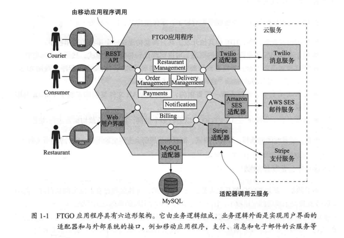

   FTGO的核心业务其实非常简单。消费者(Consumer)使用FTGO的网站或者移动应用在本地的餐馆(Restaurant)下订单，FTGO会协调一个由送餐员(Courier)组成的快递网络来完成订单食品(Order)的运送(Delivery)。显然，给送餐员和餐馆支付费用(Payment)也是FTGO的重要任务之一。这套应用程序使用了多个Web 服务，例如使用 Stripe 管理支付、使用Twilio 实现消息传递、使用Amazon SES(Simple Email Service)发送电子邮件，等等。
   与其他陈旧的企业应用程序一样，FTGO 的应用程序是一个单体，它由一个单一的 **Java WAR**文件构成。随着时间的推移，这个文件变成了一个庞大的复杂的应用程序。尽管 FTGO开发团队做出了最大的努力，但这个应用程序已成为“泥球模式”的一个典型例子。泥球模式的作者Brian Foote 和Joseph Yoder 把这样的软件比喻为“**随意架构的、庞大的、草率的、布满了胶带和线路，如同意大利面条一般的代码丛林**”。软件交付的步伐已经放缓。更糟糕的是,FTGO应用程序是使用一些日益过时的框架编写的。FTGO应用程序展示了单体地狱的几乎所有症状。

   **结合游戏开发的示例如下图***(源自《Java 游戏服务器架构实战》)*，当游戏功能较少时，使用单体模式开发是比较快速的，但是随着功能增多、开发人员变动等因素影响就会出现功能重复、耦合验证等问题。  

   

2. 单体架构的好处

   * 应用的**开发很简单**:IDE 和其他开发工具只需要构建这一个单独的应用程序。
   * **易于**对应用程序进行大规模的**更改**:可以更改代码和数据库模式，然后构建和部署
   * 测试相对简单直观:开发者只需要写几个端到端的测试，启动应用程序，调用 RESTAPI，然后使用Selenium这样的工具测试用户界面。
   * **部署简单**明了:开发者唯一需要做的，就是把 WAR 文件复制到安装了 Tomcat 的服务器上。
   * 横向扩展不费吹灰之力:FTGO 可以运行多个实例，由一个负载均衡器进行调度，水平扩展容易

3. 单体地狱的结果

   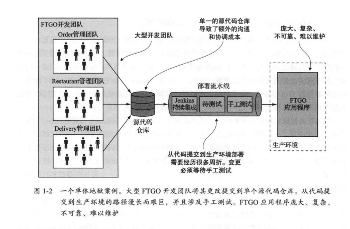

   * 过度的复杂性会吓退开发者

   * 开发速度缓慢

   * 从代码提交到实际部署的周期很长，而且容易出问题

     ```
     从代码完成到运行在生产环境是一个漫长且费力的过程。一个问题是，众多开发人员都向同一个代码库提交代码更改，这常常使得这个代码库的构建结果处于无法交付的状态。
     把更改推向生产环境的另一个挑战是运行测试需要很长时间。因为代码库如此复杂，以至于一个更改可能引起的影响是未知的，为了避免牵一发而动全身的后果，即使是一个微小的更改，开发人员也必须在持续集成服务器上运行所有的测试套件。系统的某些部分甚至还需要手工测试。如果测试失败，诊断和修复也需要更多的时间。因此，完成这样的测试往往需要数天甚至更长时间。
     ```

   * 难以扩展
     
     ```
     因为在有些情况下，应用的不同模块对资源的需求是相互冲突的。例如，餐馆数据保存在一个大型的内存数据库中，理想情况下运行这个应用的服务器应该有较大容量的内存。另外，图片处理模块又需要比较快的 CPU来完成图形运算，这需要应用部署在具有多个高性能CPU 的服务器之上。因为这些模块都是在一个应用程序内，因此FTGO在选用服务器时必须满足所有模块的需要
     ```
     
   * 交付可靠的单体应用是一项挑战
     
     ```
     系统不可靠的一个原因是应用程序体积庞大而无法进行全面和彻底的测试。缺乏可靠的测试意味着代码中的错误会进入生产环境。更糟糕的是，该应用程序缺乏故障隔离，因为所有模块都在同一个进程中运行。每隔一段时间，在一个模块中的代码错误，例如内存泄漏，将会导致应用程序的所有实例都崩溃。 
     ```

4. 扩展立方体

   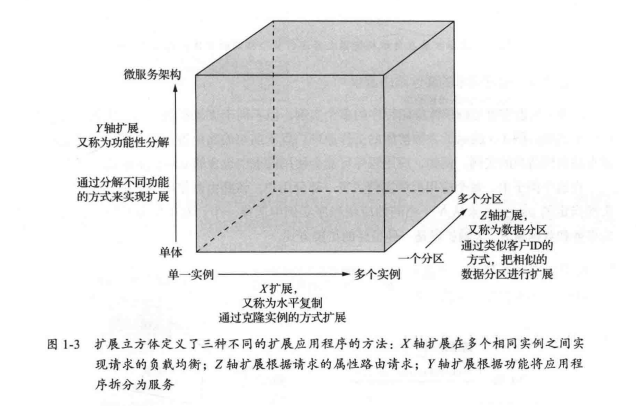

   X轴扩展是扩展单体应用程序的常用方法。在负载均衡器之后运行应用程序的多个实例。负载均衡器在 N个相同的实例之间分配请求。这是提高应用程序吞吐量和可用性的好方法。

   Z轴扩展也需要运行单体应用程序的多个实例，但不同于X轴扩展，**每个实例仅负责数据的一个子集**。图 1-5 展示了Z轴扩展的工作原理。置于前端的路由器使用请求中的特定属性将请求路由到适当的实例。例如，应用程序可能会使用请求中包含的 user Id 来路由请求。在这个例子中，每个应用程序实例负责一部分用户。该路由器使用请求 Authorization头部指定的user Id来从N个相同的应用程序实例中选择一个。对于应用程序需要处理增加的事务和数据量时，Z轴扩展是一种很好的扩展方式。

   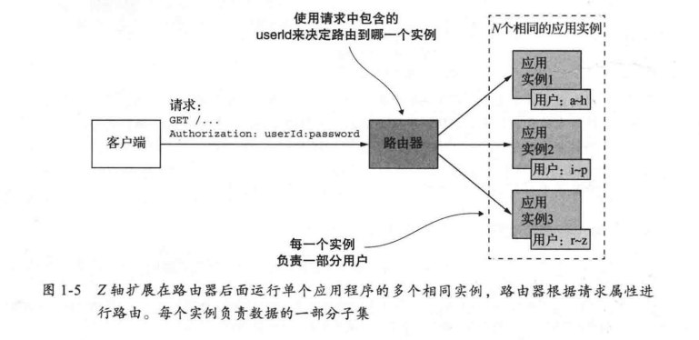

   X轴和Z轴扩展有效地提升了应用的吞吐量和可用性，然而这两种方式都没有解决日益增长的开发问题和应用复杂性。为了解决这些问题，我们需要采用Y轴扩展，也就是功能性分解。Y轴扩展把一个单体应用分成了一组服务，如图 1-6 所示。

   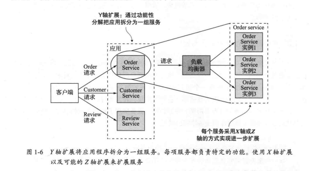

   服务本质上是一个**麻雀虽小但五脏俱全的应用程序**，它实现了一组相关的功能，例如订单管理、客户管理等。服务可以在需要的时候借助X轴或Z轴方式进行扩展。例如，订单服务可以被部署为一组负载均衡的服务实例。
   我对微服务架构的概括性定义是: **把应用程序功能性分解为一组服务的架构风格。请注意这个定义中并没有包含任何与规模有关的内容。重要的是，每一个服务都是由一组专注的、内聚的功能职责组成。**

5. 微服务特点：

   * 拆分性(**模块化的一种形式**)：将一个大型应用程序拆分成多个小型服务，每个服务实现一个或多个相关的业务功能，有助于实现系统的松耦合和高内聚，方便开发、测试、部署和维护。
   * 可独立部署：每个微服务都可以独立进行开发、测试、部署和运行，具有较好的可维护性和可扩展性。
   * 去中心化：微服务架构**不依赖于中心化**的应用服务器或数据库，可以更好地支持分布式部署和扩展；通过消息机制来同步数据。
   * 面向服务：每个微服务都以服务的形式进行通信和交互，**可以使用不同的编程语言**、技术栈和工具进行开发和部署，有助于提高开发效率和系统灵活性
   * 健壮性和弹性：微服务架构可以更好地支持故障隔离和容错处理，有助于提高系统的健壮性和弹性。

   

6. 微服务架构与SOA的异同

   |              | SOA                                                         | 微服务                                         |
   | ------------ | ----------------------------------------------------------- | ---------------------------------------------- |
   | 技术栈       | 重量级技术，例如 SOAP 和其他类似的 WS* 标准                 | 轻量级、开源的技术，如 REST 或 g RPC 等协议    |
   | 服务通信方式 | 采用 **ESB 进行服务集成**，包含业务和消息处理逻辑的智能管道 | 使用哑管道（如**消息代理**）进行通信           |
   | 数据处理方式 | 有全局的数据模型，**共享数据库**                            | 每个服务**有自己的数据库和领域模型**           |
   | 服务规模     | 集成大型、复杂的单体应用程序                                | 通常比较小，应用由数十甚至上百个更小的服务组成 |
   | 主要优点     | 可复用性高                                                  | 粒度小、自治性高、弹性好                       |
   | 主要缺点     | 部署和维护复杂                                              | 跨服务事务管理复杂                             |

7. 微服务优点

   * 使大型的复杂应用程序可以**持续交付和持续部署**每个服务都相对较小并容易维护。

   * 服务可以**独立部署**。

   * 服务可以独立扩展。

     ```
     服务可以独立扩展，不论是采用X轴扩展的实例克隆，还是Z 轴扩展的流量分区方式此外，每个服务都可以部署在适合它们需求的硬件之上。这跟使用单体架构的部署和硬件选择是迥然不同的:单体应用中组件对硬件的需求不同(例如有些组件是 CPU 运算密集型的有些可能需要更多的内存空间)，但是这些组件仍旧必须被部署在一起。
     ```

   * 微服务架构可以实现团队的自治

   * 更容易实验和采纳新的技术。

   * 更好的容错性。

8. 微服务的弊端

   * 服务的拆分和定义是一项挑战。
   * 分布式系统带来的各种复杂性，使开发、测试和**部署变得更困难**。
   * 当部署跨越多个服务的功能时需要谨慎地协调更多开发团队。
   * 开发者需要思考到底应该在应用的什么阶段使用微服务架构。

9. 微服务架构并不是“银弹”
   早在1986年，《人月神话》(Addison-Wesley Professional，1995)的作者 Fred Brooks 就曾说:软件工程的世界里没有银弹。换一种说法，并不存在一种或几种技术，可以把你的生产效率提升10倍。

   **目前的设计模式以及框架并不能有效提高系统效率，甚至会降低效率；应选择适合现状的架构，不应过度迷恋新技术，导致过度设计，从而导致系统的维护成本变高。**

10. 模式

    描述解决一个特定问题的最佳实践或经验的通用形式。模式通常是一种抽象的、独立于具体实现的描述，它描述了一个通用的、可重复使用的解决方案，可以被应用到不同的具体场景中。模式通常包含了一组规则、约定、设计原则、代码实现等等，这些元素共同组成了一个完整的解决方案。

11. 模式语言

    一组相互关联的设计模式，它们共同构成一个更大的、综合性的设计思想或实践。模式语言通常包含了许多具体的设计模式，这些模式之间有着相互依赖和互补的关系，可以用来描述一个复杂的、大型的、具有复杂结构和相互作用的软件系统。模式语言的设计目的是为了让开发人员能够更好地理解和应对软件开发中的复杂性。

## 二、服务的拆分策略

1. 软件架构定义

   应用程序的架构是将软件分解为**元素(element)**和这些元素之间的**关系(relation)**。由于以下两个原因，分解很重要:

   * 它**促进了**劳动和知识的分工。它使具有特定专业知识的人们(或多个团队)能够就应用程序高效地**协同工作**。
   * 它**定义了**软件元素的**交互方式**

2. 软件架构的4+1视图模型，来描述一下软件架构

   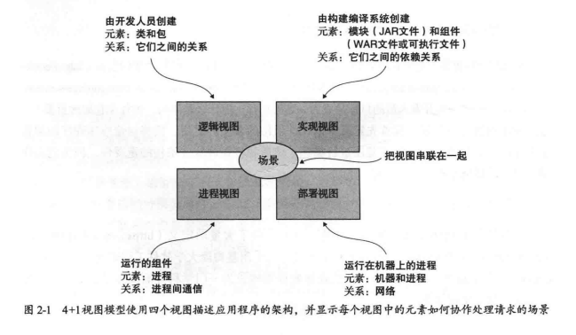

   * 逻辑视图:**开发人员创建的软件元素**。在面向对象的语言中，这些元素是类和包。它们之间的关系是类和包之间的关系，包括继承、关联和依赖。
   * 实现视图:构建编译系统的输出。**此视图由表示打包代码的模块和组件组成**，**组件是由一个或多个模块组成的可执行或可部署单元**。*在 Java 中，模块是JAR 文件，组件通常是 WAR 文件或可执行 JAR 文件。*它们之间的关系包括模块之间的依赖关系以及组件和模块之间的组合关系。
   * 进程视图:**运行时的组件**。每个元素都是一个进程，进程之间的关系代表**进程间通信**。
   * 部署视图:**进程如何映射到机器**。此视图中的元素由(物理或虚拟)计算机和进程组成。机器之间的关系代表网络。该视图还描述了进程和机器之间的关系
   * 除了这四个视图以外，4+1中的 +1 是指场景，它负责把视图串联在一起。每个场景负责描述在一个视图中的多个架构元素如何协作，以完成一个请求。例如，在**逻辑视图中的场景，展现了类是如何协作的**。同样，在**进程视图中的场景，展现了进程是如何协作的**。

3. 逻辑视图的架构风格

   * 分层式：常见三层架构

     - 表示层：负责处理用户的请求和响应，通常是一个Web或移动应用程序。
     - 业务逻辑层：负责处理业务逻辑，包括验证和处理用户请求、协调数据访问和其他服务、执行业务规则等。
     - 数据访问层：负责管理应用程序和数据存储之间的交互，包括数据库和其他数据存储的读取和写入。

   * 六边形

     六边形架构是分层架构风格的替代品。如图 2-2 所示，六边形架构风格选择**以业务逻辑为中心**的方式组织逻辑视图。应用程序具有一个或多个入站适配器，而不是表示层，它通过**调用业务逻辑来处理来自外部的请求**。同样，应用程序具有一个或多个出站适配器，而不是数据持久化层，这些出站适配器由业务逻辑调用并调用外部应用程序。此架构的一个关键特性和优点是**业务逻辑不依赖于适配器**。相反，**各种适配器都依赖业务逻辑**。

     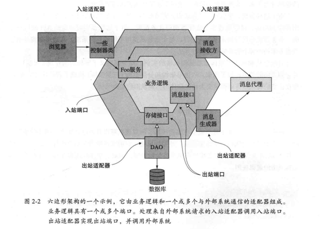

     
     六边形架构将应用程序分成三个部分：
     
     - 领域层：包含应用程序的**核心业务逻辑和数据模型**，它不依赖于任何特定的技术实现。
     - 适配器层：处理与外部世界（如UI、数据库、外部服务等）的**交互**，**将数据转换为领域模型可以理解的格式**，并将领域模型的结果返回给外部世界。
     - 端口层：用于定义应用程序的接口，它包括所有可以由其他应用程序调用的操作，例如使用HTTP、消息队列等。
     
     |  架构类型  |                       分层架构                       |                          六边形架构                          |
     | :--------: | :--------------------------------------------------: | :----------------------------------------------------------: |
     |    理念    | 将系统按照**职责划分**成若干层，每一层负责特定的任务 | 将系统**按照用户角色和功能**划分成若干层，每一层负责特定的任务 |
     |   关注点   |            关注业务逻辑和数据访问层的实现            |                 关注业务流程和交互逻辑的实现                 |
     | **测试性** |       容易进行单元测试，但需要进行大量集成测试       |          更容易进行集成测试，但需要进行大量单元测试          |
     | **依赖性** |  存在**层与层之间的依赖**，需要避免底层对高层的影响  | 各层之间**基于接口协作**，**各层之间相对独立**，减少了依赖性 |
     |  可维护性  |        **修改某一层的实现可能会影响整个系统**        |     **更容易进行局部的修改和调整**，保持系统的整体稳定性     |
     |  可扩展性  | 可以通过**增加新的层**来扩展系统功能(如：三方服务层) | 可以通过**增加新的角色和功能**来扩展系统功能 (提供三方服务对应的接口) |
     |  可重用性  |    存在**较高的代码复用性**，但需要注意层的耦合度    |        各层之间基于接口协作，便于组件的重用和二次开发        |
     
     由于这种分离，单独测试业务逻辑要容易得多。另一个好处是它更准确地反映了**现代应用程序的架构**。可以通过多个适配器调用业务逻辑，每个适配器实现特定的 API或用户界面。业务逻辑还可以调用多个适配器，每个适配器调用不同的外部系统。六边形架构是描述微服务架构中每个服务的架构的好方法。

4. 实现视图的架构风格

   * 单体架构

   * 微服务架构

     ```
     它的实现视图由多个组件构成:一组可执行文件或 WAR文件。它的组件是服务，连接器是使这些服务能够协作的通信协议。每个服务都有自己的逻辑视图架构，通常也是六边形架构。
     ```

5. 定义应用程序的微服务架构

   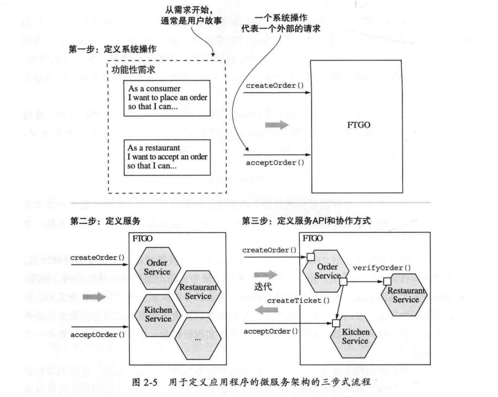

   * 系统操作(system operation)是应用程序必须处理的请求的一种抽象描述。它既可以是更新数据的命令，也可以是检索数据的查询。每个命令的行为都是根据抽象领域模型定义的，抽象领域模型也是从需求中派生出来的。系统操作是描述服务之间协作方式的架构场景。

   * 该流程的第二步是确定如何分解服务。有几种策略可供选择。

     * 一种源于业务架构学派的策略是定义与业务能力相对应的服务。
     * 另一种策略是围绕领域驱动设计的子域来分解和设计服务。

     *但这些策略的最终结果都是围绕业务概念而非技术概念分解和设计的服务。*

   * 定义应用程序架构的第三步是确定每个服务的 API。为此，你将第一步中标识的每个系统操作分配给服务。服务可以完全独立地实现操作。或者，它可能需要与其他服务协作。在这种情况下，你可以确定服务的协作方式，这通常需要服务来支持其他操作。你还需要确定选用第3章中描述的哪种进程间通信机制来实现每个服务的API。

6. 拆分服务的指导原则

   * 单一职权原则

   * 闭包原则

     ```
     在包中包含的所有类应该是对同类的变化的一个集合，也就是说，如果对包做出修改，需要调整的类应该都在这个包之内。
     ```

7. 拆分服务的难点

   * 网络延迟。

   * 同步进程间通信导致可用性降低。

     ```
     如何处理进程间通信而不降低系统的可用性。例如，实现create Order()操作最常见的方式是让order Service 使用REST同步调用其他服务这样做的弊端是REST这样的协议会降低order Service 的可用性。如果任何一个被调用的服务处在不可用的状态，那么订单就无法创建了。有时候这可能是一个不得已的折中，但是在第 3 章中学习异步消息之后，你就会发现其实有更好的办法来消除这类同步调用产生的紧耦合并提升可用性。
     ```

   * 在服务之间维持数据一致性。

   * 获取一致的数据视图。

     ```
     分解的另一个障碍是无法跨多个数据库获得真正一致的数据视图。在单体应用程序中,ACID 事务的属性保证查询将返回数据库的一致视图。相反，在微服务架构中，即使每个服务的数据库是一致的，你也无法获得全局一致的数据视图。如果你需要一些数据的一致视图，那么它必须驻留在单个服务中，这也是服务分解所面临的问题。幸运的是，在实践中这很少带来真正的问题。
     ```
   
   * 上帝类阻碍了拆分
   
     ```
     上帝类通常为应用程序的许多不同方面实现业务逻辑。它有大量字段映射到具有许多列的数据库表。大多数应用程序至少有一个这样的上帝类，每个类代表一个对领域至关重要的概念:银行账户、电子商务订单、保险政策，等等。因为上帝类将应用程序的许多不同方面的状态和行为捆绑在一起，所以将使用它的任何业务逻辑拆分为服务往往都是一个不可逾越的障碍。
     ```

## 三、微服务架构中的进程间通信

### 1 概述

微服务架构将应用程序构建为一组服务, 这些服务必须经常协作才能处理各种外部请求。因为服务实例通常是运行在不同机器的进程，所以它们必须使用进程间通信进行交互。因此，进程间通信技术在微服务架构中比在单体架构中扮演着更重要的角色。

#### 1.1 交互方式

在为服务的API选择进程间通信机制之前，首先考虑服务与其客户端的交互方式是非常重要的。考虑交互方式将有助于专注需求，并避免陷入特定进程间通信技术的细节。交互方式的选择会影响应用程序的可用性。

两种维度：

- 一对一/一对多

- - 一对一： 每个客户端请求由一个服务实例来处理。
  - 一对多： 每个客户端请求由多个服务实例来处理。

- 同步/异步

- - 同步模式：客户端请求需要服务端实时响应，客户端等待响应时可能导致阻塞。
  - 异步模式：客户端请求不会阻塞进程，服务端的响应可以是非实时的。

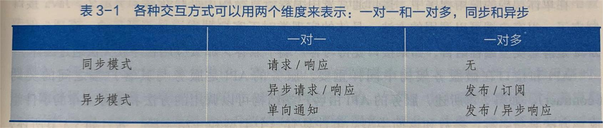

- 请求/响应 ：会导致服务的紧耦合
- 异步请求/响应
- 单向通知
- 发布/订阅
- 发布/异步响应

交互方式并不会因为具体的进程间通信技术而发生改变。例如，一个服务使用请求/响应的交互方式与其他服务进行交互，底层的进程间通信技术可以是REST，也可以是消息机制。

进程中通信技术选型

1. 基于同步请求/响应的通信机制, HTTP REST, gRPC
2. 基于异步消息的通信机制, AMQP, STOMP

消息格式

1. 基于文本的json, xml
2. 基于二进制的Avro, Protocol Buffer

#### 1.2 在微服务架构中定义API

在单体应用程序中，接口通常采用编程语言结构定义，如java interface，java接口定义了一组客户端可以调用的方法。微服务架构，服务的API是服务与其客户端之间的契约(Contract)，由客户端可以调用的方法和服务发布的事件组成。

- 接口定义语言IDL
- API设计优先

如何定义API取决于使用的进程间通信机制。

- 消息机制： 消息通道、消息类型、消息格式
- HTTP：URL、HTTP动词、请求和响应格式

#### 1.3 API的演化

API不可避免地会随着应用功能的增减而发生变化。在单体应用中，变更API并更新所有调用方的代码相对简单，唯一的挑战在于变更的范围。在基于微服务架构的应用中改变服务的API就没这么容易了，服务的客户端可能是另外的服务，通常是其他团队所开发的，客户端也极有可能是由组织之外的人所开发和控制的。不能强制要求客户端和服务端的API版本保持一致。另外通过滚动升级的方式来更新服务，新旧版本的服务肯定会共存。具体的措施取决于API演化的实际情况。

##### 语义化版本控制

语义化版本控制规范要求版本号由三部分组成：MAJOR.MINOR.PATCH。必须按如下的方式递增版本号：

- MAJOR: 不兼容的更改
- MINOR: 向后兼容的增强
- PATCH: 向后兼容的错误修复

##### 进行次要并且向后兼容的改变

- 理想情况
- 对API的附加更改或功能增强
- 客户端可以直接使用更新后的服务，须遵守**健壮性原则**。服务端应为缺少的请求属性提供默认值，客户端应该忽略任何额外的响应属性，同时使用支持健壮性原则的请求和响应格式（JSON，XML）。

##### 进行主要并且不向后兼容的改变

- 不得不做
- HTTP

- - URL中嵌入主版本号
  - 利用HTTP的内容协商机制，如header头中Accept 增加version=1

#### 1.4 消息的格式

进程间通信的本质是交换消息。确定消息数据的格式是一个非常重要的设计决策。消息格式的选择会对进程间通信的效率、API的可用性和可演化性产生影响。

消息的格式可以分为两大类：文本和二进制。

##### 基于文本的消息格式

常用的格式有 XML、JSON。

- 优点： 

- - 可读性，同时也是自描述的
  - 很好的向后兼容性
  - XML Schema 、JSON Schema 可以定义消息属性的名称和类型，可选或必须，除了可以起到文档的作用，还可以用来验证传入的消息结构是否正确

- 缺点：

- - 冗长
  - 解析性能差

##### 二进制消息格式

常用的格式有Protocol Buffers（tagged fields，较易于API版本升级）、Avro。

- 优点：

- - 提供强类型定义的IDL（接口描述文件），用于定义消息的格式，要求采用API优先的方式来进行服务设计
  - 数据精简
  - 性能高

- 缺点：

- - 可读性差

### 2 基于同步远程过程调用模式的通信

客户端中的业务逻辑调用代理接口，这个接口由远程过程调用代理适配器类实现。远程过程调用代理向服务发出请求。该请求由远程过程调用服务器适配器类处理，该类通过接口调用服务的业务逻辑。然后它将回复发送回远程过程调用代理，该代理将结果返回给客户端的业务逻辑。

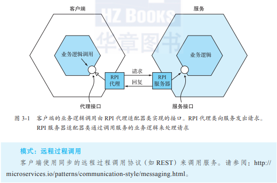

#### 2.1 使用REST

REST是一种使用HTTP协议的进程间通信机制。

REST的一个关键概念是资源，它通常表示单个业务对象或业务对象的集合。REST使用HTTP动词来操作资源，使用URL引用这些资源。如，GET请求返回资源的表现形式，POST请求创建资源，PUT请求更新资源。

##### REST成熟度模型

Leonard Richardson为REST定义了一个成熟度模型，具体包含以下四个层次。

- Level 0：Level 0层级服务的客户端只是向服务端点发起HTTP POST请求，进行服务调用。每个请求都指明了需要执行的操作、这个操作针对的目标（例如，业务对象）和必要的参数。
- Level 1：Level 1层级的服务引入了资源的概念。要执行对资源的操作，客户端需要发出指定要执行的操作和包含任何参数的POST请求。
- Level 2：Level 2层级的服务使用HTTP动词来执行操作，譬如GET表示获取、POST表示创建、PUT表示更新。请求查询参数和主体（如果有的话）指定操作的参数。这让服务能够借助Web基础设施服务，例如通过CDN来缓存GET请求。
- Level 3：Level 3基本思想是在由GET请求返回的资源信息中包含链接，这些链接能够执行该资源允许的操作。例如，客户端通过订单资源中包含的链接取消某一订单，或者发送GET请求去获取该订单，等等。HATEOAS的优点包括无须在客户端代码中写入硬链接的URL。

定义REST API
最流行的REST IDL是Open API规范，它是从Swagger开源项目发展而来的。Swagger项目是一组用于开发和记录REST API的工具。它包括从接口定义到生成客户端桩（stub，存根）和服务器骨架的一整套工具。
在一个请求中获取多个资源的挑战
REST资源通常以业务对象为导向。因此，设计REST API时的一个常见问题是如何使客户端能够在单个请求中检索多个相关对象。
把操作映射为HTTP动词的挑战
另一个常见的REST API设计问题是如何将要在业务对象上执行的操作映射到HTTP动词。 REST API应该使用PUT进行更新，但可能有多种方法来更新订单，包括取消订单、修改订单等。此外，更新可能不是幂等的，但这却是使用PUT的要求。一种解决方案是定义用于更新资源的特定方面的子资源。例如，Order Service具有用于取消订单的POST/orders/{orderId}/cancel端点，以及用于修订订单的POST/orders/{orderId}/revise端点。另一种解决方案是将动词指定为URL的查询参数。可惜的是，这两种解决方案都不是特别符合RESTful的要求。
REST的好处和弊端

- 优点：

- - 它非常简单，并且大家都很熟悉。
  - 可以使用浏览器扩展（比如Postman插件）或者curl之类的命令行（假设使用的是JSON或其他文本格式）来测试HTTP API。
  - 直接支持请求/响应方式的通信。
  - HTTP对防火墙友好。
  - 不需要中间代理，简化了系统架构。

- 缺点：

- - 它只支持请求/响应方式的通信。
  - 可能导致可用性降低。由于客户端和服务直接通信而没有代理来缓冲消息，因此它们必须在REST API调用期间都保持在线。
  - 客户端必须知道服务实例的位置（URL）。如3.2.4节所述，这是现代应用程序中的一个重要问题。客户端必须使用所谓的服务发现机制来定位服务实例。
  - 在单个请求中获取多个资源具有挑战性。
  - 有时很难将多个更新操作映射到HTTP动词。

虽然存在这些缺点，但REST似乎是API的事实标准。

#### 2.2 使用gRPC

gRPC是一个用于编写跨语言客户端和服务端的框架。gRPC是一种基于二进制消息的协议，所以必须采用API优先的方法来进行服务设计。gRPC使用Protocol Buffer作为消息格式，可以使用基于Protocol Buffers的IDL定义gRPC API。

- 优点：

- - 设计具有复杂更新操作的API非常简单。
  - 它具有高效、紧凑的进程间通信机制，尤其是在交换大量消息时。
  - 支持在远程过程调用和消息传递过程中使用双向流式消息方式。
  - 它实现了客户端和用各种语言编写的服务端之间的互操作性。

- 缺点：

- - 与基于REST/JSON的API机制相比，JavaScript客户端使用基于gRPC的API需要做更多的工作。
  - 旧式防火墙可能不支持HTTP/2。

#### 2.3 使用断路器模式处理局部故障

分布式系统中，当服务试图向另一个服务发送同步请求时，永远都面临着局部故障的风险。因为客户端和服务端是独立的进程，服务端很有可能无法在有限的时间内对客户端的请求做出响应。服务端可能因为故障或维护的原因而暂停。或者，服务端也可能因为过载而对请求的响应变得极其缓慢。
客户端等待响应被阻塞，这可能带来的麻烦就是在其他客户端甚至使用服务的第三方应用之间传导，并导致服务中断。

例如，考虑图3-2所示的场景，其中Order Service无响应。移动客户端向API Gateway发出REST请求，如第8章所述，它是API客户端应用程序的入口点。API Gateway将请求代理到无响应的Order Service。

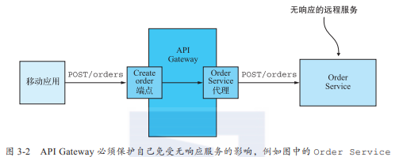

OrderServiceProxy将无限期地阻塞，等待响应。这不仅会导致糟糕的用户体验，而且在许多应用程序中，它会消耗宝贵的资源，例如线程。最终，API Gateway将耗尽资源，无法处理请求。整个API都不可用。
要通过合理地设计服务来防止在整个应用程序中故障的传导和扩散，这是至关重要的。解决这个问题分为两部分：

- 必须让远程过程调用代理（例如OrderServiceProxy）有正确处理无响应服务的能力。
- 需要决定如何从失败的远程服务中恢复。

首先，我们将看看如何编写健壮的远程过程调用代理。
开发可靠的远程过程调用代理
服务同步调用时应采用的保护方法。

- 网络超时：在等待针对请求的响应时，一定不要做成无限阻塞，而是要设定一个超时。使用超时可以保证不会一直在无响应的请求上浪费资源。
- 限制客户端向服务器发出请求的数量：把客户端能够向特定服务发起的请求设置一个上限，如果请求达到了这样的上限，很有可能发起更多的请求也无济于事，这时就应该让请求立刻失败。
- 断路器模式：监控客户端发出请求的成功和失败数量，如果失败的比例超过一定的阈值，就启动断路器，让后续的调用立刻失效。如果大量的请求都以失败而告终，这说明被调服务不可用，这样即使发起更多的调用也是无济于事。在经过一定的时间后，客户端应该继续尝试，如果调用成功，则解除断路器。

从服务失效故障中恢复

- 向其客户端返回错误。

- - 例如，创建Order的请求失败。唯一的选择是API Gateway将错误返回给移动客户端

- 在其他情况下，返回备用值（fallback value，例如默认值或缓存响应）可能会有意义。

- - 例如，即使送餐状态不可用，客户也可以向用户显示有用的信息

#### 2.4 使用服务发现

服务实例具有动态分配的网络位置。此外，由于自动扩展、故障和升级，服务实例集会动态更改。因此，你的客户端代码必须使用服务发现。

##### 什么是服务发现

服务发现在概念上非常简单：其关键组件是服务注册表，它是包含服务实例网络位置信息的一个数据库。
服务实例启动和停止时，服务发现机制会更新服务注册表。当客户端调用服务时，服务发现机制会查询服务注册表以获取可用服务实例的列表，并将请求路由到其中一个服务实例。

实现服务发现有以下两种主要方式：

- 服务及其客户直接与服务注册表交互（Eureka）。
- 通过部署基础设施来处理服务发现。

##### 应用层服务发现模式

服务实例使用服务注册表注册其网络位置。客户端首先通过查询服务注册表获取服务实例列表来调用服务，然后它向其中一个实例发送请求。

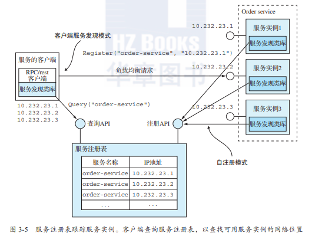

- 优点：

- - 可以处理多平台部署的问题（服务发现机制与具体的部署平台无关）

- 缺点：

- - 需要为你使用的每种编程语言（可能还有框架）提供服务发现库

##### 平台层服务发现模式

部署平台为每个服务提供DNS名称、虚拟IP（VIP）地址和解析为VIP地址的DNS名称。客户端向DNS名称和VIP发出请求，部署平台自动将请求路由到其中一个可用服务实例。因此，服务注册、服务发现和请求路由完全由部署平台处理。

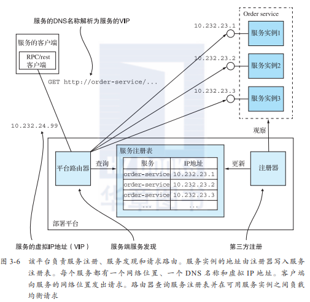

- 优点：

- - 服务发现的所有方面都完全由部署平台处理。服务和客户端都不包含任何服务发现代码。因此，无论使用哪种语言或框架，服务发现机制都可供所有服务和客户使用。

- 缺点：

- - 仅限于支持使用该平台部署的服务。

### 3 基于异步消息模式的通信

使用消息机制时，服务之间的通信采用异步交换消息的方式完成。基于消息机制的应用程序通常使用消息代理，它充当服务之间的中介。另一种选择是使用无代理架构，通过直接向服务发送消息来执行服务请求。服务客户端通过向服务发送消息来发出请求。如果希望服务实例回复，服务将通过向客户端发送单独的消息的方式来实现。由于通信是异步的，因此客户端不会堵塞和等待回复。相反，客户端都假定回复不会马上就收到。

#### 3.1 什么是消息传递

消息通过消息通道进行交换。发送方（应用程序或服务）将消息写入通道，接收方（应用程序或服务）从通道读取消息。

##### 关于消息

消息由消息头部和消息主体组成。消息头是名称与值对的集合，描述正在发送的数据的元数据，消息主体是以文本或二进制格式发送的数据。

有以下几种不同类型的消息。

- 文档：仅包含数据的通用消息。接收者决定如何解释它。对命令式消息的回复是文档消息的一种使用场景。
- 命令：一条等同于RPC请求的消息。它指定要调用的操作及其参数。
- 事件：表示发送方这一端发生了重要的事件。事件通常是领域事件，表示领域对象（如Order或Customer）的状态更改。

##### 关于消息通道

消息通过消息通道进行交换。发送方中的业务逻辑调用发送端接口，该接口封装底层通信机制。发送端由消息发送适配器类实现，该消息发送适配器类通过消息通道向接收器发送消息。消息通道是消息传递基础设施的抽象。调用接收器中的消息处理程序适配器类来处理消息。它调用接收方业务逻辑实现的接收端接口。

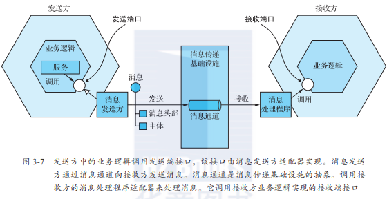

有以下两种类型的消息通道：点对点（www.enterpriseintegrationpatterns.com/PointToPointChannel.html ）和发布-订阅（www.enterpriseintegrationpatterns.com/PublishSubscribeChannel.html ）。

- 点对点通道：向正在从通道读取的一个消费者传递消息。服务使用点对点通道来实现前面描述的一对一交互方式。例如，命令式消息通常通过点对点通道发送。
- 发布-订阅通道：将一条消息发给所有订阅的接收方。服务使用发布-订阅通道来实现前面描述的一对多交互方式。例如，事件式消息通常通过发布-订阅通道发送。

#### 3.2 使用消息机制实现交互方式

##### 实现请求/响应和异步请求/响应

当客户端和服务使用请求/响应或异步请求/响应进行交互时，客户端会发送请求，服务会发回回复。两种交互方式之间的区别在于，对于请求/响应，客户端期望服务立即响应，而对于异步请求/响应，则没有这样的期望。消息机制本质上是异步的，因此只提供异步请求/响应。但客户端可能会堵塞，直到收到回复。

客户端和服务端通过交换一对消息来实现异步请求/响应方式的交互。客户端发送命令式消息，该消息指定要对服务执行的操作和参数，这些内容通过服务拥有的点对点消息通道传递。该服务处理请求，并将包含结果的回复消息发送到客户端拥有的点对点通道。

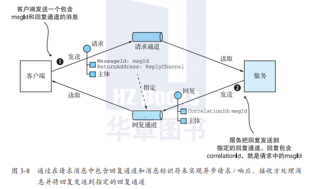

##### 实现单向通知

##### 实现发布/订阅

##### 实现发布/异步响应

#### 3.3 为基于消息机制的服务API创建API规范

服务的异步API规范必须指定消息通道的名称、通过每个通道交换的消息类型及其格式。你还必须使用诸如JSON、XML或Protobuf之类的标准来描述消息的格式。但与REST和Open API不同，并没有广泛采用的标准来记录通道和消息类型，你需要自己编写这样的文档。

服务的异步API包含供客户端调用的操作和由服务对外发布的事件。

##### 记录异步操作

- 请求/异步响应式API：包括服务的命令消息通道、服务接受的命令式消息的具体类型和格式，以及服务发送的回复消息的类型和格式。
- 单向通知式API：包括服务的命令消息通道，以及服务接受的命令式消息的具体类型和格式。

##### 记录事件发布

- 订阅/发布式API：包括事件通道以及服务发布到通道的事件式消息的类型和格式。

#### 3.4 使用消息代理

基于消息传递的应用程序通常使用消息代理，即服务通信的基础设施服务。但基于消息代理的架构并不是唯一的消息架构。你还可以使用基于无代理的消息传递架构，其中服务直接相互通信。这两种方法具有不同的利弊，但通常基于代理的架构是一种更好的方法。

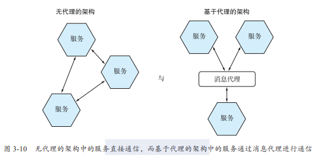

##### 无代理消息

服务可以直接交换消息。ZeroMQ（[http://zeromq.org](http://zeromq.org/) ）

- 优点：

- - 允许更轻的网络流量和更低的延迟，因为消息直接从发送方发送到接收方，而不必从发送方到消息代理，再从代理转发到接收方。
  - 消除了消息代理可能成为性能瓶颈或单点故障的可能性。
  - 具有较低的操作复杂性，因为不需要设置和维护消息代理。

- 缺点：

- - 服务需要了解彼此的位置，因此必须使用3.2.4节中描述的服务发现机制。
  - 会导致可用性降低，因为在交换消息时，消息的发送方和接收方都必须同时在线。
  - 在实现例如确保消息能够成功投递这些复杂功能时的挑战性更大。

##### 基于代理的消息

消息代理是所有消息的中介节点。发送方将消息写入消息代理，消息代理将消息发送给接收方。使用消息代理的一个重要好处是发送方不需要知道接收方的网络位置。另一个好处是消息代理缓冲消息，直到接收方能够处理它们。

流行的开源消息代理包括：

- Apache ActiveMQ（[http://activemq.apache.org](http://activemq.apache.org/) ）。
- RabbitMQ（[https://www.rabbitmq.com](https://www.rabbitmq.com/) ）。
- Apache Kafka（[http://kafka.apache.org](http://kafka.apache.org/) ）。

选择消息代理时，你需要考虑以下各种因素：

- 支持的编程语言：你选择的消息代理应该支持尽可能多的编程语言。
- 支持的消息标准：消息代理是否支持多种消息标准，比如AMQP和STOMP，还是它仅支持专用的消息标准？
- 消息排序：消息代理是否能够保留消息的排序？
- 投递保证：消息代理提供什么样的消息投递保证？
- 持久性：消息是否持久化保存到磁盘并且能够在代理崩溃时恢复？
- 耐久性：如果接收方重新连接到消息代理，它是否会收到断开连接时发送的消息？
- 可扩展性：消息代理的可扩展性如何？
- 延迟：端到端是否有较大延迟？
- 竞争性（并发）接收方：消息代理是否支持竞争性接收方？

基于代理的消息的好处和弊端：

- 优点：

- - 松耦合：客户端发起请求时只要发送给特定的通道即可，客户端完全不需要感知服务实例的情况，客户端不需要使用服务发现机制去获得服务实例的网络位置。
  - 消息缓存：消息代理可以在消息被处理之前一直缓存消息。像HTTP这样的同步请求/响应协议，在交换数据时，发送方和接收方必须同时在线。然而，在使用消息机制的情况下，消息会在队列中缓存，直到它们被接收方处理。这就意味着，例如，即使订单处理系统暂时离线或不可用，在线商店仍旧能够接受客户的订单。订单消息将会在队列中缓存（并不会丢失）。
  - 灵活的通信：消息机制支持前面提到的所有交互方式。
  - 明确的进程间通信：基于RPC的机制总是企图让远程服务调用跟本地调用看上去没什么区别（在客户端和服务端同时使用远程调用代理）。然而，因为物理定律（如服务器不可预计的硬件失效）和可能的局部故障，远程和本地调用还是大相径庭的。消息机制让这些差异变得很明确，这样程序员不会陷入一种“太平盛世”的错觉。

- 缺点：

- - 潜在的性能瓶颈：消息代理可能存在性能瓶颈。幸运的是，许多现代消息代理都支持高度的横向扩展。
  - 潜在的单点故障：消息代理的高可用性至关重要，否则系统整体的可靠性将受到影响。幸运的是，大多数现代消息代理都是高可用的。
  - 额外的操作复杂性：消息系统是一个必须独立安装、配置和运维的系统组件。

#### 3.5 处理并发和消息顺序

为了同时处理消息，拥有多个实例是一个常见的要求。而且，即使单个服务实例也可能使用线程来同时处理多个消息。使用多个线程和服务实例来并发处理消息可以提高应用程序的吞吐量。但同时处理消息的挑战是确保每个消息只被处理一次，并且是按照它们发送的顺序来处理的。

常见解决方案是使用分片（分区）通道。该解决方案分为三个部分。

1. 分片通道由两个或多个分片组成，每个分片的行为类似于一个通道。
2. 发送方在消息头部指定分片键，通常是任意字符串或字节序列。消息代理使用分片键将消息分配给特定的分片。例如，它可以通过计算分片键的散列来选择分片。
3. 消息代理将接收方的多个实例组合在一起，并将它们视为相同的逻辑接收方。例如，Apache Kafka使用术语消费者组。消息代理将每个分片分配给单个接收器。它在接收方启动和关闭时重新分配分片。

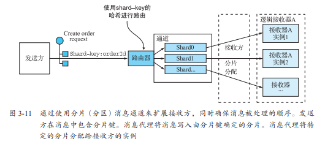

每个Order事件消息都将orderId作为其分片键。特定订单的每个事件都发布到同一个分片，而且该分片中的消息始终由同一个接收方实例读取。因此，这样做就能够保证按顺序处理这些消息。

#### 3.6 处理重复消息

当系统正常工作时，保证传递的消息代理只会传递一次消息。但是客户端、网络或消息代理的故障可能导致消息被多次传递。假设客户端在处理消息后、发送确认消息之前，它的数据库崩溃了，这时消息代理将再次发送未确认的消息，在数据库重新启动时向该客户端或客户端的另一个副本发送。

理想情况下，你应该使用消息代理，在重新传递消息时保留排序。

处理重复消息有以下两种不同的方法。

- 编写幂等消息处理程序。如果应用程序处理消息的逻辑是满足幂等的，那么重复的消息就是无害的。
- 跟踪消息并丢弃重复项。消息接收方使用message id跟踪它已处理的消息并丢弃任何重复项。

#### 3.7 事务性消息

服务通常需要在更新数据库的事务中发布消息。传统的解决办法是在数据库和消息代理之间使用分布式事务。分布式事务对现今的应用程序而言并不是一个很好的选择。而且，很多新的消息代理，例如Apache Kafka并不支持分布式事务。因此，应用必须采用不同的机制确保消息的可靠发送。

##### **使用数据库表作为消息队列**

假设应用程序正在使用关系型数据库。可靠地发布消息的直接方法是应用**事务性发件箱**模式。此模式使用数据库表作为临时消息队列。如图3-13所示，发送消息的服务有一个OUTBOX数据库表。作为创建、更新和删除业务对象的数据库事务的一部分，服务通过将消息插入到OUTBOX表中来发送消息。这样可以保证原子性，因为这是本地的ACID事务。

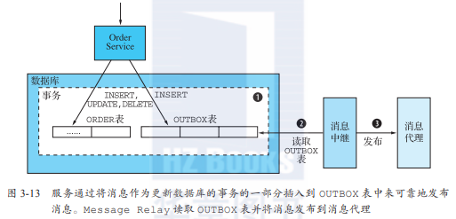

OUTBOX表充当临时消息队列。MessageRelay是一个读取OUTBOX表并将消息发布到消息代理的组件。

对于NoSQL数据库可以使用类似的方法。作为record存储在数据库中的每个业务实体都有一个属性，该属性是需要发布的消息列表。当服务更新数据库中的实体时，它会向该列表附加一条消息。这是原子的，因为它是通过单个数据库操作完成的。但是，挑战在于有效地找到那些拥有事件并发布事件的业务实体。

将消息从数据库移动到消息代理并对外发送有两种不同的方法。

##### **通过轮询模式发布事件**

如果应用程序使用关系型数据库，则对外发布插入OUTBOX表的消息的一种非常简单的方法是让MessageRelay在表中轮询未发布的消息。接下来，MessageRelay把这些消息发送给消息代理，它把每个消息发送给它们的目的消息通道。最后，MessageRelay把完成发送的消息从OUTBOX表中删除。

轮询数据库是一种在小规模下运行良好的简单方法。其弊端是经常轮询数据库可能造成昂贵的开销（导致数据库性能下降）。此外，你是否可以将此方法与NoSQL数据库一起使用取决于NoSQL数据库支持的查询功能。这是因为应用程序必须查询业务实体，而不是查询OUTBOX表，这可能会无法有效地执行。

##### **使用事务日志拖尾模式发布事件**

每次应用程序提交到数据库的更新都对应着数据库事务日志中的一个条目。事务日志挖掘器可以读取事务日志，把每条跟消息有关的记录发送给消息代理。图3-14展示了这个方案的具体实现方式。
Transaction-Log-Miner读取事务日志条目。它将对应于插入消息的每个相关日志条目转换为消息，并将该消息发布到消息代理。此方法可用于发布写入关系型数据库中的OUTBOX表的消息或附加到NoSQL数据库中的记录的消息。

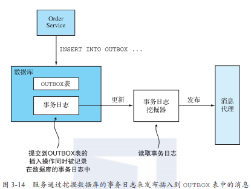


#### 3.8 消息相关的类库和框架


### 4 使用异步消息提高可用性

我们需要在不同的进程间通信机制之间权衡利弊。其中的一个重要权衡因素，就是进程间通信机制与系统的可用性之间的关系。

#### 4.1 同步消息会降低可用性

只要服务使用同步协议进行通信，就可能降低应用程序的可用性。

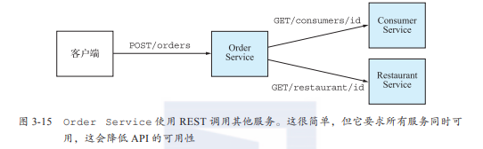

当服务必须从另外一个服务获取信息后，才能够返回它客户端的调用，这种情况都会导致可用性问题。即使服务使用异步消息的请求/响应方式的交互进行通信，也存在此问题。例如，如果通过消息代理向Consumer Service发送消息然后等待响应，则Order Service的可用性将会降低。

如果你想最大化一个系统的可用性，就应该设法最小化系统的同步操作量。

#### 4.2 消除同步交互

在必须处理同步请求的情况下，仍旧有一些方式可以最大限度地降低同步通信的数量。当然，最彻底的方式还是把所有的服务都改成异步API，但是在现实情况下这并不太可能，例如一些公用API总是采用RESTful方式，另外有些情况下服务也必须被设计为采用同步API。

幸运的是，总有一些办法在不发出同步调用请求的情况下来处理同步的调用请求。

##### 使用异步交互模式

理想的情况是，所有的交互都应该使用本章之前所描述的异步交互。例如，让我们假设FTGO采用请求/异步响应的交互方式来创建订单。客户端可以通过向Order Service发送一个请求消息交换消息的方式创建订单。这个服务随即采用异步交换消息的方式跟其他服务通信完成订单的创建，并向客户端发回一个返回消息。

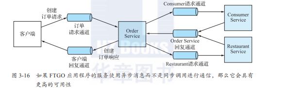

客户端和服务端使用消息通道发送消息来实现异步通信。这个交互过程中不存在堵塞等待响应的情况。
这样的架构非常有弹性，因为消息代理会一直缓存消息，直到有服务端接收并处理消息。

##### 同步通信提高可用性的方法

###### 复制数据

服务维护一个数据副本，这些数据是服务在处理请求时需要使用的。这些数据的源头会在数据变化时发出消息，服务订阅这些消息来确保数据副本的实时更新。

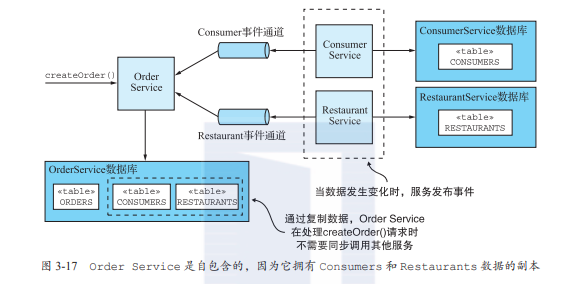

- 缺点：有时候被复制的数据量巨大，会导致效率低下。

###### 先返回响应，再完成处理

具体办法：

1. 仅使用本地的数据来完成请求的验证。
2. 更新数据库，包括向OUTBOX表插入消息。
3. 向客户端返回响应。

当处理请求时，服务并不需要与其他服务直接进行同步交互。取而代之的是，服务异步向其他的服务发送消息。这种方式确保了服务之间的松耦合。

弊端是它使客户端更复杂。

## 四、使用Saga管理事务

### 1 微服务架构下的事务管理

在只访问一个数据库的单体应用中，事务管理是简单明了的。一些较为复杂的单体应用可能会使用多个数据库和消息代理。更进一步，微服务架构下的事务往往需要横跨多个服务，每个服务都有属于自己的私有数据库。在这种情况下，应用程序必须使用一些更为高级的事务管理机制来管理事务。

#### 1.1 微服务架构对分布式事务的需求

已createOrder()操作为例，在微服务架构下，所需要的验证数据散布在不同的服务中。createOrder()操作必须访问多个服务来获得它所需要的验证数据。

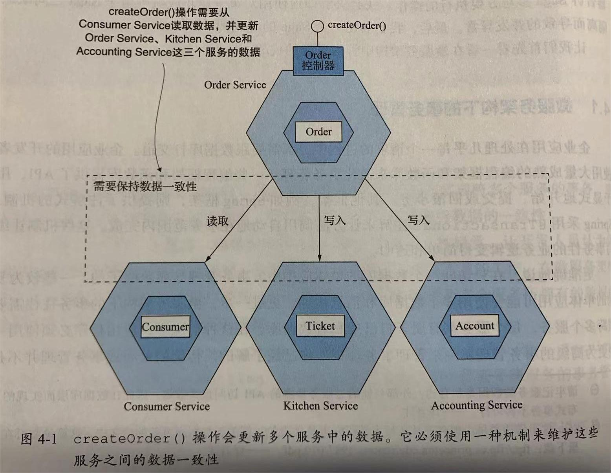

#### 1.2 分布式事务的挑战

在多个服务、数据库和消息代理之间维持数据一致性的传统方式是采用分布式事务。其事实标准是X/Open XA。XA采用了两阶段提交来保证事务中的所有参与方同时完成提交，或在失败时同时回滚。应用程序的整个技术栈都需要满足XA标准。市面上绝大多数的SQL数据库和一部分消息代理满足XA标准。

问题：

- 很多新技术，包括NoSQL数据库（如Mongodb）并不支持XA标准的分布式事务，RabbitMQ、Kafka也不支持。
- 本质上都是同步进程间通信，会降低分布式系统的可用性。

#### 1.3 使用Saga模式维护数据一致性

Saga是一种在微服务架构中维护数据一致性的机制。它通过使用**异步消息**来协调一系列本地事务，从而维护多个服务之间的数据一致性，每个本地事务负责更新它所在服务的私有数据库，这些操作仍旧依赖于我们所熟悉的ACID事务框架和函数库。

### 2 Saga的协调模式

Saga的实现包含协调Saga步骤的逻辑。当通过系统命令启动Saga时，协调逻辑必须选择并通知第一个Saga参与方执行本地事务。一旦该事务完成，Saga协调选择并调用下一个Saga参与方。这个过程一直持续到Saga执行完所有步骤。如果任何本地事务失败，则Saga必须以相反的方式执行补偿事务。

构建Saga协调逻辑的两种方法：

- **协同式**：把Saga的决策和执行顺序逻辑分布在Saga的每一个参与方中，它们通过交换事件的方式来进行沟通。
- **编排式**：把Saga的决策和执行顺序逻辑集中在一个Saga编排器类中。Saga编排器发出命令式消息给各个Saga参与方，指示这些参与方服务完成本地事务。

#### 2.1 协同式Saga

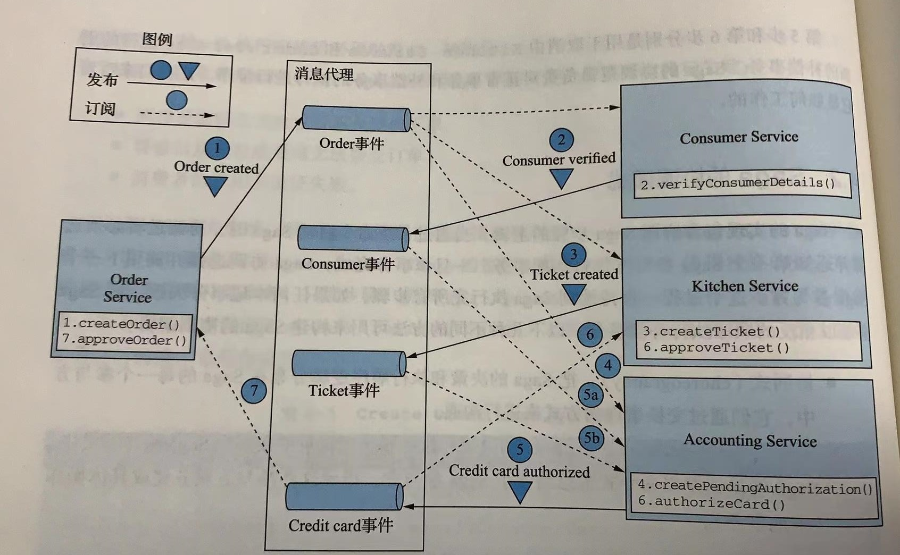

图解：

1. Order Service创建一个处于APPROVAL_PENDING状态的Order并发布OrderCreated事件；
2. Consumer Service消费OrderCreated事件，验证消费者是否可以下订单，并发布ConsumerVerified事件；
3. Kitchen Service消费OrderCreated事件，验证Order，创建一个处于CREATE_PENDING状态的后厨工单Ticket，并发布TicketCreated事件；
4. Accounting Service消费OrderCreated事件并创建一个处于PENDING状态的CreditCardAuthorization；
5. Accounting Service消费TicketCreated和ConsumerVerified事件，向消费者的信用卡收费，并发布CreditCardAuthorized事件；

- - 如果失败，则发布CreditCardAuthorizationFailed事件；

1. Kitchen Service消费CreditCardAuthorized事件，将Ticket的状态更改为AWAITING_ACCEPTANCE；

- - 如果失败，则消费CreditCardAuthorizationFailed事件，将Ticket的状态更改为REJECTED；

1. Order Service接收CreditCardAuthorized事件，将Order的状态改为APPROVED，并发布OrderApproved事件；

- - 如果失败，则消费CreditCardAuthorizationFailed事件，将Order的状态更改为REJECTED；

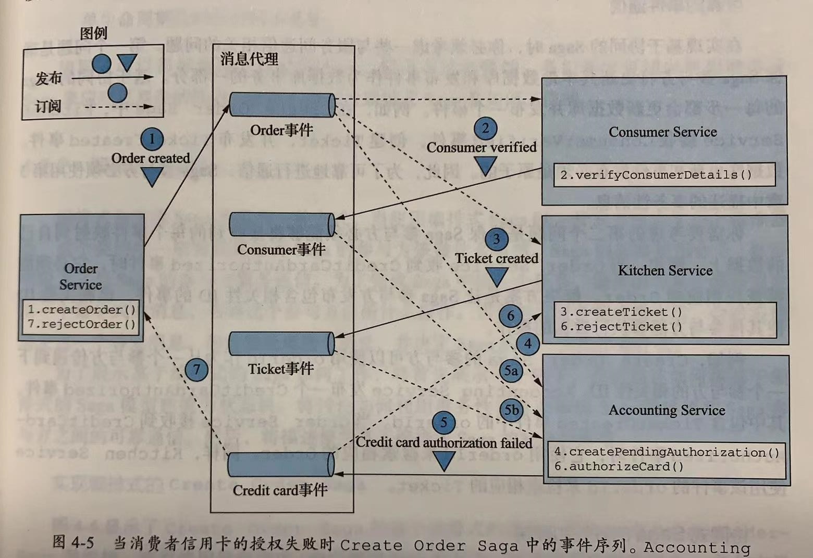


基于协同式的Saga参与方使用发布/订阅进行交互。

##### 可靠的事件通信

在实现基于协同的Saga时，必须考虑一些服务间通信相关的问题。

- 确保Saga参与方将其更新本地数据库和发布事件作为数据库事务的一部分。

- - 解决方案：采用事务性消息。

- 确保Saga参与方必须能够将接收到的每个事件映射到自己的数据上。

- - 解决方案：让Saga参与方发布包含相关性ID的事件（orderId）。

##### 协同式Sage的好处和弊端

- 好处：

- - 简单：服务在创建、更新和删除业务对象时发布事件。
  - 松耦合：参与方订阅事件并且彼此之间不会因此而产生耦合。

- 弊端：

- - 更难理解：协调式Saga的逻辑分布在每个服务的实现中；开发人员有时很难理解特定Saga是如何工作。
  - 服务之间的循环依赖关系：Saga参与方订阅彼此事件，通常会导致循环依赖关系。
  - 紧耦合的风险：每个Saga参与方都需要订阅所有影响它们的事件。

#### 2.2 编排式Saga

##### 实现编排式的Create Order Saga

开发人员定义一个编排器类，该类唯一的职责是告诉Saga的参与方该做什么事清。Saga编排器使用命令 / 异步响应方式与Saga参与方服务通信。

基于编排式是Saga的每个步骤都包括一个更新数据库和发布消息的服务。

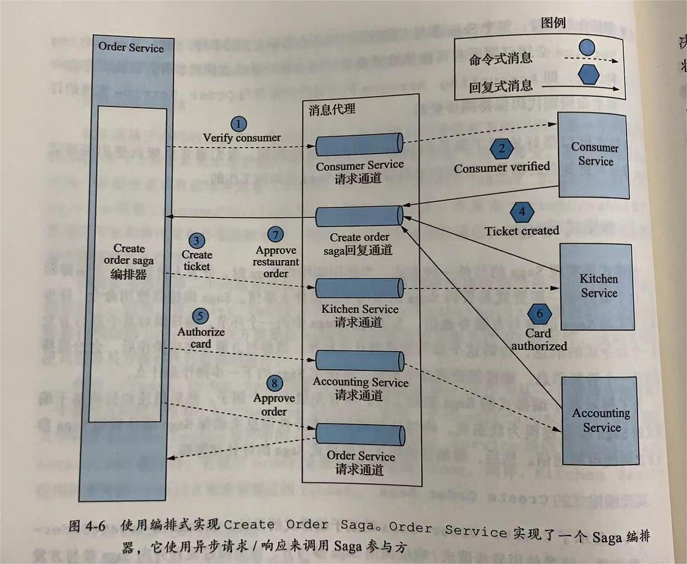

图解：

Order Service首先创建（实例化）一个Order对象和一个Create Order Saga编排器对象，一切正常后流程如下：

1. Saga编排器向Consumer Service发送Verify Consumer命令；
2. Consumer Service回复Consumer Verified消息；
3. Saga编排器向Kitchen Service发送Create Ticket命令；
4. Kitchen Service回复Ticket Created消息；
5. Saga编排器向Accounting Service发送Authorize Card消息；
6. Accounting Service使用Card Authorized消息回复；
7. Saga编排器向Kitchen Service发送Approve Ticket命令；
8. Saga编排器向Order Service发送Approve Ordere命令（命令式消息）；

##### 把Saga编排器视为一个状态机

状态机是由一组状态和一组由事件触发的状态之间的转换组成。每个转换都可以有一个动作，对Saga来说动作就是对某个参与方对调用。

将Saga建模成状态机非常有用，因为它描述了所有可能的场景（可能成功也可能失败）。

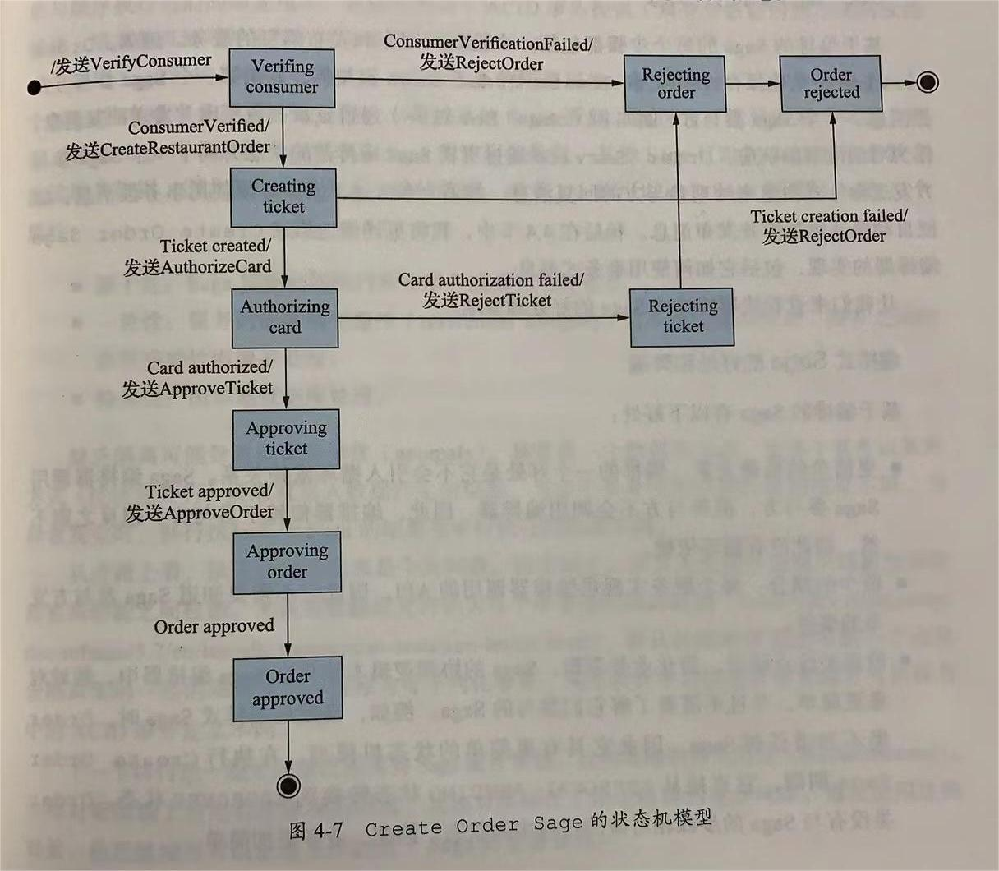

- Verifying Consumer：初始状态。当处于此状态时，该Saga正在等待Consumer Service验证消费者是否可以下订单；
- Creating Ticket：该Saga正在等待对Create Ticket命令的回复；
- Authorizing Card：等待Authorizing Service授权消费者的信用卡；
- Order Approved：最终状态，表示该Saga已成功完成；
- Order Rejected：最终状态，表示Order被其中一个参与方拒绝；

##### 编排式Saga的优缺点

- 好处：

- - 更简单的依赖：不会引入循环依赖关系；
  - 较少的耦合：每个服务实现供编排器调用的API，因此它不需要知道Saga参与方发布的事件；
  - 改善关注点隔离，简化业务逻辑：Saga的协调逻辑本地化在Saga编排器中；领域对象更简单，并且不需要了解它们参与的Saga；

- 弊端：

- - 在编排器中存在集中过多业务逻辑的风险；

- - - 解决办法：可以通过设计只负责排序的编排器来避免此问题，并且不包含任何其他业务逻辑；

### 3 解决隔离问题

ACID事务的隔离性可确保同时执行多个事务的结果与顺序执行它们的结果相同。而Saga只满足ACD（原子性、一致性、持久性），不满足隔离性。

#### Saga只满足ACD

- 原子性：Saga实现确保执行所有事务或撤销所有更改；
- 一致性：服务内的参照完整性（referential integrity）由本地数据库处理；服务之间的参照完整性由服务处理；
- 持久性：由本地数据库处理；

#### 3.1 缺乏隔离导致的问题

缺乏隔离将导致以下三个异常。

- 丢失更新：一个Saga没有读取更新，而是直接覆盖了另一个Saga所做的更改；
- 脏读：一个事务或一个Saga读取了尚未完成的Saga所做的更新；
- 模糊或不可重复读：一个Saga的两个不同步骤读取相同的数据却获得了不同的结果，因为另一个Saga已经进行了更新；

#### 3.2 Saga模式下实现隔离的对策

- 语义锁：应用程序级的锁；

- - Saga的可补偿性事务会在其创建或更新的任何记录中设置标志，该标志表示该记录未提交且可能发生失败；
  - 如：在可补偿性事务执行时给操作对象添加上*_PENDING状态，以告诉该对象的其他Saga，该对象当前正处于一个Saga的处理过程中；

- 交换式更新：把更新操作设计成可以按任何顺序执行；

- - 将更新操作设计为可交换的；
  - 如：账户的debit()和credit()操作是可交换的；

- 悲观视图：重新排序Saga的步骤，以最大限度地降低业务风险；

- - 重新排序Saga的步骤，以最大限度地降低由于脏读而导致的业务风险；

- 重读值：通过重写数据来防止脏写，以在覆盖数据之前验证它是否保持不变；

- - 使用此对策的Saga在更新之前重新读取记录，验证它是否未更改，然后更新记录；如果记录已更改，则Saga将中止并可能重新启动。此对策是乐观脱机锁模式的一种形式；
  - 如：可以用来处理Order在批准过程中被取消的情况；

- 版本文件：将更新记录下来，以便可以对它们重新排序；

- - 记录对数据执行的操作，以便可以对它们进行重新排序；
  - 如：当Accounting Service先收到Cancel Authorization请求，再收到Authorize Card请求时，它会注意到它已经收到Cancel Authorization请求并跳过授权信用卡；

- 业务风险评级（by value）：使用每个请求的业务风险来动态选择并发机制；

- - 使用此对策的应用程序使用每个请求的属性来决定使用Saga和分布式事务；

##### Saga的结构

一个Saga包含三个类型的事务。

- 可补偿性事务：可以使用补偿事务回滚的事务；
- 关键性事务：Saga执行过程的关键节点。如果关键性事务成功，则Saga将一直运行到完成。关键性事务不见得是一个可补偿性事务，或者可重复性事务。但是它可以是最后一个可补偿的事务或第一个可重复的事务；
- 可重复性事务：在关键性事务之后的事务，保证成功；

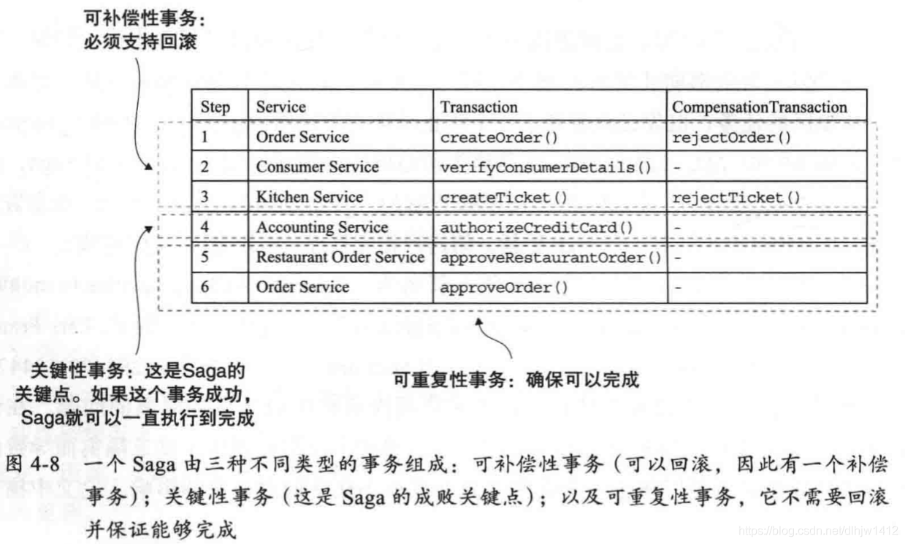


## 五、微服务架构中的业务逻辑设计

## 六、使用时间溯源开发业务逻辑

## 七、在微服务架构中实现查询

## 八、外部API模式

## 九、微服务架构中的测试策略（上）

## 十、微服务架构中的测试策略（下）

## 十一、开发面向生产环境的微服务应用

## 十二、部署微服务应用

## 十三、微服务架构的重构策略
