# 第1章 网络编程基础

## 1.1 单机游戏与网络游戏的区别

1. 第一个需要了解的概念是“异步”。与“异步”一起出现的概念有“同 步”“并行”（并发）等，这几个概念往往比较容易混淆。 举一个加载的例子，如果需要加载几个不同的资源，先加载A，等到A加载 完成后再加载B，加载完B，再加载C，直到所有资源加载完成，这就是同步操 作。以同步方式实现加载，加载者必须等到加载完成之后才能继续后续的加 载。 如果用3个线程同时加载A、B、C资源，由于线程之间是不会相互影响的， 加载A的同时另外两个线程在加载B和C，这就是并行操作。但这种情况不能算是 异步，因为在加载A时，要等待A加载完成之后退出线程。这个等待产生了阻 塞。 那么，什么是异步呢？异步不会等待，也不会阻塞。 假设加载一个资源需要10秒，加载3个资源，在串行时需要30秒，在并行时 需要10秒，异步也需要10秒。

2. 那么，异步与并行的差别在哪里呢?以图1-4为例来看一下异步的流程。在第N帧发出了加载A命令，这一帧会马 上结束，不需要等待10秒，直接进入下一帧，不关心A是否加载成功，当它加载 成功之后，会在某一帧收到加载成功的回调。因为是异步，同时加载A、B时， 得到结果的顺序可能是不一样的，可能A先发出加载命令，但是B的回调却先发生

   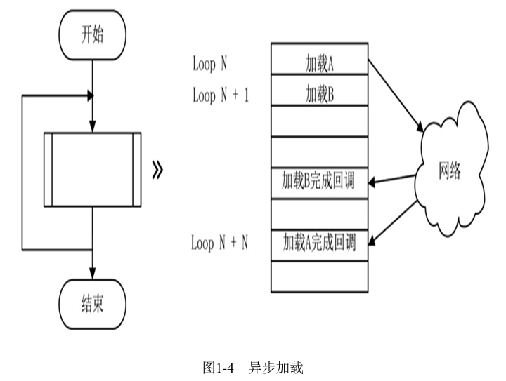

3. 那么，程序是如何知道回调完成的呢？一般来说，有两种方式可以知道A是 否加载成功：
   1.  主动询问，每间隔一段时间询问A是否加载完成。
   2. 被动接收，一般在启动事件时会要求注册一个回调函数，事件完成时 会主动调用回调函数，以标记事件完成。
4.  所谓异步，简而言之，就是在不阻塞进程的情况下完成操作。

## 1.2 理解IP地址

1. 我们看到的IP地址通常是4个十进制数，以“.”隔开，每个十进制数不超 过255。

## 1.3 理解TCP/IP

1. 理论上，开放系统互连参考模型（Open System Interconnection Reference Model，OSI参考模型）为7层。TCP/IP并不完全匹配这7层，它有4层 协议

2. 图1-6简洁地说明了TCP/IP四层协议中的基本结构。链路层囊括网络层的数 据，而网络层又囊括传输层的数据。像洋葱一样，数据发送时一层一层被包裹 起来，到了发送目的地，像剥洋葱一样，又一层一层剥离，最终得到应用层需 要的数据。在这个过程中，首先需要理解“层”的概念，表1-1详细说明了每个 协议层级的作用。

   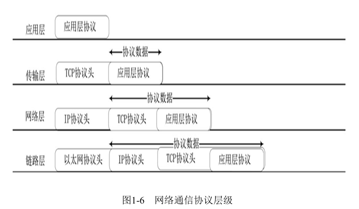

   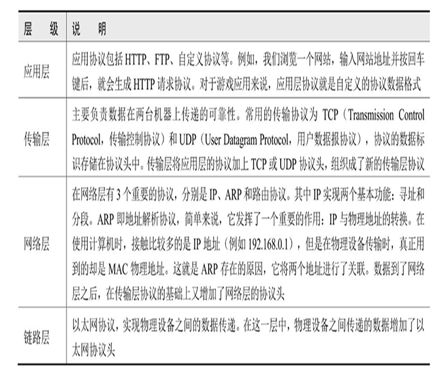

3. 从应用与操作系统的层面来看协议在这几 个层级的处理。发送数据时，如图1-7所示，数据从左侧自上而下叠加，而到了 目标主机，数据是自下而上剥离的，最终到了应用层面，就变成了当初发送的 数据。

   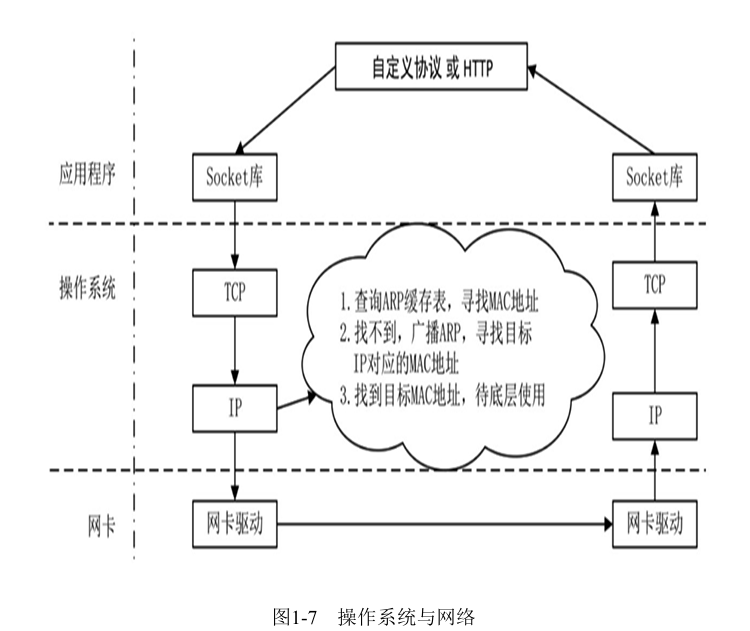

## 1.4 阻塞式网络编程

1. 对于：：recv函数而言，buf是接收数据的缓存，len是该缓存的长度。假 设服务端向客户端发送了2024字节的数据，但客户端接收buf的长度只有1024， len的长度也只能为1024，即：：recv函数一次只会读取系统底层网络缓冲中的 1024字节，放入buf缓冲中。这个概念非常关键，会引发粘包、拆包的问题。网 络数据并不是我们想象中一条一条规整地发送过来的，有可能接收的1024字节 里面有3个协议数据，也有可能接收的1024字节只是某个协议的一部分，需要多 次读取。
2. 函数：：accept、：：send和：：recv都处于 阻塞模式下。 所谓阻塞，就是一定要收到数据之后，后面的操作才会继续。客户端调 用：：connect函数连接到服务端，发送数据之后一直阻塞在：：recv函数 上，直到收到服务端传来的数据才退出。服务端同样是阻塞的，在：：accept 函数处等待连接进来，如果没有就一直等待，接收到一个连接之后，再次阻 塞，等待：：recv函数返回数据
3. 作为服务端，采用阻塞模式显然不够高效。一般来说，服务端需要同时处 理成千上万个通信，不能因为一个连接而阻塞另一个连接的收发数据进程。在 实际情况下，更常用的是非阻塞模式。

## 1.5 非阻塞网络编程

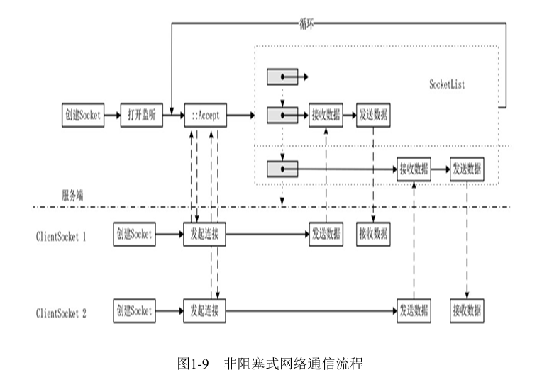

## 1.6 总结

# 第2章 网络IO多路复用

## 2.1 Select网络模型

1. 让系统底层去判断Socket是处于可读 还是可写状态，在可读可写时通知上层，也就是我们常用的网络IO处理——IO 多路复用。
2. Select是一个在Windows和Linux系统下通用的模型。该模型名为Select主 要是因为它以名为：：select的函数为驱动，该函数以不同的返回值来决定后 续如何操作。简单来说，其主要的原理就是监视描述符（Socket）的变化来进 行读写操作，且在必要时抛出异常。
3. 实Select模式原理就是将关心的Socket放到读、写或异常集合中，再传递给：： select函数，它会帮助我们分析、筛选并返回有事件的Socket集合。一旦有了 返回值，再判断每个Socket处于哪一个集合中，针对不同的集合有不同的操 作。如果Socket处于读集合，那么进行读操作；如果Socket处于写集合，那么 进行写操作；如果发生异常，就可以断开网络
4. select函数的连接数量是有限制的，在Linux系统 中，将robots测试工程中的线程调为1100就会发现产生错误提示，这是因为 Linux默认支持集合的最大值为1024
5. Select模型是一种主动的查询模式，这种模式有上限的局限性，而且每一 帧都需要把所有关心的Socket压入集合中，这也带来了效率问题。

## 2.2 Epoll网络模型

1. Select模型兼容两种系统，但Epoll只能在Linux系统下运行。相对于 Select，Epoll最大的好处在于它不会因为连接数量过多而降低效率。在前面 的示例中，我们可以发现Select采用了轮询的方式，假如有3000个连接，在每 一帧都要将3000个Socket放到集合中进行轮询。而Epoll正好相反，Epoll对需 要监听的事件进行注册，对于读事件，只需要注册一次，而不是每一帧盲目地 轮询。
2. select函数每一帧中都对所有Socket进行注册，但 是Epoll不需要那么频繁操作，只需要修改一次，底层就会一直保持其监听事件，直到上层逻辑对其监听的事件做出修改

# 第3章 线程、进程以及Actor模型

## 3.1 游戏架构概述

1. 无服务端游戏除了单机游戏之外，还有一种无服务端游戏架构——P2P架构

2. 单进程CS架构

3. 多进程CS架构

## 3.2 框架瓶颈

1. 滚服游戏:可以认为是一种平行空间的游戏方式，因为一 个游戏世界容纳不了太多人，过一段时间就新开一个服务器，每个服务器的世 界都一样。因为不断地增加新的服务器，用“滚服”来形容非常贴切。这类游戏技术的实现较为简单，只需要多开服务端，用简单的单进程CS架 构就可以实现。但它有一个缺点，玩家承载是有限的；合服是滚服游戏一定要考虑的问题，一开始就要考虑的问题是合服时的数 据库处理。

2. 副本游戏:在副本游戏中，会为玩家专门开辟一个地图或空间实 例。例如棋牌，为每一桌可以开一个副本空间

3.  大图分割空间游戏:大图分割空间游戏。将一张大图分割成几个处理块，或者将不同地 图放到不同进程进行处理。这类游戏又分为两种类型：一种类型如《剑侠情缘 网络版叁》，不同的城镇在服务端可能在不同的进程中；另一种类型如《魔兽 世界》，采用了Big World（大地图）的方式，所有的人看似都在同一个地图 上，但其实这个地图像农田一样被划分成了多个小块，每个小块由不同的地图 实例管理；分割一张地图有一个比较难处理的问题，玩家移动的时候，如果正好处于分割 空间的分界线上，就会产生边界问题

## 3.3 设计游戏框架

1. 应该采用哪一种服务端架构呢？这个问题实际上是由游戏 内容来决定的。本书从技术层面出发，目标是做一个难度相对较大的全球服。 理解了全球服的思路，其他架构都是全球服的缩影。
2. 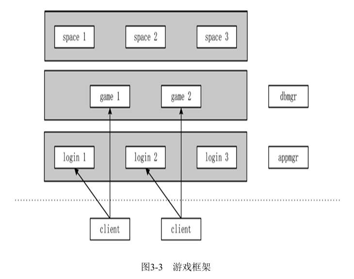
   本书要以分割空间的方式实现一个不分服的架构，在这个架构之下可以再 深度扩展，不仅可以实现一个MMORPG，也可以实现类似《王者荣耀》的对战类 游戏。当然，既然可以分割空间到不同的进程，我们也希望它可以合并空间到 一个进程，也就是说这个框架也可以实现常规的滚服游戏，这是一个可伸可展 的框架，可以满足大部分游戏的需求。
3. 副本空间的框架也有两种实现方式，一种是客户端维护一个网 络连接，只与game进行通信；另一种是客户端需要维护两个网络连接，同时与 game和副本进行通信。也可以把副本服务器称为战场服务器，典型的用法是在 《英雄联盟》中，登录、匹配数据在一个进程上，而进入地图之后，它在另一 台服务器上。这两种结构各有其特点，并没有好坏之分，只是需求不相同。
3. 本书为了实现兼容MMORPG与MOBA类游戏的双重功能，将采用第一种方式， 将game服务进程视为网关服务器。顾名思义，网关是用来连接两个网络的，网关服务器是一个中转服务器，它是连接客户端与地图（战场）服务器之间的桥梁。

## 3.5 理解进程和线程

1. 进程拥有一个Id，进程Id（PID）是进程唯一的标识码。我们 所编写的程序代码，每一个包含main入口函数的程序都认为是一个进程，在 Windows系统中，.exe后缀的文件就是一个进程。
2. 一个进程至少拥有一个线程，即主线程。每个线程拥有自己的调用堆栈， 是CPU调用的基本单位。我们从CPU调度的角度来看看单线程和多线程有什么不 同。
3. CPU均匀地调度所有线程，当其中一个线程被IO阻塞时，CPU不会等待，会 马上转向另一个线程。这就是多线程比单线程更快的原因。多线程可以更好地 均衡CPU的负载。
4. 每个线程有每个线程的调用堆栈，例如A线程的数据，如果同 时有两个线程进行写操作，就会出现一些无法预估的宕机错误。在编程上为了 避免这种错误，有两种常规的处理办法
   1. 加锁。每种编程语言都有加锁语法。对于那些跨线程的数据进行加 锁，这种加锁行为相当于让访问数据的线程进行排队，一个一个串行访问数 据。虽然加锁可以解决线程访问的问题，但是实际上在处理这些数据时，它变 成了“单线程”，而不能并发。 
   2. 消息机制。永远都不正面访问线程中的数据，而是通过消息的方式来 调用。请求操作到来时，我们把数据以消息的方式保存下来，处理完成之后， 再用消息的方式传递出去
5. 在游戏编程中，常见的一种线程使用方式为：例如有1000个DB数据需要存 储，发起1000个线程，每个线程处理一个，处理完成之后销毁线程，回调到主 线程。类似的需求很多，例如发送邮件。这种方式使用了并发处理数据，的确 提高了效率，但如果出现回调函数，就避免不了加锁。因为回调函数在主线程 中，从一个线程调用主线程函数时必须要加锁。在编码中，有了一个锁，就会 有无数个锁，随着游戏的功能越来越多，锁会越来越多，遗漏一处都会产生宕 机。这也是很多人不喜欢用线程的原因。

## 3.6 Actor模型

1. Actor模型是为了并发而设计出来的。
2. 一个纯粹的Actor只接收消息，受事件驱 动，然后根据消息执行相应的计算。
3. 最大的特点是，大量Actor之间是相互隔 离的，它们不共享内存。
4. Actor之间有且只有一种通信方式，就是消息传递。在 Actor模型中，对象的任何数据不对外，所有数据只有它自己可以修改。
5. 两个Actor之间不能互调函数。
6. 当我们在使用线程时，因为有资源的竞争，需要加锁。同时，有两个或者 两个以上的线程需要访问某个对象时，为了避免出错必须加锁。如果一个系统 日渐发展壮大，又使用了多线程，那么到了后期，这些锁几乎是一种毁灭性的 灾难，因为其不可维护。采用消息通信的方式来修改数据，避免了加锁且可以进行单元测试。
7. Actor模型是基于消息的，单个Actor的原型分为3部分：消息队列、行为和 数据。消息队列又被称为MailBox或邮箱，邮箱比较贴切，因为邮箱是协议的中 转地，发起邮箱的双方没有耦合。

## 3.7 游戏框架中的线程

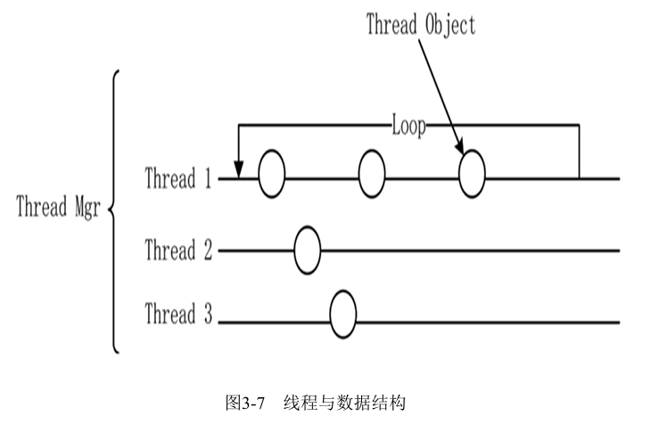

图3-7中的Thread 1、Thread 2和Thread 3分别表示3个独立线程，其中 Thread 1维护了3个线程包裹对象。线程就像一个流水线一样，每个 ThreadObject实例就是上面一个个包裹，为了方便理解，就叫它线程包裹类。 线程不关心这些“包裹”中的内容是什么，只是每帧调用Update函数时， 对“包裹”对象进行更新。而线程管理则管理着Thread 1、Thread 2和Thread 3，线程管理器并不关心每个线程中有多少个线程包裹。

1. 包裹类ThreadObject:每个线程包裹都是一个以Actor为原型的类，它们互不影响。每个Actor必定有自己感兴趣的协议类型，函数RegisterMsgFunction用来 实现Actor的协议注册，帧函数中实现不同的Actor的不同更新操作。
2. 线程类Thread:提供了启动线程与结束线程的函数。其中，AddThreadObj 函数是将一个指定的线程包裹类ThreadObject实例放在本线程中，属性Objlist维护了这些线程 包裹类实例。线程类并不关心这个流水线上的包裹有什么用，它只需要在更新时遍历Objlist中 的所有对象，调用这些对象的Update帧函数即可
3. 线程管理类ThreadMgr有两个主要任务:
   1. 每帧检查一下每个线程是否还在工作，若线程全部退出，则进程退出。 
   2. 管理多个线程对象。当有新的线程包裹对象加入线程时，丢给管理类处理，会将新对象放置到一个合适的 线程中。ThreadObject本身并不知道自己会加入哪个线程中。 
4. 线程管理类维护了一个线程对象列表，AddObjToThread函数将一个个包裹类加入线程中，外部并不知道该对象 加到哪个线程中，函数内有一个平衡算法。为了实现均衡，所有线程上的包裹类是由线程管理类来分配的。具体函 数实现就不在这里分析了，相关代码并不复杂。值得一提的是，线程管理类用到了设计模式上的单例模式，因为它 只需要有一个实例
5. libserver库与游戏逻辑:前面阐述了服务端的架构，它是由登录服务器login、管理服务器appmgr、逻辑服务器 game、数据库服务器dbmgr和空间服务器space共同组成的。这些服务器在逻辑层的功能千差 万别，但其基本的架构是完全一致的，它们每一个进程都有无数个线程，有网络处理能力， 有收发网络协议的能力，两两之间可以通信，也可能会监听一个网络端口或者去连接其他服务器等。这些是每个服务器的基本功能。
   1. 网络层：打开监听或进行网络连接。 
   2. 使用Actor模型来处理协议。 
   3. 管理多线程，每个具体的线程需要做什么不是libserver底层库需要考虑的事情， 库相当于只提拱了一个运行平台，而每个具体的线程包裹对象要做什么是由具体实现类来实 现的。 
   4. 提供一个基本的ServerApp类来创建不同的服务器。
6. 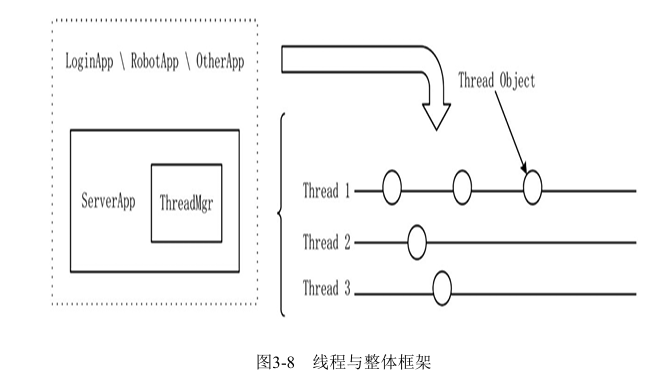

## 3.8 Actor对象之间的消息处理机制

1. ThreadObject是一个Actor模型，MessageList类对应Actor的MailBox部分。

2. 总结一下消息分发的流程:

   1. 当网络层收到网络数据时，将数据组织成Packet，此时二进制数据依然还是二进制，存放在 Packet的缓冲中，通知ThreadMgr进行广播。 

   2. ThreadMgr收到一个Packet，分发给所有线程。

   3. 线程分发给所有该线程之上的包裹类对象，如果包裹类对这个Packet有兴趣，就将这个 Packet放到它的Messagelist中，等待下一帧进行处理。 

   4. 在下一帧中，MessageList发现有待处理的Packet，将其取出，调用该协议号注册的处理函 数。在处理函数中，Packet中的二进制数据转化为protobuf的定义结构，变为有意义的数据。

      

# 第4章 账号登录与验证

1. 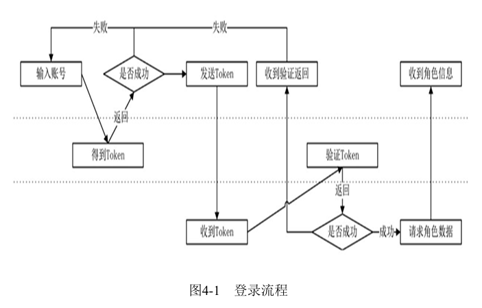

   一般来说，游戏本身没有验证用户的接口，因为游戏最终是发布到各大平 台的，验证用户账号是否合法需要调用平台的用户验证接口，也就是图4-1虚线 标注的中间部分，这一部分的功能由平台提供。图4-1上半部分是由客户端发起 的，中间是第三方平台，最下面是服务端的处理流程。总的来说，整个登录分 成如下几步： 

   1. 客户端通过平台给定的SDK取到该账号的token和账号ID，生成的 token是有时效性的。 
   2. 客户端将token发送到服务端，服务端通过平台提供的HTTP将token和 账号ID传给平台进行验证。
   3. 服务端收到平台的反馈结果，如果失败就通知客户端，如果成功就加 载玩家数据。

2. 每个平台接入的API各有不同，但大部分采用了HTTP。为了搭建一个真正的 环境，我们将实现一个HTTP账号验证系统，以模仿真实的登录环节。

# 第5章 性能优化与对象池

1. 交换型数据结构:。如图5-6所示，准备了两块数据，一块用于读，另一块用于写，开始时它们都是 空的。在某个时间段，发现写数据块中有数据需要处理，这时将两个指针对调。这时写指针指向了一个 空的数据块，而读指针的数据块上充满了数据，将需要读取的数据都处理完。等下一个时刻，发现写数 据块有数据，再进行数据块的对调。因为读、写数据分开了，就不再需要加锁了。

   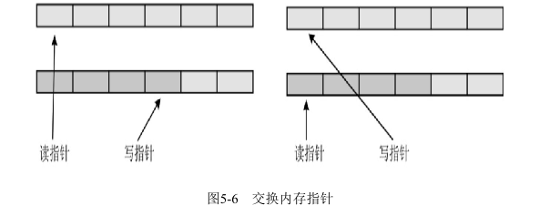

2. 刷新型数据结构：是一种用于对象的增加与删除的数据结构，它通常用于线程中的对象队列或对象池等场景。
3. 组织数据方式——对象池

# 第6章 搭建ECS框架

## 6.1 一个简单的ECS工程

1. ECS的全称为Entity Component System，Entity是实体，Component是组件，System则指系统。Entity中可以包括无数个Component，具备某组件便具有某功能，而System是控制这些组件的动作。

2. ECS和我们之前的框架有什么区别呢？在之前的框架中，线程或者进程上会存在很多Object（对象），这些Object都 是继承自ThreadObject，这带来了一个问题，并不是所有在线程上存在的实例 都需要Update帧操作，例如login工程中的Account类虽然继承了 ThreadObject，也实现了Update函数，但这个函数是空的。继承自 ThreadObject的类都需要实现Update函数，所以这里只能写一个空函数。

   为了解决空函数的问题，提出了一个System框架，在System中定义了几种 类型的动作。例如InitializeSystem是初始化动作，UpdateSystem是更新系 统，每一个动作都是一个接口。这意味着一个对象可以实现按需定义，如果需 要初始化就实现InitializeSystem接口，如果需要Update就实现UpdateSystem 接口

3. Component作为一个基类，数据非常少，每个组件都有一个唯一标识SN 和一个父对象指针，这个指针并不一定赋值，也就是说组件也有可能没有父 类。组件的父类一定是一个实体，组件不能成为组件的父类，一个类有了组件则一定是实体。
4. Entity类中实现了一个增加组件的函数AddComponent，它将一个组件绑 定到Entity中。Entity本身也是一个Component，也就是说它可以作为其他 Entity的组件。
5. 如何判断一个类该定义为组件还是实体呢？简单来说， 如果一个类中还需要有组件，它就是一个实体，如果一个类中不需要再有更小 的组件，它就是一个基本的组件
6. 为了维护Entity和Component类，需要一个管理类EntitySystem,在EntitySystem类中提供了CreateComponent函数来创建一个组件或实体，因 为每一个类的构造函数参数不同，所以这是一个多参的创建函数

## 6.2 基于ECS框架的libserver

1. ECS框架是一个整体，如果在本书之前的多线程框架中加入一个ECS框架就 必须加锁，加锁会引起工作量和效率的连锁反应，所以要将ECS框架思路引入线 程中，就需要每一个线程都有一个ECS架构，也就是说每个线程中都有一个 EntitySystem来管理线程中的对象。

2. libserver修改为如上框架
   1. 现在我们不再需要基类ThreadObject，而由Entity或者Component来 替代它。
   2. 线程管理类ThreadMgr作为一个主线程的对象，它除了管理线程之 外，还需要继承EntitySystem类，在主线程中也有全局的Entity或者Component类需要管理。 
   3. 线程类Thread需要集合EntitySystem类的功能，Thread管理std：： thread对象，而基类EntitySystem打理线程中的对象。 
   4. 增加一些基础的System类，例如UpdateSystem和MessageSystem，用 于更新和处理消息
   
3. 在新的ECS框架中，生成对象是由EntitySystem对象统一来生成的，生成对 象的同时需要对这些对象的特征进行分析，放置到不同的系统中，新对象是否 实现了IMessageSystem接口决定了它是否需要进行消息处理，实现了 IUpdateSystem接口决定了它需要每帧更新

4. 通过字符串动态创建类:因为在新框架中有了EntitySystem，用于维护和创建对象，所有的类都在这里被创建和销毁，以方便管理。首 先，我们不希望这条规则被破坏，其次，如果需要跨线程创建对象，就存在加锁的问题。实际上，跨线程创建的对象 非常有限，为了一些有限的类，每帧都要加锁，显然是一个不值得的事情,C++中无法直接通过名字创建对象，只能通过工厂模式实现。

5. 提供多参变量来创建实例

6. EntitySystem的工作原理

   1. 一个功能模块例如登录为一个App

   2. App中包含一个ThreadMgr

   3. ThreadMgr中包含多个Thread，现在为默认3个

   4. ThreadMgr和Thread都是继承自EntitySystem，但是其实这个设计并不太好，因为会给人一个错乱的感觉，ThreadMgr管理Thread但是又同时继承EntitySystem。

   5. ThreadMgr就是管理所有Thread的开启、转发消息给所有的Thread同时自己也处理自己的(ThreadMgr可以存储全局的实体和组件_pThreadMgr->AddComponent)

   6. Thread作用就是管理自己的实体和组件，接受ThreadMgr给的消息然后分发给自己所有的实体和组件

   7. 有3种方式可以创建组件或者实体

      1. 在EntitySystem中直接创建一个实体或者组件。 EntitySystem::AddToSystem

      2. 由一个已存在的实体创建组件。  IEntity::AddToSystem

      3. 通过协议创建

         ```c++
         void LoginApp::InitApp() { 
             _pThreadMgr->CreateComponent<NetworkListen>(std::string("127.0.0.1"), 2233) 
             _pThreadMgr->CreateComponent<RobotTest>(); 
             _pThreadMgr->CreateComponent<Account>(); 
         } 
         ```

         在login进程启动时，创建了NetworkListen、RobotTest、Account三个类。采用协议的方式将创建类的类名和需 要的参数以协议的方式传递到线程中，再由线程自行创建。*（ThreadMgr::CreateComponent方法将消息放入ThreadMgr的_createPackets，然后在ThreadMgr::Update()**均匀**分发个Thread）*

         ```c++
         inline void ThreadMgr::CreateComponent(TArgs ...args)
         {
         	std::lock_guard<std::mutex> guard(_create_lock);
         
         	const std::string className = typeid(T).name();
         	if (!ComponentFactory<TArgs...>::GetInstance()->IsRegisted(className))
         	{
         		RegistToFactory<T, TArgs...>();
         	}
         
         	Proto::CreateComponent proto;
         	proto.set_class_name(className.c_str());
         	AnalyseParam(proto, std::forward<TArgs>(args)...);
         
         	auto pCreatePacket = new Packet(Proto::MsgId::MI_CreateComponent, 0);
         	pCreatePacket->SerializeToBuffer(proto);
             // 放入_createPackets
         	_createPackets.GetWriterCache()->emplace_back(pCreatePacket);
         }
         ```

         ```c++
         void ThreadMgr::Update()
         {
             _create_lock.lock();
             if (_createPackets.CanSwap()) {
                 _createPackets.Swap();
             }
             _create_lock.unlock();
         
             auto pList = _createPackets.GetReaderCache();
             for (auto iter = pList->begin(); iter != pList->end(); ++iter)
             {
                 const auto packet = (*iter);
                 if (_threadIndex >= _threads.size())
                     _threadIndex = 0;
                // 均匀分给每个线程
                 _threads[_threadIndex]->AddPacketToList(packet);
                 _threadIndex++;
             }
             pList->clear();
         
             EntitySystem::Update();
         }
         ```

   8. 在实体和组件创建的时候就需要注意，同类型的实体或者组件不应该在不同的线程，如果他们在不同线程就可能造成对共有资源的抢占，这样就需要通过加锁来解决，这样就有违整体框架的设计，最好就是给他们放进一个Mgr组件用于管理他们，将创建消息发给Mgr，Mgr创建他们，然后他们自己维护自己的状态。


# 第7章 MySQL数据库

# 第8章 深入学习组件式编程

## 8.1 新的系统管理类SystemManager

1. SystemManager在构造函数中初始化了3个系统，分别是EntitySystem（实 体系统）、MessageSystem（消息系统）和UpdateSystem（更新系统）。

   1.  EntitySystem，负责所有组件和实体的管理，所有组件实例在这个 类中都可以找到。如果是多线程，EntitySystem就只负责本线程中的组件。
   2. MessageSystem，负责处理从网络层或从别的线程中发来的Packet消 息。 
   3. UpdateSystem，处理需要不断更新的数据的组件

2. 新的EntitySystem类中没有任何动作接口，现在它是一个纯数据类。在类中新增了一种ComponentCollections数 据，用来保存实体或组件，该类的作用是将一系列相似的组件放在一起，即所有更新组件UpdateComponent实例是放在 一个ComponentCollections实例中的，当需要取得更新组件时，取到对应的ComponentCollections实例即可

3. 在EntitySystem：：Update中，现在只做了一件事情，就是对于每一个ComponentCollections类调用了Swap函 数。在ComponentCollections类定义中，可以看到它采用了CacheRefresh的方式，有3组数据：一组是当前正常运行有 效的组件集合，一组是新增的组件数据，另一组是需要删除的组件。Swap函数就是将新增与删除的组件合并到有效组 件集合中。之所以分成3组是为了不形成死循环。

4. 实体和组件是一个相互循环的结构，实体可以创建无数个实体作为自己的组件，这些创建出来的实体也可以创建 无数个新的实体，这个逻辑可以无限地嵌套下去。

5. 更新系统由两个类组成：一个是组件类UpdateComponent；另一个是系统类UpdateSystem。这两 个类的关系是，UpdateComponent相当于一个标记，它在某个实体上打上了一个需要更新的标记，而 UpdateSystem是通过EntitySystem找到这些有标记的实体进行更新操作

   ```c++
   void NetworkListen::AwakeFromPool(std::string ip, int port) { 
       // update 
       auto pUpdateComponent = AddComponent<UpdateComponent>(); 
       pUpdateComponent->UpdataFunction = BindFunP0(this, &NetworkListen::Update); 
       return; 
   }
   // 在NetworkListen被初始化时增加了UpdateComponent组件。这个组件加入之后，更新的操作就可以转移给该组件。NetworkListen类的更新函数被绑定到了这个新创建的组件上。
   ```

   先从EntitySystem中取出所有UpdateComponent组件进行遍历，执行其组件绑 定的更新函数，以达到每个组件更新的目的。图8-1展示了这个流程。最外层的调用入口只有一个， 也就是SystemManager：：Update函数。在SystemManager中，每一帧都会调用所有系统的Update函 数，而对于UpdateSystem而言，UpdateSystem：：Update的作用就是遍历所有UpdateComponent组件 绑定的更新函数。NetworkListen类的更新函数Update只是其中之一。

   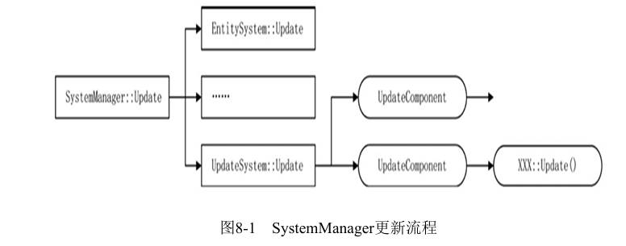

6. 消息系统MessageSystem: 
   1. 第一版：从网络底层读上来数据，将这些数据组织成一个Packet类，然后将这些类放到各个线程中，线程中的 每个对象继承自基类ThreadObject，每个对象都要实现处理消息的基础函数。
   2.  第二版：在深入编码之后，我们发现并不是所有组件都需要处理消息。然后设计了一个IMessgaeSystem接口， 继承了该接口的组件可以收到Packet消息。
   3. 现在，将IMessgaeSystem接口去掉了，只要有了MessageComponent组件就可以处理消息，这将产生一些非常灵活 而便捷的操作。例如，在某些条件下，实体A可以处理1、2号协议，当它的状态发生改变时，可以删除这个 MessageComponent组件，增加一个新的MessageComponent组件，这时可以处理3、4号协议。对于一些复杂的情况，也 可以更改1、2号协议的处理方式。

## 8.2 allinone工程

1. 修改MessageSystemHelp::SendPacket用来兼容如果是多进程改为单进程模式

## 8.3 线程分类

1. 随机放置到了某个线程中， 但这并不是我们想要的，我们希望NetworkListen类可以独占一个线程。除此之外，我们可能还希望 能启动两个或多个MysqlConnector组件，毕竟1000个账号同时登录时，用几个线程来读取数据库的 数据肯定快过用一个线程来读取数据库的数据。
2. 在dbmgr进程中，创建MysqlConnector组件时调用的函数为CreateComponent。将随机挑选一个 进程生成对象实例。该功能现在已经无法满足我们的需要，为了保证性能，希望每个 MysqlConnector可以独占进程
3. 假设有两个线程，每个线程中都有MysqlConnector实例，那么查询玩家的协议是否会被执行两 次？毕竟现在所有协议是分发给所有线程的。为了解决这两个问题，有必要对线程类型进行一个规划，有些线程对于协议的处理是互斥的。 所谓互斥，就是像MysqlConnector组件一样，只需要在多个线程中挑选一个线程处理即可，而另一 些线程是完全平等的，如逻辑线程。因此，定义了线程枚举ThreadType。

## 8.4 IAwakeSystem接口与对象池

1. 在前面的示例代码中，采用的是全局对象池，即一种类型的对象池只有一 个实例。在多线程中使用对象池，操作已使用、未使用的集合时进行了加锁操作
2. 将全局对象池变更为线程对象池。一般来说，线程中 创建的对象都在线程内使用，这些对象是不需要加锁的。

## 8.5 主动销毁对象

### 8.5.1 一般组件销毁

1. 如果组件是通过实体AddComponent这个途径增加的，那么调用 Entity：：Remove Component函数即可销毁
2. 如果是没有实体的组件（例如HttpRequest），就可以直接调用该线 程中的EntitySystem：：RemoveComponent函数销毁。

### 8.5.2 引用计数销毁对象

Packet对象的销毁比较复杂，因为它会穿越多个线程。Packet对象的销毁采用了引用计数销毁的方式。流程图如 图8-2所示，展示了整个过程。


当一个协议到达时，它被封装成了Packet类，这个Packet类的指针将穿越所有线程，查看是否有某个组件对自己 感兴趣。当它进入线程时计数加1，退出线程时计数减1。而在主线程中则不断地检查计数，归0时，该对象将被回 收。

## 8.6 时间堆

### 8.6.1 堆实现代码

### 8.6.2 时间堆组件

## 8.7 总结

# 第9章 服务器管理进程与HTTP

## 9.1 启动多个login进程

## 9.2 appmgr进程

## 9.3 HTTP

## 9.4 使用Mongoose分析HTTP格式

### 9.4.1 HTTP类型

### 9.4.2 接收HTTP数据

### 9.4.3 处理HTTP数据的协议号

### 9.4.4 收到HTTP请求是如何响应的

### 9.4.5 发送HTTP返回数据流程

## 9.5 为Packet定义新的网络标识

### 9.5.1 使用网络标识创建一个连接

### 9.5.2 使用网络标识发送数据

### 9.5.3 向外部请求HTTP数据

## 9.6 HTTP分块

## 9.7 机器人测试批量登录

## 9.8 总结

# 第10章 分布式登录与Redis内存数据库

## 10.1 game与space的定位

### 10.1.1 选择合适的game进程

### 10.1.2 使用token登录game进程

### 10.1.3 Player组件

## 10.2 Redis及其第三方库

### 10.2.1 Redis的安装

### 10.2.2 Redis命令行命令

### 10.2.3 hireids库

### 10.2.4 组件RedisConnector

### 10.2.5 Redis在login中的应用

### 10.2.6 Redis在game中的应用

### 10.2.7 从Redis删除数据

## 10.3 性能瓶颈分析

### 10.3.1 使用日志查看瓶颈

### 10.3.2 优化MessageComponent组件

### 10.3.3 ConnectObj内存组织

## 10.4 多进程登录协议回顾

## 10.5 总结

# 第11章 分布式跳转方案

## 11.1 资源数据配置与读取

### 11.1.1 资源管理类ResourceManager

### 11.1.2 地图资源管理类ResourceWorldMgr

### 11.1.3 地图资源类ResourceWorld

## 11.2 地图类World与代理类WorldProxy

### 11.2.1 地图类World

### 11.2.2 为什么需要WorldProxy

## 11.3 分布式地图跳转流程

### 11.3.1 发起跳转协议的时机

### 11.3.2 跳转协议的数据定义

### 11.3.3 目标代理地图收到跳转协议

### 11.3.4 网络标识如何在网络中传递

### 11.3.5 space进程发送的协议如何转发到客户端

## 11.4 通过客户端进入游戏

## 11.5 玩家在WorldProxy之间的跳转

## 11.6 总结

# 第12章 断线与动态加载系统

## 12.1 玩家断线

### 12.1.1 玩家在login进程中断线

### 12.1.2 玩家在game进程中断线

### 12.1.3 玩家断线时World类的处理

### 12.1.4 玩家数据的读取与保存

### 12.1.5 如何进入断线之前的地图

## 12.2 进程之间的断线

### 12.2.1 login进程断线与重连

### 12.2.2 game进程断线与重连

### 12.2.3 space进程断线与重连

### 12.2.4 appmgr进程断线与重连

## 12.3 动态新增系统

### 12.3.1 MoveComponent组件

### 12.3.2 新系统MoveSystem

### 12.3.3 加载新系统

### 12.3.4 测试移动

## 12.4 总结

# 写在最后——如何构建自己的框架

# 附录A 在CentOS上建立开发环境
