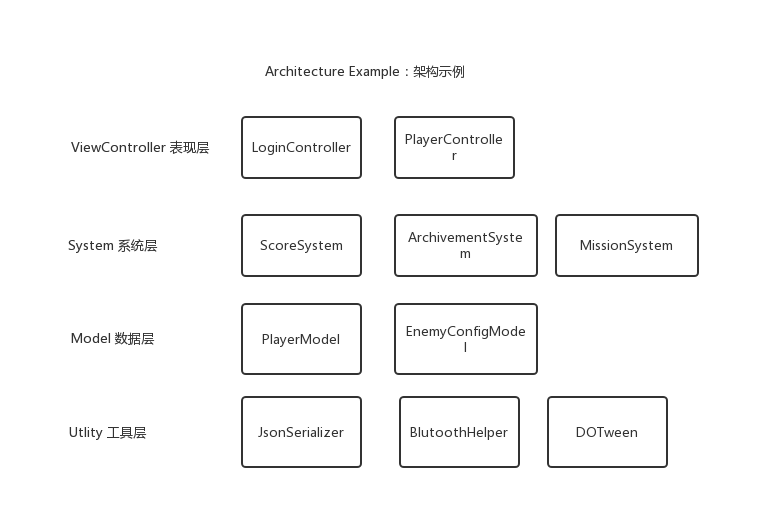

# QFormwork

# 一、框架目的

1. 难维护 

由于拖拽的时候，对象之间的引用关系是随机的没有规律可循的，所以当时间久了或者比 人来接手次项目时要理清其中的逻辑所花费的时间会很多。 

1. 团队难以协作 

很多的拖拽操作和逻辑是在场景中操作的，并且也会记录到场景里，所以在使用 git 或者 svn 或者官方的 plastics 的时候比较难以管理，容易造成冲突。 

1. 可扩展性差

 	这个原因和第一条一样，拖拽的时候，对象之间的引用关系是随机的没有规律可循的，这 样会造成大量的耦合（牵一发动全身），后边当扩展功能的时候，花的时间越来越久。 而接下来的架构演化的方向就是针对以上的这些缺点针对性地进行解决。  


而解决这三个的问题的途径-------低耦合、高内聚。

什么是耦合、内聚？

耦合就是对象、类的双向引用、循环引用；内聚就是同样类型的代码放 在一起。  


 对象之间的交互一般有三种

• 方法调用，例如：A 调用 B 的 SayHello 方法

• 委托或者回调，例如：界面监听子按钮的点击事件 

• 消息或事件，例如：服务器像客户端发送通知 


模块化也一般有三种 

• 单例，例如：Manager Of Managers

• IOC，例如：Extenject、uFrame 的 Container、StrangeIOC 的绑定等等 

• 分层，例如：MVC、三层架构、领域驱动分层等等  

# 二、设计原则

## SOLID **设计模式的六大原则有：**

- Single Responsibility Principle：单一职责原则
- Open Closed Principle：开闭原则
- Liskov Substitution Principle：里氏替换原则
- Law of Demeter：迪米特法则
- Interface Segregation Principle：接口隔离原则
- Dependence Inversion Principle：依赖倒置原则

把这六个原则的首字母联合起来（两个 L 算做一个）就是 SOLID （solid，稳定的），其代表的含义就是这六个原则结合使用的好处：建立稳定、灵活、健壮的设计。下面我们来分别看一下这六大设计原则。

## 1. 单一职责原则（Single Responsibility Principle）

一个类应该只有一个发生变化的原因

## 2. 开闭原则（Open Closed Principle）

一个软件实体，如类、模块和函数应该对扩展开放，对修改关闭

## 3. 里氏替换原则（Liskov Substitution Principle）

所有引用基类的地方必须能透明地使用其子类的对象

## 4. 迪米特法则（Law of Demeter）

只与你的直接朋友交谈，不跟“陌生人”说话

其含义是：如果两个软件实体无须直接通信，那么就不应当发生直接的相互调用，可以通过第三方转发该调用。其目的是降低类之间的耦合度，提高模块的相对独立性。

## 5. 接口隔离原则（Interface Segregation Principle）

1、客户端不应该依赖它不需要的接口。
2、类间的依赖关系应该建立在最小的接口上。

注：该原则中的接口，是一个泛泛而言的接口，不仅仅指Java中的接口，还包括其中的抽象类。

## 6. 依赖倒置原则（Dependence Inversion Principle）

1、上层模块不应该依赖底层模块，它们都应该依赖于抽象。
2、抽象不应该依赖于细节，细节应该依赖于抽象。

# 三、总体架构

## 架构分层



## QFramework系统设计架构分为四层及其规则：

-  表现层：ViewController层。IController接口，负责接收输入和状态变化时的表现，一般情况下，MonoBehaviour 均为表现层 

- - 可以获取System
  - 可以获取Model
  - 可以发送Command
  - 可以监听Event

-  系统层：System层。ISystem接口，帮助IController承担一部分逻辑，在多个表现层共享的逻辑，比如计时系统、商城系统、成就系统等 

- - 可以获取System
  - 可以获取Model
  - 可以监听Event
  - 可以发送Event

-  数据层：Model层。IModel接口，负责数据的定义、数据的增删查改方法的提供 

- - 可以获取Utility
  - 可以发送Event

-  工具层：Utility层。IUtility接口，负责提供基础设施，比如存储方法、序列化方法、网络连接方法、蓝牙方法、SDK、框架继承等。啥都干不了，可以集成第三方库，或者封装API 
-  除了四个层级，还有一个核心概念——Command 

- - 可以获取System
  - 可以获取Model
  - 可以发送Event
  - 可以发送Command

-  层级规则： 

- - IController 更改 ISystem、IModel 的状态必须用Command
  - ISystem、IModel状态发生变更后通知IController必须用事件或BindableProperty
  - IController可以获取ISystem、IModel对象来进行数据查询
  - ICommand不能有状态
  - 上层可以直接获取下层，下层不能获取上层对象
  - 下层向上层通信用事件
  - 上层向下层通信用方法调用（只是做查询，状态变更用Command），IController的交互逻辑为特别情况，只能用Command

# 四、示例

## 示例效果

[代码地址](https://github.com/liangxiegame/QFramework.Example)


## 模块注册

```c#
using QFramework;

namespace CounterApp
{
    public class CounterApp : Architecture<CounterApp>
    {
        protected override void Init()
        {
            RegisterSystem<IAchievementSystem>(new AchievementSystem());
            RegisterModel<ICounterModel>(new CounterModel());
            RegisterUtility<IStorage>(new PlayerPrefsStorage());
        }
    }
}
```

## ViewController

```c#
using System;
using QFramework;
using UnityEngine;
using UnityEngine.UI;

namespace CounterApp
{
    public class CounterViewController : MonoBehaviour,IController
    {
        private ICounterModel mCounterModel;

        private void Start()
        {
            mCounterModel = this.GetModel<ICounterModel>();

            // 监听
            mCounterModel.Count.RegisterWithInitValue(newCount =>
            {
                transform.Find("CountText").GetComponent<Text>().text = newCount.ToString();
            }).UnRegisterWhenGameObjectDestroyed(gameObject);
            

            transform.Find("BtnAdd").GetComponent<Button>().onClick.AddListener(() =>
            {
                // 交互逻辑
                this.SendCommand<AddCountCommand>();
            });

            transform.Find("BtnSub").GetComponent<Button>().onClick.AddListener(() =>
            {
                // 交互逻辑
                this.SendCommand<SubCountCommand>();
            });
        
        }
        
        private void OnDestroy()
        {

            mCounterModel = null;
        }

        IArchitecture IBelongToArchitecture.GetArchitecture()
        {
            return CounterApp.Interface;
        }
    }


    public interface ICounterModel : IModel
    {
        BindableProperty<int> Count { get; }
    }

    public class CounterModel : AbstractModel, ICounterModel
    {
        protected override void OnInit()
        {
            var storage = this.GetUtility<IStorage>();

            Count.Value = storage.LoadInt("COUNTER_COUNT", 0);

            Count.Register(count => { storage.SaveInt("COUNTER_COUNT", count); });
        }

        public BindableProperty<int> Count { get; } = new BindableProperty<int>()
        {
            Value = 0
        };
    }
}
```

## System

```c#
using QFramework;
using UnityEngine;

namespace CounterApp
{
    public interface IAchievementSystem : ISystem
    {
        
    }

    public class AchievementSystem : AbstractSystem, IAchievementSystem
    {
        protected override void OnInit()
        {
            var counterModel = this.GetModel<ICounterModel>();

            var previousCount = counterModel.Count.Value;

            counterModel.Count.Register(newCount =>
            {

                if (previousCount < 10 && newCount >= 10)
                {
                    Debug.Log("解锁点击 10 次成就");
                }
                else if (previousCount < 20 && newCount >= 20)
                {
                    Debug.Log("解锁点击 20 次成就");
                }

                previousCount = newCount;
            });
        }
    }
}
```

## Utility

```c#
#if UNITY_EDITOR
using UnityEditor;
#endif
using QFramework;
using UnityEngine;

namespace CounterApp
{
    public interface IStorage : IUtility
    {
        void SaveInt(string key, int value);
        int LoadInt(string key, int defaultValue = 0);
    }

    public class PlayerPrefsStorage : IStorage
    {
        public void SaveInt(string key, int value)
        {
            PlayerPrefs.SetInt(key, value);
        }

        public int LoadInt(string key, int defaultValue = 0)
        {
            return PlayerPrefs.GetInt(key, defaultValue);
        }
    }

    public class EditorPrefsStorage : IStorage
    {
        public void SaveInt(string key, int value)
        {
#if UNITY_EDITOR
            EditorPrefs.SetInt(key, value);
#endif
        }

        public int LoadInt(string key, int defaultValue = 0)
        {
#if UNITY_EDITOR
            return EditorPrefs.GetInt(key, defaultValue);
#else
            return 0;
#endif
        }
    }
}
```

## Command

```csharp
namespace CounterApp {
    public class AddCountCommand : AbstractCommand {
        protected override void OnExecute() {
            this.GetModel<ICounterModel>().Count.Value++;
        }
    }

    public class SubCountCommand : AbstractCommand {
        protected override void OnExecute() {
            this.GetModel<ICounterModel>().Count.Value--;
        }
    }
}
```

# 五、实现细节

1. BindableProperty   响应式数据  

```csharp
public static class CounterModel
 {
     private static int mCount = 0;
     public static Action<int> OnCountChanged ;
 
     public static int Count
     {
         get => mCount;
         set
         {
             if (value != mCount)
             {
                 mCount = value;
                 OnCountChanged?.Invoke(value);
             }
         }
     }
 }
```

2. 交互逻辑：View -> Model ； 表现逻辑: Model -> View  


3. IOC 容器  

```csharp
using System;
using System.Collections.Generic;

namespace FrameworkDesign
{
    public class IOCContainer
    {
        /// <summary>
        /// 实例
        /// </summary>
        public Dictionary<Type, object> mInstances = new Dictionary<Type, object>();

        /// <summary>
        /// 注册
        /// </summary>
        /// <param name="instance"></param>
        /// <typeparam name="T"></typeparam>
        public void Register<T>(T instance)
        {
            var key = typeof(T);

            if (mInstances.ContainsKey(key))
            {
                mInstances[key] = instance;
            }
            else
            {
                mInstances.Add(key,instance);
            }
        }

        /// <summary>
        /// 获取
        /// </summary>
        public T  Get<T>() where T : class
        {
            var key = typeof(T);
            
            object retObj;
            
            if(mInstances.TryGetValue(key,out retObj))
            {
                return retObj as T;
            }

            return null;
        }
    }
}
```

4. 接口的阉割技术  
- 接口的显式与隐式实现 

```csharp
using UnityEngine;

namespace FrameworkDesign.Example
{
    /// <summary>
    /// 1. 定义接口
    /// </summary>
    public interface ICanSayHello
    {
        void SayHello();
        void SayOther();
    }
    
    public class InterfaceDesignExample : MonoBehaviour,ICanSayHello
    {
        /// <summary>
        /// 接口的隐式实现
        /// </summary>
        public void SayHello()
        {
            Debug.Log("Hello");
        }

        /// <summary>
        /// 接口的显式实现
        /// </summary>
        void ICanSayHello.SayOther()
        {
            Debug.Log("Other");
        }
        
        // Start is called before the first frame update
        void Start()
        {
            // 隐式实现的方法可以直接通过对象调用
            this.SayHello();
            
            // 显式实现的接口不能通过对象调用
            // this.SayOther() // 会报编译错误
            
            // 显式实现的接口必须通过接口对象调用
            (this as ICanSayHello).SayOther();
        }
    }
}
```

- 接口-抽象类-实现类

```c#
  using UnityEngine;
  
  namespace FrameworkDesign.Example
  {
      public class InterfaceStructExample : MonoBehaviour
      {
          /// <summary>
          /// 接口
          /// </summary>
          public interface ICustomScript
          {
              void Start();
              void Update();
              void Destroy();
          }
          
          /// <summary>
          /// 抽象类
          /// </summary>
          public abstract class CustomScript : ICustomScript
          {
              protected bool mStarted { get; private set; }
              protected bool mDestroyed { get; private set; }
              
              /// <summary>
              /// 不希望子类访问 Start 方法，因为有可能破坏状态
              /// </summary>
              void ICustomScript.Start()
              {
                  OnStart();
                  mStarted = true;
              }
              
              void ICustomScript.Update()
              {
                 OnUpdate();
              }
  
              void ICustomScript.Destroy()
              {
                  OnDestroy();
                  mDestroyed = true;
              }
              
              /// <summary>
              /// 希望子类实现 OnStart 方法
              /// </summary>
              protected abstract void OnStart();
              protected abstract void OnUpdate();
              protected abstract void OnDestroy();
          }
          
          /// <summary>
          /// 由用户扩展的类
          /// </summary>
          public class MyScript : CustomScript
          {
              protected override void OnStart()
              {
                  Debug.Log("MyScript:OnStart");
              }
  
              protected override void OnUpdate()
              {
                  Debug.Log("MyScript:OnUpdate");
              }
  
              protected override void OnDestroy()
              {
                  Debug.Log("MyScript:OnDestroy");
              }
          }
  
          /// <summary>
          /// 测试脚本
          /// </summary>
          private void Start()
          {
              ICustomScript script = new MyScript();
              script.Start();
              script.Update();
              script.Destroy();
          }
      }
  }
```

- 接口-静态扩展

```c#
  using UnityEngine;
  
  namespace FrameworkDesign.Example
  {
      public class CanDoEveryThing 
      {
          public void DoSomething1()
          {
              Debug.Log("DoSomething1");
          }
  
          public void DoSomething2()
          {
              Debug.Log("DoSomething2");
          }
  
          public void DoSomething3()
          {
              Debug.Log("DoSomething3");
          }
      }
  
      public interface IHasEveryThing
      {
          CanDoEveryThing CanDoEveryThing { get; }
      }
  
      public interface ICanDoSomething1 : IHasEveryThing
      {
          
      }
  
      public static class ICanDoSomeThing1Extensions
      {
          public static void DoSomething1(this ICanDoSomething1 self)
          {
              self.CanDoEveryThing.DoSomething1();
          }
      }
  
      public interface ICanDoSomething2 : IHasEveryThing
      {
          
      }
      
      public static class ICanDoSomeThing2Extensions
      {
          public static void DoSomething2(this ICanDoSomething2 self)
          {
              self.CanDoEveryThing.DoSomething2();
          }
      }
  
      public interface ICanDoSomething3 : IHasEveryThing
      {
  
      }
      
      public static class ICanDoSomeThing3Extensions
      {
          public static void DoSomething3(this ICanDoSomething3 self)
          {
              self.CanDoEveryThing.DoSomething3();
          }
      }
  
      public class InterfaceRuleExample : MonoBehaviour
      {
          public class OnlyCanDo1 : ICanDoSomething1
          {
              CanDoEveryThing IHasEveryThing.CanDoEveryThing { get; } = new CanDoEveryThing();
          }
          
          public class OnlyCanDo23 : ICanDoSomething2,ICanDoSomething3
          {
              CanDoEveryThing IHasEveryThing.CanDoEveryThing { get; } = new CanDoEveryThing();
          }
  
          private void Start()
          {
              var onlyCanDo1 = new OnlyCanDo1();
              // 可以调用 DoSomething1
              onlyCanDo1.DoSomething1();
              // 不能调用 DoSomething2 和 3 会报编译错误
              // onlyCanDo1.DoSomething2();
              // onlyCanDo1.DoSomething3();
  
  
              var onlyCanDo23 = new OnlyCanDo23();
              // 不可以调用 DoSomething1 会报编译错误
              // onlyCanDo23.DoSomething1();
              // 可以调用 DoSomething2 和 3
              onlyCanDo23.DoSomething2();
              onlyCanDo23.DoSomething3();
          }
      }
  }
```

  

