# Game Programmer Study Notes 游戏编程学习笔记 

# Game Programming Patterns 游戏编程模式

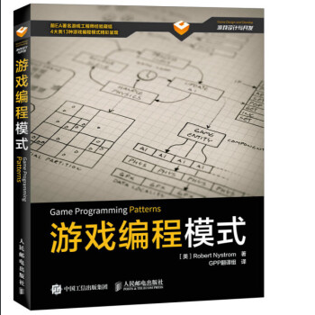

[代码示例](./GameProgrammingPatterns)	

- 重访设计模式
  - [命令模式](./GameProgrammingPatterns/Command.md)：*将“请求〞封装成对象，以便使用不同的清求，队列或者日志来参数化其他对象，同时支持可撤消的操作*
  - [享元模式](./GameProgrammingPatterns/Flyweight.md)：*以共享的方式高效地支持大量的细粒度的对象。通过复用内存中已存在的对象，降低系络创建对象实例的性能消耗*
  - [观察者模式](./GameProgrammingPatterns/Observer.md)：*定义对象间的一种一对多的依赖关系，当一个对象的状态发生改变时，所有依赖于它的对象都得到通知并被白动更新*
  - [原型模式](./GameProgrammingPatterns/Prototype.md)：*用原型实例指定创建对象的种类，并且通过拷贝这些原型创建新的对象*
  - [单例模式](./GameProgrammingPatterns/Singleton.md)：*保证一个类只有一个实例，并且提供了访问该实例的全局访问点*
  - [状态模式](./GameProgrammingPatterns/State.md)：*允许对象在当内部状态改交时改交其行为，就好像此对象改变了自己的类一样*
- 序列模式
  - [双缓冲模式](./GameProgrammingPatterns/DoubleBuffer.md)：*使用序列操作来模拟瞬间或者同时发生的事情*
  - [游戏循环](./GameProgrammingPatterns/Assets/SequencingPatterns/GameLoop)：*实现游戏运行过程中对用户输入处理和时间处理的解耦*
  - [更新方法](./GameProgrammingPatterns/UpdateMethod.md)：*通过每次处理一帧的行为来模拟一系列独立对象*
- 行为模式
  - [字节码](./GameProgrammingPatterns/Bytecode.md)：*将行为编码为虚拟机器上的指令，来赋予其数据的灵活性。从而让数据易于修改，易手加载，并与其他可执行部分相隔离*
  - [子类沙箱](./GameProgrammingPatterns/SubclassSandbox.md)：*用一系列由基类提供的操作定义子类中的行为*
  - [类型对象](./GameProgrammingPatterns/TypeObject.md)：*创造一个类A来允许灵活的创造新的类，而类A的每个实例都代表了不同类型的对象*
- 解耦模式
  - [组件模式](./GameProgrammingPatterns/Component.md)：*允许单一的实体跨越多个领域，无需这些领域彼此耦合*
  - [事件队列](./GameProgrammingPatterns/EventQueue.md)：*事件队列模式，对消息或事件的发送与处理进行时间上的解耦*
  - [服务定位器](./GameProgrammingPatterns/ServiceLocator.md)：*提供服务的全局接入点，而不心让用户和实现它的具体类解耦*
- 优化模式
  - [数据局部性](./GameProgrammingPatterns/DataLocality.md)：*合理组织数据，充分使用CPU的级存来加速内行读取*
  - [脏标识模式](./GameProgrammingPatterns/DirtyFlag.md)：*将工作延期至需要其结果时才去执行，以避免不心要的工作*
  - [对象池模式](./GameProgrammingPatterns/ObjectPool.md)：*放弃单独地分配和释放对象，从固定的池中重用对象，以提高性能和内存使用率*
  - [空间分区](./GameProgrammingPatterns/SpatialPartition.md)：*将对条存储在基于位置组织的数据结构中，来有效的定位对象*

**重访设计模式的六种设计方法为经典23种设计模式的之六，这六种设计模式也是游戏中常用的设计模式；序列模式、行为模式和优化模式适用与游戏引擎设计；解耦模式适用于游戏UI部分的设计-------自定义组件和消息机制的设计；是一本不错的学习游戏设计模式的书籍**

# QFramework Unity框架

[详细文档](./QFramework/README.md)

- 架构目的：使用框架的目的与意义
- 设计原则：SOLID设计模式的六大原则
- 总体架构：框架的分层以及层级之间的规则
- 代码示例：如何使用此框架
- 实现细节：框架实现过程中的技术要点

**此框架相较于流行的框架[ET](https://github.com/egametang/ET)、[JEngine](https://github.com/JasonXuDeveloper/JEngine)等框架，QFormwork更专注于逻辑层的架构，在工具层实现组件化做到即用即安装，更佳纯粹；此教程在Unity学堂可以学习，重点不应该放在框架的使用，而是放在框架的搭建过程**

# Unity 3D高级编程

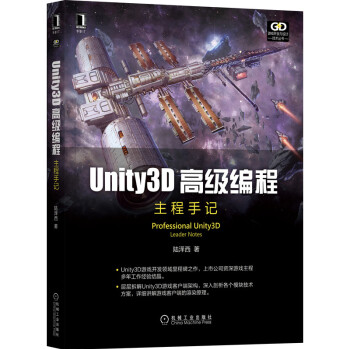

* [第一章 架构](./ProfessionalUnity3D/第一章架构.md)：架构的意义、架构的原理以及如何实现架构
* [第二章 C#技术要点](./ProfessionalUnity3D/第二章技术要点.md)：C# 技术的基础知识
* [第三章 数据表与程序](./ProfessionalUnity3D/第三章数据表.md)：针对客户端中的表格数据、程序的协作与应用
* [第四章 用户界面](./ProfessionalUnity3D/第四章用户界面.md)：用户界面（UI）的工作原理与优化手段
* [第五章 3D模型与动画](./ProfessionalUnity3D/第五章3D模型与动画.md)：3D 模型的原理、动画的原理以及两者的优化
* [第六章 网络通信](./ProfessionalUnity3D/第六章网络层.md)：网络层的业务与底层原理
* [第七章 游戏中的AI](./ProfessionalUnity3D/第七章游戏中的AI.md) : 各种 AI 类型
* [第八章 地图与寻路](./ProfessionalUnity3D/第八章地图与寻路.md) ：场景构建与优化、地图构建以及寻路算法优化
* [第九章 渲染管线与图形学](./ProfessionalUnity3D/第九章渲染管线与图形学.md) ：图形数学、图形学常用算法、渲染管线的相关知识
* [第十章 渲染原理与知识](./ProfessionalUnity3D/第十章渲染原理与知识.md) ：客户端各类渲染技术的渲染原理

**整本书讲解的为Unity的底层原理，核心思想是优化游戏性能，主要的围绕提高游戏运行速度与降低内存消耗展开，优化的本质其实就是减少GC和降低drewcall，进而分别从C#技术要点、UI、模型等模块进行讲解，适合有一定Unity开发经验的学习者**

# Clean Code 

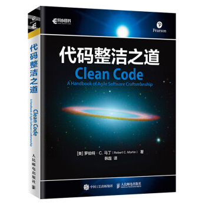

[详细文档](./CleanCode/CleanCode.md)

* 目的
* 命名法则
* 函数
* 注释
* 格式准则
* 对象和数据结构
* 错误处理
* 边界
* 单元测试
* 类

**本书主要讲解功能实现的时候代码的规范，如果你阅读的时候发现你都做到了，那你写的代码一定十分简洁，当然大多数的人应该或多或少都会有些点没有做到，那这就是你代码的提高点，此书可以多次阅读，每次尽可能都有一点改善就好，如果对书中的优化点你存在异议，请相信“Bob大叔”**

*不要在疲劳的时候写代码。敬业和专业精神，更多地体现在你的纪律性，而不是体现在投入的时间。*

# 游戏感

[详细文档](./GameFell/GameFell.md)

* 游戏感的三大基础构件
  * 实时控制
  * 模拟空间
  * 润色 (Polish)
* 游戏感的体验
  * 操作的美感
  * 学习、练习和掌握一项技能的榆
  * 悦感
  * 感觉的延伸
  * 个体的延伸
  * 与游戏里一个独特的物理实体的
  * 交互感
* 创造游戏感
* 游戏感测量维度
  * 输入
  * 响应
  * 情景
  * 润色
  * 隐喻
  * 规则

**本书主要讲解游戏感的定义、游戏感的三大基础构件以及度量游戏感的六个维度，使得我们可以从数据上对游戏好坏进行评判，评判游戏变得可以量化**

# Java 游戏服务器架构实战

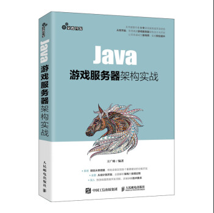

[详细文档](./JavaGameServerArchitectureOfActualCombat/README.md)

* 模块零概论
  * 第1章 游戏服务器架构总体设计
  * 第2章 服务器项目管理一Maven
  * 第3章 数据库选择与安装
* 模块二 游戏服务中心架构设计
  * 第4章 游戏服务中心开发
  * 第5章 Web服务器网关开发
* 模块三 游戏网关架构设计
  * 第6章 游戏服务器网关开发
  * 第7章 游戏服务器网关与游戏业务服务数据通信
* 模块四 业务服务架构设计
  * 第8章 游戏业务处理框架开发
  * 第9章 游戏用户数据管理
* 模块五 RPC通信架构设计
  * 第10章 RPC 通信设计与实现
  * 第11章 事件系统的设计与实现
  * 第12章 游戏服务器自动化测试
* 模块六 实例
  * 第13章 服务器开发实例一一世界聊天系统

**本书主要从游戏服务中心、游戏网关、RPC通信和业务服务四个模块，展开介绍游戏的短链接和长链接的网关设计、以及微服务通信以及业务服务设计实现，其中主要是用的框架为Spring Cloud**

# Unity 人工智能实战

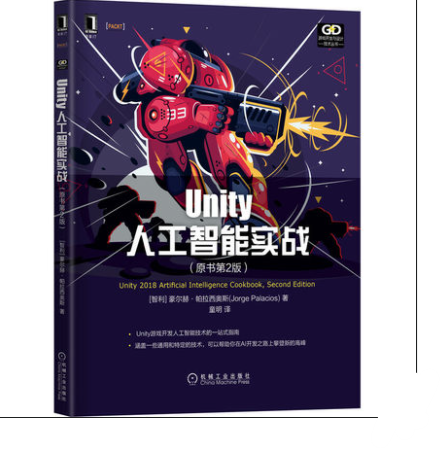

[详细文档](./UnityAI/README.md)

* 第1章 行为一一智能移动
* 第2章 导航
* 第3章 决策制定
* 第4章 新的NavMesh API
* 第5章 协作和战术
* 第6章 agent感知
* 第7章 棋类游戏和应用的搜索AI
* 第8章 机器学习
* 第9章 程序化内容生成
* 第10章 其他

**本书主要讲解如何实现各类游戏AI，在实现Agent寻路时重点讲解了NavMesh使用，并在最后两章讲解了主流的几个智能体的实现**

# Unity引擎HDRP高清渲染管线实战

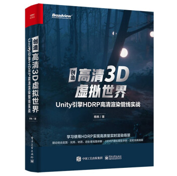

[详细文档](./UnityHDRP/README.md) 

* 第1章　HDRP入门.
* 第2章　实现市政厅办公室场景
* 第3章　HDRP配置文件和Volume框架详解
* 第4章　HDRP光照系统详解
* 第5章　Lightmapping（光照烘焙）详解
* 第6章　HDRP材质详解
* 第7章　Post.Processing后处理详解
* 第8章　HDRP.Debug窗口介绍
* 第9章　HDRP在VR中的应用
* 第10章　HDRP.Custom.Pass应用
* 第11章　HDRP实时光线追踪项目应用

**本书主要讲解Unity的HDRP渲染管线的使用，推荐地编阅读一下，有助于理解Unity的灯光系统与渲染。**

# Unity网络游戏实战

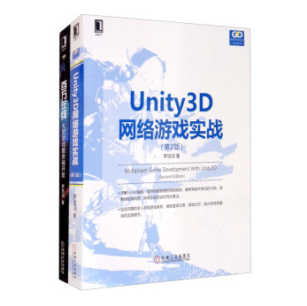

[详细文档](./UnityNetworkGame/README.md)

* 第一章 网络游戏的开端
* 第二章 分身有术：异步和安路复用
* 第三章 文践出真知：大乱斗游戏
* 第四章 正砷收发数据流
* 第五章 深入了解TCP，解决暗藏问题
* 第六章 通用客户端网络模块
* 第七章 通用服务端框架
* 第八章 完整大项目《坦克克大战》
* 第九章 UI界面模块
* 第十章 游戏大厅和房间
* 第十一章 战斗和胜负判定
* 第十二章 同步战斗信息

**第一部分“扎基础”主要介绍TCP网络游戏开发的必备知识，包括TCP异步连接、多路复用的处理，以及怎样处理粘包分包、怎样发送完整的网络数据、怎样设置正确的网络参数。第3章介绍了一款简单 网络游戏开发的全过程，在后续章节中会逐步完善这个游戏。** 

**第二部分“搭框架”主要介绍商业级客户端网络框架的实现方 法。这套框架具有较高的通用性，解决了网络游戏开发中常遇到的问 题，且达到极致的性能要求，可以运用在多款游戏上。书中还介绍了 一套单进程服务端框架的实现，服务端框架使用select多路复用，做到底层与逻辑分离，设有消息分发、事件处理等模块。 第**

**三部分“做游戏”通过一个完整的实例讲解网络游戏的设计思路，包括游戏实体的类设计、怎样组织代码、怎样实现游戏大厅（房间系统）、怎样实现角色的同步。这一部分会使用第二部分搭好的框架，一步步地做出完整的游戏项目。**

# Unity Shader入门精要

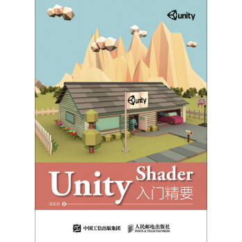

[详细文档](./UnityShader/README.md)

1. 第1篇　基础篇
   * 第1章　欢迎来到Shader的世界
   * 第2章　渲染流水线
   * 第3章　Unity Shader基础
   * 第4章　学习Shader所需的数学基础

2. 第2篇　初级篇
   * 第5章　开始Unity Shader学习之旅
   * 第6章　Unity中的基础光照
   * 第7章　基础纹理
   * 第8章　透明效果

3. 第3篇　中级篇
   * 第9章　更复杂的光照
   * 第10章　高级纹理
   * 第11章　让画面动起来
4. 第4篇　高级篇
   * 第12章　屏幕后处理效果　
   * 第13章　使用深度和法线纹理
   * 第14章　非真实感渲染
   * 第15章　使用噪声
   * 第16章　Unity中的渲染优化技术
5. 第5篇　扩展篇
   * 第17章　Unity的表面着色器探
   * 第18章　基于物理的渲染
   * 第19章　Unity 5更新了什么
   * 第20章　还有更多内容吗　

**本书主要介绍Unity Shader原理、如何编写出自己想要的shader；虽然Unity2020开始主推SRP，shader可以使用Shader Graph进行快速的制作，但是其基本原理还是大同小异，Shader Graph只是降低制作shader的门槛，使开发不再纠结于ShaderLab这门语言，但是这本书很大一部分在讲解Unity的渲染原理，这部分是Unity开发非常值得学习的**

# Unity VR虚拟现实完全自学教程

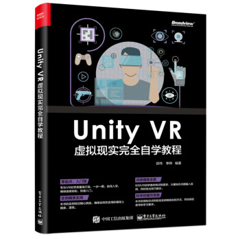

[详细文档](./UnityVR/README.md)

* 第1章：对VR行业进行了概述，介绍了该技术在其他行业中的应用案例，以及目前VR行业面临的挑战
* 第2章：对 Unity 编辑器进行了介绍。
* 第3章：对主流硬件设备及分类进行了介绍，使读者对当前主流 VR 硬件平台有了初步认知。
* 第4章：介绍了 VR 应用程序制作的基本工作流程和一些常用的开发工具。
* 第5章：介绍了在 VR 应用程序中需要遵循的交互设计原则。
* 第6章：介绍了 HTC VIVE 硬件的基本结构、安装步骤、实现位置追踪的原理，并对作为主要交互设备的控制器的按键进行了说明。
* 第7章：介绍了 VR中的U技术，讲解了在 Unity 中如何将UI 元素设置为能够在 VR环境中呈现的方法。
* 第8章：笔者从接触的学员作品来看，大部分 VR 应用程序只聚焦于交互的实现，忽视了作品的呈现品质，而这恰是 VR 应用程序给用户的第一印象。本章介绍了基于物理的渲染理论 (PBR),以及常用的 PBR 材质制作软件，通过实例介绍了 Substance Painter 的使用方法，目的是为了强调写实材质在 VR 应用程序中的关键地位。
* 第9章：SteamVR 是进行 PC 平台 VR 应用程序开发的重要工具，本章通过实例介绍了 SteamVR以及基于其上的 InteractionSystem 的核心模块和基本使用方法。
* 第10章：VRTK 是基于 SteamVR 进行 VR 应用程序开发的重要插件，本章详细介绍了 VRTK的使用方法，通过一系列实例，讲解了该插件在 VR 交互开发工作中的高效性。
* 第 11 章：VR 平合与PC、移动平台最大的区别在于交互方式的不同，本章通过演示将 PC平台上的一款游戏移植到 VR 平台的过程，展示交互开发在 VR 平台上的重要性。
* 第12章：介绍了手势识别设备---Lcap Motion 在 VR中的应用，通过一个器械装配实例，讲解了如何在 VR 中通过手势实现与物体的交互。
* 第13章：介绍了 VIVE 追踪器（Tracker）的基本使用方法，通过实例讲解了如何实现在 VR环境中将追踪器与现实世界物体进行鄉定并跟踪其位置。
* 第 14 章：演示了类似 VR 游戏《水果忍者 VR》的原型项目开发，包括游戏逻辑、水果生成、切割效果、计分 U 呈现等功能模块。
* 第15 章：演示了类似VR 应用程序 Tilt Brush 的原型项目开发，包括在 VR 环境中使用控制器绘制线条、 修改画笔颜色等功能模块。
* 第16 章：介绍了 Unity 编辑器内置的性能优化工具，同时针对 Unity 讲解了几种应用程序的优化原则。

**本书主要讲解VR的发展史、现状以及如何搭建VR项目，测试过将现有项目转Oculus、Pico 3以及Huawei VR，其本质就是替换Camera和输入设备仅此而已。**

# Unity 游戏程序优化设计实战

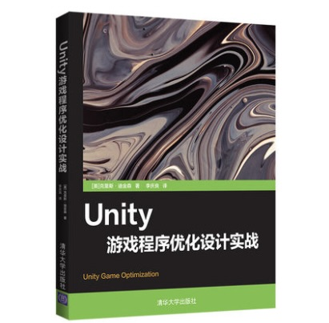

[详细文档](./UnityGameOptimization/README.md)

* 第1章 检测性能问题
* 第2章 脚本编写策略
* 第3章 批处理的好处
* 第4章 快速启动艺术资产
  * 音频
  * 纹理文件
  * 网格和动画文件
* 第5章 更快的物理引擎
* 第6章 动态图形
  * 前端瓶颈 CPU
  * 后端瓶颈GPU
  * 照明和阴影

* 第7章 精通内存管理

**本书侧重于讲解优化的方法，主要分了对内存、GPU、CPU等几个方面，但是由于这是第一版，书中是基于Unity5进行讲解的，并不适用于Unity 2022，不过其基本的理念是相通的，但是对很多基础的知识讲解，并没有《Unity3D高级编程》一书中详细，不过作者作为一个非科班出身的人，对游戏引擎研究到如此程度，已经着实不易。**

# 重构 改善既有代码的设计

[详细文档](./Refactoring/README.md)

第1章　重构，第一个示例 
第2章　重构的原则 
第3章　代码的坏味道
第4章　构筑测试体系
第5章　介绍重构名录 
第6章　第一组重构
第7章　封装
第8章　搬移特性
第9章　重新组织数据 
第10章　简化条件逻辑 
第11章　重构API 
第12章　处理继承关系 

# 百万在线---大型游戏服务端开发

[详细文档](./BigGameServerDevelopment/README.md)

* 第一部分　学以致用
  * 第1章　从角色走路说起
  * 第2章　Skynet入门精要
  
  * 第3章　案例：《球球大作战》
  
  * 第4章　Skynet进阶技法
  
* 第二部分　入木三分
  * 第5章　你好，C++并发世界

  * 第6章　图解TCP网络模块

  * 第7章　嵌入Lua脚本语言

* 第三部分　各个击破
  * 第8章　同步算法

  * 第9章　热更新

  * 第10章　防外挂

  * 第11章　未尽之路
    * 11.1　高并发

    * 11.2　服务端架构

    * 11.3　工程管理

**本书主要讲解游戏服务器如何构建，可以结合作者的《Unity3D网络实战(第二版)》一起来看，此书的受众应该为游戏服务开发人员或者是高级游戏开发者；本书的讲解了Skynet的使用、仿写Skynet以及游戏服务器常见的问题，例如同步算法和热更新；Skynet虽然是一套老的服务器框架，但是能沿用至今也是有其优点的；例如：高性能、易用、可扩展。**

**本书推荐阅读，此书作者用心程度和《Unity 3D高级编程》一致，引用一下作者的结束语 “愿我们的游戏能像一束光，突破黑暗，穿越时间，触动玩家的灵魂”。**

# 游戏服务器架构与优化

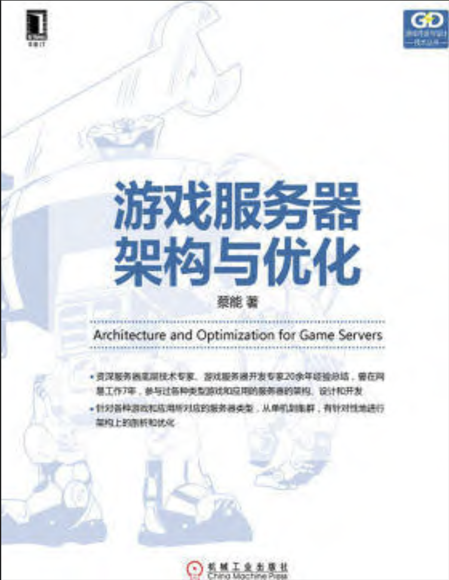

[详细文档](./TheGameServerArchitectureAndOptimization/README.md)

* 第一部分　网络和服务器
  * 第1章　Python网络编程模块 
  * 第2章　通信加密
  * 第3章　服务器实作
* 第二部分　存储与数据库
  * 第4章　基础内容存储 
  * 第5章　存储方案
* 第三部分　服务器架构及其方案
  * 第6章　游戏服务器初探
  * 第7章　游戏服务器的交互
  * 第8章　游戏大厅
  * 第9章　实时交互服务器
  * 第10章　天梯和经济系统
  * 第11章　服务器承载量和客户端优化方案
  * 第12章　分布式服务器

# 微服务架构设计模式

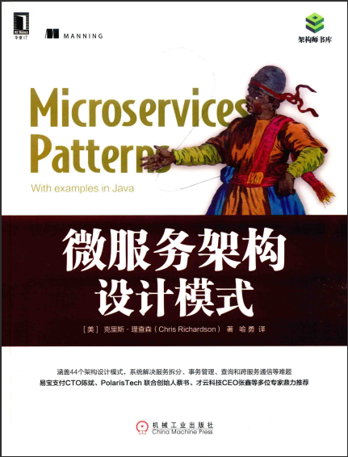

[详细文档](./MicroservicesPatterns/README.md)

1. 逃离单体地狱
2. 服务的拆分策略
3. 微服务架构中的进程间通信
4. 使用Saga管理事务
5. 微服务架构中的业务逻辑设计
6. 使用时间溯源开发业务逻辑
7. 在微服务架构中实现查询
8. 外部API模式
9. 微服务架构中的测试策略（上）
10. 微服务架构中的测试策略（下）
11. 开发面向生产环境的微服务应用
12. 部署微服务应用
13. 微服务架构的重构策略

**是一本对微服务架构有深度的书籍，从微服务架构的提出，到落地的每一步都有详细的阐述，对想将现有架构替换成微服务架构的后端开发，有着不错的参考作用。**

# 腾讯游戏开发精粹Ⅰ

[详细文档](./TencentGameDevelopment1/README.md)

* 第一部分 游戏数学
  * 第1 章 基于SDF的摇杆移动 
  * 第2 章 高性能的定点数实现方案 
* 第二部分 游戏物理
  * 第3 章 一种高效的弧长参数化路径系统
  * 第4 章 船的物理模拟及同步设计 
  * 第5 章 3D 游戏碰撞之体素内存、效率优化
* 第三部分 计算机图形
  * 第6 章 移动端体育类写实模型优化 
  * 第7 章 大规模3D 模型数据的优化压缩与精细渐进加载 
* 第四部分 人工智能及后台架构
  * 第8 章 游戏AI 开发框架组件behaviac 和元编程 
  * 第9 章 跳点搜索算法的效率、内存、路径优化方法 
  * 第10 章 优化MMORPG开发效率及性能的有限多线程模型 
* 第五部分 游戏脚本系统
  * 第11 章 Lua翻译工具——C#转Lua 
  * 第12 章 Unreal Engine 4集成Lua 
* 第六部分 开发工具
  * 第13 章 使用FASTBuild助力Unreal Engine 4 
  * 第14 章 一种高效的帧同步全过程日志输出方案 
  * 第15 章 基于解析符号表，使用注入的方式进行Profiler采样的技术

# 腾讯游戏开发精粹 Ⅱ

[详细文档](./TencentGameDevelopment2/README.md)

* 部分Ⅰ 人工智能
  * 第1章 基于照片的角色捏脸和个性化技术 
  * 第2章 强化学习在游戏AI中的应用
  * 第3章 多种机器学习方法在赛车AI中的综合应用
  * 第4章 数字人级别的语音驱动面部动画生成
* 部分Ⅱ 计算机图形
  * 第5章 实时面光源渲染
  * 第6章 可定制的快速自动化全局光照和可见性烘焙器
  * 第7章 物质点法在动画特效中的应用
  * 第8章 高自由度捏脸的表情动画复用方案
* 部分Ⅲ 动画和物理
  * 第9章 多足机甲运动控制解决方案
  * 第10章 物理查询介绍及玩法应用
  * 第11章 基于物理的角色翻越攀爬通用解决方
* 部分Ⅳ 客户端架构和技术
  * 第12章 跨游戏引擎的H5渲染解决方案
  * 第13章 大世界的场景复杂度管理方案
  * 第14章 基于多级细节网格的场景动态加载
* 部分Ⅴ 服务端架构和技术
  * 第15章 面向游戏的高性能服务网格TbusppMesh
  * 第16章 游戏配置系统设计
  * 第17章 游戏敏捷运营体系技术
* 部分Ⅵ 管线和工具
  * 第18章 从照片到模型
  * 第19章 一种可定制的Lua代码编辑检测工具
  * 第20章 安卓平台非托管内存分析方案
  * 第21章 过程化河流生成方法研究与应用

**本书主要讲解游戏领域一些难点问题的解决方案，例如NPC的拟人化、多足机器人动作模拟、H5渲染、大场景加载与渲染、数字人动画等，但是其所提供的方案，大多数未开源，如果中小厂想要实现，无论从算力还是算法都是有难度的；例如之前腾讯开源的跨平台动效解决方案PAG最早用的是 Skia，但后来发现两个问题：首先，Skia 有历史包袱，打包体积大，性能也比较保守；其次，中国开发者看重的一些问题，开发团队往往不能（或不愿）跟进。最终，PAG 团队下定决心，换掉 Skia，开发自己的图形库 TGFX**

# 人月神话

[详细文档](./MythicalManMonth/README.md)

* 第1章 焦油坑
* 第2章 人月神话 
* 第3章 外科手术队伍 
* 第4章 贵族专制、民主政治和系统设计
* 第5章 画蛇添足
  * 结构师的交互准则和机制
  * 自律—— 开发第二个系统所带来的后果
* 第6章 贯彻执行
* 第7章 为什么巴比伦塔会失败
* 第8章 胸有成竹 
* 第9章 削足适履 
* 第10章 提纲挈领
* 第11章 未雨绸缪
* 第12章 干将莫邪
* 第13章 整体部分
* 第14章 祸起萧墙
* 第15章 另外一面 
* 第16章 没有银弹 
  * 银弹的希望 
  * 针对概念上根本问题的颇具前途的方法
* 第17章 再论“没有银弹” 
  * 人狼和其他恐怖传说
  * 存在着银弹—— 就在这里
  * 含糊的表达将会导致误解
  * 子弹的本质—— 形势没有发生改变
* 第18章 《人月神话》的观点：是与非

**一本关于软件项目管理的书籍，书中的第二系统准则和银弹理论有着不错的前瞻性，一本上世纪八九十年代的书，对软件行业的发展做出了，较为准确的判断，十年内没有银弹**。

# 多人在线游戏架构实践

[详细文档](./Multi-playerOnlineGameArchitectureCombat/README.md)

- 第1章 网络编程基础
- 第2章 网络IO多路复用
- 第3章 线程、进程以及Actor模型
- 第4章 账号登录与验证
- 第5章 性能优化与对象池
- 第6章 搭建ECS框架
- 第7章 MySQL数据库
- 第8章 深入学习组件式编程
- 第9章 服务器管理进程与HTTP
- 第10章 分布式登录与Redis内存数据库
- 第11章 分布式跳转方案
- 第12章 断线与动态加载系统

*本书主要讲解从零开始搭建一个基于**Actor**模型的**ECS分布式**服务端框架，可以对照一下**《百万在线---大型游戏服务端开发》**中对**Actor**的理解，书中对关键代码进行了详细的解释，并且是循循渐进的搭建框架，一步步升级框架结构，适合服务端开发人员阅读,*

# 计算机程序设计艺术

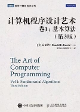

[详细文档](./TheArtofComputerProgramming/README.md)

* 第1章 基本概念
  * 1.1 算法
  * 1.2 数学准备
  * 1.3 MIX
  * 1.4 若干基本程序设计技术
* 第2章 信息结构
  * 2.1 引论
  * 2.2 线性表
  * 2.3 树
  * 2.4 多链结构
  * 2.5 动态存储分配
  * 2.6 历史和参考文献

# 游戏引擎架构

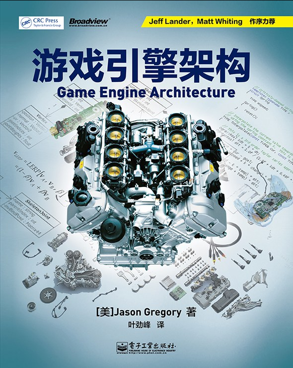

[详细文档](./GameEngineArchitecture/README.md)

- 第一部分 基础
  - 第1章 导论
  - 第2章 专业工具
  - 第3章 游戏软件工程基础
  - 第4章 游戏所需的三维数学

- 第二部分 低阶引擎系统
  - 第5章 游戏支持系统
  - 第6章 资源及文件系统
  - 第7章 游戏循环及实时模拟
  - 第8章 人体学接口设备（HID）
  - 第9章 调试及开发工具

- 第三部分 图形及动画
  - 第10章 渲染引擎
  - 第11章 动画系统
  - 第12章 碰撞及刚体动力学

- 第四部分 游戏性
  - 第13章 游戏性系统简介
  - 第14章 运行时游戏性基础系统

- 第五部分 总结
  - 第15章 还有更多内容吗

本书系统地介绍了游戏引擎的各个方面，具有很高的参考价值。无论是对于游戏开发者，还是对于对游戏引擎技术感兴趣的读者，这本书都是一本极佳的学习资料。虽然技术更新和难度问题需要注意，但这些并不影响其作为游戏开发领域经典著作的地位，游戏在渲染系统、物理系统、动画系统的讲解比较系统，深度适宜。

# 游戏之旅---我的编程感悟

[详细文档](./GameTrip/GameTrip.md)

- 第1章 计算机，游戏，我
- 第2章 算法，程序的灵魂 
- 第3章 编程语言 
- 第4章 前Windows 时代 
- 第5章 Windows 编程 
- 第6章 汇编优化 
- 第7章 SIMD 指令 
- 第8章 引擎中的优化 
- 第9章 C 和 C++ 
- 第10章 调试 
- 第11章 脚本 
- 第12章 版本控制 
- 第13章 开发方法
- 第14章 编程和游戏

*本书是以一位游戏开发者的角度讲述互联网软硬件的发展史，云风最出名的可能是**Skynet**游戏服务器，但是他在游戏引擎方面的研究可能更为有深度，只是处于网易的一些隐私协议问题，没法开源仅此而已。*

# 游戏编程精粹 Ⅰ

[详细文档](./GameProgrammingEssence1/README.md)

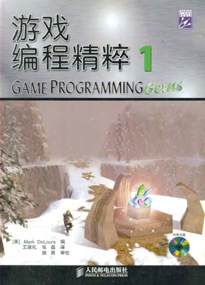

* 第1章  通用编程技术
* 第2章　数学技巧
* 第3章　人工智能
* 第4章　多边形技术
* 第5章　像素特效

# 点石成金

[详细文档](./DontMakeMeThink/README.md)

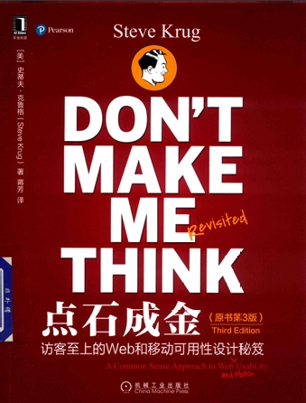

*一本不容错过的 Web 设计指南，无论你是经验丰富的设计师还是初学者，都能从中获得宝贵的知识和灵感。本书的核心思想是“**访客至上**”，即一切设计决策都应该围绕用户的体验展开。作者强调，用户在浏览网站时往往处于忙碌状态，他们不会仔细阅读每个页面，而是会**快速扫描**，寻找能满足他们需求的信息。因此，设计者需要创造不言而喻的界面，让用户能够轻松地找到他们想要的内容，并完成他们的目标。*

* 第1章 别让我思考
* 第2章 我们实际上是如何使用Web的
* 第3章 广告牌设计101法则
* 第4章 动物，植物，无机物
* 第5章 省略多余的文字
* 第6章 街头指示牌和面包屑
* 第7章 Web设计中的大爆炸理论
* 第8章 农场主和牧牛人应该是朋友
* 第9章 一天10美分的可用性测试
* 第10章 移动：不再只是亚拉巴马州的一个城市了
* 第11章 可用性是基本礼貌
* 第12章 可访问性和你
* 第13章 指点迷津

# 设计中的设计

[详细文档](./DesignWithinDesign/README.md)

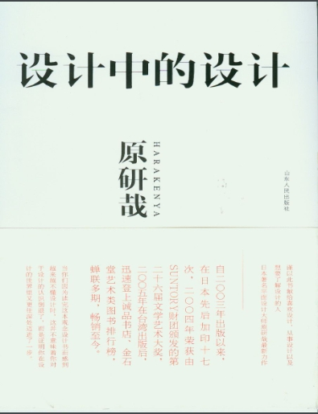

*它不仅仅是一本设计理论著作，更是一本关于生活、关于哲学的书籍。它能够帮助我们重新认识设计，并思考设计在未来的发展方向。*

* 第一章　设计到底是什么？
* 第二章　RE-DESIGN——二十一世纪的日常用品再设计
* 第三章　信息建筑的思维方式
* 第四章　无中生有
* 第五章　对消费欲望的引导
* 第六章　在日本的我
* 第七章　有过这样的世界博览会吗？
* 第八章　设计领域的再配置

# 写给大家看的设计书

[详细文档](./TheNon-Designer'sDesignBook/README.md)

*它是一本面向非专业设计师的入门指南，作者将复杂的平面设计原理简化为四大基本原则：亲密性、对齐、重复和对比。书中通过大量示例和练习，通俗易懂地阐述了这四大原则及其背后的原理，帮助读者理解并应用设计原则，提升设计作品的视觉效果和信息传达效果。*

* 第一部分：设计原则
  * 第一章：引言
  * 第二章：亲密性
  * 第三章：对齐
  * 第四章：重复
  * 第五章：对比
  * 第六章：4 大基本原则复习
  * 第七章：颜色运用
  * 第八章：更多提示与技巧
* 第二部分：字体设计
  * 第九章：字体的基本规则
  * 第十章：字体（与人生）
  * 第十一章：字体类别
  * 第十二章：字体对比
* 第三部分：其他
  * 第十三章：你掌握了吗
  * 第十四章：测验答案和建议
  * 第十五章：本书所用字体

# 破茧成蝶

[详细文档](./Butterfly/README.md)

*书中涵盖了用户体验设计基础知识、设计师的角色和职业困惑、工作流程、需求分析、设计规划和设计标准、项目跟进和成果检验、设计师职业修养以及需要具备的意识等内容。本书适用于产品经理、运营、开发等用户体验相关人员以及相关专业的学生阅读参考。*

* 第1篇 成为用户体验设计师的信念
  * 01 什么是用户体验设计
  * 02 了解用户体验设计师
  * 03 设计师的职业困惑
* 第2篇 修炼用户体验设计师的技能
  * 04 设计流程——设计师具体做什么
  * 05 需求分析——拿回产品的主导权
  * 06 设计规划——从需求到设计草图
  * 07 设计标准——好的设计需要表达
  * 08 项目跟进——保障设计效果的实现
  * 09 成果检验——设计优劣可以判断
* 第3篇 实现用户体验设计师的价值
  * 10 设计师的自我修养
  * 11 设计师易忽略的工作意识
  * 12 设计师为了什么而设计

# 冷启动

[详细文档](./ColdStart/README.md)

*书中探讨了数字经济时代企业如何通过构建网络效应实现从零到亿的用户增长。*

* 第一部分 网络效应
* 第二部分 冷启动问题
* 第三部分 临界点阶段
* 第四部分 加速发展阶段
* 第五部分 触达天花板阶段
* 第六部分 打造护城河阶段

# Unity性能调优宝典

[详细文档](./UnityPerformanceTuningBible/README.md)

*提供系统化、可落地的性能调优方法论，工具和实践案例丰富，可作为移动端项目优化的标准参考手册。需结合官方最新文档补充版本相关更新。*

* 第1章 性能调优入门
* 第2章：基础
* 第3章：性能分析工具
* 第4章：调优实践-资源
* 第5章：调优实践-资源包
* 第6章：调优实践-物理
* 第7章：调优实践-图形
* 第8章：调优实践-用户界面
* 第9章：调优实践-脚本(Unity)
* 第10章：调优实践-脚本(C#)
* 第11章：调优实践-玩家设置
* 第12章：调优实践-第三方

# Agentic Design Patterns

[详细文档](./AgenticDesignPatterns/README.md)

*通过 21 个“智能体设计模式”系统化地介绍如何构建具有自主性与协作能力的智能系统*；作者的理念为“*设计智能体的真正艺术，不在于掌握单一模式，而在于组合它们—— 就像画家在画布上调和色彩，让规划、工具使用、反思与协作交织，构建出有意识、有目标的智能系统。*”

# 腾讯游戏开发精粹 Ⅲ

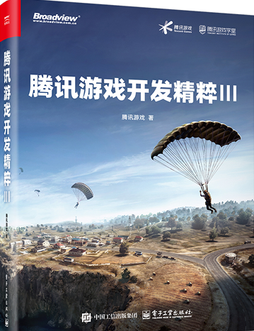

[详细文档](./TencentGameDevelopment3/README.md)

***纯实战、可落地**：每章均来源于上线项目，非纸面算法；**时效性强**：涵盖可微渲染、全动态 GI、RayQuery、神经动画等新世代技术*

# 数据密集型应用系统设计

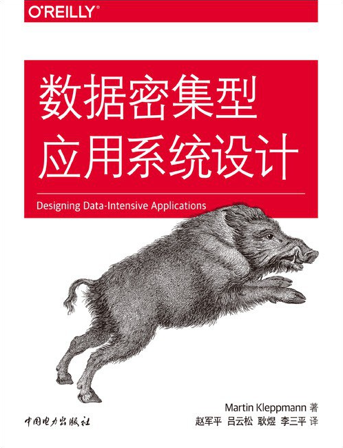

[详细文档](./DesigningDataIntensiveApplications/README.md)

*本书旨在系统性地探讨如何构建**可靠、可伸缩和可维护的数据密集型应用系统**，并将其定位为现代软件工程的核心挑战。作者 Martin Kleppmann 的核心理念是：成功的关键在于深入理解底层技术背后的**基本原则和权衡取舍**，而非盲目追随特定工具或潮流。本书为此提供了一个完整的思想框架和知识体系。*

# 3D游戏与计算机图形学中的数学方法

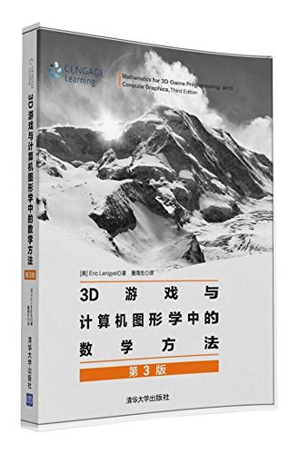

[详细文档](./MathematicsFor3DGameProgrammingAndComputerGraphics/README.md)

*全面覆盖了构建3D游戏引擎与图形系统所需的核心数学知识。其内容从基础数学工具逐步深入到图形渲染、几何处理与物理仿真等高级主题，**理论与实践紧密结合**，是开发人员系统学习或快速查阅的实用参考。*

## Star History

