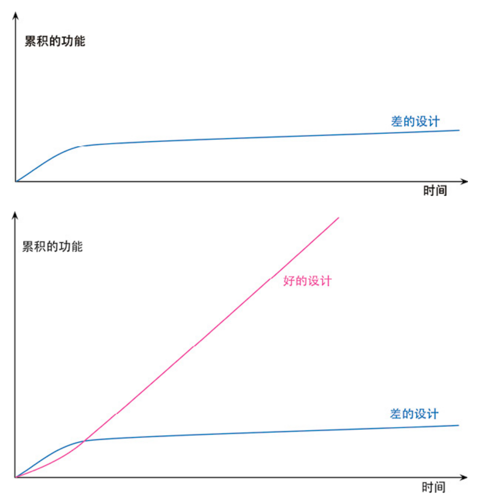

- 简介

  重构（refactoring）是这样一个过程：**在不改变代码外在行为的前提下，对代** 
  **码做出修改，以改进程序的内部结构**。**本质上说，重构就是在代码写好之后改进它的设计。**
  
  **Q:先设计而后编码**
  **A:随着时间流逝，人们不断修改代码，于是根据原先设计所得的系统，整体结构逐渐衰弱。代码质量慢慢沉沦，编码工作从严谨的工程堕落为胡砍乱劈的随性行为**
  

重构的每个步骤都很简单，甚至显得**有些过于简单：只需要把某个字段从一个类移到另一个类，把某些代码从一个函数拉出来构成另一个函数，或是在继承体系中把某些代码推上推下就行了。**

  **构筑-设计 循环往复**

  # 第1 章 重构，第一个示例

  

  ## 1.1 起点

  **戏剧演出团：**
**T : 悲剧（tragedy）和喜剧（comedy）**
  **C: 根据观众数量给出“观众量积分”**

  

  ```json
{
   "hamlet": { "name": "Hamlet", "type": "tragedy" },
 "as-like": { "name": "As You Like It", "type": "comedy" },
   "othello": { "name": "Othello", "type": "tragedy" } 
}
  ```

  

  ```json
[
   	{
 		"customer": "BigCo",
   		"performances": [
   			{
   				"playID": "hamlet",
 				"audience": 55
   			},
 			{
   				"playID": "as-like",
   				"audience": 35
   			},
   			{
     			"playID": "othello",
     			"audience": 40
     		}
 		]
   	} 
]
  ```

  

  ```jsx
  function statement (invoice, plays) {
      let totalAmount = 0;//总数量
      let volumeCredits = 0;
      let result = `Statement for ${invoice.customer}\n`; //获取invoices中的customer参数信息
      for (let perf of invoice.performances) {
          const play = plays[perf.playID];
          let thisAmount = 0;
          switch (play.type) {
              case "tragedy":
                  thisAmount = 40000;
                  if (perf.audience > 30) {
                      thisAmount += 1000 * (perf.audience - 30);
                  }
                  break;
              case "comedy":
                  thisAmount = 30000;
                if (perf.audience > 20) {
                      thisAmount += 10000 + 500 * (perf.audience - 20);
                }
                  thisAmount += 300 * perf.audience;
                  break;
              default:
                  throw new Error(`unknown type: ${play.type}`);
          }
          // add volume credits
          volumeCredits += Math.max(perf.audience - 30, 0);
          // add extra credit for every ten comedy attendees
          if ("comedy" === play.type) volumeCredits += Math.floor(perf.audience / 5);
          // print line for this order
          result += ` ${play.name}: ${format(thisAmount/100)} (${perf.audience} seats\n
  		totalAmount += thisAmount;
  	}
  	result += `Amount owed is ${format(totalAmount/100)}\n`;
  	result += `You earned ${volumeCredits} credits\n`;
  	return result; 
  }
  ```

  

  ```jsx
  Statement for BigCo
   Hamlet: $650.00 (55 seats)
   As You Like It: $580.00 (35 seats)
   Othello: $500.00 (40 seats)
  Amount owed is $1,730.00
  You earned 47 credits
  ```

  

  

  ## 1.2 对此起始程序的评价

  - 代码组织不甚清晰，但这还在可忍受的限度内，这是因为例子程序比较简单，不做深入设计也不会太难理解
  
- 如果这段代码是在一个更大规模的程序中，将所有代码放到一个函数中会使其很难理解
  
- 对于程序的结构“不甚清晰”的评价只是美学上的判断。然而，当需要修改系统时，这个问题就变得十分重要了。差劲的系统很难修改，因为很难找到修改点，也难以了解所做出的修改与现有代码如何协作实现期望的行为。如果很难找到修改点，就有可能引入 bug。
  
  - 在需要修改一个有几百行代码的程序时，应该期望它有良好的结构，并且已经被分解成一系列函数和其他程序要素，这样能够更易于清楚地了解这段代码在做什么。如果程序杂乱无章，先为它整理出结构来，再做需要的修改，通常来说更加简单
  
  
  
  **Tip** 
  如果你要给程序添加一个特性，但发现代码因缺乏良好的结构而不易于进行更改，那就先重构那个程序，使其比较容易添加该特性，然后再添加该特性。
  
  
  

现在用户希望对系统做几个修改：


- **以 HTML 格式输出详单**
  
- **修改计费逻辑**
  
- **表演类型上做更多突破**
  
  
  

1.在每处追加字符串到result变量的地方添加分支逻辑，这会引入更多复杂度，复制粘贴代码虽然不难，但会导致重复逻辑和潜在威胁，特别是在程序需要保存很长时间的情况下
  2.如果一段代码能正常工作且不会被修改，那么就不需要进行重构，但如果有人需要理解它的工作原理并且觉得很费劲，那么就需要改进一下代码

  

  **不论最终提出什么方案，他们一定会在 6 个月之内再次修改它。毕竟，需求通常不来则已，一来便会接踵而至**。
**如果你编写的是一个永不需要修改的程序，这样剪剪贴贴就还好。但如果程序要保存很长时间，那么重复的逻辑就会造成潜在的威胁。** 

------

  

  ## 1.3 重构的第一步

  

  **建立测试** 
在进行重构之前，需要确保即将修改的代码拥有一组可靠的测试。这些测试必不可少，
  **因为**：**即使遵循重构手法也有可能犯错，特别是程序越大，修改不小心破坏其他代码的可能性就越大**。
建立测试的过程需要关注测试程序对于结果的报告方式：


- 测试都应该能够自我检验。
  
  - 建立好测试体系后，测试可以视为 bug 检测器，它们能保护开发人员不被自己犯的错误所困扰，同时也可以节省大量的比对时间，并提高开发速度。

  - 建立测试也有助于降低犯错的概率，因为对工作进行了二次确认。尽管编写测试需要花费时间，但可以为节省调试时间，构筑测试体系对重构来说实在太重要了。

  
  

**Tip** 
  重构前，先检查自己是否有一套可靠的测试集。这些测试必须有自我检验能力。

  

  ## 1.4 分解 statement 函数

  

  ```jsx
function statement (invoice, plays) {
      let totalAmount = 0;//总数量
      let volumeCredits = 0;
      let result = `Statement for ${invoice.customer}\n`; //获取invoices中的customer参数信息
      const format = new Intl.NumberFormat("en-US",
                                         { style: "currency", currency: "USD",
                                            minimumFractionDigits: 2 }).format;
    for (let perf of invoice.performances) {
          const play = plays[perf.playID];
        let thisAmount = 0;
  
        //switch ---------------
          switch (play.type) {
            case "tragedy":
                  thisAmount = 40000;
                if (perf.audience > 30) {
                      thisAmount += 1000 * (perf.audience - 30);
                  }
                break;
              case "comedy":
                thisAmount = 30000;
                  if (perf.audience > 20) {
                    thisAmount += 10000 + 500 * (perf.audience - 20);
                  }
                thisAmount += 300 * perf.audience;
                  break;
            default:
                  throw new Error(`unknown type: ${play.type}`);
        }
          //switch ---------------
  
  
          // add volume credits
          volumeCredits += Math.max(perf.audience - 30, 0);
          // add extra credit for every ten comedy attendees
          if ("comedy" === play.type) volumeCredits += Math.floor(perf.audience / 5);
          // print line for this order
          result += ` ${play.name}: ${format(thisAmount/100)} (${perf.audience} seats
  		totalAmount += thisAmount;
  	}
  	result += `Amount owed is ${format(totalAmount/100)}\n`;
  	result += `You earned ${volumeCredits} credits\n`;
  	return result; 
  }
  ```

  

  #### 函数拆分

  

  - **中间那段 switch 语句。**
  
  - **它在计算一场戏剧演出的费用。这只是我脑海中转瞬即逝的灵光。我需要梳理这些灵感，将它们从脑海中搬回到代码里去，以免忘记。**
  
  -  **把这个流程记录下来，并将它命名为提炼函数**
  
  - **有哪些变量会离开原本的作用域**。

  

  **perf**、**play会被提炼后的函数使用，但不会被修改。直接当参数传递进去**
  **thisAmount。会被修改的变量。将其当函数返回**

  

  - **将函数的返回值命名为“result”**
  
  - **修改参数名，为参数取名时都默认带上其类型名。**

  

  好代码应能清楚地表明它在做什么，而变量命名是代码清晰的关键。只要改名能够提升代码的可读性，那就应该毫不犹豫去做


**将switch函数提炼成一个方法**


```jsx
  function amountFor(perf, play) { //aPerformance
    let thisAmount = 0;
      switch (play.type) {
        case "tragedy":
              thisAmount = 40000;
            if (perf.audience > 30) {
                  thisAmount += 1000 * (perf.audience -- 30);
            }
              break;
        case "comedy":
              thisAmount = 30000;
            if (perf.audience > 20) {
                  thisAmount += 10000 + 500 * (perf.audience -- 20);
            }
              thisAmount += 300 * perf.audience;
              break;
        default:
              throw new Error(`unknown type: ${play.type}`);
    }
      return thisAmount  // result; 
}
```

  

  ```jsx
function statement (invoice, plays) {
      。。。。。。
    for (let perf of invoice.performances) {
          //------------------
        let thisAmount = amountFor(perf, play);
          。。。。。
 	}
  	。。。。
  }
  ```

  

  - **成重构后即运行测试，做完一次修改就运行测试，这样即使真的犯了错时，只需要考虑一个很小的改动范围**

  

  **精髓**：重构技术就是以微小的步伐修改程序。如果你犯下错误，很容易便可发现它。

  


  **好代码应能清楚地表明它在做什么，而变量命名是代码清晰的关键。只要改名能够提升代码的可读性，那就应该毫不犹豫去做**

  

  ### 移除play 变量

  

```jsx
  for (let perf of invoice.performances) {
    const play = plays[perf.playID];
    	let thisAmount = amountFor(perf, play);
  }
```

  

  移除 paly 的原因：

  

  - **play 变量是由 performance 变量计算得到的，每次循环都会改变**

  - **具有局部作用域的临时变量，这会使提炼函数更加复杂。**

  

  1. **使用 查询取代临时变量（178）**

  

  ```jsx
function playFor(aPerformance) {
   	return plays[aPerformance.playID]; 
  }
  ```


1.   **statement 函数 play 替换流程**


  ```jsx
  function statement (invoice, plays) {
    	for (let perf of invoice.performances) {
   				const play = playFor(perf);
   				let thisAmount = amountFor(perf, play);
  	}
  }
  ```


1. **内联变量（123）手法内联 play 变量**


```jsx
  function statement (invoice, plays) {
 	for (let perf of invoice.performances) {
   		let thisAmount = amountFor(perf, playFor(perf));
    if ("comedy" === play.type){.....}
   	}
}
```

  

  1. **删除 statement 函数中的 play 变量**

  

  ```jsx
function statement (invoice, plays) {
     。。。。。。
 		for (let perf of invoice.performances) {
          .....
   				let thisAmount = amountFor(perf , playFor(perf));
        	if ("comedy" === playFor(perf).type){.....}
      }
  ```

  

1. **对 amountFor 函数应用改变函数声明（124），移除 play 参数**


```jsx
  function amountFor(aPerformance, play) {
  //			play.type
   	switch (playFor(aPerformance).type) {
       .........
   	}
  }
```

  

重构前，查找 play 变量的代码在每次循环中只执行了 1 次，而重构后却执行了 3 次。这次改动还不太可能对性能有严重影响，即便真的有所影响，后续再对一段结构良好的代码进行性能调优，也容易得多


移除局部变量的好处就是做提炼时会简单得多，因为需要操心的局部作用域变少了。实际上，在做任何提炼前，一般都会先移除局部变量。


  1. **采用内联变量（123）手法内联 playFor() 方法**

  

  ```jsx
  let play = playFor();
  let number = play.count;
  ==============
let number = playFor().count;
  

  function statement (invoice, plays) {
 for (let perf of invoice.performances) {
   		result += ` ${playFor(perf).name} `
 }
  ```

  

  ### 移除format 变量

  

format 也是一个临时变量，它们只在对其进行处理的代码块中有用，因此临时变量实质上是鼓励你写长而复杂的函数


```jsx
  function statement (invoice, plays) {
    const format = new Intl.NumberFormat("en-US",
                                           { style: "currency", currency: "USD",
                                          minimumFractionDigits: 2 }).format;
      for (let perf of invoice.performances) {
        ......
          result += `Amount owed is ${format(totalAmount/100)}\n`;
    }
  }
=============================
  function statement (invoice, plays) {
      ......
      for (let perf of invoice.performances) {
          ......
          result += ` ${playFor(perf).name}: ${format(amountFor(perf)/100)} 
          .......
      }
  }
```

  

```jsx
  function format(aNumber) {
    return new Intl.NumberFormat("en-US", {
          style: "currency",
        currency: "USD",
          minimumFractionDigits: 2,
    }).format(aNumber); 
  }
```


尽管将函数变量改变成函数声明也是一种重构手法，但上面这个函数改名的手法既十分简单又不太常用，不值得在重构名录中占有一席之地。


  应用了改变函数声明（124）手法。修改 format 方法名

  

  ```jsx
  function usd(aNumber) {........ }
  ```

  

  **命名十分重要，但往往并非唾手可得。只有恰如其分地命名，才能彰显出将大函数分解成小函数的价值**。**但要一次把名取好并不容易，因此我会使用当下能想到最好的那个。如果稍后想到更好的，我就会毫不犹豫地换掉它。通常你需要花几秒钟通读更多代码，才能发现最好的名称是什么。**

  

  ### 移除观众量积分总和

  

  **volumeCredits**  它是在循环的迭代过程中累加得到的。

  

  1. **应用拆分循环（227）将 volumeCredits 的累加过程分离出来。**

  

  ```jsx
  for (let perf of invoice.performances) {
   	volumeCredits += volumeCreditsFor(perf);
   // print line for this order
  	 result += ""
     totalAmount += amountFor(perf);
   }
============
  
function statement (invoice, plays) {
      .........
    for (let perf of invoice.performances) {
      	..........
    }
      for (let perf of invoice.performances) {
        volumeCredits += volumeCreditsFor(perf);
      }
      .......
  }
  ```


1. **使用移动语句（223）手法将变量声明挪动到紧邻循环的位置**


```jsx
  	let volumeCredits = 0;
 	for (let perf of invoice.performances) {
   		volumeCredits += volumeCreditsFor(perf);
 	}
```

  

  有利于以查询取代临时变量（178）手法的施展

  

  ```jsx
  function totalVolumeCredits() {
   	let volumeCredits = 0;
   	for (let perf of invoice.performances) {
   			volumeCredits += volumeCreditsFor(perf);
   	}
   	return volumeCredits; 
  }
  ```

  

  ```jsx
  function statement (invoice, plays) {
   	......
   	let volumeCredits = totalVolumeCredits();
    ......
  }
  ```


1. **内联变量（123）手法内联 totalVolumeCredits 函数**


  重构过程中，大多数情况下可以忽略性能问题，因为重构往往只对代码的一小部分产生影响，且结构良好的代码更易于后续调优。若重构引入性能损耗，应先完成重构再进行性能优化。在重构过程中，应采用小步子的方式，当重构过程变得复杂时，应回滚到最后一次可工作的提交，以更小的步子重做。这得益于频繁提交的好习惯，特别是在处理复杂代码时，细小的步子是快速前进的关键。

  

  ## 1.5 进展：大量嵌套函数

  

  计算相关的逻辑从主函数中被移走，改由一组函数来支持。每个单独的计算过程和详单的整体结构，都因此变得更易理解了。

  

  ```jsx
  function statement (invoice, plays) {
   		let result = `Statement for ${invoice.customer}\n`;
  	 	for (let perf of invoice.performances) {
   			result += ""
  	 	}
   		result += `Amount owed is ${usd(totalAmount())}\n`;
   		result += `You earned ${totalVolumeCredits()} credits\n`;
  	 return result;
}
  //====================
 function totalAmount() {
   		let result = 0;
   		for (let perf of invoice.performances) {
   			result += amountFor(perf);
   		}
   		return result;
   }
   
 //====================
   
 function totalVolumeCredits() {
     let result = 0;
   for (let perf of invoice.performances) {
       result += volumeCreditsFor(perf);
   }
     return result;
 }
  //==================

   function usd(aNumber) {
   return new Intl.NumberFormat("en-US",
     														{ style: "currency", currency: "USD",
   															minimumFractionDigits: 2 }).format(aNumber/100);
   }
//==================
  
 function volumeCreditsFor(aPerformance) {
     let result = 0;
   result += Math.max(aPerformance.audience -- 30, 0);
     if ("comedy" === playFor(aPerformance).type) result += Math.floor(aPerforma
   return result;
   }
  
  //==================
   function playFor(aPerformance) {
     return plays[aPerformance.playID];
   }
  
  //==================
   function amountFor(aPerformance) {
     let result = 0;
     switch (playFor(aPerformance).type) {
       case "tragedy":
           result = 40000;
           if (aPerformance.audience > 30) {
             result += 1000 * (aPerformance.audience -- 30);
           }
      		 break;
     		case "comedy":
           result = 30000;
           if (aPerformance.audience > 20) {
             result += 10000 + 500 * (aPerformance.audience -- 20);
           }
     				result += 300 * aPerformance.audience;
           break;
     		default:
           throw new Error(`unknown type: ${playFor(aPerformance).type}`);
      }
   		return result;
   }
  ```

  

  

  ## 1.6 拆分计算阶段与格式化阶段

  复用：
  将逻辑分成两部分：

  

  - 一部分计算详单所需的数据，
  
  - 另一部分将数据渲染成文本或HTML
  
  - 第一阶段会创建一个**中转数据结构**，再把它传递给第二阶段。

  

  1. **先对组成第二阶段的代码应用提炼函数（106）**

  

  ```jsx
  	function statement (invoice, plays) {
   		return renderPlainText(invoice, plays); 
    }
  
  
   function renderPlainText(invoice, plays) {
     .........原statement 中的方法
   }
  
  
  
  
   function totalAmount() {...}
   function totalVolumeCredits() {...}
   function usd(aNumber) {...}
   function volumeCreditsFor(aPerformance) {...}
   function playFor(aPerformance) {...}
 function amountFor(aPerformance) {...}
  ```

  

  1. **创建一个对象，作为在两个阶段间传递的中转数据结构**

  

  ```jsx
function statement (invoice, plays) {
      const statementData = {};
      return renderPlainText(statementData, invoice, plays);
}
  
function renderPlainText(data, invoice, plays) {
    ....... 
}
  ```

  

  1. **renderPlainText用到的其他参数也放到中转参数中去**

  

  ```jsx
function statement (invoice, plays) {
     	const statementData = {};
    	statementData.performances = invoice.performances;
   		statementData.customer = invoice.customer; //顾客参数
      statementData.performances = invoice.performances.map(enrichPerformance);
      return renderPlainText(statementData, invoice, plays); 
  }
  
  function renderPlainText(data, plays) {
     for (let perf of data.performances) {
       。。。
     }
     。。。
  }
  
  function enrichPerformance(aPerformance) {
   		const result = Object.assign({}, aPerformance);
   		return result;
  }
  ```


尽量不要修改传给函数的参数，我总是尽量保持数据不可变（immutable）——可变的状态会很快变成烫手的山芋。
  js：**对象副本**

  

  ## 1.7 进展：分离到两个文件(和两个阶段)


  statement.js

  ```jsx
  function statement(invoice, plays) {
   return renderPlainText(createStatementData(invoice, plays)); 
  }
  ```

  

  ```jsx
function renderPlainText(data, plays) {
   let result = `Statement for ${data.customer}\n`;
 for (let perf of data.performances) {
   result += ` ${perf.play.name}: ${usd(perf.amount)} (${
   perf.audience
   } seats)\n`;
   }
   result += `Amount owed is ${usd(data.totalAmount)}\n`;
   result += `You earned ${data.totalVolumeCredits} credits\n`;
   return result; }
  ```

  

  ```jsx
  function htmlStatement(invoice, plays) {
   return renderHtml(createStatementData(invoice, plays)); }
  ```

  

  ```jsx
  function renderHtml(data) {
      let result = `<h1>Statement for ${data.customer}</h1>\n`;
    result += "<table>\n";
      result +=
        "<tr><th>play</th><th>seats</th><th>cost</th></tr>";
      for (let perf of data.performances) {
          result += ` <tr><td>${perf.play.name}</td><td>${perf.audience}</td>`;
        result += `<td>${usd(perf.amount)}</td></tr>\n`;
      }
    result += "</table>\n";
      result += `<p>Amount owed is <em>${usd(
        data.totalAmount
      )}</em></p>\n`;
    result += `<p>You earned <em>${data.totalVolumeCredits}</em> credits</p>\n`;
      return result; }
  ```


  ```jsx
function usd(aNumber) {
      return new Intl.NumberFormat("en-US", {
        style: "currency",
          currency: "USD",
          minimumFractionDigits: 2,
      }).format(aNumber / 100); }
  ```


createStatementData.js

  

  ```jsx
  export default function createStatementData(invoice, plays) {
      const result = {};
      result.customer = invoice.customer;
      result.performances = invoice.performances.map(enrichPerformance);
      result.totalAmount = totalAmount(result);
      result.totalVolumeCredits = totalVolumeCredits(result);
      return result;
  }
  ```


  ```jsx
  function enrichPerformance(aPerformance) {
      const result = Object.assign({}, aPerformance);
    result.play = playFor(result);
      result.amount = amountFor(result);
    result.volumeCredits = volumeCreditsFor(result);
      return result;
  }
  ```

  

  ```jsx
  function playFor(aPerformance) {
   return plays[aPerformance.playID]
   }
  ```

  

  ```jsx
  function amountFor(aPerformance) {
      let result = 0;
    switch (aPerformance.play.type) {
          case "tragedy":
            result = 40000;
              if (aPerformance.audience > 30) {
                  result += 1000 * (aPerformance.audience -- 30);
              }
              break;
          case "comedy":
              result = 30000;
              if (aPerformance.audience > 20) {
                  result += 10000 + 500 * (aPerformance.audience -- 20);
            }
              result += 300 * aPerformance.audience;
            break;
          default:
            throw new Error(`unknown type: ${aPerformance.play.type}`);
      }
    return result;
  }
  ```

  

  ```jsx
  function volumeCreditsFor(aPerformance) {
      let result = 0;
      result += Math.max(aPerformance.audience -- 30, 0);
      if ("comedy" === aPerformance.play.type) result += Math.floor(aPerformance.
                                                                  return result;
  }
  ```

  

  ```jsx
  function totalAmount(data) {
      return data.performances
          .reduce((total, p) => total + p.amount, 0);
  }
  ```

  

  ```jsx
  function totalVolumeCredits(data) {
   return data.performances
   .reduce((total, p) => total + p.volumeCredits, 0);
   }
  ```


  - 代码行数由我开始重构时的 44 行增加到了 70 行
  
  - 重构带来了代码可读性的提高。额外的包装将混杂的逻辑分解成可辨别的部分，分离了详单的计算逻辑与样式。这种模块化使我更容易辨别代码的不同部分，了解它们的协作关系
  
  - 通过增强代码的模块化，可以轻易地添加 HTML版本的代码，而无须重复计算部分的逻辑

  

  编程时，需要遵循营地法则：保证你离开时的代码库一定比来时更健康。

  

  

  

  ## 1.8 按类型重组计算过程

  

  按类型重组计算过程的基本思路是将不同类型的计算过程拆分为独立的函数，并将这些函数组合在一起以实现原来的计算过程。最核心的方法是使用“**多态**”
  使用按类型重组计算过程可以带来多个好处。

  

  - 这样可以使得代码更加清晰，因为每种计算过程都有自己的独立函数。
  
  - 这样可以方便地添加新的类型或者修改计算过程，因为每个类型的计算过程都是独立的。
  
  - 这样可以使得代码更加易于测试，因为每个计算函数都可以单独进行测试。

  

### 将函数搬进计算器


  1. **创建演出计算器**

  ```jsx
  class PerformanceCalculator {
      constructor(aPerformance) {
        this.performance = aPerformance;
      } 
}
  
  function enrichPerformance(aPerformance) {
      const calculator = new PerformanceCalculator(aPerformance);
      
      const result = Object.assign({}, aPerformance);
      
    result.play = playFor(result);
      result.amount = amountFor(result);
    result.volumeCredits = volumeCreditsFor(result);
      return result; 
}
  ```

  

  1. **将函数搬移进计算器里面去。这样可以把数据转换集中到一个地方。使用改变函数声明（124）手法将 performance 的 play 字段传给计算器**

  ```jsx
class PerformanceCalculator {
      constructor(aPerformance, aPlay) {
        this.performance = aPerformance;
          this.play = aPlay;
    } 
  }

  function enrichPerformance(aPerformance) {
    const calculator = new PerformanceCalculator(
          aPerformance,
        playFor(aPerformance)
      );
      。。。。。。。。
    result.play = calculator.play; 
  }
  ```


1. **将计算过程放入到这个计算器类里面**

```jsx
  function amountFor(aPerformance) {
    let result = 0;
      switch (aPerformance.play.type) {
        case "tragedy":
              result = 40000;
            if (aPerformance.audience > 30) {
                  result += 1000 * (aPerformance.audience -- 30);
            }
              break;
        case "comedy":
              result = 30000;
              if (aPerformance.audience > 20) {
                  result += 10000 + 500 * (aPerformance.audience -- 20);
              }
              result += 300 * aPerformance.audience;
              break;
          default:
              throw new Error(`unknown type: ${aPerformance.play.type}`);
      }
      return result;
  }
  
  
  =======================================================
  get amount() {
      let result = 0;
      switch (this.play.type) {
          case "tragedy":
            result = 40000;
              if (this.performance.audience > 30) {
                result += 1000 * (this.performance.audience -- 30);
              }
            break;
          case "comedy":
            result = 30000;
              if (this.performance.audience > 20) {
                  result += 10000 + 500 * (this.performance.audience -- 20);
              }
              result += 300 * this.performance.audience;
              break;
          default:
              throw new Error(`unknown type: ${this.play.type}`);
      }
      return result; }
```

  

  

  

### 使演出计算器表现出多态性

```jsx
  get amount() {
    result = 30000;
      if (this.performance.audience > 20) {
        result += 10000 + 500 * (this.performance.audience -- 20);
      }
      result += 300 * this.performance.audience;
      return result; 
  }
  
  class TragedyCalculator extends PerformanceCalculator {}
  class ComedyCalculator extends PerformanceCalculator {}
  
  function createPerformanceCalculator(aPerformance, aPlay) {
      switch (aPlay.type) {
          case "tragedy":
              return new TragedyCalculator(aPerformance, aPlay);
          case "comedy":
              return new ComedyCalculator(aPerformance, aPlay);
          default:
              throw new Error(`unknown type: ${aPlay.type}`);
      } 
  }
```

  

  

  ## 1.9 进展：使用多态计算器来提供数据

  代码量仍然有所增加，因为我再次整理了代码结构。新结构带来的好处：

  - 不同戏剧种类的计算各自集中到了一处地方。
  
  - 如果大多数修改都涉及特定类型的计算，像这样按类型进行分离就很有意义。当添加新剧种时，只需添加一个子类，并在创建函数中返回它。
  
  - 将条件分支的查找从两个不同的函数（amountFor 和 volumeCreditsFor）搬移到一个集中的构造函数 createPerformanceCalculator 中。有越多的函数依赖于同一套类型进行多态，这种继承方案就越有益处。

  ## 1.10 结语

  

  通过上面的简单的例子可以大致了解到“重构怎么做”的一点感觉。
  例如使用到的一些手法：

  

  - **提炼函数（106）**
  
  - **内联变量（123）  let numer = play.number   let number = paly().number**

  - **搬移函数（198）**

  - **以多态取代条件表达式**（272）

  

  重构 3 个较为重要的节点。
**1.将原函数分解成一组嵌套的函数**
  **2.应用拆分阶段（154）分离不同的逻辑<示例中是计算、展示的逻辑>**
**3.使用多态对同一类型不同计算方式的功能来进行拆分**
  **好代码的检验标准就是人们是否能轻而易举地修改它。好代码应该直截了当：有人需要修改代码时，他们应能轻易找到修改点，应该能快速做出更改，而不易引入其他错误**。

  

  好代码的检验标准就是人们是否能轻而易举地修改它。

  

  

  

  # 第2 章重构的原则

  

  ## 2.1 何谓重构

  - 重构（名词）：对软件内部结构的一种调整，目的是在不改变软件可观察行为的前提下，提高其可理解性，降低其修改成本。 例如提炼函数（106）和以多态取代条件表达式（272）。
  
  - 重构（动词）：使用一系列重构手法，在不改变软件可观察行为的前提下，调整其结构所以，可能会花一两个小时进行重构（动词），其间我会使用几十个不同的重构（名词）。

  如果有人说他们的代码在重构过程中有一两天时间不可用，基本上可以确
  定，他们在做的事不是重构。

  

  重构的关键在于运用大量微小且保持软件行为的步骤，一步步达成大规模的修改。每个单独的重构要么很小，要么由若干小步骤组合而成。因此，在重构的过程中，代码很少进入不可工作的状态，即便重构没有完成，可以在任何时刻停下来。

  

  ## 2.2 两顶帽子

  Kent Beck 提出了“两顶帽子”的比喻。使用重构技术开发软件时，把时间分配给两种截然不同的行为：

  

  - 添加新功。添加新功能时，我不应该修改既有代码，只管添加新功能。通过添加测试并让测试正常运行，我可以衡量自己的工作进度。

  - 重构时我就不能再添加功能，只管调整代码的结构。此时我不应该添加任 何测试（除非发现有先前遗漏的东西），只在绝对必要（用以处理接口变化）时才修改测试。

  

  开发中经常变换帽子。首先会尝试添加新功能，然后会意识到：如果把程序结构改一下，功能的添加会容易得多。于是换一顶帽子，做一会儿重构工作。程序结构调整好后，又换上原先的帽子，继续添加新功能

  

  ## 2.3 为何重构

  ### 重构改进软件的设计

  **缺点**

- **只为短期目的修改代码，经常无法全理解架构的整体设计，代码结构逐渐流失**
  
- **代码结构的流失有累积效应**
  

**优点**

- **经常性的重构有助于代码维持自己该有的形态**
  
- **消除重复代码是改进程序设计的重要方向**
  
- **代码量减少将使未来可能的程序修改动作容易得多**
  
- **优秀设计的根本是确定所有事物和行为在代码中只表述一次**
  
  
  
  ### 重构使软件更容易理解
  
- **程序设计的核心在于准确表达自己的意图**，**通过编写代码告诉计算机做什么事情。**
  
- **代码还有其他读者，例如未来的开发者<我自己>**。
  
- **重构可以在代码的结构不够理想时，通过重新组织和修改代码，让其更好地表达自己的意图。**
  
- **重构可以提高代码的可读性，使其更易于维护和修改。**
  
- **重构可以帮助更好地管理自己的代码，并减轻他们的记忆负担。**
  
  
  

因此，开发者需要在编写代码时重视代码的可读性和易维护性，并使用重构技术来改进代码结构，使其更好地表达自己的意图。这样可以提高代码的质量和可维护性，使未来的开发者能够更轻松地理解和修改代码。


### 重构帮助找到bug

Kent Beck 经常形容自己的一句话：“我不是一个特别好的程序员，我 
  只是一个有着一些特别好的习惯的还不错的程序员。”重构能够帮助我更有效地写 
出健壮的代码


### 重构提高编程速度

谈到重构，人们很容易看出它能够提高质量。改善设计、提升可读性、减少 bug，这些都能提高质量。但花在重构上的时间，难道不是在降低开发速度吗？ 



  

  - 需要添加新功能时，内部质量良好的软件可以很容易找到在哪里修改、如何修改。

  - 良好的模块划分使我只需要理解代码库的一小部分，就可以做出修改。

  - 如果代码很清晰，我引入 bug 的可能性就会变小，即使引入了 bug，调试也会容易得多。

  **理想情况下，我的代码库会逐步演化成一个平台，在其上可以很容易地构造与其领域相关的新功能。**

  

  ## 2.4 何时重构

  三次法则

  

  - **第一次做某件事时只管去做；**

  - **第二次做类似的事会产生反感，但无论如何还是可以去做；**

  - **第三次再做类似的事，你就应该重构。**

  

  ### 预备性重构：让添加新功能更容易

  重构的最佳时机就在添加新功能之前。在动手添加新功能之前，我会看看现有的代码库，此时经常会发现：如果对代码结构做一点微调，我的工作会容易得多。修复bug时的情况也是一样。

  

  ### 帮助理解的重构：使代码更易懂

  **重构的时机**：当我们理解代码的时候需要思考“这段代码到底在做什么”。
**通过重构达到的目的**：重构这段代码，令其一目了然。


### 捡垃圾式重构

当我在重构过程中或者开发过程中，发现某一块不好，如果很容易修改可以顺手修改，但如果很麻烦，我又有紧急事情时候，可以选择记录下来（但不代表我就一点都做不到把他变好）。就像野营者的老话：至少让营地比你到达时更干净，久而久之，营地就非常干净（来自营地法则）


### 有计划的重构和见机行事的重构

如果团队过去忽视了重构，那么常常会需要专门花一些时间来优化代码库，以便更容易添加新功能。在重构上花一个星期的时间，会在未来几个月里发挥价值。有时，即便团队做了日常的重构，还是会有问题在某个区域逐渐累积长大，最终需要专门花些时间来解决。但这种有计划的重构应该很少，大部分重构应该是不起眼的、见机行事的。


重构经常发生在我们日常开发中，随手可改的地方。当我们发现不好的味道，就要将他重构


### 长期重构

可以在一个团队内，达成共识。每当有人靠近“重构区”的代码，就把它朝想要改进的方向推动一点。这个策略的好处在于，重构不会破坏代码——每次小改动之后，整个系统仍然照常工作。


### 复审代码时重构

代码复审也让更多人有机会提出有用的建议，我们可以按照这些有用的建议对代码进行重构。重构还可以帮助代码复审工作得到更具体的结果。不仅获得建议，而且其中许多建议能够立刻实现。最终你将从实践中得到比以往多得多的成就感。


### 何时不应该重构

- 不需要修改的代码
  
- 隐藏在一个API之下，只有当我需要理解其工作原理时，对其进行重构才有价值
  
- 重写比重构还容易。
  
  
  
## 2.5 重构的挑战


### 延缓新功能开发

重构的唯一目的就是让我们开发更快，用更少的工作量创造更大的价值。

实际上，这只是一部分不理解重构真正原因的人的想法，重构是为了从长效上见到收益，一段优秀的代码能让我们开发起来更顺手，要权衡好重构与新功能的时机，比如一段很少使用的代码。就没必要对他重构


### 代码所有权

  接口的使用者（客户端）与声明者彼此独立，声明者无权修改使用者的代码。


有时候我们经常会遇到，接口发布者与调用者不是同一个人，并且甚至可能是用户与我们团队的区别，在这种情况下，需要使用函数改名手法，重构新函数，并且保留旧的对外接口来调用新函数，并且标记为不推荐使用。


### 分支

  经常会有长期不合并的分支，一旦存在时间过长，合并的可能性就越低，尤其是在重构时候，我们经常要对一些东西进行改名和变化，所以最好还是尽可能短的进行合并，这就要求我们尽可能的将功能颗粒化，如果遇到还没开发完成且又无法细化的功能，我们可以使用特性开关对其隐藏。


### 测试

一组好的测试代码对重构很有意义，它能让我们快速发现错误，虽然实现比较复杂，但他很有意义。


### 遗留代码

不可避免，一组别人的代码使得我们很烦恼，如果是一套没有合理测试的代码则使得我们更加苦恼。这种情况下，我们需要增加测试，可以运用重构手法找到程序的接缝，再接缝处增加测试，虽然这可能有风险，但这是前进所必须要冒的风险，同时不建议一鼓作气的把整个都改完，更倾向于能够逐步地推进。
  **《修改代码的艺术》**

  

  ### 数据库

  数据库重构最好是分散到多次生产发布来完成，这样即便某次修改在生产数据库上造成了问题，也比较容易回滚。

  

  ## 2.6 重构、架构和YAGNI

  简单设计、增量式设计或者 YAGNI[mf-yagni]——“你不会需要它”（you arenʼt going to need it）的缩写。YAGNI 并不是“不做架构性思考”的意思。 YAGNI 是 视为将架构、设计与开发过程融合的一种工作方式，这种工作方式必须有重构作为基础才可靠。

  

  ### 早期的经验

  在任何人开始写代码之前，必须先完成软件的设计和架构。

  

  ### 存在的问题

  “在编码之前先完成架构”这种做法最大的问题在于，它假设了软件的需求可以预先充分理解。但经验显示，这个假设很多时候甚至可以说大多数时候是不切实际的。只有真正使用了软件、看到了软件对工作的影响，人们才会想明白自己到底需要什么。

  

  ### 通过重构改善架构

  重构改变了这种观点。有了重构技术，即便是已经在生产环境中运行了多年的软件，我们也有能力大幅度修改其架构

  

### 应对未来需求变更

有了重构技术，我就可以采取不同的策略。与其猜测未来需要哪些灵活性、需要什么机制来提供灵活性，我更愿意只根据当前的需求来构造软件，同时把软件的设计质量做得很高。随着对用户需求的理解加深，我会对架构进行重构，使其能够应对新的需要。


## 2.7 重构与软件开发过程

### 徒有其名的敏捷开发

重构起初是作为极限编程，极限编程是最早的敏捷软件开发方法之一。
    如今已经有很多项目使用敏捷方法，但实际上大部分“敏捷”项目只是徒有其名。要真正以敏捷的方式运作项目，团队成员必须在重构上有能力、有热情，他们采用的开发过程必须与常规的、持续的重构相匹配。
重构和软件开发过程
    三大实践：自测试代码、持续集成、重构

  

  ### 自测试代码

  重构的第一块基石是自测试代码。我应该有一套自动化的测试，我可以频繁地运行它们，并且我有信心：如果我在编程过程中犯了任何错误，会有测试失败。

  

  ### 持续集成

  通过持续集成（CI）每个成员的重构都能快速分享给其他同事，不会发生这边在调用一个接口那边却已把这个接口删掉的情况；如果一次重构会影响别人的工作，我们很快就会知道。

  

  ### 真正的敏捷开发

  有这三大核心实践打下的基础，才谈得上运用敏捷思想的其他部分。持续交付确保软件始终处于可发布的状态，很多互联网团队能做到一天多次发布，靠的正是持续交付的威力。即便我们不需要如此频繁的发布，持续集成也能帮我们降低风险，并使我们做到根据业务需要随时安排发布，而不受技术的局限。有了可靠的技术根基，我们能够极大地压缩“从好点子到生产代码”的周期时间，从而更好地服务客户。这些技术实践也会增加软件的可靠性，减少耗费在bug上的时间。

  

  ## 2.8 重构与性能

  重构可能使软件运行更慢，但它也使软件的性能优化更容易。除了对性能有严格要求的实时系统，其他任何情况下“编写快速软件”的秘密就是：先写出可调优的软件，然后调优它以求获得足够的速度。

  

  ## 2.9 重构起源何处

  最早认识重构重要性的两个人是 Ward Cunningham 和 Kent Beck，他们早在 20 世纪 80 年代 
就开始使用 Smalltalk，


## 2.10 自动化重构

自动化重构工具的出现是重构领域最大的变化之一。

- IntelliJ IDEA
  
- Eclipse
  
- Smalltalk的Refactoring Browser是第一个自动化重构工具，
  
  
  

这些工具可以减轻重构过程的负担，并减少错误。 
  大多数重构功能都依附于强大的IDE，这些IDE本来就在语法树上实现了代码导航、静态检查等功能，自然也可以用于重构。
在静态类型语言中，很多重构手法会更加安全。例如，要对Java中的函数改名（124）进行重构，这个重构可以是完全安全和自动化的，因为在静态类型的帮助下，工具可以识别函数所属的类，所以它只会修改正确的函数。在其他类型的语言中，如动态类型语言，工具必须手动列出所有调用点，并手动决定修改哪些调用点，这可能会导致错误。


## 2.11 延展阅读

- 《重构手册》[Wake]
- 《重构与模式》 [Kerievsky]
- 《数据库重构》[Ambler & Sadalage]
- 《重构 HTML》[Harold]
- 《修改代码的艺术》[Feathers]
- 《重构》[Fields et al.]。

## 第三章 代码的坏味道

代码的坏味道是指代码中存在的一些不良的编码习惯或者设计问题，它们会影响代码的可读性、可维护性和可扩展性，使得代码变得难以理解、修改和扩展。《重构》一书中列举了许多常见的代码坏味道，本文将会针对其中一些坏味道进行介绍和解决方案的探讨。

### 1. 神秘命名

函数、变量或者类的名称无法清晰的表明自己的功能和用法

解决方案：函数要表达出其实际的用处，变量要表明其所代表的意义。

### 2. 重复代码

多个函数含有相同的表达式或相同的用途

解决方案：设法合而为一，首先尝试重组代码顺序，把相似的部分放在一起以便提炼。

### 3. 过长的函数

函数代码行数过多，不易阅读和理解，难以维护。

解决方案：将函数拆分成多个小函数，每个函数只关注单一功能。这样可以提高代码的模块化程度，也方便以后的维护和修改。

### 4. 过长的参数列表

函数参数过多，不易理解和使用，增加了函数的调用难度。

解决方案：使用对象封装重构手法，将多个参数封装成一个对象作为参数传入函数，可以提高代码的可读性和可维护性。

### 5. 全局数据

全局变量和常量使用过多，使得代码的耦合度高，难以进行模块化设计。

解决方案：使用局部变量或者函数参数来代替全局变量和常量，以减少代码的耦合度。

### 6. 可变数据

此变量可被多处功能修改，无法意识到此变量何时何处会被修改

解决方案：封装变量来确保该变量仅可被少数的几个函数改变

### 7. 发散式变化

修改一个类或者函数时，需要修改多个不同的代码文件，代码分散，难以维护和修改。

解决方案：使用封装变化重构手法，将需要修改的代码集中在一起，形成一个新的类或者函数，可以降低代码的耦合度，方便后续的维护和修改。

### 8. 霰弹式修改

一个类或者函数被多个不同的修改操作修改，使得代码的修改难度和成本高。

解决方案：使用以对象取代基本类型重构手法，将基本类型封装成一个对象，将修改操作集中在这个对象中进行，可以降低代码的修改成本。

### 9. 依恋情结

一个类或者函数过于关注另一个类或者函数的内部实现细节，耦合度高。

解决方案：使用移动函数重构手法，将函数移动到需要访问它的类中，可以降低类之间的耦合度。

### 10. 数据泥团

相同的字段或者参数总是绑定在一起出现

解决方案：新建一个类去包装这些相同的参数或字段。

### 11. 基本类型偏执

在某些特殊领域把基本数据类型直接进行加减乘除，如无视单位直接进行的操作

解决方案：新建一个对象去实现对基本类型的封装，例如厘米和毫米，在对象内部实现基本操作和单位的转换。

### 12. 重复的switch

代码中存在多个switch语句，这些switch语句的结构和功能相似或者相同，造成代码重复，难以维护和修改。

解决方案：

1. 用多态取代条件表达式：使用面向对象的多态技术，将多个相似或相同的switch语句替换成一个统一的接口，由具体的子类来实现不同的行为。
2. 以策略取代条件表达式：使用策略模式，将switch语句中的条件表达式替换成具体的策略类，将不同的行为封装到策略类中。

### 13. 循环语句

代码中使用循环语句来重复执行相似的代码

解决方案：

1. 提炼函数：将循环语句中重复的代码提炼成一个独立的函数，使得代码更加简洁、易于理解和修改。
2. 以管道取代循环：使用函数式编程技术，将循环语句中的操作转换成一系列的处理步骤，使得代码更加简洁、易于理解和修改。
3. 以递归取代循环：使用递归技术，将循环语句中的重复操作转换成递归函数，使得代码更加简洁、易于理解和修改。

### 14. 过长的消息链

一个对象向后请求一个新的对象，然后再向后者请求一个新的对象，然后再请求另一个对象...

解决方案：

先观察最终的对象是用来干什么的，尝试把该对象的代码提炼到一个独立的函数中

### 15. 过大的类

单个类做太多的事情，出现大量的字段和函数。

解决方案：

运用提炼类将字段提炼至新类中，提炼时应该选择类内彼此相关的变量。运用提炼函数将复杂函数拆分成小函数

## 第五章 介绍重构名录

这一章主要是作者为后面几张的重构示例做出的一些标准手法的介绍，

先是名称(name)。要建造一个重构词汇表，名称是很重要的。

名称之后是一一个简单的速写(sketch)这部分可以帮助你更快找到你所需要的重构手法。

动机(motivation) 为你介绍“为什么需要做这个重构”和“什么情况下不该做这个重构”。

做法(mechanics) 简明扼要地一步一步介绍如何进行此重构。

范例(examples)以一个十分简单的例子说明此重构手法如何运作。

## 第六章 第一组重构

本章主要围绕函数进行了多方位的重构手法的讲解

### 1. 函数提炼（Extract Function）

将函数中的一部分代码提炼成一个独立的函数，使得代码更加简洁、易于理解和修改。

 做法 

1：创造一个新函数，根据这个函数的意图来对它命名（以 它“做什么”来命名，而不是以它“怎样做”命名）。

2： 将待提炼的代码从源函数复制到新建的目标函数中。

3：仔细检查提炼出的代码，看看其中是否引用了作用域限 于源函数、在提炼出的新函数中访问不到的变量。若 是，以参数的形式将它们传递给新函数。 

4：所有变量都处理完之后，编译。 

5： 在源函数中，将被提炼代码段替换为对目标函数的调 用。 

6：测试。

7： 查看其他代码是否有与被提炼的代码段相同或相似之 处。如果有，考虑使用以函数调用取代内联代码令其调用提炼出的新函数。

### 2. 函数重命名（Rename Function）

修改函数的名称，使其更加清晰、准确和易于理解。

### 3. 提炼变量（Extract Variable）

将函数中的一个表达式提炼成一个独立的变量，使得代码更加简洁、易于理解和修改。

 做法 

1:确认要提炼的表达式没有副作用。

2: 声明一个不可修改的参数，把你想要提炼的表达式复制 一份，以该表达式的结果值给这个变量赋值。

3: 用这个新变量取代原来的表达式。 

4:测试。  

### 4. 封装变量

声明变量，创建封装函数，在其中访问和更新变量值（java中的get和set）

 做法 

1:创建封装函数，在其中访问和更新变量值。

2: 执行静态检查。 逐一修改使用该变量的代码，将其改为调用合适的封装 函数。每次替换之后，执行测试。

3: 限制变量的可见性。

4: 测试。  

### 5. 改变函数声明（Change Function Declaration）

修改函数的参数列表、返回值类型和其他属性，使其更加清晰、准确和易于使用。

 简单的做法 

1:如果想要移除一个参数，需要先确定函数体内没有使用 该参数。

2: 修改函数声明，使其成为你期望的状态。 

3:找出所有使用旧的函数声明的地方，将它们改为使用新 的函数声明。

4: 测试。 

最好能把大的修改拆成小的步骤，所以如果你既想修改 函数名，又想添加参数，最好分成两步来做。（并且，不论 何时，如果遇到了麻烦，请撤销修改，并改用迁移式做 法。） 

迁移式做法 

1:如果有必要的话，先对函数体内部加以重构，使后面的 提炼步骤易于开展。 

2:使用提炼函数将函数体提炼成一个新函数。 

3:如果你打算沿用旧函数的名字，可以先给新函数起一 个易于搜索的临时名字。

4: 如果提炼出的函数需要新增参数，用前面的简单做法添 加即可。 

5:测试。

### 6.  函数组合成类（Combine Functions into Class）  

 如果发现一组函数形影不离地操作同一块数据（通常是 将这块数据作为参数传递给函数），我就认为，是时候组建 一个类了  

 做法 

1:运用封装记录对多个函数共用的数据记录加以封 装。 

2: 对于使用该记录结构的每个函数，运用搬移函数 将其移入新类。 

3: 用以处理该数据记录的逻辑可以用提炼函数提炼出来，并移入新类。  

### 7.  引入参数对象（Introduce Parameter Object）  

 将数据组织成结构  

 做法 

1:如果暂时还没有一个合适的数据结构，就创建一个。 

2: 测试。 

3:使用改变函数声明给原来的函数新增一个参数， 类型是新建的数据结构。

4: 测试。 

5:调整所有调用者，传入新数据结构的适当实例。每修改 一处，执行测试。 

6:用新数据结构中的每项元素，逐一取代参数列表中与之 对应的参数项，然后删除原来的参数。测试。  
