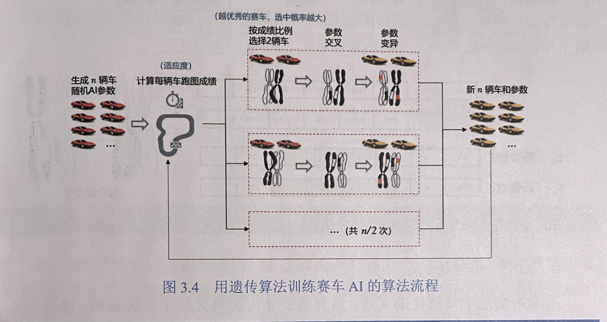
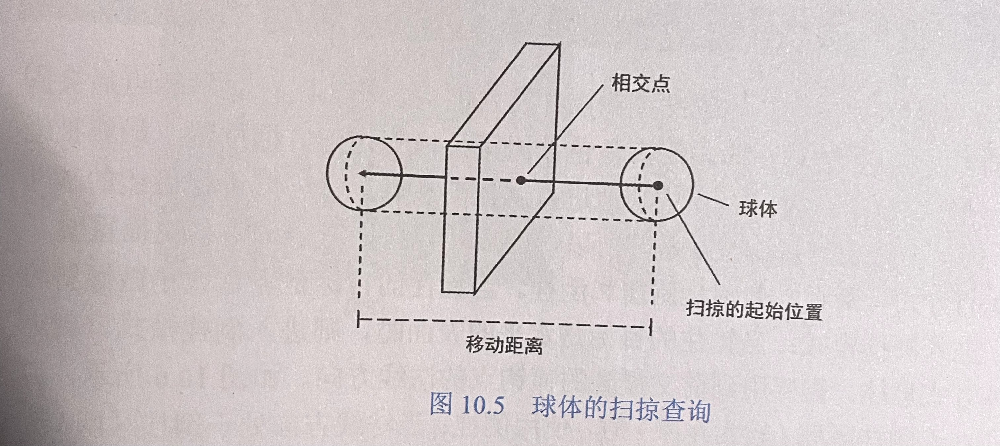
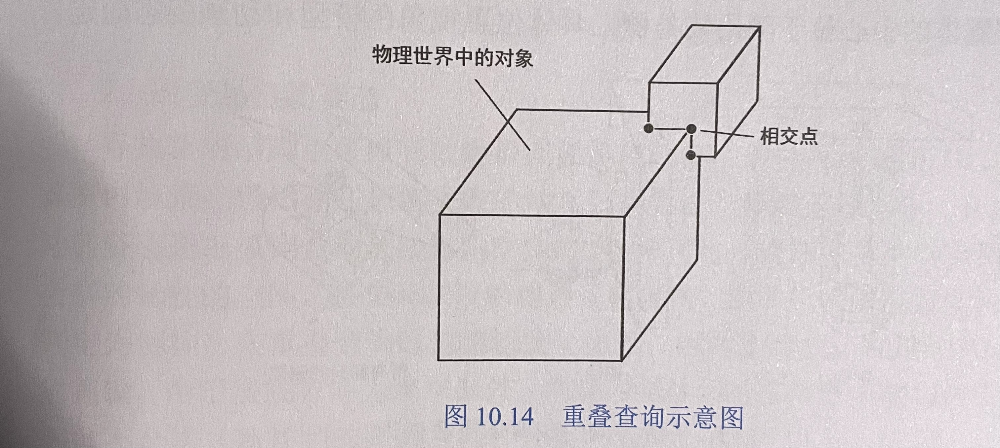
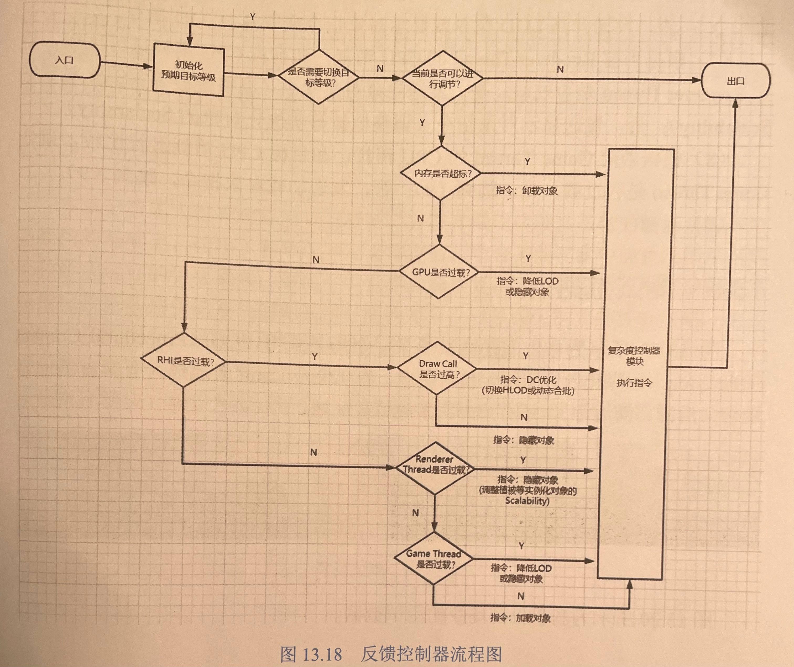
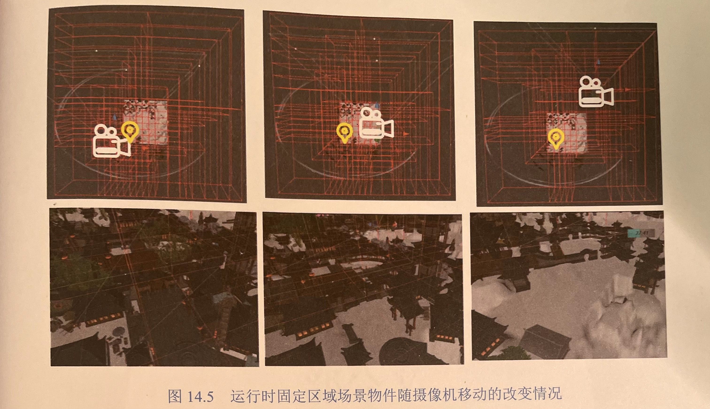
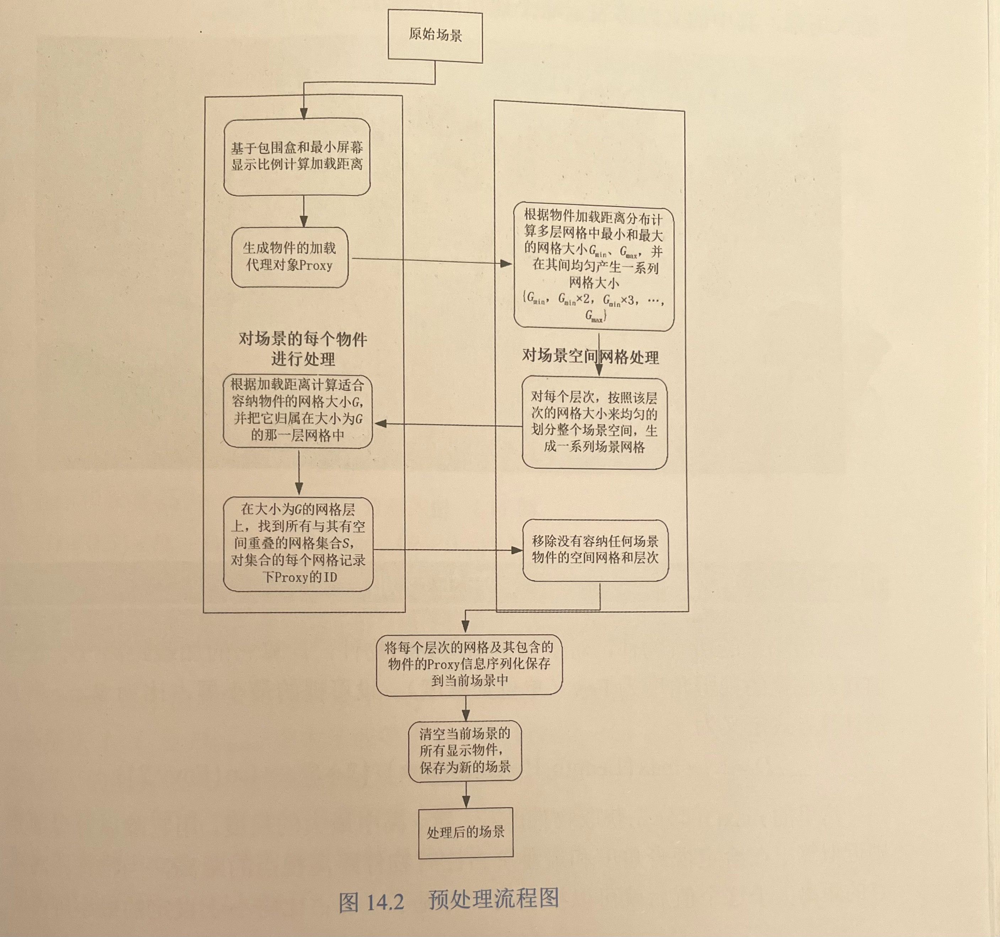
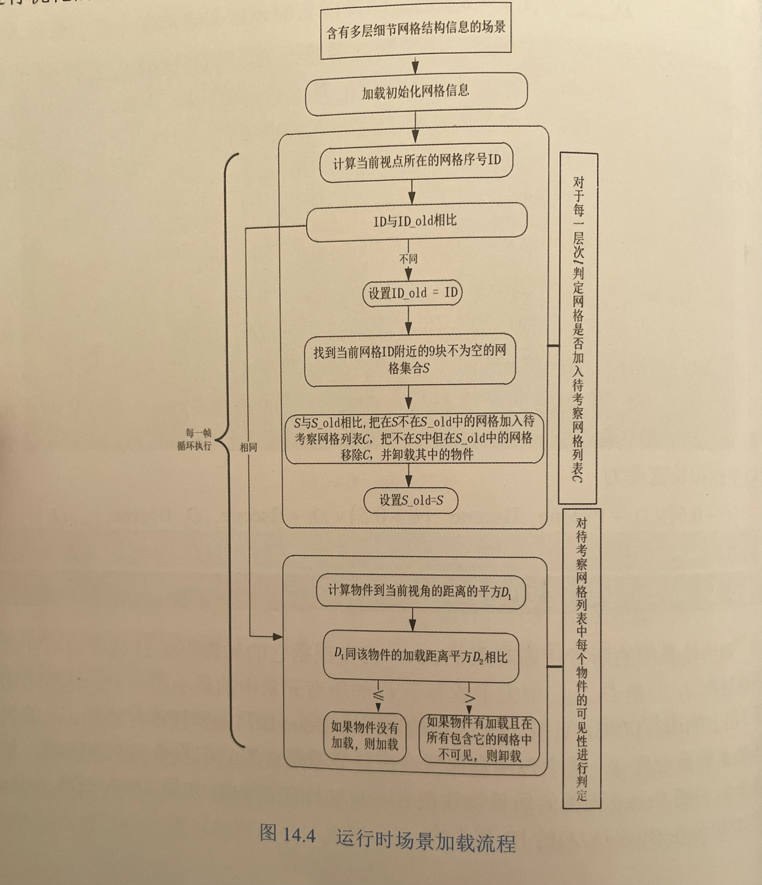

* # 部分Ⅰ 人工智能

  * ## 第1章 基于照片的角色捏脸和个性化技术 

  * ## 第2章 强化学习在游戏AI中的应用

    本章介绍了强化学习方法在制作游戏 AI 方面的一些探索。利用强化学习方法，只需要部分的人工参与，就可以在竞速类、格斗类等游戏上建立快速的高质量游戏AI生成流程。这个流程不仅能够生产在竞技水平上与一流的人类玩家相匹配的AI，还在能力分级、拟人行为等方面做了许多适应实际游戏开发需要的工作。

    - 基于强化学习方法解决了业务冷启动问题。
    - 通过对算法和分布式系统的优化，提升了模型的训练效率，一定程度上解决了机器学习模型训练时间成本高昂的问题。
    - 在自对弈策略、奖励设计等方面形成了设计模板，可以快速实现不同风格玩法的 Bot。
    - 通过奖励设计、动作优化、利用示例数据等手段解决强化学习方法的拟人化问题。
    - 通过改变输入状态、动作优化等方式实现模型分级，以适配不同水平玩家的需求。
    - 实现了包括离线训练、模型评估、模型管理、数据分析和发布的一套完整系统，并通过系统 API实现自定义的自动化工作流。

  * ## 第3章 多种机器学习方法在赛车AI中的综合应用

    1. 本章首先介绍了常规赛车AI 的赛道表示和行驶控制方法，引出了该模型下的调参问题，并提出了遗传算法进行调参的解决方案；然后分别介绍了监督学习和强化学习的基础概念和原理，并对这两个方案面临的问题与挑战进行了简单分析。

    2. 监督学习和强化学习都是机器学习的方法，训练出来的神经网络模型对于大部分研发团队来说是一个黑盒，无法对里面进行精细化控制，较难满足各种应用场景。此外，游戏逻辑变更或新增额外功能，都可能导致训练出来的模型失效，需要重新建模训练。因此，建议在游戏项目初期选用传统方法搭建基础的游戏 AI，在核心玩法稳定的情况下再尝试机器学习的方法。但在核心玩法复杂的竞技游戏中，用传统方法开发高水平的AI 是件非常困难的事情，所以机器学习仍是一种非常不错的解决方案。

    3. 强化学习是学术界在游戏AI研究方面热门的方向之一，随着技术的提升和推广，会在越来越多的游戏中落地，提高行业水平。这些超高水平的游戏 AI 研发技术可以给游戏体验和玩法探索带来更多的可能性。

    4. 对于赛车AI 参数优化问题，可以根据遗传算法流程设计如图所示的训练流程。

       （1）随机初始化n套赛车参数作为初始种群。

       （2）每套参数放到同一辆车上在赛道上跑，计算成绩（适应度）。

       （3）如果有足够优秀的成绩，则输出对应的参数作为结果。

       （4）从n套参数中，按成绩的比例权重随机选择2套参数作为母体。

       （5）把选中的2套参数进行交叉和变异得到新的2套参数。

       （6） 把作为母体的2套参数放回原种群，新的2套参数放入新种群。

       （7） 重复步骤（4）～步骤（6）共n/2次，共得到新的n套参数。

       （8）用新的n套参数重复步骤（2）～步骤（7），直到得到符合条件的参数。

       

       监督学习方案是让AI 学习人类玩家的操作的，因此AI 的能力上限理论上无法超越样本中的玩家。同时样本的选取会极大地影响AI 的能力表现。如果全都使用高端玩家录像的样本（失误少），则缺乏异常样本，训练出来的AI 应对异常突发情况的能力比较弱。如果加入中低端玩家的样本，则会拉低整体 AI 的能力水平。此外，在大部分赛道中，只在某些弯道上使用高阶技巧，因此高阶技巧的样本在整个赛道中的占比少，在训练时容易被忽略。所以在实际项目中，需要对样本进行分类和筛选，并且根据游戏特性设计复杂的网络结构，而不是简单地使用一个全连接网络。例如，先把操控左右和漂移的按键抽象成一个独立的模型，把复位刹车操作抽象成另外的模型，再把两个模型结合起来，从而控制赛车。

       除此之外，监督学习方案必须要使用样本来训练模型。一些还没上线的游戏，由于缺少游戏样本，因此无法使用这个方案。

    6. 强化学习过程看起来简单，但是实际落地在项目时，会有很多需要处理的问题。例如，一个动作的价值需要一段时间才能体现出来，Reward 只是当前动作结束后的反馈结果，不能代表动作的长远价值，那么动作的长远价值如何体现？这里面就涉及 Bellman 方程和 Reward 回传的问题。因赛车游戏只看完成赛道的时间，不关心中间过程，只有冲线后才能得到 Reward，所以 Reward 回传的路径很长，需要大量的训练时间，才能回传到初始状态。此外，AI 只追求最终结果，不关心具体操作情况，所以最终训练出来的AI 可能操作频率非常高，超出人类操作的极限。还有可能出现一些操作或失误不像人类的情况。这些问题都需要花费时间进行优化，游戏才能达到较好的上线效果。虽然强化学习技术的挑战较大，但是它可以突破传统游戏 AI 方法的限制，探索出超越人类顶尖玩家的 AI，同时发掘更多新奇的玩法体系。通过大量的探索训练，我们可以发现游戏漏洞或平衡性问题，可以辅助验证新赛车、新角色的数值合理性。

  * ## 第4章 数字人级别的语音驱动面部动画生成

* # 部分Ⅱ 计算机图形

  * ## 第5章 实时面光源渲染

  * ## 第6章 可定制的快速自动化全局光照和可见性烘焙器

  * ## 第7章 物质点法在动画特效中的应用

  * ## 第8章 高自由度捏脸的表情动画复用方案

* # 部分Ⅲ 动画和物理

  * ## 第9章 多足机甲运动控制解决方案

    1. 当角色从行走转变到站立姿态时，会在过渡期内同时播放行走和站立的动画序列，并根据过渡的进程将播放权重a慢慢从行走转移到站立，从而达到平滑过渡的效果。如果在两个动画序列中，角色着地的那条支撑腿的位置距离比较远，就会很明显地看到这条腿贴着地面滑行了一段距离，这种不会在现实世界中发生的违和现象，在游戏动画的开发中称为滑步。
    2. 面对滑步的问题，传统的动画解决方案通常采用打补丁的方式。例如，以分走到站立的动画混合会产生滑步，就专门制作一个从行走转向站立的过渡动画宋列来替代动画混合。但动画序列是固定的，而在游戏中玩家在操作机甲停步的那一刻，它的任何一条腿都有可能成为支撑腿，这种情况下就得锁定玩家的操作，等机甲的支撑腿与过渡动画的支撑腿匹配后再开始停步，这种方案会对玩家的操作造成严重的反馈延迟。
    3. 为了降低对玩家操作的影响，需要为每条腿的停步过渡制作一个动画序列。如果一台机甲被设计为有很多条腿的造型，就会直接放大此处的动画工作量。除此之外，还需要考虑机甲在前进、后退、左右移动时有可能会采用不同的行走姿势，为了匹配这些姿势的停步，需要为它们分别制作过渡动画。进一步考虑的话，机甲还可能会有不同的移动速度，在行走和在奔跑中停步，也应该采用不同的过波动画。如果对游戏品质有更高要求的话，可能还会对转向、上下坡等方面提出类似的需求。所有的这些，构成了过渡动画的不同维度，这些维度会以乘法的关系使过渡动画的需求量成倍增长。显然这样的动画工作量是大多数动画师无法承受的，并且动画资源量的增长会导致动画状态机及动画树逻辑的复杂度增长，使其变得难以扩展或维护，这是开发团队不希望看到的。为了解决这一困境，团队决定采用程序化的方式来生成机甲的动画，这样可以完全规避动画混合带来的不良影响，从根本上解决滑步的问题，对玩家操作的响应速度也能极大提高。
    4. Ahmad Abdul Karim 曾提出一套基于多足角色的程序化动画实现方案，在不采用任何动画序列的情况下，完全通过程序计算对角色的运动动画进行模拟。但这种纯程序生成的动画难免有些机械化，很难达到动画师要求的艺术水平。为此，需要在程序化和预制动画序列之间找到一个平衡点，在尽可能不降低动画品质的前提下提升动画的制作效率。正如前面所分析的，大多数问题都集中于角色的脚步运动上，于是我们决定在预制动画序列的基础上，将脚步的动作交由程序计算，并通过IK （InverseKinematics，逆向动力学）将两者结合。这样既避免了制作大量行走动画资源的需要，又能在最大程度上保留预制动画的表演效果，从而让动画师有充分的发挥空间。
       1. 将讲述如何通过程序化的方式来生成角色的运动动画；
       2. 将说明如何将程序动画与预制作的动画序列进行结合，并辅以曲线控制和简单的物理模拟来使运动动画的表现更为生动；
       3. 将讲解机甲在各种不同的地形上运动时，其脚步和身体进行的对应调整，以使呈现的效果更加真实可信。

    

  * ## 第10章 物理查询介绍及玩法应用

    1. Nvidia PhysX是 Nvidia 公司旗下的物理引擎，是世界顶尖的物理引擎之一。

       以PhysX物理引擎为例，物理查询被分为3种：射线投射查询、扫掠查询和重叠查询。

    2. 射线投射查询:从原点4发射一条射线到目标点B，用这条射线与其他物理对象进行相交检查并获取相交信息，这种方式被称为射线投射查询。数学上的射线应该是无限长的，所以严格来说应该叫作向量投射查询更为合理。

    3. 扫掠查询:在物理世界中，将一个3D 几何体从 4 点移动到B点，检查3D几何体移动过程中与其他对象的相交情况并返回结果，这种方式被称为扫掠查询。如图所示为球体的扫掠查询。

       

    4. 重叠查询：在物理世界中，在某个位置指定一个3D几何体，用这个3D 几何体与其他对象进行相交检查并返回检查结果，这种方式称重叠查询，如图1所示。

       

  * ## 第11章 基于物理的角色翻越攀爬通用解决方

* # 部分Ⅳ 客户端架构和技术

  * ## 第12章 跨游戏引擎的H5渲染解决方案

    <!--还得是大厂，看着不好就是自研系统来解决生产问题，这套PixUI-->

    1. 解决周边系统(运营活动、非游戏玩法相关的系统等)迭代快、需求差异大的问题。在实践中，直接使用Unity、Unreal 引擎自带的开发工具完成对应的开发工作，各小组遵照统一的开发规范就可以很好地协同工作。但是，当这样的组织结构需要考虑跨多个游戏、多个开发组甚至不同的公司的时候，就需要考虑以下4个问题。
       1. 每个游戏使用不同引擎时，周边系统是否可以不考虑引擎差异。
       2. 每个游戏都有自己的时间节点，周边系统的上线，特别是运营活动，是否可以不跟随游戏发版节奏。
       3. 不同游戏、不同引擎、不同平台的开发方式是否可以保持一致。
       4. 这套开发方式开发的系统能否和游戏引擎开发的系统在交互、操作、性能上保持一致。
    2. 解决以上需要提出一套独立于游戏引擎的UI开发方案，该方案可以独立部署、独立热更新，同时可以满足与游戏引擎UI 完全一致的操作、交互体验需求-----在不低于原有引擎UI 方案运行效率的前提下。
    3. 一个直接的想法是在游戏内嵌入WebView，使用H5的方式来开发运营活动甚至周边系统，在实践中，很长一段时间包括现在都在使用这样的方式，但这样的方式最大的问题是无法满足问题（4）的要求，即在交互、操作和性能上无法满足要求。对于一些简单运营活动，如领奖、抽奖等还可以胜任，但对于复杂的周边系统，如游戏内商城、任务、成就等系统，这样的 H5 页面在交互上无法与游戏内的UI保持一致；在功能上无法渲染 3D 模型到H5 页面上用于试穿预览等情形；在性能上，WebView 的内存占用远高于引擎 UL开发的相同系统。
    4. H5的开发方式很好地解决了前3个问题，同时足够简单，足够流行，成本足够低，这促使我们思考有没有可能在保留HS 开发方式的同时解决问题（4）。为了解决问题（4），需要提出一套标准和方便地在游戏引擎内实现这套标准的方法。
    5. 然后就是讲解腾讯的自研系统PixUI的核心设计理念，目标就是使用H5开发UI，然后调用游戏引擎原生渲染接口，实现渲染显示，但是我查了一下这个系统不没有开源，所以一般的公司推荐继续使用WebView。

  * ## 第13章 大世界的场景复杂度管理方案

    1. 大世界首当其冲的3个问题是规模、复杂度/性能、渲染，分别对应内容生产、内容承载和内容呈现。本章聚焦如何解决内容承载问题，即场景复杂度管理。在大世界场景里，通常有大面积地形、大规模植被、大量琐碎静态物件等，在相同的硬件平台下，复杂度管理方案很大程度上决定了大世界场景里填充内容的数量和质量。本章描述的大世界场景复杂度管理方案，基于控制理论中的负反馈控制系统，分为以下3个部分：

       - 输入部分。包含复杂度降维、复杂度度量、对象评分计算。在引擎和玩法层面，根据游戏定制计算因子和权重，统一计算复杂度和评分，传递给控制器模块。

       - 控制器/被控对象部分。包含 Visibility（可见性）检测系统、LOD（Level OfDetail，细节层级）系统、Scalabiity（可伸缩性）系统等。该部分根据输入和反馈信号，利用多种不同的复杂度控制算法综合调节系统当前负荷。

       - 输出/反馈部分。用于实现 Adaptive Performance（自适应性能）系统。根据系统负荷能力、系统当前负荷和系统指定负荷，传递反馈信号到控制器模块。

       整个系统，最终可以达成如下目标。

       * 运行时根据平台设定，智能控制场景内容的加载卸载、显示隐藏、LOD控制等。
       * 根据平台负荷能力和当前负荷，更有效地控制运行负荷，获取平滑的FPS（Frame Per Second，帧率）。

    2. 反馈控制器模块根据反馈的系统指标数据和期望的系统指标数据之间的差异，按照一定的策略发送控制指令给复杂度控制器模块，从而达到调节场景复杂度的目的。图13.18所示为反馈控制器流程图。

       

       ​	对图13.18的说明如下。

       （1）初始化。根据当前硬件平台，初始化既定目标值：目标 FPS、场景复杂度总量、CPU时间、GPU时间、Memory数值、Draw Call 数值。

       （2）计算当前视口场景复杂度，和目标复杂度比较，确定是否需要根据差值切换目标等级。是，跳到（1）；否，跳到（3）。

       （3）确定是否可以进行调节（上一次调节是否结束，当前环境是否允许新的调节动作）。否，等待；是，跳到（4）。

       （4） 根据当前内存使用量，和目标内存数值比较，确定当前内存是否超标。

       是，发送卸载对象指令；否，跳到（5）。

       （5）根据当前GPU消耗，和目标GPU消耗进行比较，确定GPU 是否过载。

       是，根据过载级别发送降低LOD 指令或隐藏对象指令；否，跳到（6）。

       （6）根据当前 RHI Thread 的CPU消耗，和目标 CPU 消耗进行比较，确定 RHIIThread 是否过载。是，［当前Draw Call是否过高？是，发送 Draw Call 调节指令（切换 HLOD 或在 Renderer Thread没有过载的情况下动态合批）；否，发送隐藏对象指令］；否，发送升高LOD 指令或显示对象指令或取消HLOD 指令。

       （7）根据当前 Renderer Thread 的CPU 消耗，和目标CPU 消耗进行比较，确定 Renderer Thread 是否过载。是，发送隐藏对象指令（调整植被等实例化对象的Scalability）；否，发送显示对象指令（调整植被等实例化对象的 Scalability）。

       （8）根据当前 Game Thread 的CPU消耗，和目标CPU消耗进行比较，确定Game Thread 是否过载。是，跳到（9）；否，发送加载对象指令，跳到（9）。

       （9）返回（2）。

  * ## 第14章 基于多级细节网格的场景动态加载

    1. 本章提出了一种基于多级细节网格结构的场景加载方案，并在实际游戏中应用于移动端游戏超大型 3D 场景的加载和连续展现。图14.5展示了运行时固定区域场景物件随摄像机移动的改变情况，可以看到，当摄像机逐渐远离该区域时，该区域内的小物件很快就会消失，而重要的物件较晚才消失，从而保证了用户看到的物件的准确性及最小化内存加载。

       

       本方案的优势在于预先将所有场景物件的位置连同重要度信息整理排列存储在一个数据结构中，实现了“越不重要的物件，加载越少越近”的目标，并可以根据重要度进行一些加载优先级上的优化。此外，这种场景结构的划分和处理可以完全实现自动化，在实际的项目应用中，场景的美术设计人员不需要关心场景物件的区块划分或分块设计，制作流程相对简单。

    2. 场景预处理成多级细节网格结构

       

    3. 加载过程

       

* # 部分Ⅴ 服务端架构和技术

  * ## 第15章 面向游戏的高性能服务网格TbusppMesh

  * ## 第16章 游戏配置系统设计

  * ## 第17章 游戏敏捷运营体系技术

* # 部分Ⅵ 管线和工具

  * ## 第18章 从照片到模型

  * ## 第19章 一种可定制的Lua代码编辑检测工具

  * ## 第20章 安卓平台非托管内存分析方案

  * ## 第21章 过程化河流生成方法研究与应用
