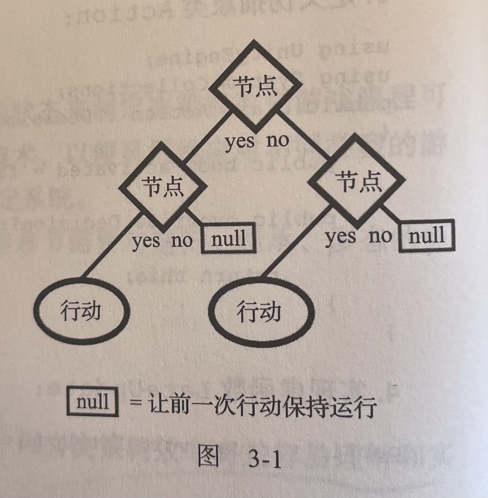
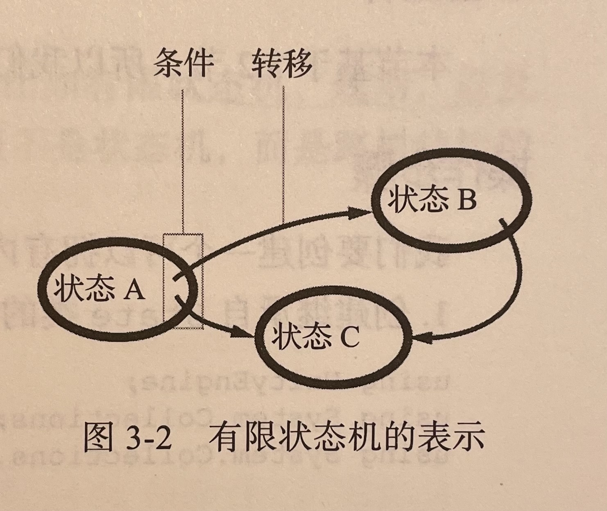
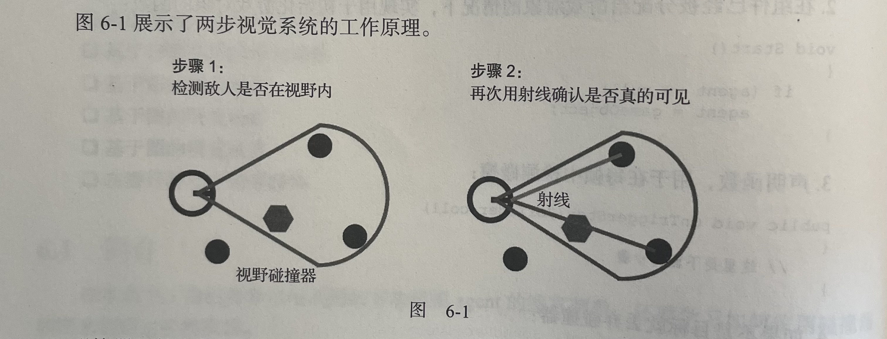
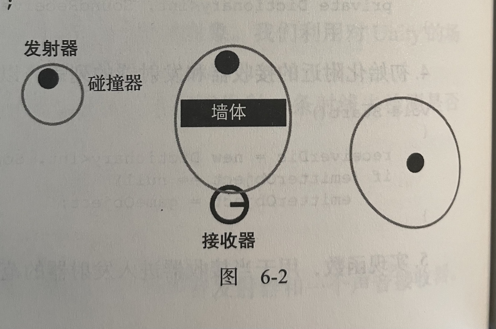
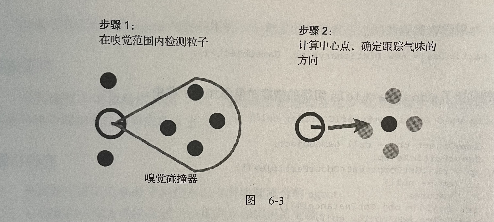

# 第1章 行为——智能移动

本章将从学习某些最有趣的移动算法开始，这些算法基于 Craig Reynolds 和 Ian Millington一起开发的转向行为原则，本章介绍的实用方法是绝大多数用于高级游戏以及其他依赖于移动的算法（比如寻路算法家族）的 AI的基石。

创建行为模板、追赶和逃跑、为物理引擎调整、到达和离开、朝向物体、徘徊、按路径移动、避开agent 、避开墙体、通过权重混合多个行为、通过优先级混合多个行为、射击抛射体、预测抛射体的着地点 、锁定抛射体 、创建跳跃系统 

# 第2章 导航

1. 用深度优先搜索在迷宫中找到出路

   深度优先搜索(DFS)算法是一个适合小内存设备的寻路算法，另一种常见用法是构建迷宫，只对访问和发现的节点列表做一些修改，然而主要的算法还是一样的。

2. 用广度优先搜索在网格中找到最短路径

   广度优先搜索（BFS)算法是另一个用于图遍历的基础技术，目的是用尽可能最少的步骤获取最短路径，并且权衡内存方面的消耗，尤其针对高端主机和计算机的游戏。

3. 用迪杰斯特拉算法找到最短路径

   迪杰斯特拉算法最初的设计目标是解决图的单源最短路径问题。所以，这个算法找到的是从单一起点到各个终点的最低成本的路线。我们将学习如何用两种不同的方式使用这个算法

4. 用A*找到最优路径*

   A*算法可能是路径查找中最常用的技术了，因为它容易实现、效率高，而且还有优化的余地。所以有一些算法把它作为基础并非巧合。另外，A*与迪杰斯特拉算法具有同根性，所以你会发现它们实现上的相似之处。

5. *改进A*算法的内存占用：IDA*

   IDA*是一个叫作选代深化 DFS ( Torative Depening Deptb-First Search） 算法的变种，内存使用量比 A*小，因为它不使用数据结构存储找到的和访问过的节点。

# 第3章 决策制定

1. 通过决策树做选择

   

2. 有限状态机

   

3. 改进有限状态机：分层的有限状态机

   有限状态机可 以通过划分不同层次和不同层级进行改进。原理还是相同的，只是状态还可以有自己的内部有限状态机，让状态更灵活且可以扩展

4. 行为树

   行为树可以看作是其他几个人工智能技术的综合体，比如有限状态机、规划，以及决策树。实际上，行为树与有限状态机有一些相似之处，但不是状态机，而是跨树结构的动作。

5. 使用模糊逻辑

   有时候当我们必领得对灰色区域而不是基于二进制值的区域做出决策时，模糊逻辑可以作为帮助我们解决这种任务的一组数学技术。假如我们正在开发一个自动驾驶程序，两个可用的行动是转向和速度控制，二者都有度的数值范围。决定如何转向，以及以什么速度行驶，是让驾驶员与众不同且可能更聪明的关键。这种类型的灰色区域就是模糊逻辑要帮我们表示和处理的。

# 第4章 新的NavMesh API

在运行时创建和更新NavMesh数据、控制NavMesh实例的生命周期、连接多个NavMesh实例、创建动态的带有障碍物的NavMesh 93

# 第5章 协作和战术

1. 扩展A*算法用于协作：A* mbush 

   A* mbush 算法分析每个agent 的路径然后增加节点的开销，这样一来，当 agent 使用A* 计算其路径时，最好选择一个与其他agent 不同的路径，那样就可以在目标点位中创建埋伏点了。

2. 用高度分析路径点

   我们遍历附近点位的列表，目的是找到最大宽度和最小宽度，然后计算 -1到1范围内的位置值。也可以通过改变此范围以满足游戏的设计，或在公式中颠倒高度的重要性

3. 用覆盖性和可见性分析路径点

   我们创建了一些迭代逻辑，然后开始在路径点周围放置随机数，以检验是否可到达和可命中。之后，我们计算出一个系数以确定质量值。

4. 自动化创建路径点

   我们将 wavpoint 组件分配给图中的每个节点，或者说每个值得作为路径点的节点(因为凝结算法提升了性能）。路径点根据相关性排序(比如狙击高度或有利位置），然后通过凝结检查哪个邻接点是不需要的。自然地，价值少的凝节点留在了最后的计算结果中。

5. 势力图

   势力映射图与一般图的原理相同，因为只有两个额外的参数用于在图上映射势力，所以与基于势力的顶点相同。最关键的部分依赖于势力的计算，而这部分基于 BFS 算法。对于地图上的每个单位，根据半径摊开其势力。当计算出的势力大于顶点原来的阵营时，顶点的阵营就改变了

6. 用淹没图改进势力图

   算法从阵营的位置点开始遍历整个图。根据我们之前的反向减法运算，永远从优先队列中最强的节点开始遍历，直到它接近一个小于 dropOffThreshold 的值才计算结果如果顶点的值大于当前兵力，或如果分配的阵营是相同的，算法还要想办法在不满足条件时避免分配新的阵营。

7. 用卷积滤波器改进势力图

   在每个位置上应用矩阵滤波器之后，创建新的网格与原始网格进行交换。然后，遍历创建的每个位置点（这些位置点作为目标网格)，然后计算这些位置的值，取原始网格的值并对这个值应用矩阵滤波器。要特别注意矩阵滤波器必须是一个奇数平方的数组，才能让算法可以得到我们期待的结果

# 第6章 agent感知

1. 基于碰撞系统的视觉函数

   

   碰撞组件在每一顺中检测是否碰撞到场最中的任何游戏对象。我们利用对 Unity的场景图片和引擎的优化，可以专注于如何处理有效的碰撞。检测之后，如果有目标对象在碰撞器的视说范園内，我们就发射一条射线去检测是否真的可见，或者在 agent 与目标之间是否有一堵墙。

2. 基于碰撞系统的听觉函数

   

   碰撞触发器帮助记录 agent 列表中指定给发射器的 agent。 声音发射函数根据agent 到发射器的距离，用声音衰减的原理减少声音强度

3. 基于碰撞系统的嗅觉函数

   

   我们使用触发式碰撞器的目的是把气味粒子记录到一个 agent 的感知列表中(用一个字典实现)。当一个粒子被添加进来或被移除出去时就计算出气味中心。然而，我们实现了一个西数用于获取这个中心，因为当没有气味粒子被记录时，内部的中,心位置是不变的。

4. 基于图的视觉函数、基于图的听觉函数、基于图的嗅觉函数

   

# 第7章 棋类游戏和应用的搜索AI

1. Minimax算法

   极小化极大算法实现了有界的深度优先搜索。在每一步中，行动的选择是这样的：通过挑选出那个可以最大化玩家得分并且假设对手会挑选最小化自己得分的行动，直到遇见终止（叶子）节点。对行动的追踪是由递归完成的，而用于选择或假设选择的启发式算法则依赖于Evaluate 函数

2. Negamax算法
   Negamax 与极小化极大算法的基本原理相同，但是做了一些改进。在递归的每一步的返回中，把上一步的得分变为负。算法在这里不选择最佳行动，而是改变得分的正负符号,以避免追踪是哪个玩家的行动。

3. AB Negamax算法

   这里有两个值：alpha 和beta。alpha 值是玩家可能得到的最低分值，这样就不用再考虑对手还可以出什么招去减少这个分值。类似地，beta 值是上限分值，不管行动多有吸引力，这个算法假设对手没有机会得分假设两个玩家之间轮流行动 （极小化和极大化)，则每一步中只需要检查其中一个值。

4. Negascout算法

   Negascout 算法的原理是检查每个节点的第一次行动。侦察员基于第一次行动，试图通过缩小搜素窗口来确认随后的行动。如果无法通过搜素窗口，就用全尺寸的搜索窗口重复这个过程。结果就是剪枝大量的分支，避免了失败。

# 第8章 机器学习

1. N元语法预测器预测行动

   预测器根据搜索窗口的大小记录了一组行动 (记录这些行动是为了做预测）并给它们分配一个结果值。例如，有一个大小是了的搜索窗口，前了个就会作为一个键值保存，以预测接下来的第4个行动。根据之前的行动，预测西数计算出某个行动有多大可能会是接下来的行动。记录的行动越多，则预测会越准确（有一些限制）。

2. 改进预测器：分层的N元语法

   分层N 元语法预测器的原理几乎与N元语法预测器中的一样，不同之处在于它有一组预测器，并且使用其子预测器计算出每个主两数的值。每个预测器通过分解集合中可用的行动，然后记录序列或者找出最可能的潜在行动，再把这些行动填充到子预测器中。

3. 朴素贝叶斯分类器

   人类都不一定能很容易地发现两个集合之间的关系。解决这个问题的一种方式是把值的一个集合进行分类后再试一次，而这就是分类算法派上用场的地方。朴素贝叶斯分类器是用于给问题实例设定标签的预测算法，分类器运用概率和贝叶斯理论，在要进行分析的变量之间有强独立性假设。贝叶斯分类器的一个重要优点是可扩展性

   在 Q-learning 算法中，游戏世界被看作一个状态机，要特别注意这些参数的意义：

   * alpha：学习率
   * gamma：打折率
   * rho：探测的随机性
   * nu：运行的时间

4. 强化学习

   假设我们需要设计出一个敌人，随着玩家在游戏中的剧情进展以及他们的模式发生变化时，这个敌人需要采取不同的行动，或者需要设计一款游戏，游戏中训练不同类型的有自由意志的宠物。对于这些类型的任务，有一系列基于经验的建模学习技术。其中一个算法是 Q-learning,在本节中将会实现它。

5. 人工神经网络

   我们实现了两种类型的 Perceptron，用于处理外部输人的感知器，以及在内部互相连接的感知器。这就是为什么基础 Perceptron 类继承自后者。FeedForward函数处理输人并顺着神经网络冲洗这些输人值。最后，用于反向传播的两数负责调整权重，权重调整是对学习的模拟。

# 第9章 程序化内容生成

1. 用深度优先搜索创建迷宫
2. 为地下城和群岛实现可构造算法
3. 生成风景
4. 使用N元语法生成内容
5. 用进化算法生成敌人

# 第10章 其他

1. 创建和管理可编写脚本的对象
2. 更好地处理随机数
3. 构建空气曲棍球游戏对手 
4. 实现竞速游戏架构
5. 使用橡皮筋系统管理竞速难度