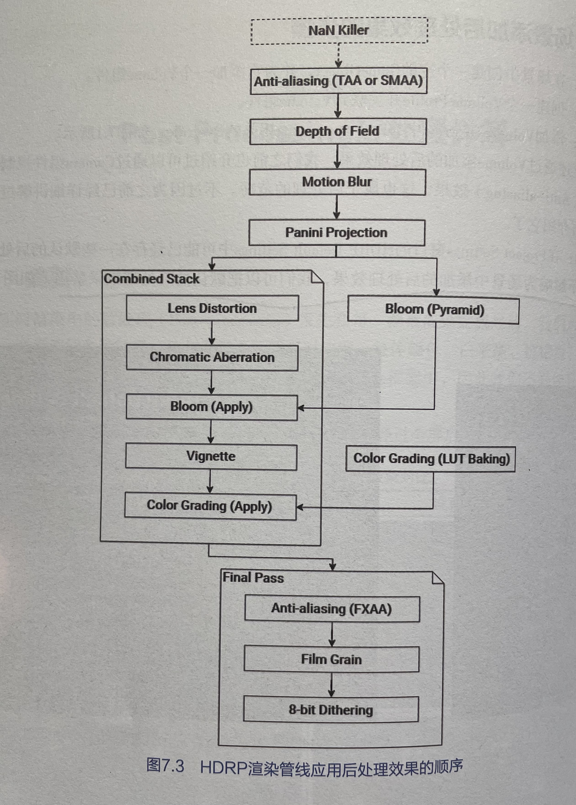

## 第1章　HDRP入门

介绍HDRP场景组成

## 第2章　实现市政厅办公室场景

以实例介绍HDRP组成

## 第3章　HDRP配置文件和Volume框架详解

1. HDRP配置文件（HDRP Asset）

   * Frame.Settings（帧设置）

     帧设置针对的是场景中的Camera （相机）、Baked or Cuatom Reflection（烘培或自定义反射帧设置）和Realtime Reflection （实时反射）的相关设置。后面两个反射相关的设管应用在Reflection Probe（反射探针）组件上。

     帧设置的优先级低于HDRP配置文件，也就是说，如果在HDRP配置文件中没有打开某项功能，那么帧设置中对应的功能就会被自动禁用。

   * Volume框架.

     Volume的作用是通过调整各项HDRP功能的参数，影响相机所看到画面的最终渲染效果。

     volume的优先级低于帧设置，也就是说，如果在当前相机的倾设置中没有打开某项功能，那么在Volume中对相关功能的调整是不起作用的

   * 针对不同平台使用不同的HDRP配置文件

   

2. Volume框架详解（后续章节会分开详细介绍以下功能）

   * Exposure（曝光控制）
   * Fog（雾效制作）
   * Lighting（光照）
   * Material（材质）
   * Shadowing（阴影处理）
   * Sky（天空）
   * Post-processing（后处理）
   * Ray.Tracing（实时光线追踪）
   * Local.Volume（本地Volume）使用示例

## 第4章　HDRP光照系统详解

### 一、场景打光步骤解析

1. 启用Scene.Settings.Volume
2. 启用Directional.Light（平行光）
3. 启用Volume中的自动曝光控制
4. 启用所有灯笼模型和点光源
5. 启用场景中所有反射探针（Reflection.Probe）
6. 启用场景中的光照探针组（Light.Probe.Group）
7. 完成整个场景的光照烘焙
8. 增强间接光强度
9. 处理阴影和环境光遮蔽.
10. 添加雾效
11. 画面抗锯齿处理
12. 添加后处理Volume组件

### 二、场景打光步骤解析

1. 修改Directional.Light设置

   * 修改Scene.Settings.Volume→HDRI.Sky设置
   * 修改Scene.Settings.Volume→Exposure（曝光）设置
   * 修改Scene.Settings.Volume→Fog（雾效）设置
   * 修改Scene.Settings.Volume→Contact.Shadow（接触阴影）设置
   * 修改Post.Processing.Volume→Color.Adjustment（颜色调整）设置
   * 修改Post.Processing.Volume→White.Balance（白平衡）设置

2. 光源类型和模式

   * 如何制作和使用Light.Cookie为灯光添加更多细节

     本质为在射出的光线前添加一张图片

   * 光照相关的常见问题汇总

     1. 为什么场景中出现奇怪的阴影块

        灯光数超过24，Project setting -> HDRP default setting -> Default Frame -> light loop

     2. 为什么相机移动场景中的阴影会扭曲或者闪烁

        启用了HDRP中的阴影Dynamic Rescale

     3. 未启用体积光的高质量，但是场景中的灯光雾效有很多噪点

        编辑器只是预览，打包就好

3. 光源分层

4. 使用光照探针

   * 为什么要使用光照探针

     为动态和静态物体提供间接光照信息

   * 使用光照探针的基本步骤

     1. 创建光照组
     2. 光照烘焙生成间接光
     3. 调整光照组

5. 使用Reflection Probe为场景提供反射信息

   * Screen.Space.Reflection（屏幕空间反射）
   * Reflection.Probe（反射探针）
   * Sky.reflection（天空反射）

6. 阴影 

   * 阴影的种类

     光源投射阴影和基于屏幕空间信息计算阴影(Contact shadow 、Micro shadow、Ambient Occlusion环境光遮蔽)

   * 三种光照模式

   * 两种Shadowmask模式下的阴影表现

   * 阴影的最大投射距离设置

   * Distance.Shadowmask和Shadowmask两种模式对性能的影响

     前者消耗GPU效果好，后者消耗内存

## 第5章　Lightmapping（光照烘焙）详解

### 一、渐进式光照贴图烘焙对场景中的模型有什么要求

1. 模型上不能有重叠UV，未使用光照贴图前，相同部分可以使用相同的UV进行映射，但是启用光照贴图，如果相同部分用一个UV，则表示不同部分有着相同光照，这是不合理的。
2. UV之间有足够的间距以避免“渗色”现象。
3. 光照贴图只用烘培静态物体。

### 二、渐进式光照贴图烘焙对硬件的要求是什么？支持Unity的哪些渲染管线 

硬件要求：

1. 至少需要一块支持OpenCL 1.2的显卡
2. 至少2GB的显存
3. CPU支持SSE4.1指令

支持的渲染管线：

1. 内置渲染管线（Built-in Render Pipeline ），支持
2. 通用渲染管线(Universal Render Pipeline, 简称URP），支持Baked Indirect、Subtractive和Shadowmask光照模式。
3. 高清渲染管线 (High Definition Render Pipeline， 简称HIDRP），支持Baked Indirect和Shadowmask光照模式。

### 三、进行渐进式光照贴图烘焙时烘焙出来的是什么？

光照贴图、光照探针、反射探针

### 四、渐进式光照贴图烘焙的CPU版本和GPU版本有什么区别 

cpu版本是cpu 和内存，gpu是gpu和显存

### 五、光照贴图烘焙界面参数详解

1. Prioritize View
2. 采样相关设置
3. 降噪相关设置
4. 光照贴图分辨率
5. Compress Lightmaps
6. Ambient Occlusion相关

### 六、不同显卡对GPU版本的烘焙效率有什么影响 

成倍影响

### 七、相同场景使用CPU烘焙需要多长时间

大约15倍

### 八、为什么GPU版本在烘焙的过程中，有时会自动切换成CPU版本

显存不足

### 九、如何避免GPU烘焙自动切换成CPU烘焙 

1. 不能完全避免
2. Edit -> Project Settings -> Quality -> Texture Quality = Eighth Res
3. 烘培过程隐藏Scene 和 Game 窗口
4. 切分成小场景

### 十、如何解决光照贴图接缝问题 

这是由于GPU无法将分开光照贴图进行混合，启用Mesh Renderer 中的Stitch Seams，渲染时间会加长

### 十一、如何整体地查看光照贴图的不同组成部分

Scene面板中有个UV Charts选项

### 十二、如何查看场景中的模型在光照贴图中的位置和占比大小

1. 在Hierarchy 面板选中模型
2. 在Inspector面板找到Lightmapping区域中的Baked Light map
3. 点击Open Preview

## 第6章　HDRP材质详解

1. 使用Lit着色器制作典型材质
2. 木头材质
3. 冰箱材质
4. 陶瓷材质
5. （普通）玻璃材质
6. （带折射的）玻璃材质
7. 半透明材质和次表面散射材质
8. 自发光材质
9. Decal（贴花）的具体使用方法
10. 渲染器和材质优先级
11. 使用HDRP自带的示例材质库
12. 金属箔材质
13. 肥皂泡材质

## 第7章　Post.Processing后处理详解

1. 为场景添加后处理效果的步骤

   步骤1：在场景中创建一个空的GameObject， 并为它添加一个Volume组件。

   步骤2：创建一个Volume Profile并关联到Volume组件。

   步骤3：添加Volume Override中 与Post-processing相关的Override，如图7.1所示。

   除了上述通过Volume添加的后处理效果，我们之前也介绍过可以通过Camera组件控制画面的抗锯齿（Anti-aliasing ）效果，这也属于后处理的范畴。不过因为之前已经详细讲解过，所以本章不再介绍它了。

   步骤4：在Project Settings 窗口的HDRP Default Setings中可能己经存在一些默认的后处理效果。为了不影响为场景中添加的后处理效果，我们可以把默认的后处理效果禁用。

2. 后处理效果应用顺序和效果组合

   

3. HDRP中的后处理效果

4. Tonemapping（色调映射）

5. White.Balance（白平衡）

6. Bloom（泛光）

7. Film.Grain（胶片颗粒）

8. Depth.of.Field（景深）

9. Panini.Projection（帕尼尼投影）

10. Lens.Distortion（镜头畸变）

11. Motion.Blur（运动模糊）

12. Chromatic.Aberration（色差）

13. Vignette（晕映）

14. Lift、Gamma和Gain（颜色分级）

15. Channel.Mixer（通道混合）

16. Color.Curve（颜色曲线）

17. Color.Adjustment（颜色调整）

18. Split.Toning（分离调色）

19. Shadow、Midtones、Highlights（阴影、中间调、高光）

## 第8章　HDRP.Debug窗口介绍

1. Material（材质）相关的Debug窗口
2. Lighting（光照）相关的Debug窗口 
3. Camera（相机）相关的Debug窗口 
4. MatCap显示模式的使用方法

## 第9章　HDRP在VR中的应用

1. HDRP VR支持的平台
2. 系统要求
3. 支持的平台
4. 配置HDRP项目以支持VR
5. 可以应用到VR中的HDRP功能
6. 将市政厅办公室场景转换成HDRP VR
7. 配置HDRP+VR
8. 配置XR.Plug-in.Management
9. 添加XR.Interaction.Toolkit
10. 创建XR.Rig、控制器和瞬移区域
11. 创建转向系统
12. 创建可交互物体
13. 构建项目到设备
14. 在VR设备中进行Debug

## 第10章　HDRP.Custom.Pass应用..........................................................................401

10.1　摘要 .................................................................401
10.2　Custom Pass实例解析 ..................................................401
10.2.1　实例讲解1...................................................................................................402
10.2.2　实例讲解2...................................................................................................407
10.3　如何查看Custom Pass的渲染阶段 ..................................408
10.4　本章总结 .....................................................................................409

## 第11章　HDRP实时光线追踪项目应用......................................................................410

11.1　摘要 .................................................................................410
11.1.1　运行光追应用所需的软硬件......................................................................411
11.1.2　Unity光追功能在编辑器中的位置.............................................................411
11.2　配置HDRP光追项目 .........................................................414
11.2.1　将普通HDRP项目升级到支持光追的HDRP项目....................................414
11.2.2　进一步设置HDRP配置文件（HDRP.Asset）启用相关的光追功能. .......417
11.2.3　在HDRP.Default.Settings界面启用相机的Frame.Settings中的光追功能.....421
11.2.4　在Scene窗口打开相机的抗锯齿功能和启用刷新设置..............................422
11.3　光追功能的使用方法 ..............................................................423
11.3.1　环境光遮蔽.................................................................................................424
11.3.2　屏幕空间反射.............................................................................................427
11.3.3　屏幕空间全局光.........................................................................................431
11.3.4　Light.Cluster的使用.....................................................................................433
11.3.5　屏幕空间阴影.............................................................................................439
11.3.6　次表面散射.................................................................................................443
11.3.7　递归式渲染.................................................................................................450
11.3.8　路径追踪.....................................................................................................453