第一部分“扎基础”主要介绍TCP网络游戏开发的必备知识，包 括TCP异步连接、多路复用的处理，以及怎样处理粘包分包、怎样发 送完整的网络数据、怎样设置正确的网络参数。第3章介绍了一款简单 网络游戏开发的全过程，在后续章节中会逐步完善这个游戏。 

第二部分“搭框架”主要介绍商业级客户端网络框架的实现方 法。这套框架具有较高的通用性，解决了网络游戏开发中常遇到的问 题，且达到极致的性能要求，可以运用在多款游戏上。书中还介绍了 一套单进程服务端框架的实现，服务端框架使用select多路复用，做到 底层与逻辑分离，设有消息分发、事件处理等模块。 第

三部分“做游戏”通过一个完整的实例讲解网络游戏的设计思路，包括游戏实体的类设计、怎样组织代码、怎样实现游戏大厅（房 间系统）、怎样实现角色的同步。这一部分会使用第二部分搭好的框 架，一步步地做出完整的游戏项目。

# 第一章 网络游戏的开端

1. Socket

   网络上的两个程序通过一个双向的通信连接实现数据交换，这个 连接的一端称为一个Socket。一个Socket包含了进行网络通信必需的 五种信息：连接使用的协议、本地主机的IP地址、本地的协议端口、 远程主机的IP地址和远程协议端口（如图1-6所示）。如果把Socket理 解成一台手机，那么本地主机IP地址和端口相当于自己的手机号码， 远程主机IP地址和端口相当于对方的号码。至少需要两台手机才能打 电话，同样地，至少需要两个Socket才能进行网络通信。

   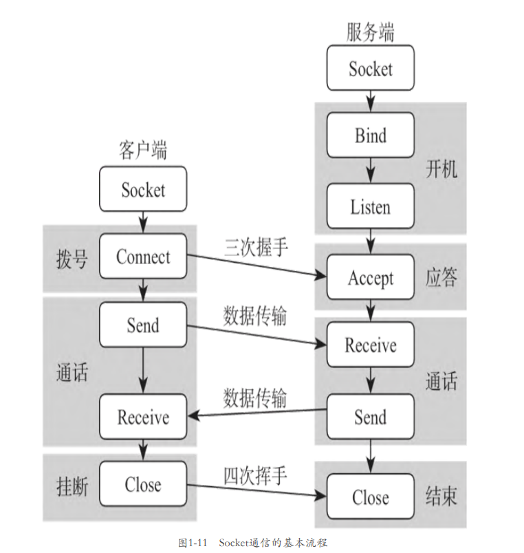

2. TCP、UDP

   从概念上讲，TCP是一种面向连接的、可靠的、基于字节流的传输 层通信协议，与TCP相对应的UDP协议是无连接的、不可靠的、但传输 效率较高的协议。在本章的语义中，“Socket通信”特指使用TCP协议 的Socket通信。 也许能够以寄快递的例子解释不同协议的区别。有些快递公司收 费低，对快递员的要求也低，丢件的事情频频发生；有些公司收费 高，但要求快递员在每个节点都做检查和记录，丢件率很低。不同快 递公司有着不同的行为规则，有的奉行低价优先，有的奉行服务至 上。TCP、UDP协议对应不同快递公司的行为规则。它们的目的都是将 数据发送给接收方，但使用的策略不同：TCP注重传输的可靠性，确保 数据不会丢失，但速度慢；UDP注重传输速度，但不保证所有发送的数 据对方都能够收到。至于孰优孰劣，得看具体的应用场景。游戏开发 最常用的是TCP协议，所以本书也以TCP为主。

# 第二章 分身有术：异步和多路复用

1. 异步

   在Start方法中创建一个定时器对象timer（定时器Timer类位于 System.Threading命名空间内）。Timer类的构造函数有4个参数：第 一个参数TimeOut代表回调函数，即打印“铃铃铃”的方法；第三个参 数5000代表5000毫秒，即5秒；另外两个参数暂不需要关心。整个程序 的功能就是开启定时器，5秒后回调TimeOut方法，打印“铃铃铃”。 这种方法称为异步，它指进程不需要一直等下去，而是继续往下 执行，直到满足条件时才调用回调函数，这样可以提高执行的效率。

   异步的实现依赖于多线程技术。在Unity中，执行 Start、Update方法的线程是主线程，定时器会把定时任务交给另外的 线程去执行，在等待5秒后，“另外的某条线程”调用回调函数。主线 程继续往下执行代码，不受影响。

   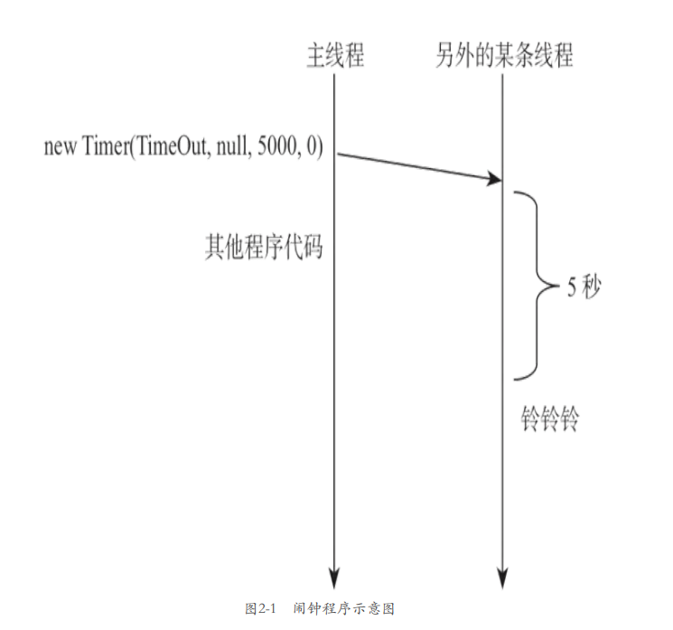

2. 状态检测Poll

   Poll方法将会检查Socket的状态。如果指定mode参数为 SelectMode.SelectRead，则可确定Socket是否为可读；指定参数为 SelectMode.SelectWrite，可确定Socket是否为可写；指定参数为 SelectMode.SelectError，可以检测错误条件。Poll将在指定的时段 （以微秒为单位）内阻止执行，如果希望无限期地等待响应，可将 microSeconds设置为一个负整数；如果希望不阻塞，可将 microSeconds设置为0。

   *在阻塞方法前加上一层判断，有数据可读才调用Receive，有 数据可写才调用Send，那不就既能够实现功能，又不会卡住程序了 *

3. 多路复用Select

   多路复用，就是同时处理多路信号，比如同时检测多个 Socket的状态。同时检测多个 Socket的状态。在设置要监听的Socket列表后，如果有一个（或多 个）Socket可读（或可写，或发生错误信息），那就返回这些可读的 Socket，如果没有可读的，那就阻塞。

   Select可以确定一个或多个Socket对象的状态，如图所示。 使用它时，须先将一个或多个套接字放入IList中。通过调用 Select（将IList作为checkRead参数），可检查Socket是否具有可读 性。若要检查套接字是否具有可写性，可使用checkWrite参数。若要 检测错误条件，可使用checkError。在调用Select之后，Select将修 改IList列表，仅保留那些满足条件的套接字。如图2-13所示，把包含 6个Socket的列表传给Select，Select方法将会阻塞，等到超时或某个 （或多个）Socket可读时返回，并且修改checkRead列表，仅保存可读 的socket A和socket C。当没有任何可读Socket时，程序将会阻塞， 不占用CPU资源。

   

# 第三章 实践出真知：大乱斗游戏

1. 角色控制

   可以设计图所示的类结构，其基类BaseHuman是基础的角色 类，它处理“操控角色”和“同步角色”的一些共有功能；CtrlHuman 类代表“操控角色”，它在BaseHuman类的基础上处理鼠标操控功能； SyncHuman类是“同步角色”类，它也继承自BaseHuman，并处理网络同步（如果有必要）。

   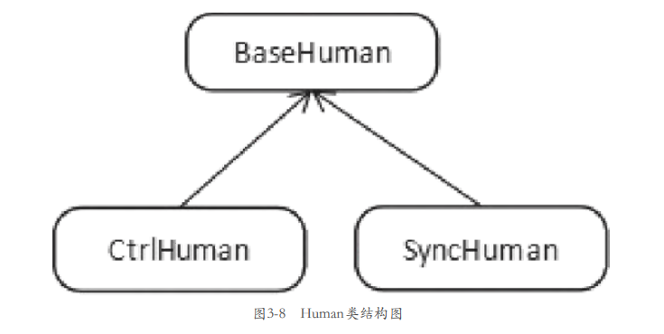

2. 网络模块

   在实际的网络游戏开发中，网络模块往往是作为一个底 层模块用的，它应该和具体的游戏逻辑分开，而不应该把处理逻辑的 代码（例如之前给recvStr赋值）写到ReceiveCallback里面去，因为 ReceiveCallback应当只处理网络数据，不应该去处理游戏功能。一个 可行的做法是，给网络管理类添加回调方法，当收到某种消息时就自 动调用某个函数，这样便能够将游戏逻辑和底层模块分开。

   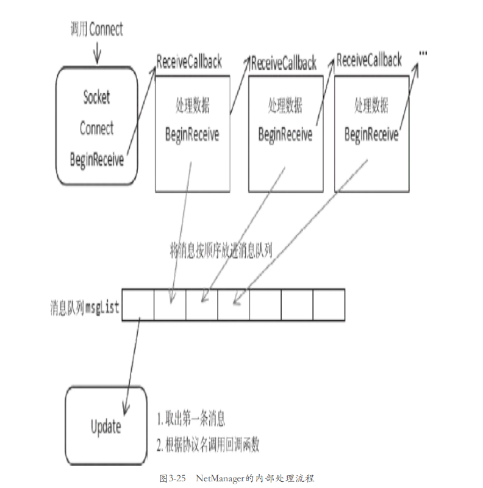

3. 进入游戏：Enter协议

   当玩家打开游戏，客户端程序会生成一个操控角色 （CtrlHuman），并把它放到场景中的一个随机位置。然后发送一条 Enter协议给服务端，包含了对玩家的描述、位置等信息。服务端将 Enter协议广播出去，其他客户端收到Enter协议后，创建一个同步角 色（SyncHuman）

   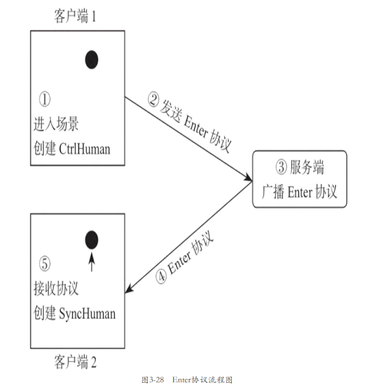

   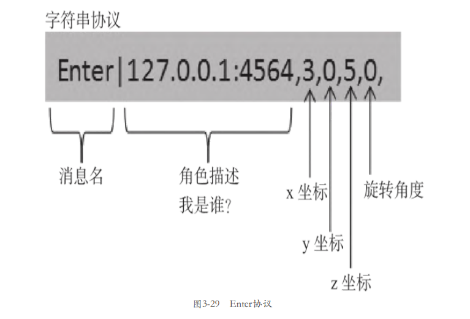

4. 玩家列表：List协议

   客户端发送和接收List协议的代码如下所示，它解析参数后，生 成一个同步角色。

   

5. 移动同步：Move协议

   当玩家用鼠标点击场景，角色移动时，客户端应把目的地位置发 送给服务端。服务端一方面记录位置信息，另一方面将目的地位置信 息广播给其他客户端。其他客户端收到协议后，解析目的地位置信 息，然后控制SyncHuman走到对应的位置去。

   

6. 玩家离开：Leave协议

   当某个客户端掉线，服务端会广播Leave协议，客户端收到后删除 对应的角色。

   

7. 攻击动作：Attack协议

   Attack协议设计如图所示。它带有两个参数，第一个参数为 角色描述，第二个参数为攻击的方向。在CtrlHuman发起攻击动作后， 将Attack协议发送给服务端

   

8. 攻击伤害：Hit协议

   当玩家发起进攻，且打击到敌人时，敌人会受到伤害。假设不会 有玩家作弊，服务端完全信任客户端，一种可能的实现方式是，当攻 击到敌人时，攻击方发送Hit协议，如图所示，协议中带有被攻击 者的信息。服务端收到协议后，扣除被攻击角色的血量。

   

9. 角色死亡：Die协议

   当角色死亡时，服务端会广播Die协议（图3-57），客户端收到协 议后删除该角色。

   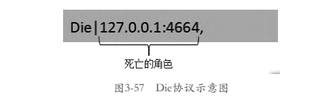

# 第四章 正确收发数据流

1. TCP数据流：粘包半包现象

   在聊天软件中，客户端依次 发送“Lpy”和“_is_handsome”，期望其他客户端也展示出“Lpy” 和“_is_handsome”两条信息，但由于Receive可能把两条信息当作一 条信息处理，有可能只展示“Lpy_is_handsome”一条信息（如图所示）。Receive方法返回多少个数据，取决于操作系统接收缓冲区中 存放的内容

   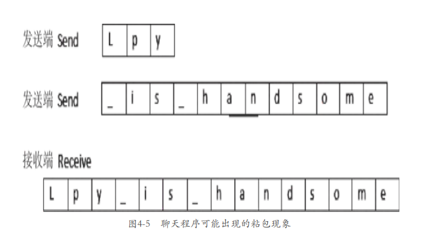

   发送端发送的数据还有可能被拆分，如发送“HelloWorld”（如图所示），但在接收端调用Receive时，操作系统只接收到了部分 数据，如“Hel”，在等待一小段时间后再次调用Receive才接收到另 一部分数据“loWorld”。

   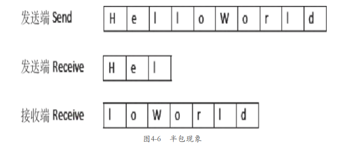

2. 解决粘包问题的方法：长度信息法、固定长度法、结束符号法

   * 长度信息法

     长度信息法是指在每个数据包前面加上长度信息。每次接收到数 据后，先读取表示长度的字节，如果缓冲区的数据长度大于要取的字 节数，则取出相应的字节，否则等待下一次数据接收。

   * 固定长度

     每次都以相同的长度发送数据，假设规定每条信息的长度都为10 个字符，那么发送“Hello”“Unity”两条信息可以发送成 “Hello...”“Unity...”，其中的“.”表示填充字符，是为凑数， 没有实际意义，只为了每次发送的数据都有固定长度。

   * 结束符号法

     规定一个结束符号，作为消息间的分隔符。假设规定结束符号为 “$”，那么发送“Hello”“Unity”两条信息可以发送成“Hello$” “Unity$”。接收方每次读取数据，直到“$”出现为止，并且使用 “$”去分割消息。

3. 大端小端

   大端：高位存低字节；小端相反

4. 完整发送数据

   Send方法会把要发送的数据存入操作系统的发 送缓冲区，然后返回成功写入的字节数。这句话的另一层含义是，对 于那些没有成功发送的数据，程序需要把它们保存起来，在适当的时 机再次发送。

   

# 第五章 深入了解TCP，解决暗藏问题

1. 从TCP到铜线：

   * 应用层

     应用层功能是应用程序（游戏程序）提供的功能。在给客户端发 送“hello”的例子中，程序把“hello”转化成二进制流传递给传输 层（传送给send方法，如图5-1所示）。操作系统会对二进制数据做一 系列加工，使它适合于网络传输。

   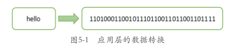

   * 传输层

     收到二进制数据后，传输层协议会对它做一系列加工，并提供数 据流传送、可靠性校验、流量控制等功能。依然想象一下寄信，在寄 出一封信后，为了确保对方一定会收到信件，人们可以约定如下的规则。

     1）加个确认机制，收到信件的人必须写回信，告诉对方收到了信 件。寄件人在收到回信后，可以确认对方一定收到了信件。

      2）信件寄出后，寄信人会等待回信。如果过一个月时间都没能收 到回信，说明信件很有可能丢失了，寄件人会重新写一封一模一样的 信，再次寄出，等待回信。如果三次重寄都没有回音，只能放弃，当 作对方不可能收到信件。

   * 网络层

     邮政系统并不是直达系统，当寄件人想要把信件从广州天河区寄 到北京西城区的时候，信件会先从天河区邮局发送到广州市邮局，再 由广州市邮局发送到北京市邮局，北京市邮局再发送到西城区邮局， 最后再由邮递员投递到指定地址。网络通信同理，数据包会经过一层 层传送，最终到达目的地（5.3.3节会有进一步介绍），所以网络消息 必须附带“寄件人地址”“收件人地址”等数据，方便“各地邮局” 投递。IP协议会给TCP数据添加本地地址、目的地地址等信息（如图所示）。

     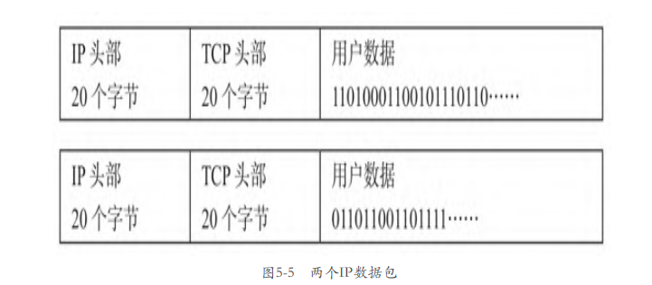

   * 网络接口

     在多层处理后，数据通过物理介质（如电缆、光纤）传输到接收 方，接收方再依照相反的过程解析，得到用户数据。实际上，IP协议 还会被封装成更为底层的链路层协议，以完成数据校验等一些功能。

2. 数据传输流程：

   * TCP连接的建立：三次握手

     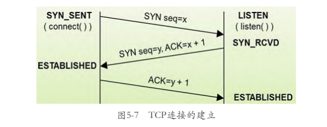

   * TCP的数据传输

     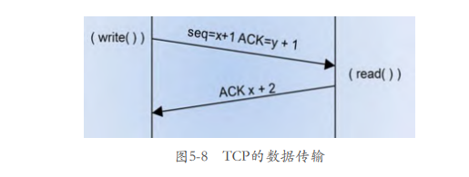

   * TCP连接的终止：四次挥手

     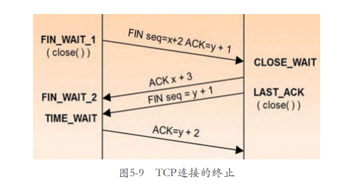

   

3. 常用TCP参数

   * ReceiveBufferSize

     ReceiveBufferSize指定了操作系统读缓冲区的大小，默认值是 8192

   * SendBufferSize

     SendBufferSize指定了操作系统写缓冲区的大小，默认值也是 8192

   * NoDelay

     指定发送数据时是否使用Nagle算法，对于实时性要求高的游戏， 该值需要设置成true。Nagle是一种节省网络流量的机制，默认情况 下，TCP会使用Nagle算法去发送数据。

   * TTL

     TTL指发送的IP数据包的生存时间值（Time To Live，TTL）。TTL 是IP头部的一个值，该值表示一个IP数据报能够经过的最大的路由器 跳数。

   * ReuseAddress

     ReuseAddress即端口复用，让同一个端口可被多个socket使用。 一般情况下，一个端口只能由一个进程独占，假设服务端程序都绑定 了1234端口，若开启两个服务端程序，虽然，第一个开启的程序能够 成功绑定端口并监听，但第二个程序会提示“端口已经在使用中”， 无法绑定端口。在计算机中，退出程序与释放端口并不同步。

   * LingerState

     LingerState的功能是设置套接字保持连接的时间。

   

4. Close的恰当时机

   LingerState选项可以让程序在关闭连接前发完系统缓冲区中的数据，然而，这并不代表能将所有数据发出去。写入队列writeQueue保存要发送的数据，再逐 一发送。

5. 心跳机制

   断开连接时，主动方会给对端发送FIN信号，开启4次挥手流程。 但在某些情况下，比如拿着手机进入没有信号的山区，更极端的，比 如有人拿剪刀把网线剪断。虽然断开了连接，但主动方无法给对端发 送FIN信号（网线剪断了还能干什么？），对端会认为连接有效，一直 占用系统资源。 

   TCP有一个连接检测机制，就是如果在指定的时间内没有数据传 送，会给对端发送一个信号（通过SetSocketOption的KeepAlive选项 开启）。对端如果收到这个信号，回送一个TCP的信号，确认已经收 到，这样就知道此连接通畅。如果一段时间没有收到对方的响应，会 进行重试，重试几次后，会认为网络不通，关闭socket。

   游戏开发中，TCP默认的KeepAlive机制很“鸡肋”，因为上述的 “一段时间”太长，默认为2小时。一般会自行实现心跳机制。心跳机 制是指客户端定时（比如每隔1分钟）向服务端发送PING消息，服务端 收到后回应PONG消息。服务端会记录客户端最后一次发送PING消息的 时间，如果很久没有收到（比如3分钟），就假定连接不通，服务端会 关闭连接，释放系统资源。

# 第六章 通用客户端网络模块

1. 网络模块设计：对外接口、内部设计

2. 网络事件：事件类型、监听列表、分发事件

3. 连接服务端：Connect、ConnectCallback、测试程序

4. 关闭连接：isClosing、Close、测试

5. Json协议：为什么会有协议类、使用JsonUtility、协议格式、协议文件、协议体的编码解码、协议名的编码解码

6. 发送数据：Send、SendCallback、测试

7. 消息事件

8. 接收数据：新的成员、ConnectCallback、ReceiveCallback、OnReceiveData、Update、测试

9. 心跳机制：PING和PONG协议、成员变量、发送PING协议、监听PONG协议、测试

10. Protobuf协议：什么是Protobuf、编写proto文件、生成协议类、导入protobuf-net.dll、编码解码

# 第七章  通用服务端框架

1. 服务端架构

   总体架构

   模块划分

   游戏流程

2. Json编码解码

   添加协议文件

   引用System.web.Extensions

   修改MsgBase类

   测试

3. 网络模块

   整体结构

   ClientState

   开启监听和多路复用

   处理监听消息

   处理客户端消息

   关闭连接

   处理协议

   Time

   发送协议

   测试

4. 心跳机制

   lastPingTime

   时间戳

   回应MsgPing协议

   超时处理

   测试程序

5. 玩家的数据结构

   完整的ClientState

   PlayerData

   Player

   PlayerManager

6. 配置MySQL数据库

   安装并启动MySQL数据库

   安装Navicat for MySQL

   配置数据表

   安装connector

   MySQL基础知识

7. 数据库模块

   连接数据库

   防止SQL注入

   IsAccountExist

   Register

   CreatePlayer

   CheckPassword

   GetPlayerData

   UpdatePlayerData

8. 登录注册功能

   注册登录协议

   记事本协议

   注册功能

   登录功能

   退出功能

   获取文本功能

   保存文本功能

   客户端界面

   客户端监听

   客户端注册功能

   客户端登录功能

   客户端记事本功能

   测试

# 第八章 完整大项目《坦克大战》

1. 《坦克大战》游戏功能

    登录注册

   房间系统

   战斗系统

2. 坦克模型

   导入模型

   模型结构

3. 资源管理器

   设计构想

   代码实现

   测试

4. 坦克类

   设计构想

   代码实现

   测试

5. 行走控制

   速度参数

   移动控制

   测试

   走在地形上

6. 坦克爬坡

   Unity的物理系统

   添加物理组件

   测试

7. 相机跟随

   功能需求

   数学原理

   编写代码

   测试

8. 旋转炮塔

   炮塔元素

   旋转控制

   测试

9. 发射炮

   制作炮弹预设

   制作爆炸效果

   炮弹组件

   坦克开炮

   测试

10. 摧毁敌人

    坦克的生命值

    焚烧特效

    坦克被击中处理

    炮弹的攻击处理

    测试

# 第九章 UI界面模块

1. 界面模块的设计

   简单的界面调用

   通用界面模块

2. 场景结构

3. 面板基类BasePanel

   设计要点

   代码实现

   知识点

4. 界面管理器PanelManager

   层级管理

   打开面板

   关闭面板

5. 登录面板LoginPanel

   导入资源

   UI组件

   制作面板预设

   登录面板类

   打开面板

   引用UI组件

   网络监听

   登录和注册按钮

   收到登录协议

6. 注册面板RegisterPanel

   制作面板预设

   注册面板类

   按钮事件

   收到注册协议

7. 提示面板TipPanel

   制作面板预设

   提示面板类

   测试面板

8. 游戏入口GameMain

   设计要点

   代码实现

   缓存用户名

9. 功能测试

   登录

   注册

   下线

# 第十章 游戏大厅和房间

1. 列表面板预设

   整体结构

   个人信息栏

   操作栏

   房间列表栏

   Scroll View

   列表项Room

2. 房间面板预设

   整体结构

   列表栏

   列表项Player

   控制栏

3. 协议设计

   查询战绩MsgGetAchieve协议

   查询房间列表MsgGetRoomList协议

   创建房间MsgCreateRoom协议

   进入房间MsgEnterRoom协议

   查询房间信息MsgGetRoomInfo协议

   退出房间MsgLeaveRoom协议

   开始战斗MsgStartBattle协议

4. 列表面板逻辑

   面板类

   获取部件

   网络监听

   刷新战绩

   刷新房间列表

   加入房间

   创建房间

   刷新按钮

5. 房间面板逻辑

   面板类

   获取部件

   网络监听

   刷新玩家列表

   退出房间

   开始战斗

6. 打开列表面板

7. 服务端玩家数据

   存储数据

   临时数据

8. 服务端房间类

   管理器和房间类的关系

   房间类的设计要点

   添加玩家

   选择阵营

   删除玩家

   选择新房主

   广播消息

    生成房间信息

9. 服务端房间管理器

   数据结构

   获取房间

   添加房间

   删除房间

   生成列表信息

10. 服务端消息处理

    查询战绩MsgGetAchieve

    查询房间列表MsgGetRoomList

    创建房间MsgCreateRoom

    进入房间MsgEnterRoom

    查询房间信息MsgGetRoomInfo

    离开房间MsgLeaveRoom

11. 玩家事件处理

12. 测试

# 第十一章 战斗和胜负判定

1. 协议设计

   进入战斗MsgEnterBattle

   战斗结果MsgBattleResult

   退出战斗MsgLeaveBattle

2. 坦克

   不同阵营的坦克预设

   战斗模块

   同步坦克SyncTank

   坦克的属性

3. 战斗管理器

   设计要点

   管理器类

   坦克管理

   重置战场

   开始战斗

   产生坦克

   战斗结束

   玩家离开

4. 战斗结果面板

   面板预设

   面板逻辑

5. 服务端开启战斗

   能否开始战斗

   定义出生点

   坦克信息

   开启战斗

   消息处理

6. 服务端胜负判断

   是否死亡

   胜负决断函数

   定时器

   Room::Update

7. 服务端断线处理

8. 测试

   进入战场

   离开战场

# 第十二章 同步战斗信息

1. 同步理论

   同步的过程

   同步的难题

2. 状态同步

   直接状态同步

   跟随算法

   预测算法

3. 帧同步

   指令同步

   从Update说起

   什么是同步帧

   指令

   指令的执行

4. 协议设计

   位置同步MsgSyncTank

   开火MsgFire

   击中MsgHit

5. 发送同步信息

   发送位置信息

   发送开火信息

   发送击中信息

6. 处理同步信息

   协议监听

   OnMsgSyncTank

   OnMsgFire

   OnMsgHit

7. 同步坦克SyncTank

   预测算法的成员变量

   移动到预测位置

   初始化

   更新预测位置

   炮弹同步

8. 服务端消息处理

   位置同步MsgSyncTank

   开火MsgFire

   击中MsgHit

   调试

9. 完善细节

   滚动的轮子和履带

   灵活操作

   准心

   自动瞄准

   界面和场景优化

   战斗面板

   击杀提示
