# 第1篇 基础篇

## 第1章 欢迎来到Shader的世界

程序员的三大浪漫：编译原理、操作系统和图形学

## 第2章 渲染流水线

这一章讲解了现代GPU是如何实现整个渲染流水线的，这些内容对于理解Shader的工作原理有着非常重要的作用

### CPU和GPU之间的通信

渲染流水线的起点是CPU，即应用阶段。应用阶段大致可分为下面3个阶段：

* （1）把数据加载到显存中。

* （2）设置渲染状态。

* （3）调用Draw Call

###  GPU流水线

当GPU从CPU那里得到渲染命令后，就会进行一系列流水线操作，最终把图元渲染到屏幕上。GPU渲染的过程就是GPU流水线。对于概念阶段的后两个阶段，即几何阶段和光栅化阶段，开发者无法拥有绝对的控制权，其实现的载体是GPU。GPU通过实现流水线化，大大加快了渲染速度。虽然我们无法完全控制这两个阶段的实现细节，但GPU向开发者开放了很多控制权。

###  一些容易困惑的地方

1. OpenGL/DirectX：OpenGL和DirectX就是这些图像应用编程接口，这些接口用于渲染二维或三维图形。

   

2. HLSL、GLSL、CG：着色语言是专门用于编写着色器的，常见的着色语言有DirectX的HLSL（HighLevel Shading Language）、OpenGL的GLSL（OpenGL Shading Language）以及NVIDIA的CG（C for Graphic）。HLSL、GLSL、CG都是“高级（High-Level）”语言，但这种高级是相对于汇编语言来说的，而不是像C#相对于C的高级那样。

3. Draw Call：CPU调用图像编程接口，如OpenGL中的glDrawElements命令或者DirectX中的DrawIndexedPrimitive命令，以命令GPU进行渲染的操作。

4. 为什么Draw Call多了会影响帧率？

   在每次调用Draw Call之前，CPU需要向GPU发送很多内容，包括数据、状态和命令等。在这一阶段，CPU需要完成很多工作，例如检查渲染状态等。而一旦CPU完成了这些准备工作，GPU就可以开始本次的渲染。GPU的渲染能力是很强的，渲染200个还是2000个三角网格通常没有什么区别，因此渲染速度往往快于CPU提交命令的速度。如果Draw Call的数量太多，CPU就会把大量时间花费在提交Draw Call上，造成CPU的过载。

5. 固定管线渲染：在较旧的GPU上实现的渲染流水线。这种流水线只给开发者提供一些配置操作，但开发者没有对流水线阶段的完全控制权。

### Shader定义

* GPU流水线上一些可高度编程的阶段，而由着色器编译出来的最终代码是会在GPU上运行的（对于固定管线的渲染来说，着色器有时等同于一些特定的渲染设置）；
* 有一些特定类型的着色器，如顶点着色器、片元着色器等；
* 依靠着色器我们可以控制流水线中的渲染细节，例如用顶点着色器来进行顶点变换以及传递数据，用片元着色器来进行逐像素的渲染。

## 第3章 Unity Shader基础

这一章将讲解Unity Shader的实现原理和基本语法，同时也将为读者解答一些常见的困惑点。

### Unity Shader的基础：ShaderLab

Unity Shader是Unity为开发者提供的高层级的渲染抽象层。

### Unity Shader的结构

1. 命名：每个Unity Shader文件的第一行都需要通过Shader语义来指定该Unity Shader的名字。这个名字由一个字符串来定义，例如“MyShader”。当为材质选择使用的Unity Shader时，这些名称就会出现在材质面板的下拉列表里。通过在字符串中添加斜杠（“/”），可以控制Unity Shader在材质面板中出现的位置。
2. Properties：Properties语义块中包含了一系列属性（property），这些属性将会出现在材质面板中。
3. SubShader：每一个Unity Shader文件可以包含多个SubShader语义块，但最少要有一个。当Unity需要加载这个Unity Shader时，Unity会扫描所有的SubShader语义块，然后选择第一个能够在目标平台上运行的SubShader。如果都不支持的话，Unity就会使用Fallback语义指定的Unity Shader。
4. Fallback：紧跟在各个SubShader语义块后面的，可以是一个Fallback指令。它用于告诉Unity, “如果上面所有的SubShader在这块显卡上都不能运行，那么就使用这个最低级的Shader吧！”

###  Unity Shader的形式

1. 表面着色器（Surface Shader）

   表面着色器（Surface Shader）是Unity自己创造的一种着色器代码类型。它需要的代码量很少，Unity在背后做了很多工作，但渲染的代价比较大。它在本质上和下面要讲到的顶点/片元着色器是一样的。也就是说，当给Unity提供一个表面着色器的时候，它在背后仍旧把它转换成对应的顶点/片元着色器。我们可以理解成，表面着色器是Unity对顶点/片元着色器的更高一层的抽象。它存在的价值在于，Unity为我们处理了很多光照细节，使得我们不需要再操心这些“烦人的事情”。

2. 顶点/片元着色器

   顶点/片元着色器的代码也需要定义在CGPROGRAM和ENDCG之间，但不同的是，顶点/片元着色器是写在Pass语义块内，而非SubShader内的。原因是，我们需要自己定义每个Pass需要使用的Shader代码。虽然我们可能需要编写更多的代码，但带来的好处是灵活性很高。更重要的是，我们可以控制渲染的实现细节。

3. 固定函数着色器（FixedFunction Shader）

   上面两种Unity Shader形式都使用了可编程管线。而对于一些较旧的设备（其GPU仅支持DirectX 7.0、OpenGL 1.5或OpenGL ES 1.1），例如iPhone 3，它们不支持可编程管线着色器，因此，这时候我们就需要使用固定函数着色器（FixedFunction Shader）来完成渲染。

### 答疑解惑

1. Unity Shader和CG/HLSL之间的关系

   Unity Shader是用ShaderLab语言编写的，但对于表面着色器和顶点/片元着色器，我们可以在ShaderLab内部嵌套CG/HLSL语言来编写这些着色器代码。在提供给编程人员这些便利的背后，Unity编辑器会把这些CG片段编译成低级语言，如汇编语言等。通常，Unity会自动把这些CG片段编译到所有相关平台（这里的平台是指不同的渲染平台，例如Direct3D 9、OpenGL、Direct3D 11、OpenGL ES等）上。这些编译过程比较复杂，Unity会使用不同的编译器来把CG转换成对应平台的代码。这样就不会在切换平台时再重新编译，而且如果代码在某些平台上发生错误就可以立刻得到错误信息。

   “我就是不想用CG/HLSL来写！就是要使用GLSL来写！”，但是这意味着你可以发布的目标平台就只有Mac OS X、OpenGL ES 2.0或者Linux，而对于PC、Xbox 360这样的仅支持DirectX的平台来说，你就放弃它们了。

## 第4章 学习Shader所需的数学基础

本章将为读者讲解渲染过程中常见的数学知识，如矢量、矩阵运算、坐标空间等。本章内容可以大大帮助读者理解Shader中的数学运算。为了帮助读者加深理解，我们在讲解过程中以一个具体的例子来阐述“一头奶牛的鼻子是如何一步步被绘制到屏幕上的”。

### Unity Shader的内置变量（数学篇）

# 第2篇 初级篇

## 第5章 开始Unity Shader学习之旅

本章将实现一个简单的顶点/片元着色器，并详细解释其中每个步骤的原理，这需要读者对之前基础篇的内容有所理解。本章还会给出关于Unity Shader的一些常用的辅助技巧，例如如何调试、查看内置代码以及编写规范等。

### Unity提供的内置文件和变量

1. Unity中一些常用的包含文件

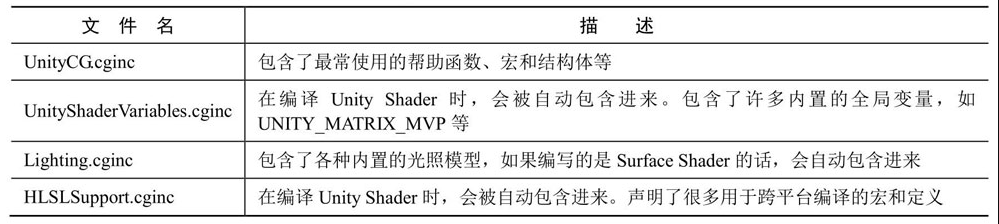

2. UnityCG.cginc中一些常用的结构体

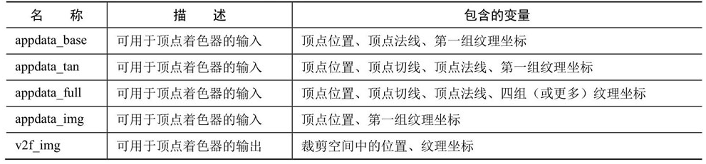

3. UnityCG.cginc中一些常用的帮助函数

   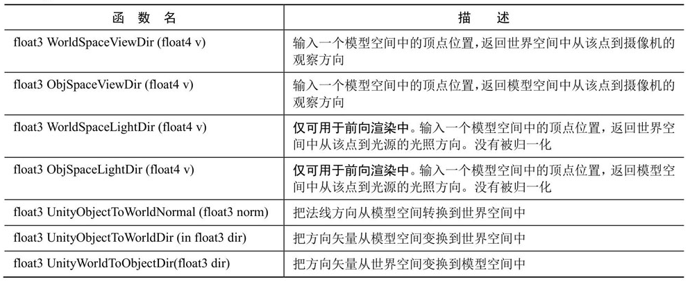

### Unity提供的CG/HLSL语义

1. 从应用阶段传递模型数据给顶点着色器时Unity支持的常用语义

   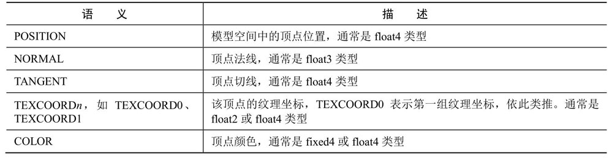

2. 从顶点着色器传递数据给片元着色器时Unity使用的常用语义

   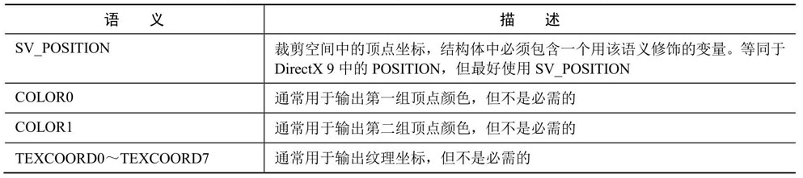

3. 片元着色器输出时Unity支持的常用语义

   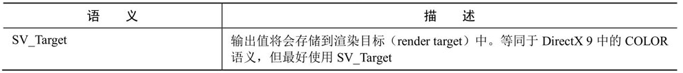

### Debug

1. 使用假彩色图像
2. 利用神器：Visual Studio——Graphics Debugger

### 渲染平台的差异

1. 渲染纹理的坐标差异

   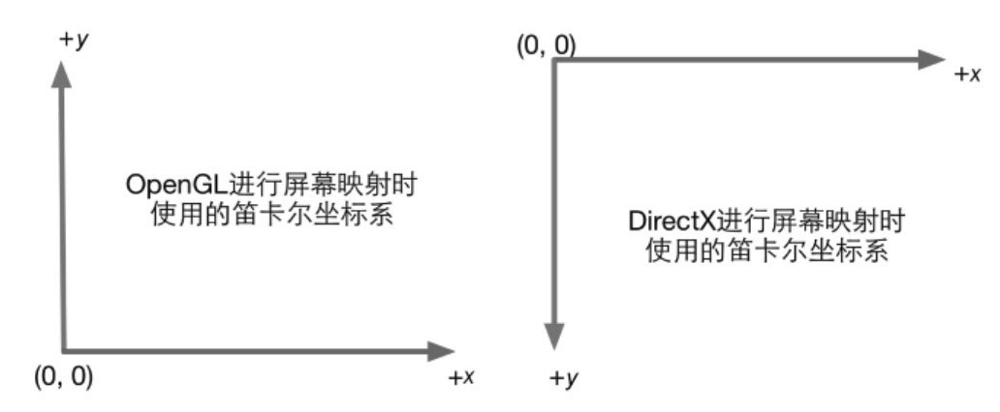

2. Shader的语法差异：DirectX 9/11对Shader的语义更加严格

3. Shader的语义差异

   * 使用SV_POSITION来描述顶点着色器输出的顶点位置。一些Shader使用了POSITION语义，但这些Shader无法在索尼PS4平台上或使用了细分着色器的情况下正常工作。
   * 使用SV_Target来描述片元着色器的输出颜色。一些Shader使用了COLOR或者COLOR0语义，同样的，这些Shader无法在索尼PS4上正常工作。

### Shader整洁之道

1. float、half还是fixed

   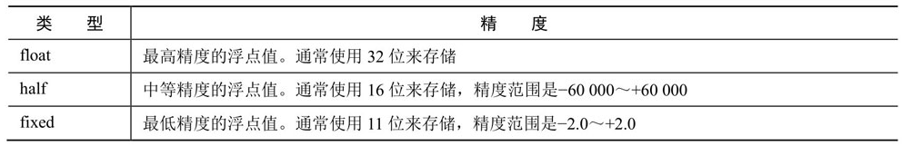

2. 规范语法：我们提到DirectX平台对Shader的语义有更加严格的要求。这意味着，如果我们要发布到DirectX平台上就需要使用更严格的语法。例如，使用和变量类型相匹配的参数数目来对变量进行初始化。

3. 避免不必要的计算

4. 慎用分支和循环语句

5. 不要除以0

## 第6章 Unity中的基础光照

本章将学习如何在Shader中实现基本的光照模型，如漫反射、高光反射等。我们首先解释如何从无到有实现一个光照模型，最后给出使用Unity提供的内置函数来实现的版本。

###  标准光照模型

标准光照模型只关心直接光照（direct light），也就是那些直接从光源发射出来照射到物体表面后，经过物体表面的一次反射直接进入摄像机的光线。

* 自发光（emissive） 这个部分用于描述当给定一个方向时，一个表面本身会向该方向发射多少辐射量。需要注意的是，如果没有使用全局光照（global illumination）技术，这些自发光的表面并不会真的照亮周围的物体，而是它本身看起来更亮了而已。

* 高光反射（specular） 这个部分用于描述当光线从光源照射到模型表面时，该表面会在完全镜面反射方向散射多少辐射量。

* 漫反射（diffuse）  这个部分用于描述，当光线从光源照射到模型表面时，该表面会向每个方向散射多少辐射量。

  漫反射光照符合兰伯特定律（Lambert's law）：反射光线的强度与表面法线和光源方向之间夹角的余弦值成正比。

* 环境光（ambient） 它用于描述其他所有的间接光照。在标准光照模型中，我们使用了一种被称为环境光的部分来近似模拟间接光照。环境光的计算非常简单，它通常是一个全局变量，即场景中的所有物体都使用这个环境光。

虽然标准光照模型仅仅是一个经验模型，也就是说，它并不完全符合真实世界中的光照现象。但由于它的易用性、计算速度和得到的效果都比较好，因此仍然被广泛使用。

但这种模型有很多局限性。首先，有很多重要的物理现象无法用Blinn-Phong模型表现出来，例如菲涅耳反射（Fresnel reflection）。其次，Blinn-Phong模型是各项同性（isotropic）的，也就是说，当我们固定视角和光源方向旋转这个表面时，反射不会发生任何改变。但有些表面是具有各向异性（anisotropic）反射性质的，例如拉丝金属、毛发等。

### Unity内置的函数

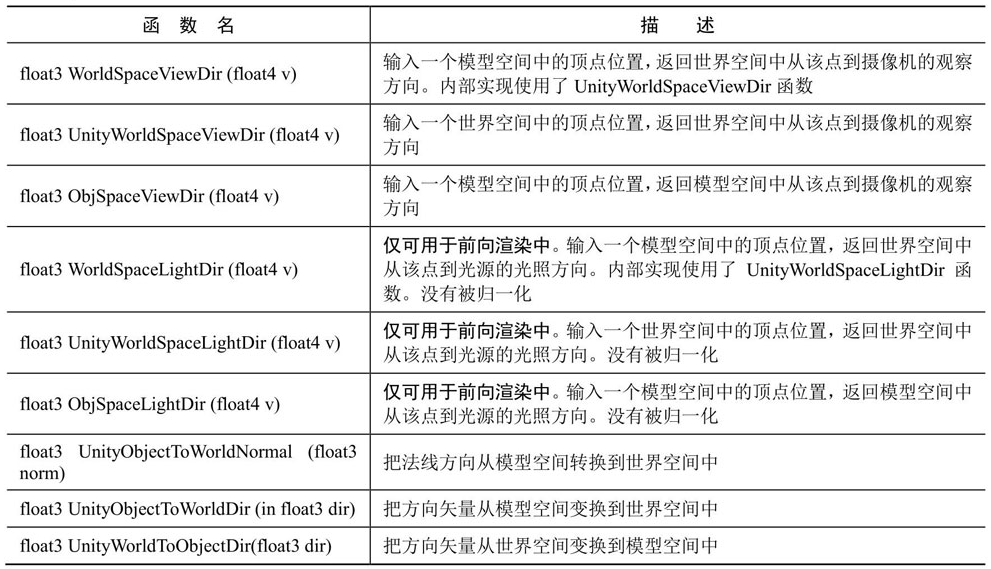

## 第7章 基础纹理

这一章将会讲述如何在Unity Shader中使用法线纹理、遮罩纹理等基础纹理，着重讲述纹理采样的原理。

纹理最初的目的就是使用一张图片来控制模型的外观。使用纹理映射（texture mapping）技术，我们可以把一张图“黏”在模型表面，逐纹素（texel）（纹素的名字是为了和像素进行区分）地控制模型的颜色。

### 7.1 单张纹理

mipmapping

纹理缩小的过程比放大更加复杂一些，此时原纹理中的多个像素将会对应一个目标像素。纹理缩放更加复杂的原因在于我们往往需要处理抗锯齿问题，一个最常使用的方法就是使用多级渐远纹理（mipmapping）技术。其中“mip”是拉丁文“multum in parvo”的缩写，它的意思是“在一个小空间中有许多东西”。如同它的名字，多级渐远纹理技术将原纹理提前用滤波处理来得到很多更小的图像，形成了一个图像金字塔，每一层都是对上一层图像降采样的结果。

### 7.2 凹凸映射

纹理的另一种常见的应用就是凹凸映射（bump mapping）。凹凸映射的目的是使用一张纹理来修改模型表面的法线，以便为模型提供更多的细节。这种方法不会真的改变模型的顶点位置，只是让模型看起来好像是“凹凸不平”的，但可以从模型的轮廓处看出“破绽”。

有两种主要的方法可以用来进行凹凸映射：

一种方法是使用一张高度纹理（heightmap）来模拟表面位移（displacement），然后得到一个修改后的法线值，这种方法也被称为高度映射（height mapping）；

另一种方法则是使用一张法线纹理（normal map）来直接存储表面法线，这种方法又被称为法线映射（normalmapping）。

### 7.3 渐变纹理

尽管在一开始，我们在渲染中使用纹理是为了定义一个物体的颜色，但后来人们发现，纹理其实可以用于存储任何表面属性。一种常见的用法就是使用渐变纹理来控制漫反射光照的结果。在之前计算漫反射光照时，我们都是使用表面法线和光照方向的点积结果与材质的反射率相乘来得到表面的漫反射光照。

使用这种技术，可以保证物体的轮廓线相比于之前使用的传统漫反射光照更加明显，而且能够提供多种色调变化。而现在，很多卡通风格的渲染中都使用了这种技术。

### 7.4 遮罩纹理

遮罩允许我们可以保护某些区域，使它们免于某些修改。例如，在之前的实现中，我们都是把高光反射应用到模型表面的所有地方，即所有的像素都使用同样大小的高光强度和高光指数。但有时，我们希望模型表面某些区域的反光强烈一些，而某些区域弱一些。为了得到更加细腻的效果，我们就可以使用一张遮罩纹理来控制光照。

另一种常见的应用是在制作地形材质时需要混合多张图片，例如表现草地的纹理、表现石子的纹理、表现裸露土地的纹理等，使用遮罩纹理可以控制如何混合这些纹理。

使用遮罩纹理的流程一般是：通过采样得到遮罩纹理的纹素值，然后使用其中某个（或某几个）通道的值（例如texel.r）来与某种表面属性进行相乘，这样，当该通道的值为0时，可以保护表面不受该属性的影响。总而言之，使用遮罩纹理可以让美术人员更加精准（像素级别）地控制模型表面的各种性质。

## 第8章 透明效果

这一章首先介绍了渲染的实现原理，并给出了和Unity的渲染顺序相关的重要内容。在了解了这些内容的基础上，我们将学习如何实现透明度测试和透明度混合等透明效果。

在Unity中，我们通常使用两种方法来实现透明效果：第一种是使用透明度测试（Alpha Test），这种方法其实无法得到真正的半透明效果；另一种是透明度混合（Alpha Blending）。

###  渲染顺序

根据深度缓存中的值来判断该片元距离摄像机的距离，当渲染一个片元时，需要把它的深度值和已经存在于深度缓冲中的值进行比较（如果开启了深度测试），如果它的值距离摄像机更远，那么说明这个片元不应该被渲染到屏幕上（有物体挡住了它）；否则，这个片元应该覆盖掉此时颜色缓冲中的像素值，并把它的深度值更新到深度缓冲中（如果开启了深度写入）。

###  Unity Shader的渲染顺序

Unity提前定义的5个渲染队列

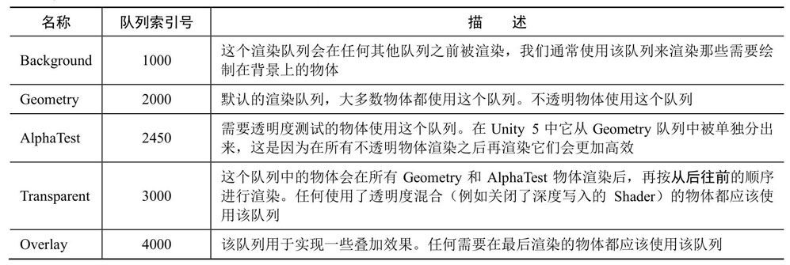

### 透明度测试

它采用一种“霸道极端”的机制，只要一个片元的透明度不满足条件（通常是小于某个阈值），那么它对应的片元就会被舍弃。被舍弃的片元将不会再进行任何处理，也不会对颜色缓冲产生任何影响；否则，就会按照普通的不透明物体的处理方式来处理它，即进行深度测试、深度写入等。也就是说，透明度测试是不需要关闭深度写入的，它和其他不透明物体最大的不同就是它会根据透明度来舍弃一些片元。虽然简单，但是它产生的效果也很极端，要么完全透明，即看不到，要么完全不透明，就像不透明物体那样。

### 透明度混合

这种方法可以得到真正的半透明效果。它会使用当前片元的透明度作为混合因子，与已经存储在颜色缓冲中的颜色值进行混合，得到新的颜色。但是，透明度混合需要关闭深度写入（我们下面会讲为什么需要关闭），这使得我们要非常小心物体的渲染顺序。需要注意的是，透明度混合只关闭了深度写入，但没有关闭深度测试。这意味着，当使用透明度混合渲染一个片元时，还是会比较它的深度值与当前深度缓冲中的深度值，如果它的深度值距离摄像机更远，那么就不会再进行混合操作。这一点决定了，当一个不透明物体出现在一个透明物体的前面，而我们先渲染了不透明物体，它仍然可以正常地遮挡住透明物体。也就是说，对于透明度混合来说，深度缓冲是只读的。

###  ShaderLab的混合命令

1.  ShaderLab中设置混合因子的命令

   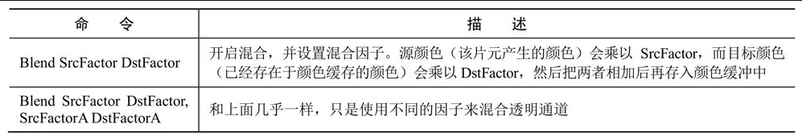

2. ShaderLab中的混合因子

   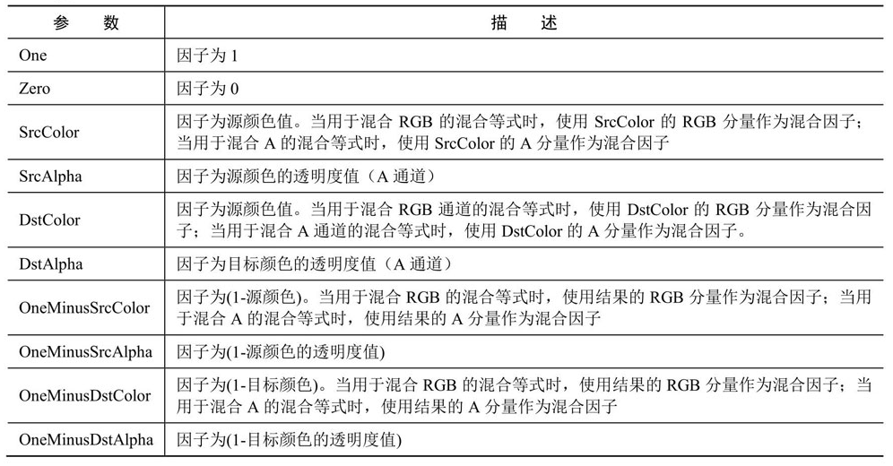

3. ShaderLab中的混合操作

   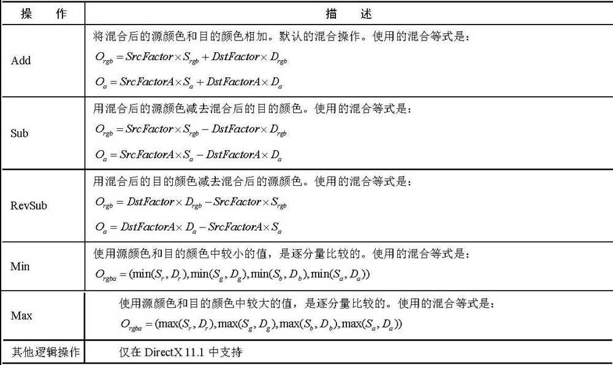

### 双面渲染的透明效果

在现实生活中，如果一个物体是透明的，意味着我们不仅可以透过它看到其他物体的样子，也可以看到它内部的结构。但在前面实现的透明效果中，无论是透明度测试还是透明度混合，我们都无法观察到正方体内部及其背面的形状，导致物体看起来就好像只有半个一样。这是因为，默认情况下渲染引擎剔除了物体背面（相对于摄像机的方向）的渲染图元，而只渲染了物体的正面。如果我们想要得到双面渲染的效果，可以使用Cull指令来控制需要剔除哪个面的渲染图元。

# 第3篇 中级篇

## 第9章 更复杂的光照

本章首先讲解Unity中的3种渲染路径和3种重要的光源类型，再解释如何在前向渲染路径中实现包含了光照衰减、阴影等效果的完整的光照计算。在本章最后，我们会给出基于之前学习内容实现的包含了完整光照计算的Unity Shader。

### Unity的渲染路径

渲染路径（Rendering Path）决定了光照是如何应用到Unity Shader中的。

1. 前向渲染路径

   (1) 每进行一次完整的前向渲染，我们需要渲染该对象的渲染图元，并计算两个缓冲区的信息：一个是颜色缓冲区，一个是深度缓冲区。我们利用深度缓冲来决定一个片元是否可见，如果可见就更新颜色缓冲区中的颜色值。

   (2) 在Unity中，前向渲染路径有3种处理光照（即照亮物体）的方式：逐顶点处理、逐像素处理，球谐函数（Spherical Harmonics, SH）处理。而决定一个光源使用哪种处理模式取决于它的类型和渲染模式。

   (3) Unity使用的判断规则如下。

   * 场景中最亮的平行光总是按逐像素处理的。
   * 渲染模式被设置成Not Important的光源，会按逐顶点或者SH处理。
   * 渲染模式被设置成Important的光源，会按逐像素处理。
   * 如果根据以上规则得到的逐像素光源数量小于Quality Setting中的逐像素光源数量(Pixel Light Count)，会有更多的光源以逐像素的方式进行渲染。

   (4)前向渲染可以使用的内置光照变量

   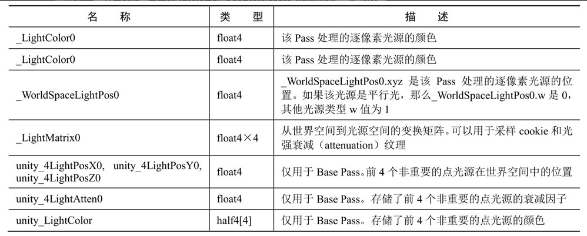

   (5) 前向渲染可以使用的内置光照函数

   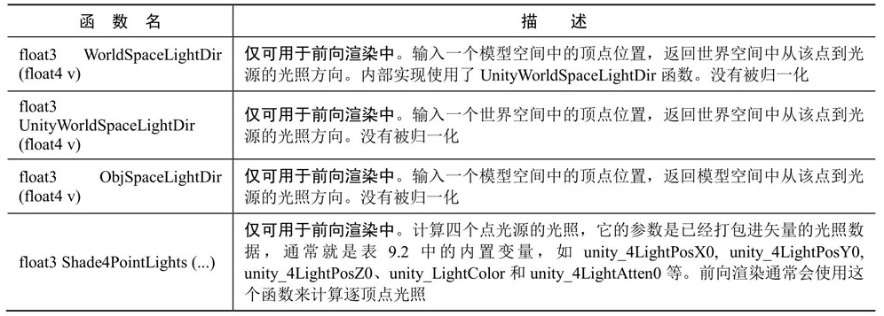

2. 顶点照明渲染路径

   (1) 顶点照明渲染路径是对硬件配置要求最少、运算性能最高，但同时也是得到的效果最差的一种类型，它不支持那些逐像素才能得到的效果，例如阴影、法线映射、高精度的高光反射等。实际上，它仅仅是前向渲染路径的一个子集，也就是说，所有可以在顶点照明渲染路径中实现的功能都可以在前向渲染路径中完成。

   (2) 顶点照明渲染路径中可以使用的内置变量

   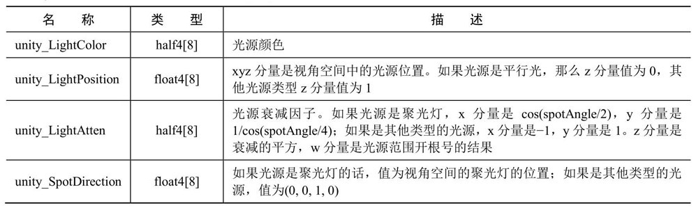

   (3)  顶点照明渲染路径中可以使用的内置函数

   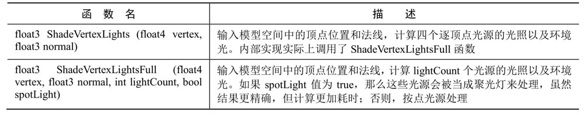

3. 延迟渲染路径

   (1) 延迟渲染主要包含了两个Pass。在第一个Pass中，我们不进行任何光照计算，而是仅仅计算哪些片元是可见的，这主要是通过深度缓冲技术来实现，当发现一个片元是可见的，我们就把它的相关信息存储到G缓冲区中。然后，在第二个Pass中，我们利用G缓冲区的各个片元信息，例如表面法线、视角方向、漫反射系数等，进行真正的光照计算。

   (2) Unity有两种延迟渲染路径，一种是遗留的延迟渲染路径，即Unity 5之前使用的延迟渲染路径，而另一种是Unity5.x中使用的延迟渲染路径。如果游戏中使用了大量的实时光照，那么我们可能希望选择延迟渲染路径，但这种路径需要一定的硬件支持。

   (3) 延迟渲染缺点

   * 不支持真正的抗锯齿（anti-aliasing）功能。
   * 不能处理半透明物体。
   * 对显卡有一定要求。如果要使用延迟渲染的话，显卡必须支持MRT（Multiple Render Targets）、Shader Mode 3.0及以上、深度渲染纹理以及双面的模板缓冲。

   (4) 延迟渲染路径中可以使用的内置变量

   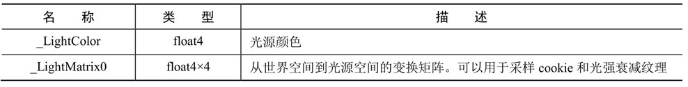

### Unity的光源类型

平行光、点光源、聚光灯和面光源（area light）

### Unity的光照衰减

1. 用于光照衰减的纹理
2. 使用数学公式计算衰减

### Unity的阴影

在实时渲染中，我们最常使用的是一种名为Shadow Map的技术。这种技术理解起来非常简单，它会首先把摄像机的位置放在与光源重合的位置上，那么场景中该光源的阴影区域就是那些摄像机看不到的地方。

在前向渲染路径中，如果场景中最重要的平行光开启了阴影，Unity就会为该光源计算它的阴影映射纹理（shadowmap）。这张阴影映射纹理本质上也是一张深度图，它记录了从该光源的位置出发、能看到的场景中距离它最近的表面位置（深度信息）。

## 第10章 高级纹理

这一章将会讲解如何在Unity Shader中使用立方体纹理、渲染纹理和程序纹理等高级纹理。

###  立方体纹理

在图形学中，立方体纹理（Cubemap）是环境映射（Environment Mapping）的一种实现方法。环境映射可以模拟物体周围的环境，而使用了环境映射的物体可以看起来像镀了层金属一样反射出周围的环境。

和之前见到的纹理不同，立方体纹理一共包含了6张图像，这些图像对应了一个立方体的6个面，立方体纹理的名称也由此而来。立方体的每个面表示沿着世界空间下的轴向（上、下、左、右、前、后）观察所得的图像。

1. 天空盒子
2. 环境映射：模拟出金属质感的材质
3. 反射：使用了反射效果的物体通常看起来就像镀了层金属
4. 折射
5. 菲涅耳反射：菲涅耳反射描述了一种光学现象，即当光线照射到物体表面上时，一部分发生反射，一部分进入物体内部，发生折射或散射。

### 渲染纹理

现代的GPU允许我们把整个三维场景渲染到一个中间缓冲中，即渲染目标纹理（Render Target Texture, RTT），而不是传统的帧缓冲或后备缓冲（backbuffer）。与之相关的是多重渲染目标（Multiple Render Target, MRT），这种技术指的是GPU允许我们把场景同时渲染到多个渲染目标纹理中，而不再需要为每个渲染目标纹理单独渲染完整的场景。延迟渲染就是使用多重渲染目标的一个应用。

Unity为渲染目标纹理定义了一种专门的纹理类型——渲染纹理（Render Texture）。在Unity中使用渲染纹理通常有两种方式：

一种方式是在Project目录下创建一个渲染纹理，然后把某个摄像机的渲染目标设置成该渲染纹理，这样一来该摄像机的渲染结果就会实时更新到渲染纹理中，而不会显示在屏幕上。使用这种方法，我们还可以选择渲染纹理的分辨率、滤波模式等纹理属性。

另一种方式是在屏幕后处理时使用GrabPass命令或OnRenderImage函数来获取当前屏幕图像，Unity会把这个屏幕图像放到一张和屏幕分辨率等同的渲染纹理中，下面我们可以在自定义的Pass中把它们当成普通的纹理来处理，从而实现各种屏幕特效。我们将依次学习这两种方法在Unity中的实现（OnRenderImage函数会在第12章中讲到）。

1. 镜子效果
2. 玻璃效果
3. 水中投影

###  程序纹理

程序纹理（Procedural Texture）指的是那些由计算机生成的图像，我们通常使用一些特定的算法来创建个性化图案或非常真实的自然元素，例如木头、石子等。

使用程序纹理的好处在于我们可以使用各种参数来控制纹理的外观，而这些属性不仅仅是那些颜色属性，甚至可以是完全不同类型的图案属性，这使得我们可以得到更加丰富的动画和视觉效果。

## 第11章 让画面动起来

静态的画面往往是无趣的。这一章将帮助读者学习如何在Shader中使用时间变量来实现纹理动画、顶点动画等动态效果。

### Unity Shader中的内置变量（时间篇）

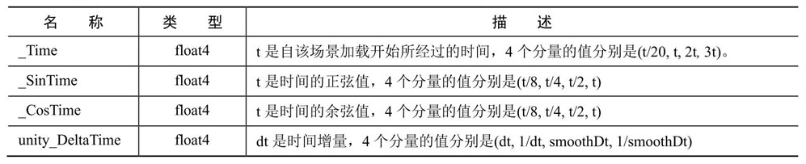

### 纹理动画

1. 序列帧动画

   每个时刻计算该时刻下应该播放的关键帧的位置，并对该关键帧进行纹理采样

2. 滚动的背景

### 顶点动画

1. 流动的河流

   它的原理通常就是使用正弦函数等来模拟水流的波动效果。

2. 广告牌技术

   广告牌技术会根据视角方向来旋转一个被纹理着色的多边形（通常就是简单的四边形，这个多边形就是广告牌），使得多边形看起来好像总是面对着摄像机。广告牌技术被用于很多应用，比如渲染烟雾、云朵、闪光效果等。

   广告牌技术的本质就是构建旋转矩阵，而我们知道一个变换矩阵需要3个基向量。广告牌技术使用的基向量通常就是表面法线（normal）、指向上的方向（up）以及指向右的方向（right）。除此之外，我们还需要指定一个锚点（anchorlocation），这个锚点在旋转过程中是固定不变的，以此来确定多边形在空间中的位置。

# 第4篇 高级篇

## 第12章 屏幕后处理效果

屏幕特效是游戏中常用的渲染手法之一。这一章将介绍如何在Unity中实现一个基本的屏幕后处理脚本系统，并给出一些基本的屏幕特效的实现原理，如高斯模糊、边缘检测等。

### 边缘检测

边缘检测的原理是利用一些边缘检测算子对图像进行卷积（convolution）操作

1. 卷积

   在图像处理中，卷积操作指的就是使用一个卷积核（kernel）对一张图像中的每个像素进行一系列操作。卷积核通常是一个四方形网格结构（例如2×2、3×3的方形区域），该区域内每个方格都有一个权重值。当对图像中的某个像素进行卷积时，我们会把卷积核的中心放置于该像素上，如图12.4所示，翻转核之后再依次计算核中每个元素和其覆盖的图像像素值的乘积并求和，得到的结果就是该位置的新像素值。

2. 边界 

   如果相邻像素之间存在差别明显的颜色、亮度、纹理等属性，我们就会认为它们之间应该有一条边界。这种相邻像素之间的差值可以用梯度（gradient）来表示，可以想象得到，边缘处的梯度绝对值会比较大。

3. 基于边界的理解，有几种不同的边缘检测算子被先后提出来。

   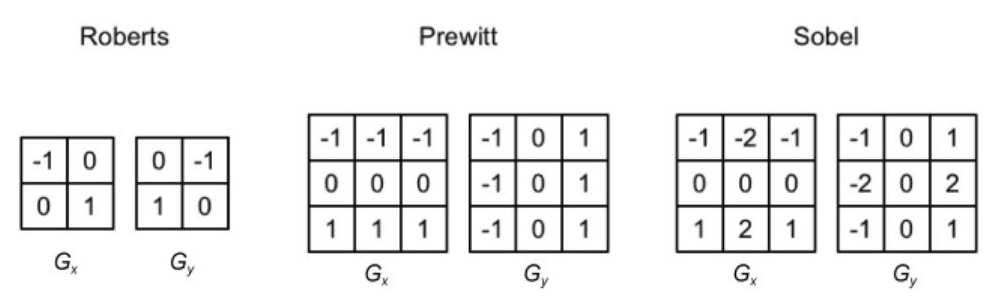

   它们都包含了两个方向的卷积核，分别用于检测水平方向和竖直方向上的边缘信息。在进行边缘检测时，我们需要对每个像素分别进行一次卷积计算，得到两个方向上的梯度值Gx和Gy，而整体的梯度可按下面的公式计算而得：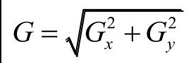

   当得到梯度G后，我们就可以据此来判断哪些像素对应了边缘（梯度值越大，越有可能是边缘点）。

### 高斯模糊

模糊的实现有很多方法，例如均值模糊和中值模糊。均值模糊同样使用了卷积操作，它使用的卷积核中的各个元素值都相等，且相加等于1，也就是说，卷积后得到的像素值是其邻域内各个像素值的平均值。而中值模糊则是选择邻域内对所有像素排序后的中值替换掉原颜色。一个更高级的模糊方法是高斯模糊。

### Bloom效果

Bloom的实现原理非常简单：我们首先根据一个阈值提取出图像中的较亮区域，把它们存储在一张渲染纹理中，再利用高斯模糊对这张渲染纹理进行模糊处理，模拟光线扩散的效果，最后再将其和原图像进行混合，得到最终的效果。

### 运动模糊

运动模糊的实现有多种方法。一种实现方法是利用一块累积缓存（accumulation buffer）来混合多张连续的图像。当物体快速移动产生多张图像后，我们取它们之间的平均值作为最后的运动模糊图像。然而，这种暴力的方法对性能的消耗很大，因为想要获取多张帧图像往往意味着我们需要在同一帧里渲染多次场景。另一种应用广泛的方法是创建和使用速度缓存（velocity buffer），这个缓存中存储了各个像素当前的运动速度，然后利用该值来决定模糊的方向和大小。

## 第13章 使用深度和法线纹理

使用深度和法线纹理可以帮助我们实现很多屏幕特效。本章将介绍如何在Unity中获取这些特殊的纹理来实现屏幕特效。

### 13.1 获取深度和法线纹理

### 13.2 再谈运动模糊

### 13.3 全局雾效

### 13.4 再谈边缘检测

### 13.5 扩展阅读

## 第14章 非真实感渲染

很多游戏使用了非真实感渲染的方法来渲染游戏画面。这一章将会给出常见的非真实感渲染的算法，如卡通渲染、素描风格的渲染等。本章的扩展阅读部分可以帮助读者找到更多其他类型的非真实感渲染的实现方法。

### 14.1 卡通风格的渲染

### 14.2 素描风格的渲染

### 14.3 扩展阅读

### 14.4 参考文献

## 第15章 使用噪声

很多时候噪声是我们的救星。本章给出了噪声在游戏渲染中的一些应用。

### 15.1 消融效果

### 15.2 水波效果

### 15.3 再谈全局雾效

### 15.4 扩展阅读

### 15.5 参考文献

## 第16章 Unity中的渲染优化技术

优化往往是游戏渲染中的重点。这一章介绍了Unity中针对移动平台使用的常见的优化技巧。

### 16.1 移动平台的特点

### 16.2 影响性能的因素

### 16.3 Unity中的渲染分析工具

### 16.4 减少draw call数目

### 16.5 减少需要处理的顶点数目

### 16.6 减少需要处理的片元数目

### 16.7 节省带宽

### 16.8 减少计算复杂度

### 16.9 扩展阅读

# 第5篇 扩展篇

## 第17章 Unity的表面着色器探秘

Unity提出了一种新颖的Shader形式——表面着色器。本章将会介绍这些表面着色器是如何实现的，以及如何使用这些表面着色器来实现渲染。

### 17.1 表面着色器的一个例子

### 17.2 编译指令

### 17.3 两个结构体

### 17.4 Unity背后做了什么

### 17.5 表面着色器实例分析

### 17.6 Surface Shader的缺点

## 第18章 基于物理的渲染

Unity 5终于引入了基于物理的渲染，这给Unity引擎带来了更强的渲染能力。这一章将介绍基于物理渲染的理论基础，并解释Unity是如何实现基于物理的渲染的。我们还会在本章实现一个基本的场景来进一步阐述如何在Unity 5中利用基于物理的渲染。

### 18.1 PBS的理论和数学基础

### 18.2 Unity 5的Standard Shader

### 18.3 一个更加复杂的例子

### 18.4 答疑解惑

### 18.5 扩展阅读

### 18.6 参考文献

## 第19章 Unity 5更新了什么

本章将给出Unity 5中一些重要的更新，以帮助读者解决在升级Unity 5时所面对的各种问题。

### 19.1 场景“更亮了”

### 19.2 表面着色器更容易“报错了”

### 19.3 当家做主：自己控制非统一缩放的网格

### 19.4 固定管线着色器逐渐退出舞台

## 第20章 还有更多内容吗

图形学的丰富多彩远远超乎我们的想象，我们相信一本书也远远无法满足一些读者强烈的求知欲。在最后一章中，我们将给出许多非常有价值的学习资料，以帮助读者进行更深入的学习。

### 20.1 如果你想深入了解渲染的话

### 20.2 世界那么大

### 20.3 参考文献

本书特色
