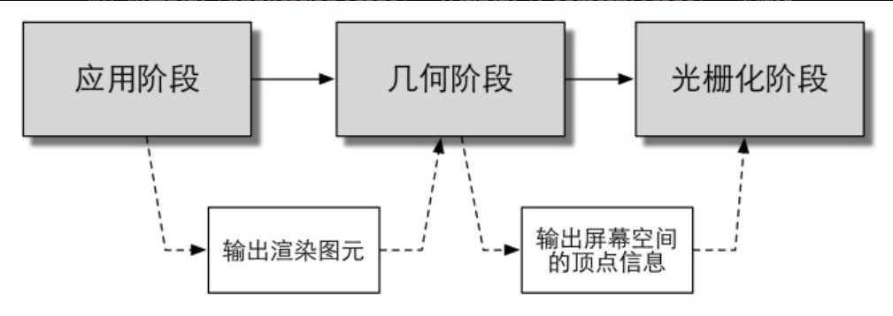
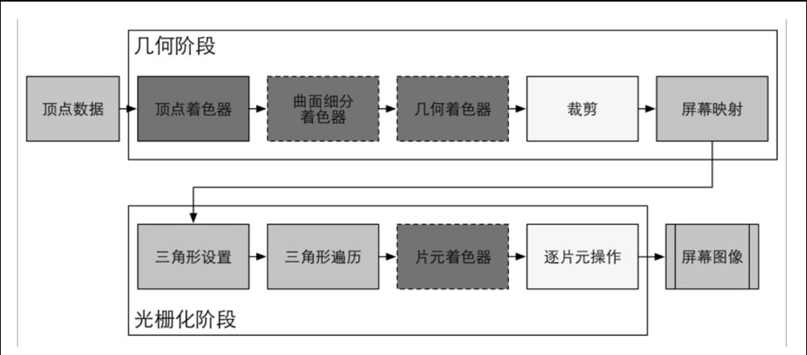
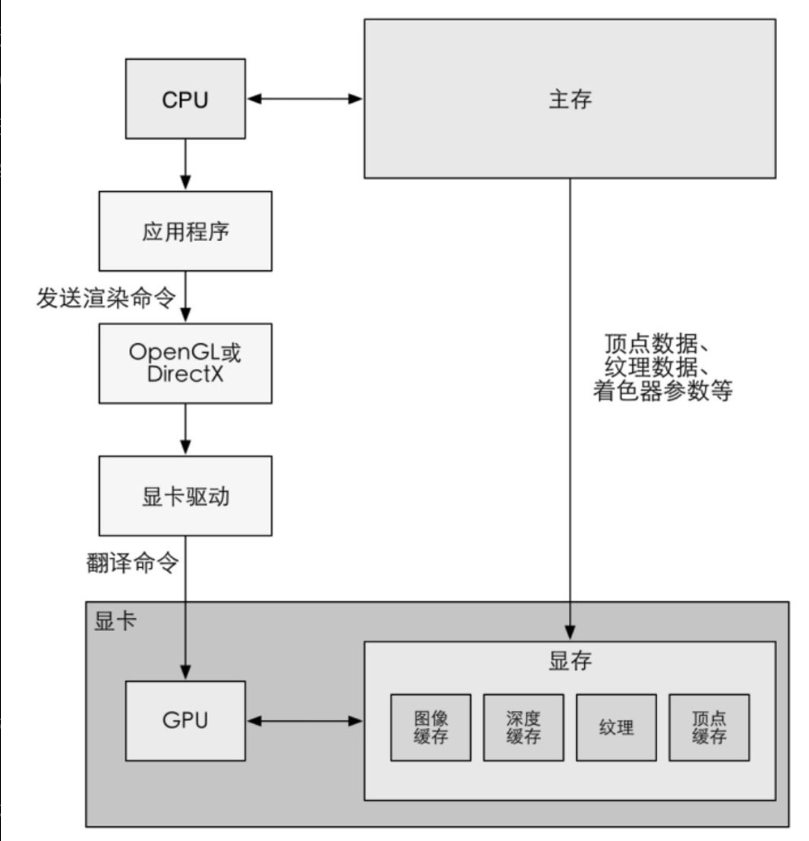
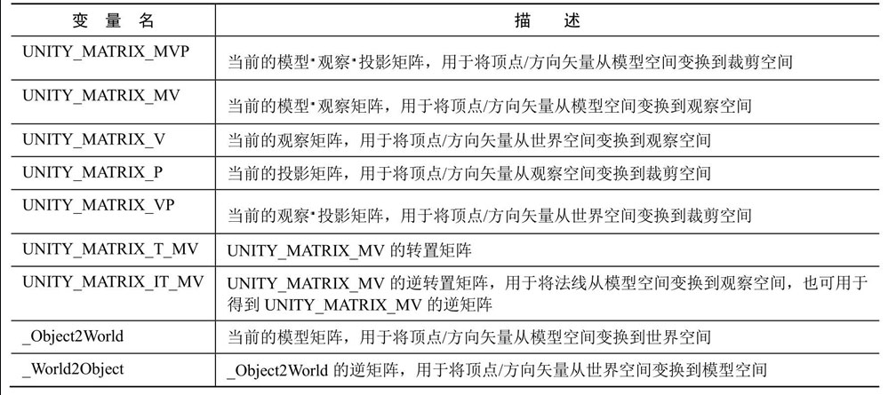
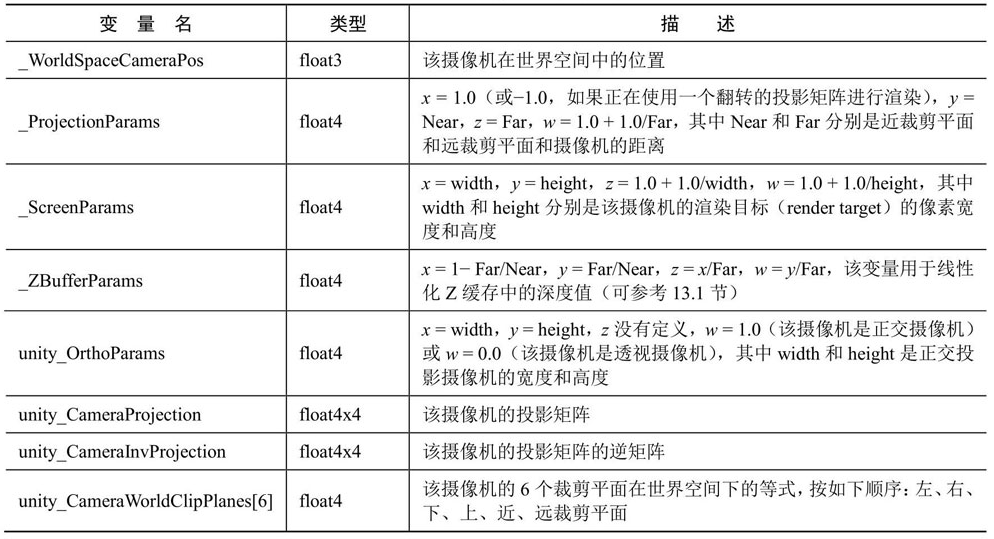

# 第1篇 基础篇

## 第1章 欢迎来到Shader的世界

程序员的三大浪漫：编译原理、操作系统和图形学

## 第2章 渲染流水线

这一章讲解了现代GPU是如何实现整个渲染流水线的，这些内容对于理解Shader的工作原理有着非常重要的作用

### CPU和GPU之间的通信

渲染流水线的起点是CPU，即应用阶段。应用阶段大致可分为下面3个阶段：

* （1）把数据加载到显存中。

* （2）设置渲染状态。

* （3）调用Draw Call

###  GPU流水线

当GPU从CPU那里得到渲染命令后，就会进行一系列流水线操作，最终把图元渲染到屏幕上。GPU渲染的过程就是GPU流水线。对于概念阶段的后两个阶段，即几何阶段和光栅化阶段，开发者无法拥有绝对的控制权，其实现的载体是GPU。GPU通过实现流水线化，大大加快了渲染速度。虽然我们无法完全控制这两个阶段的实现细节，但GPU向开发者开放了很多控制权。

###  一些容易困惑的地方

1. OpenGL/DirectX：OpenGL和DirectX就是这些图像应用编程接口，这些接口用于渲染二维或三维图形。

   

2. HLSL、GLSL、CG：着色语言是专门用于编写着色器的，常见的着色语言有DirectX的HLSL（HighLevel Shading Language）、OpenGL的GLSL（OpenGL Shading Language）以及NVIDIA的CG（C for Graphic）。HLSL、GLSL、CG都是“高级（High-Level）”语言，但这种高级是相对于汇编语言来说的，而不是像C#相对于C的高级那样。

3. Draw Call：CPU调用图像编程接口，如OpenGL中的glDrawElements命令或者DirectX中的DrawIndexedPrimitive命令，以命令GPU进行渲染的操作。

4. 为什么Draw Call多了会影响帧率？

   在每次调用Draw Call之前，CPU需要向GPU发送很多内容，包括数据、状态和命令等。在这一阶段，CPU需要完成很多工作，例如检查渲染状态等。而一旦CPU完成了这些准备工作，GPU就可以开始本次的渲染。GPU的渲染能力是很强的，渲染200个还是2000个三角网格通常没有什么区别，因此渲染速度往往快于CPU提交命令的速度。如果Draw Call的数量太多，CPU就会把大量时间花费在提交Draw Call上，造成CPU的过载。

5. 固定管线渲染：在较旧的GPU上实现的渲染流水线。这种流水线只给开发者提供一些配置操作，但开发者没有对流水线阶段的完全控制权。

### Shader定义

* GPU流水线上一些可高度编程的阶段，而由着色器编译出来的最终代码是会在GPU上运行的（对于固定管线的渲染来说，着色器有时等同于一些特定的渲染设置）；
* 有一些特定类型的着色器，如顶点着色器、片元着色器等；
* 依靠着色器我们可以控制流水线中的渲染细节，例如用顶点着色器来进行顶点变换以及传递数据，用片元着色器来进行逐像素的渲染。

## 第3章 Unity Shader基础

这一章将讲解Unity Shader的实现原理和基本语法，同时也将为读者解答一些常见的困惑点。

### Unity Shader的基础：ShaderLab

Unity Shader是Unity为开发者提供的高层级的渲染抽象层。

### Unity Shader的结构

1. 命名：每个Unity Shader文件的第一行都需要通过Shader语义来指定该Unity Shader的名字。这个名字由一个字符串来定义，例如“MyShader”。当为材质选择使用的Unity Shader时，这些名称就会出现在材质面板的下拉列表里。通过在字符串中添加斜杠（“/”），可以控制Unity Shader在材质面板中出现的位置。
2. Properties：Properties语义块中包含了一系列属性（property），这些属性将会出现在材质面板中。
3. SubShader：每一个Unity Shader文件可以包含多个SubShader语义块，但最少要有一个。当Unity需要加载这个Unity Shader时，Unity会扫描所有的SubShader语义块，然后选择第一个能够在目标平台上运行的SubShader。如果都不支持的话，Unity就会使用Fallback语义指定的Unity Shader。
4. Fallback：紧跟在各个SubShader语义块后面的，可以是一个Fallback指令。它用于告诉Unity, “如果上面所有的SubShader在这块显卡上都不能运行，那么就使用这个最低级的Shader吧！”

###  Unity Shader的形式

1. 表面着色器（Surface Shader）

   表面着色器（Surface Shader）是Unity自己创造的一种着色器代码类型。它需要的代码量很少，Unity在背后做了很多工作，但渲染的代价比较大。它在本质上和下面要讲到的顶点/片元着色器是一样的。也就是说，当给Unity提供一个表面着色器的时候，它在背后仍旧把它转换成对应的顶点/片元着色器。我们可以理解成，表面着色器是Unity对顶点/片元着色器的更高一层的抽象。它存在的价值在于，Unity为我们处理了很多光照细节，使得我们不需要再操心这些“烦人的事情”。

2. 顶点/片元着色器

   顶点/片元着色器的代码也需要定义在CGPROGRAM和ENDCG之间，但不同的是，顶点/片元着色器是写在Pass语义块内，而非SubShader内的。原因是，我们需要自己定义每个Pass需要使用的Shader代码。虽然我们可能需要编写更多的代码，但带来的好处是灵活性很高。更重要的是，我们可以控制渲染的实现细节。

3. 固定函数着色器（FixedFunction Shader）

   上面两种Unity Shader形式都使用了可编程管线。而对于一些较旧的设备（其GPU仅支持DirectX 7.0、OpenGL 1.5或OpenGL ES 1.1），例如iPhone 3，它们不支持可编程管线着色器，因此，这时候我们就需要使用固定函数着色器（FixedFunction Shader）来完成渲染。

### 答疑解惑

1. Unity Shader和CG/HLSL之间的关系

   Unity Shader是用ShaderLab语言编写的，但对于表面着色器和顶点/片元着色器，我们可以在ShaderLab内部嵌套CG/HLSL语言来编写这些着色器代码。在提供给编程人员这些便利的背后，Unity编辑器会把这些CG片段编译成低级语言，如汇编语言等。通常，Unity会自动把这些CG片段编译到所有相关平台（这里的平台是指不同的渲染平台，例如Direct3D 9、OpenGL、Direct3D 11、OpenGL ES等）上。这些编译过程比较复杂，Unity会使用不同的编译器来把CG转换成对应平台的代码。这样就不会在切换平台时再重新编译，而且如果代码在某些平台上发生错误就可以立刻得到错误信息。

   “我就是不想用CG/HLSL来写！就是要使用GLSL来写！”，但是这意味着你可以发布的目标平台就只有Mac OS X、OpenGL ES 2.0或者Linux，而对于PC、Xbox 360这样的仅支持DirectX的平台来说，你就放弃它们了。

## 第4章 学习Shader所需的数学基础

本章将为读者讲解渲染过程中常见的数学知识，如矢量、矩阵运算、坐标空间等。本章内容可以大大帮助读者理解Shader中的数学运算。为了帮助读者加深理解，我们在讲解过程中以一个具体的例子来阐述“一头奶牛的鼻子是如何一步步被绘制到屏幕上的”。

### Unity Shader的内置变量（数学篇）

# 第2篇 初级篇

## 第5章 开始Unity Shader学习之旅

第5章 开始Unity Shader学习之旅 本章将实现一个简单的顶点/片元着色器，并详细解释其中每个步骤的原理，这需要读者对之前基础篇的内容有所理解。本章还会给出关于Unity Shader的一些常用的辅助技巧，例如如何调试、查看内置代码以及编写规范等。

### 5.1 本书使用的软件和环境

### 5.2 一个最简单的顶点/片元着色器

### 5.3 强大的援手：Unity提供的内置文件和变量

### 5.4 Unity提供的CG/HLSL语义

### 5.5 程序员的烦恼：Debug

### 5.6 小心：渲染平台的差异

### 5.7 Shader整洁之道

### 5.8 扩展阅读

## 第6章 Unity中的基础光照

第6章Unity中的基础光照 本章将学习如何在Shader中实现基本的光照模型，如漫反射、高光反射等。我们首先解释如何从无到有实现一个光照模型，最后给出使用Unity提供的内置函数来实现的版本。

### 6.1 我们是如何看到这个世界的

### 6.2 标准光照模型

### 6.3 Unity中的环境光和自发光

### 6.4 在Unity Shader中实现漫反射光照模型

### 6.5 在Unity Shader中实现高光反射光照模型

### 6.6 召唤神龙：使用Unity内置的函数

## 第7章 基础纹理

第7章 基础纹理 纹理的使用给渲染的世界带来了更多的变化。这一章将会讲述如何在Unity Shader中使用法线纹理、遮罩纹理等基础纹理。

### 7.1 单张纹理

### 7.2 凹凸映射

### 7.3 渐变纹理

### 7.4 遮罩纹理

## 第8章 透明效果

第8章 透明效果 透明是游戏中常用的渲染效果。这一章首先介绍了渲染的实现原理，并给出了和Unity的渲染顺序相关的重要内容。在了解了这些内容的基础上，我们将学习如何实现透明度测试和透明度混合等透明效果。

### 8.1 为什么渲染顺序很重要

### 8.2 Unity Shader的渲染顺序

### 8.3 透明度测试

### 8.4 透明度混合

### 8.5 开启深度写入的半透明效果

### 8.6 ShaderLab的混合命令

### 8.7 双面渲染的透明效果

# 第3篇 中级篇

## 第9章 更复杂的光照

第9章 更复杂的光照 我们在初级篇中实现的光照模型没有考虑一些重要的光照计算，如阴影和光照衰减。本章首先讲解Unity中的3种渲染路径和3种重要的光源类型，再解释如何在前向渲染路径中实现包含了光照衰减、阴影等效果的完整的光照计算。在本章最后，我们会给出基于之前学习内容实现的包含了完整光照计算的Unity Shader。

### 9.1 Unity的渲染路径

### 9.2 Unity的光源类型

### 9.3 Unity的光照衰减

### 9.4 Unity的阴影

### 9.5 本书使用的标准Unity Shader

## 第10章 高级纹理

第10章 高级纹理 这一章将会讲解如何在Unity Shader中使用立方体纹理、渲染纹理和程序纹理等高级纹理。

### 10.1 立方体纹理

### 10.2 渲染纹理

### 10.3 程序纹理

## 第11章 让画面动起来

第11章 让画面动起来 静态的画面往往是无趣的。这一章将帮助读者学习如何在Shader中使用时间变量来实现纹理动画、顶点动画等动态效果。

### 11.1 Unity Shader中的内置变量（时间篇）

### 11.2 纹理动画

### 11.3 顶点动画

# 第4篇 高级篇

## 第12章 屏幕后处理效果

第12章 屏幕后处理效果 屏幕特效是游戏中常用的渲染手法之一。这一章将介绍如何在Unity中实现一个基本的屏幕后处理脚本系统，并给出一些基本的屏幕特效的实现原理，如高斯模糊、边缘检测等。

### 12.1 建立一个基本的屏幕后处理脚本系统

### 12.2 调整屏幕的亮度、饱和度和对比度

### 12.3 边缘检测

### 12.4 高斯模糊

### 12.5 Bloom效果

### 12.6 运动模糊

### 12.7 扩展阅读

## 第13章 使用深度和法线纹理

第13章 使用深度和法线纹理 使用深度和法线纹理可以帮助我们实现很多屏幕特效。本章将介绍如何在Unity中获取这些特殊的纹理来实现屏幕特效。

### 13.1 获取深度和法线纹理

### 13.2 再谈运动模糊

### 13.3 全局雾效

### 13.4 再谈边缘检测

### 13.5 扩展阅读

## 第14章 非真实感渲染

第14章 非真实感渲染 很多游戏使用了非真实感渲染的方法来渲染游戏画面。这一章将会给出常见的非真实感渲染的算法，如卡通渲染、素描风格的渲染等。本章的扩展阅读部分可以帮助读者找到更多其他类型的非真实感渲染的实现方法。

### 14.1 卡通风格的渲染

### 14.2 素描风格的渲染

### 14.3 扩展阅读

### 14.4 参考文献

## 第15章 使用噪声

第15章 使用噪声 很多时候噪声是我们的救星。本章给出了噪声在游戏渲染中的一些应用。

### 15.1 消融效果

### 15.2 水波效果

### 15.3 再谈全局雾效

### 15.4 扩展阅读

### 15.5 参考文献

## 第16章 Unity中的渲染优化技术

第16章Unity中的渲染优化技术 优化往往是游戏渲染中的重点。这一章介绍了Unity中针对移动平台使用的常见的优化技巧。

### 16.1 移动平台的特点

### 16.2 影响性能的因素

### 16.3 Unity中的渲染分析工具

### 16.4 减少draw call数目

### 16.5 减少需要处理的顶点数目

### 16.6 减少需要处理的片元数目

### 16.7 节省带宽

### 16.8 减少计算复杂度

### 16.9 扩展阅读

# 第5篇 扩展篇

## 第17章 Unity的表面着色器探秘

第17章Unity的表面着色器探秘 Unity提出了一种新颖的Shader形式——表面着色器。本章将会介绍这些表面着色器是如何实现的，以及如何使用这些表面着色器来实现渲染。

### 17.1 表面着色器的一个例子

### 17.2 编译指令

### 17.3 两个结构体

### 17.4 Unity背后做了什么

### 17.5 表面着色器实例分析

### 17.6 Surface Shader的缺点

## 第18章 基于物理的渲染

第18章 基于物理的渲染 Unity 5终于引入了基于物理的渲染，这给Unity引擎带来了更强的渲染能力。这一章将介绍基于物理渲染的理论基础，并解释Unity是如何实现基于物理的渲染的。我们还会在本章实现一个基本的场景来进一步阐述如何在Unity 5中利用基于物理的渲染。

### 18.1 PBS的理论和数学基础

### 18.2 Unity 5的Standard Shader

### 18.3 一个更加复杂的例子

### 18.4 答疑解惑

### 18.5 扩展阅读

### 18.6 参考文献

## 第19章 Unity 5更新了什么

第19章Unity 5更新了什么相较于Unity 4.x, Unity 5在Shader方面有很多重要的更新。本章将给出Unity 5中一些重要的更新，以帮助读者解决在升级Unity 5时所面对的各种问题。

### 19.1 场景“更亮了”

### 19.2 表面着色器更容易“报错了”

### 19.3 当家做主：自己控制非统一缩放的网格

### 19.4 固定管线着色器逐渐退出舞台

## 第20章 还有更多内容吗

第20章 还有更多内容吗 图形学的丰富多彩远远超乎我们的想象，我们相信一本书也远远无法满足一些读者强烈的求知欲。在最后一章中，我们将给出许多非常有价值的学习资料，以帮助读者进行更深入的学习。

### 20.1 如果你想深入了解渲染的话

### 20.2 世界那么大

### 20.3 参考文献

本书特色
