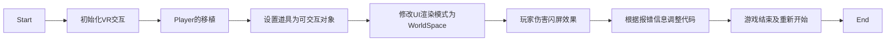

# Unity VR虚拟现实完全自学教程

# 第 1 章 VR 行业概述

VR 行业目前处于发展早期阶段，在大众市场普及方面面临着挑战，行业生态尚需完善，硬件先发展还是内容先丰富，貌似是一个悖论，但我们应该看到，硬件技术正在飞速发展，硬件产业链上的厂家也在还渐提高产品性能，同时深度学习、SG 等技术也逐渐显露，随着Unity 等内容制作引擎的版本升级，使得开发者制作高品质 VR 应用程序的门槛也越来越低。我们有理由相信，VR 技术会在未来蓬勃发展。

# 第 2 章 Unity VR 概述

Unity 是当前业界领先的 VR/AR 内容制作工具，是大多数 VR/AR 创作者首选的开发工具，世界上超过 60%的 VR/AR 内容是用 Unity 制作完成的。Unity 为制作优质的 VR 应用程序提供了一系列先进的解决方案，无论是 VR、AR 还是MR，都可以依靠 Unity 高度优化的渲染流水线以及编辑器的快速迭代功能，使需求得以完美实现。基于跨平台的优势，Unity 支持市面上绝大多数的硬件平台，原生支持 Oculus Rift、 Steam VR/VIVE、 Play Station VR、Gear VR、Microsoft HoloLens 以及Google 的 Daydream View。

# 第 3 章 当前主流 VR 硬件

HTC VIVE （HTC 使用Value公司的Steam VR技术）、Oculus Rift（被Facebook收购前期版本使用SteamVR）、Gear VR（三星使用Oculus技术）、Cardboard（谷歌的开源初级VR方案）、Daydream 平台（第二代谷歌VR解决方案）

# 第 4 章 VR 应用程序开发工作流程

资源准备->模型优化及重拓扑->展 UV 的过程->材质贴图制作->将资源导入 Unity->导入开发工具包->场景搭建->设置光照环境->交互开发->测试优化->发布应用程序

# 第 5 章 VR 交互设计原则

1. 设计必要的新手引导
2. 使用十字线（准星）
3. 避免界面深度引起的疲劳感
4. 使用恒定的速度 
5. 保持用户在地面上
6. 保持头部的跟踪
7. 用光来引导用户的注意力
8. 借助比例
9. 使用空间音频
10. 充分使用反馈

# 第 6 章 HTC VIVE 硬件

1. HTC VIVE 定位原理

   HTC VIVE 基于 Valve 公司的 SteamVR 技术，SteamVR 定位由 Valve 自主研发，SteamVR定位器（即 Lighthouse）使用多重同步脉沖与激光线扫描房间，覆盖大约5 米的范围。SteamVR使用简单的三角学找到每个感应器的精确到毫米以内的位置，借助组合多个感应器 2个定位器，以及添加高速IMU（惯性测量单元）。SteamVR 也以 1000Hz 的刷新率计算被定位物品的方向、速度、角速度。

2. Inside-Out 与 Out-Inside 位置跟踪技

   VR技术中比较重要的技术是获取到头显、手柄等设备的位置信息，即位置追踪技术，目前存在两种实现方式，分别为由内而外的位置追踪(Inside-Out）和由外而内(Outside-In）的位置追踪。

   * Outside-In 跟踪技术

     Ouside-In跟踪技术借助外部设备 （比如 HITC VIVE 中的 Liehthouse 基站），实现对头显、控制器等设备在场景中的位置跟踪。外部设各通常为摄像机、红外传感器等，它们被放在静止位置，朝向被跟踪物体。在外部设备所能感应的范国内，系统获得被跟踪设备的位置和朝向信息。使用这种跟踪技术的 VR 平台以 Oculus Rifi、 HTC VIVE、PS VR为代表，通过外部跟踪器实现硬件设备的位置追踪，其优势是跟踪精度较高，适合小范围跟踪：其劣势是需要使用外部设备进行跟踪，用户移动范围有限。

   * Inside-Out 跟踪技术

     Inside-Out 位置跟踪技术采用额外摄像机，通过光学或者计算机视觉的方法实现空问定位功能，可以实现较大空间内的定位。该定位技术中比较重要的是 SLAM (Simultaneous Localization and Mapping）算法，此算法也多应用在 AR 技术中。这种跟踪技术的优势是不受空间约束，能够显著提高 VR 设备的移动性，越来越被广泛应用在提供6自由度运动跟踪的 VR一体机中；其劣势是该技术受光照因素影响较大，在光照强烈的室外场景、光照较暗的室内场景，以及缺少足够特征(比如几乎没有任何特征的地面)的场景中，跟踪精度会降低，容易出现画面漂移的现象。

# 第 7 章 VR 中的 UI

一、将 UI 容器转换为世界空间坐标

1. 新建一个 Canvas 游戏对象，在其 Canvas 组件中，将Render Mode 属性修改为 World Space。
2. 此时 Canvas 便具有了世界空间坐标，Rect Trasform 组件为可修改状态，可以像3D物体一样在场景中设置位置、旋转、缩放等参数。我们一般需要根据 VR 场景的大小，修改Canvas 容器的外观，使其适应场景比例。有两种方式实现：一种方式是修改 RectTransform 组件的缩放 Scale 值，比如将其修改为 0.001;另外-一种方式是保持缩放不变，修改 Rect Transform 的Width 和 Height 属性。需要注意的是，对于修改比例的操作，尽量在 Canvas（即 UI 元素的容器）上完成，而不要修改容器的子物体。
3. 为了能够在 VR 场景中比较清晰地观看 UI 元素，需要修改 Canvas 容器上 Canvas Scaler组件的 Dynamic Pixels Per Unit 属性值，一般为 2~5 之间的数值。下图左右侧文字分别在不同的 Canvas 中，左侧文字是 Dynamic Pixels Per Unit 属性值为默认时的表现，右侧文字是该值为3时的表现。

二、VR 中的 UI 交互 

Unity 的 UI 系统主要由以下部分组成，它们互相配合，实现了从用户输入（例如点击、悬停等）到事件发送的过程。

* Event System：事件系统。
* Input Module： 输入模块。
* Raycaster：射线投射器。
* Graphic Components： 图形组件，如按钮、列表等。

不同的 VR 硬件平台和SDK，与UI交互的实现机制不同，但它们都基于 Unity Ur 的事什系统流程，或者继示站文介绍的组件，或者模找相关的事件，例如在 Oculus Utilities 中，使用 OVR Physics Raycaster 类通过集成Unity 的 Basc Raycaster 类来实现Physics Raycaster的角色。

# 第 9 章 SteamVR

一、 SteamVR

SteamVR 是由 Valve 公司推出的一套 VR 软硬件解决方案，由 Valve 提供软件支持和硬件标淮，授权技术给硬件生产伙伴，其中包括 HTC VIVE、OSVR、微软 Windows MR 等。我们谈到 SteamVR，在不同的情境下，所指代的对象不同。当运行一个 VR 程序时，需要打开 SteamVR。进行房型设置、硬件配对时，这里指的是 SteamVR Runtime (SteamVR 运行时）如果在使用 Unity 进行 VR 内容开发时，需要导入 SteamVR，这里所指的是 SteamVR Plugin。

二、 SteamVR Plugin 

SteamVR Plugin 是针对Unity 的SteamVR 开发工具包，以插件的形式存在，可以从 Unity Asset Store 中进行下载，导入到 Unity 项目中。该插件是开发基于 SteamVR 应用程序的必备工具，包括附带的交互开发工具 Interaction System,以及第三方开发的 VRTK，都是基于该工具包延伸而来的.

三、 InteractionSystem

InteractionSystem 脱胎于 The Lab，抽取了这个应用中关于交互的关键部分，包括一系列的脚本、预制体和一些游戏资源，InteractionSystem 内置于 SteamVR Unity Plugin 中，将 SteamvR Plugin 导入Unity 后，即可在SteamVR 目录下找到 InteractionSystem。

通过InteractionSystem可以快速实现传送、与物体的交互、UI 的交互等。

# 第 10 章 使用 VRTK 进行交互开发

一、什么是 VRTK
VRTK 全称为 Virtual Reality Toolkit， 前身是 SteamVR Toolkit，由于后续版本开始支持其他VR 平台的 SDK，如 Oculus、Daydream、GearVR 等，所以改名为 VRTK。它是使用 Unity 进行VR 交互开发的利器，以二八原则来看，开发者可以使用 20%的时间完成 80%的 VR 交互开发内容，从这个工具在 Github 上的项目简介中就能印证。

二、VRTK 能做什么

* 支持 SteamVR、 Oculus、Daydream 等SDK
* VR模拟器，不需要 VR 硬件即可调试
* 基于头显和手柄的激光指针
* 基于头显和手柄的曲线指针
* 游玩区域光标
* 指针交互
* 可以为物体设置拖放区域
* 多种移动方式：瞬移、Dash Movement、 Touchpad Movement、 Move in place/Run in place Movement
* 攀登
* 物体交互：Touching. Grabbing、 Using
* 双手联动操作物体：缩放、沖锋枪等需要双手持握的物体
* 物体高亮
* 手柄振动反馈
* 手柄效果：高亮、透明、隐藏
* 预制常见物体的交互方式：按钮、杠杆、门、抽屉、滑动条、把手
* 面板菜单、环形菜单
* 使用指针与 UGUI 进行交互
* 对UI元素进行拖动

三、为什么选择 VRTK

1. 免费开源，GitHub、Unity Asset Store
2. 文档丰富

四、SteamVR Plugin、InteractionSystem 与 VRTK 的关系

SteamVR Plugin 是实现所有交互的基础，InteractionSystem 包含在 SteamVR Plugin 中，是The Lab 中常用交互功能的集合。而 VRTK 由第三方开发，同样基于 SteamVR Plugin，可以更加高效地实现更多丰富的交互功能。由于 InteractionSystem 与 VRTK 基于不同的架构，所以从理论上说，两个交互工具不适合同时使用。但是两者均为开源工具，所以可根据源码查看各自调用 SteamVR Plugin 的机制，用款工具实现另外一款工具的功能。

# 第 11 章 将基于 PC 平台的应用移植到 VR 平台

一、项目移植分析

本章我们将会把 Unity 官方制作的 PC版游戏 Survival Shoorer移植到 VR 平台。应用程序在PC平台与 VR 平台之问显著的区别在与交互方式的不同，这主要取决于各平台之间不同的输入设备。在PC 平台，主要的是输入设备是键盘和鼠标，而VR平台则主要是手柄控制器。在本实例中，我们将原项目移植到 HTC VIVE 平台，最终实现的效果为：使用手柄控制器双手持握游戏中的道具冲锋枪，按下 Trigger 键开枪射击敌人，按下 TouchPad 键在场景中移动玩家位置，同时将提示信息（如生命值、分数、游戏结束等 U 元素）根据 VR 平台的特性进行显示。

二、主要步骤

# 第 12 章 Leap Motion for VR

在VR 交互方式中，手势输入也是 VR 交互中的一种重要手段。通过计算机视觉，识别用户的手部动作，从而实现与虚拟物体的交互，比较普遍应用的设备是 Leap Motion。该设备早期定位于桌面计算平台，试图取代鼠标的交互输入方式，随着 VR 技术的兴起，其逐渐过渡到为 VR硬件设备提供手势输入，Leap Motion 能够提供非常精确且低延时的手部动作追踪数据，适用于VR技术操作教学应用、医疗手术等领域。

通过手势输入，用户不再局限于有限的拴制器按键输入，而是以更加接近自然的手势输入与虚拟物体进行交互。Leap Motion 不只作为一个独立的硬件实体为 VR 设各提供交互输入，在未来还将以输入模块的形式集成到 VR 头显中，尤其是VR一体机设备。

# 第 13 章 VIVE Tracker 的使用

VIVE Tracker 是 VIVE VR 系列产品的配件，可以通过鄉定现实世界中的物体，实现追踪物体的位置，继而将对应的虚拟物体呈现在虚拟世界中。从实际使用的角度来看，Trakcer 更像是-个简化版的手柄控制器，因为它具备与控制器相同的 6DOF 追踪信息但没有实体按键。由于其体积小巧，它可以与任意物体或人体关节绑定，实现在虚拟世界中的运动追踪

# 第 14 章 Unity VR 游戏案例——《水果忍者 VR》原型开发

## 14.1 项目简介

## 14.2 初始化项目

## 14.3 配置武士刀

## 14.4 编写水果生成逻辑 

## 14.5 实现切割水果的效果

## 14.6 制作分数和游戏结束 UI

## 14.7 编写计分、计时和游戏结束等逻辑

# 第 15 章 Unity VR 案例—— Tilt Brush 原型开发

## 15.1 项目分析

## 15.2 初始化项目并编写脚本

## 15.3 实现修改笔刷颜色功能

## 15.4 扩展内容：将绘制交互修改为 VRTK 版本

## 15.5 异常处理

# 第16 章 Unity VR 性能优化工具和方法

# 16.1 Unity Profiler 

## 16.2 Memory Profiler

## 16.3 Frame Debugger

## 16.4 优化原则和措施

### 16.4.1 LOD 技术

### 16.4.2 较少 Draw Call 数量

### 16.4.3 使用单通道立体渲染

### 16.4.4 使用 The Lab Renderer

## 16.4.5 小结
